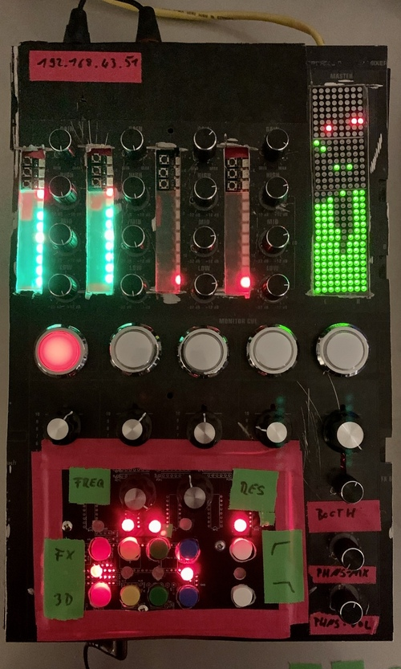

# A³ Assembly overview
## Hardware layout
- A³ Core: [A³ Core](https://doc.a3-audio.com/assembly/core.html)
- A³ Mix: [A³ Mic](https://doc.a3-audio.com/assembly/mic.html)
- A³ Motion: [A³ Motion](https://doc.a3-audio.com/assembly/moc.html)
- Buy parts: [Parts](https://doc.a3-audio.com/assembly/parts.html)

## Hardware
A working prototype exists. We applied intensive stress tests by using 12V car hifi with 15 inch centered Downfire subwoofer and 5 JBL Control One satellites on stands. We put everything on a hand-wagon and played at 40°C on a summerday in a fieldtest. It works pretty well and meanwhile was a rocksolid and stable experience.

## Current prototype
### A³ Mix v0.1

### A³ Motion v0.1

### A³ Core v0.1

## A³ Stresstests v0.1

