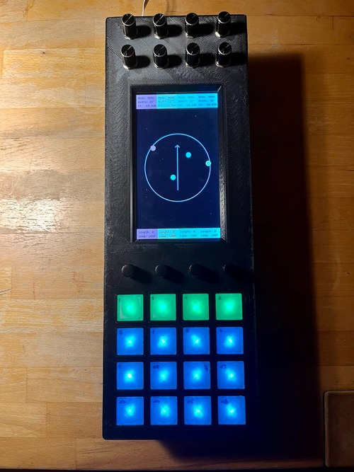

# A³ Assembly overview
A working prototype exists. We applied intensive stress tests by using 12V car hifi with 15 inch centered Downfire subwoofer and 5 JBL Control One satellites on stands. We put everything on a hand-wagon and played at 40°C on a summerday in a fieldtest. It works pretty well and meanwhile was a rocksolid and stable experience.

## A³ Devices
- [A³ Motion Assembly](https://doc.a3-audio.com/assembly/moc.html)
- [A³ Mix Assembly](https://doc.a3-audio.com/assembly/mic.html)
- [A³ Core Assembly](https://doc.a3-audio.com/assembly/core.html)

## Prototype v 0.2
| A³ Mix | A³ Motion | A³ Core |
| ----------- | ----------- | ----------- |
|  |  |  |

## Github
- [A³ Hardware](https://github.com/a3-audio/a3-hardware)