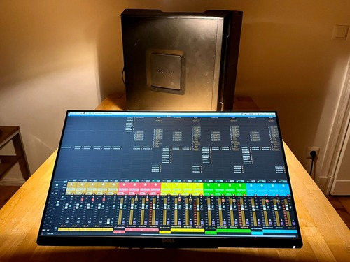
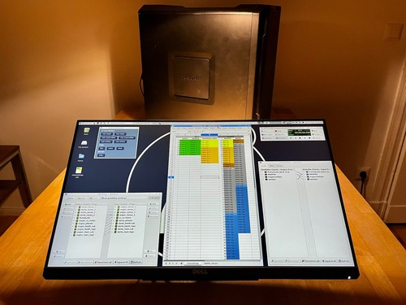

# A³ Core Assembly
## V02
 | 
---|---
 | 

## Specifications
- A powerful linux pc (could be headless), based on debian, linux realtimekernel and jack audioserver
- Different class compliant audio hardware could be installed (we tested: Focusrite, RME, Digigram)
- We provide a reaper session for a3mix but a3core can run different audio backends (we tested: Reaper, Panoramix, IEM-Pluginsuite, puredata, supercollider, Bitwig Studio)
- IO roundtrip latency are measured from 1.3ms to 2.8ms, depends on audio and pc hardware components 