# A³ History
Since 2018 we're working with 3d audio in live environments. Since its complex to use 3d audio software it also needs a total rework of the live perfoming setup for artists. At the beginning we always where in a situation that we, as system operators, must perform 3d panning for artists, which resolves in confusing when and which operations we have to do to fit the artist ideas - though it was kind of random. We decided to start our journey and build something an artist could use with almost no knowledge about what is behind.

## The journey starts

First Mocup

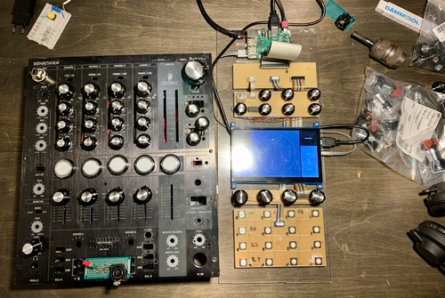

## A³ System - V01
A³ System at Home

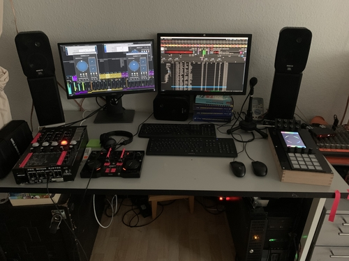

A³ Core | A³ Mix | A³ Motion
--- | --- | ---
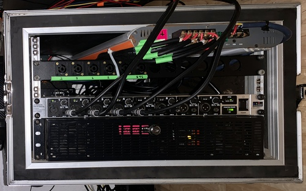 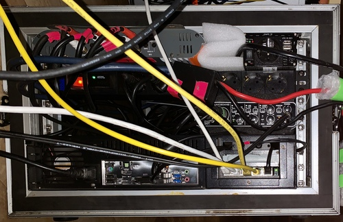 | 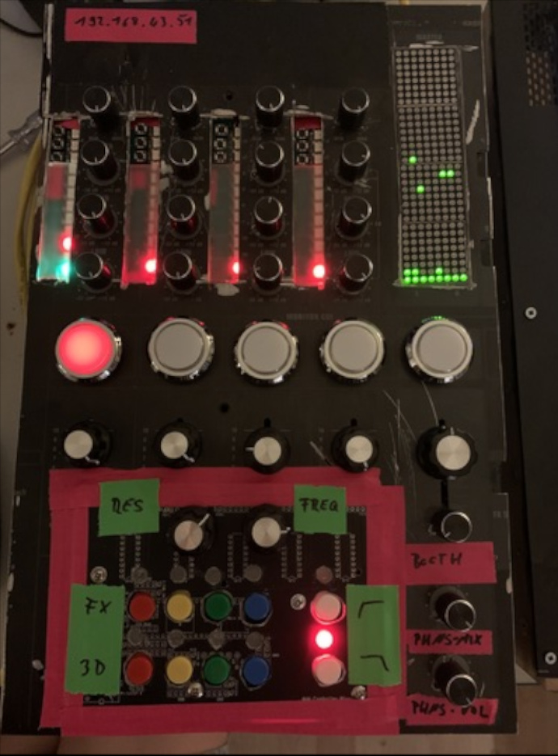 | 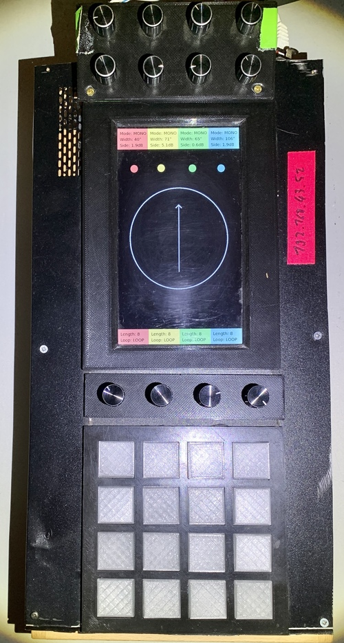

We bought some cheap speakers

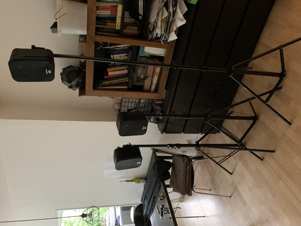

Put everything on a handwagon

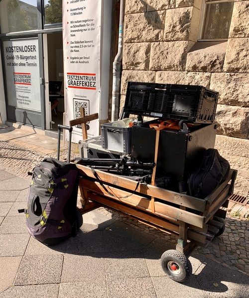

And pulled it into a park

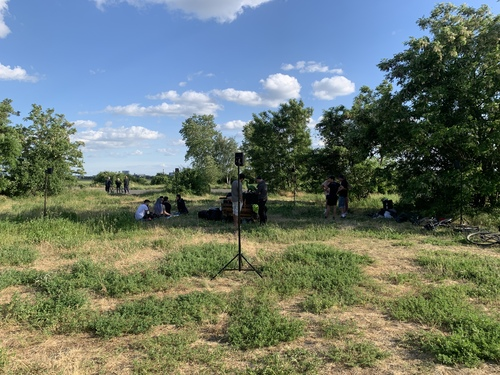

People came and loves it

Police came and forced us to change the location

Another day

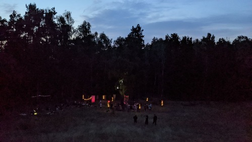

The day after

To get an idea of the layout

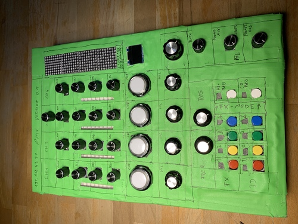

## Current states
- [A³ System](https://doc.a3-audio.com/assembly/assembly.html)
- [A³ Motion](https://doc.a3-audio.com/assembly/moc.html)
- [A³ Mixer](https://doc.a3-audio.com/assembly/mic.html)
- [A³ Core](https://doc.a3-audio.com/assembly/core.html)