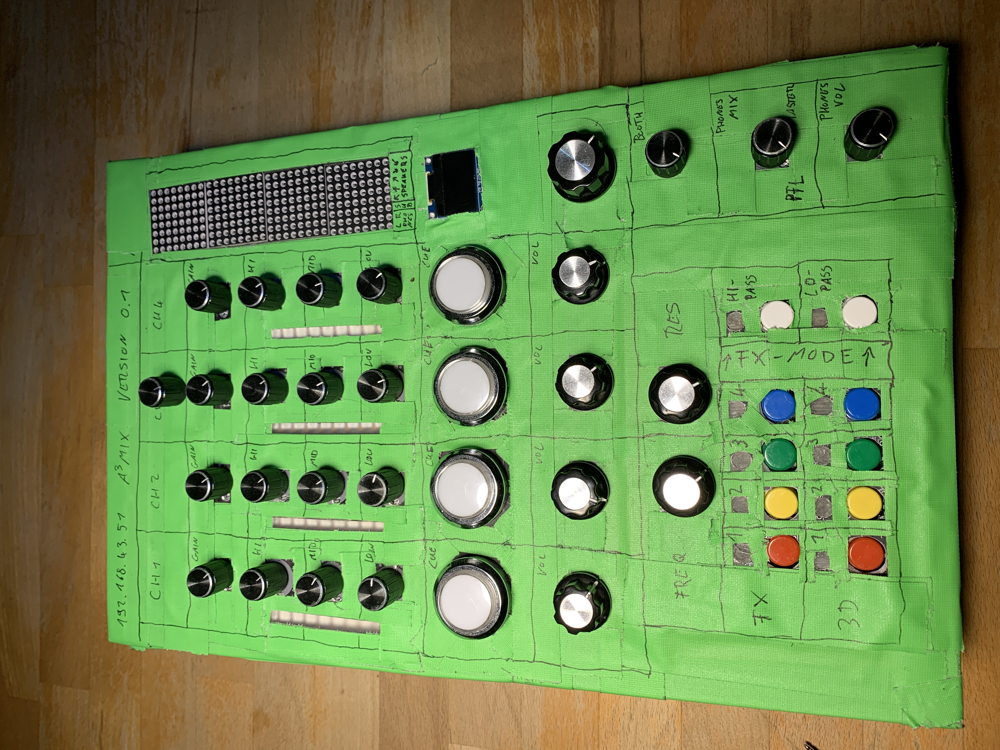
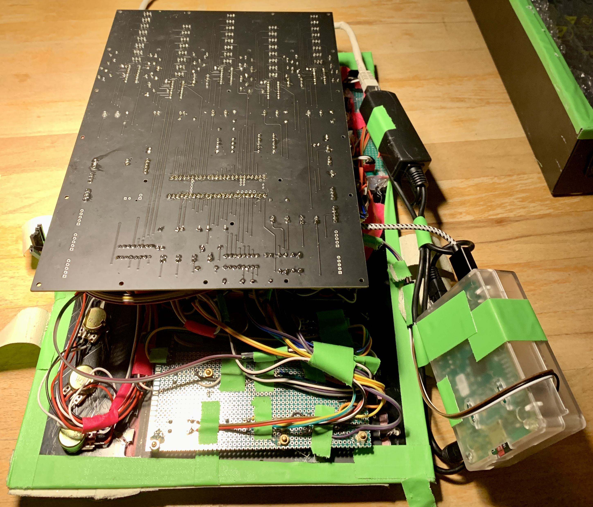
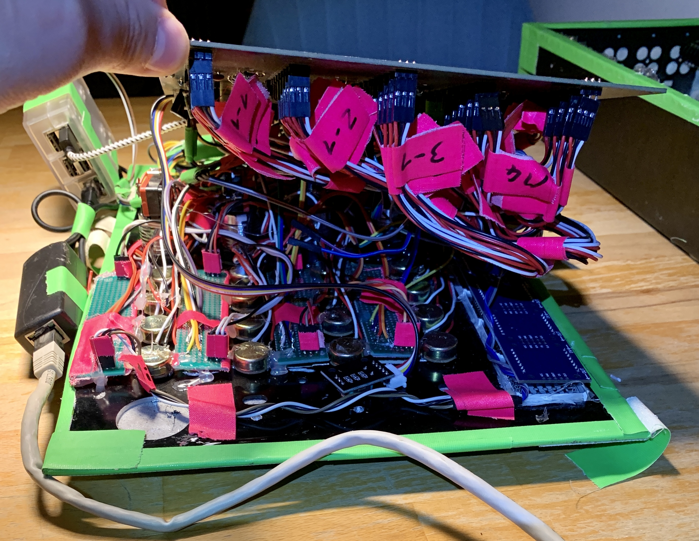
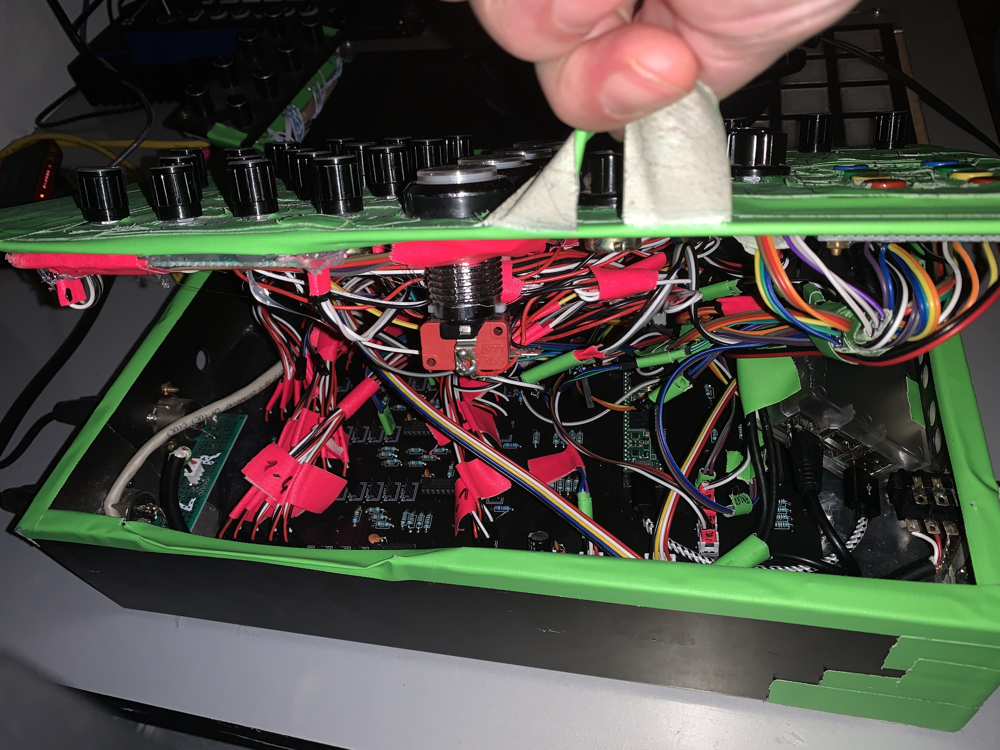

# A³ Mix Assembly
## Current version


### Housing
A³ Mix housing isn't ready yet ...

## Hardware
- PoE to USB 5V Adapter
- Raspberry Pi 3 Model B
- Teensy 4.1
- A³ Mix PCB V0.2 
- 22 potentimeter
- 14 buttons
- 46 NeoPixel (ws2811)
- 8x32 pixel matrix (max7219)
- 6.3mm phones socket
- 2x XLRw socket
- 1x Cat extender socket
- Bunch of cables

### Estimated power consumption
Device | Watts
---|---
Raspberry Pi 3 Model B | 5W
Teensy 4.1 | 2.5W
46 NeoPixel | 13W
8x32 Leds max7219 | 4.5W
---|---
Sum | 25W
 
### PCB V0.2
A³ Mix pcb is published as kicad project. You should find all information to assemble peripherals in the circuit-diagram of kicad-project:
```
/home/aaa/Ambijockey/hardware/mic/a3mix-mainboard-v0.2
```


#### Multiplexer 1-4 (hc4051)
Function (potentiometer)| Pin
---|---
GAIN | 0 
EQ HIGH | 1 
EQ MID | 2 
EQ LOW | 3 
VOLUME | 4

#### Multiplexer 5 (hc4051)
Function (potentiometer) | Pin
---|---
MASTER | 0 
BOOTH | 1
PHONES MIX | 2
PHONES VOLUME | 3
FX FREQUENCY | 4
FX RESONANCE | 5

#### Multiplexer 6 (hc4051)
Function (buttons) | Pin
---|---
FX TOGGLE | 0-3
3D TOGGLE | 4-7

#### Leds
- 4 led-buttons for heapdphones prelisten function (pfl)
- 4x9 NeoPixel for input vu (ws2811)
- 10 NeoPixel for fx and 3d-section (ws2811)

#### Headphone
2 XLR sockets on the back are connected to a 6.3mm jack socket on the front. An external headphone amp is needed.

#### Wires




## Early versions
### 2021


