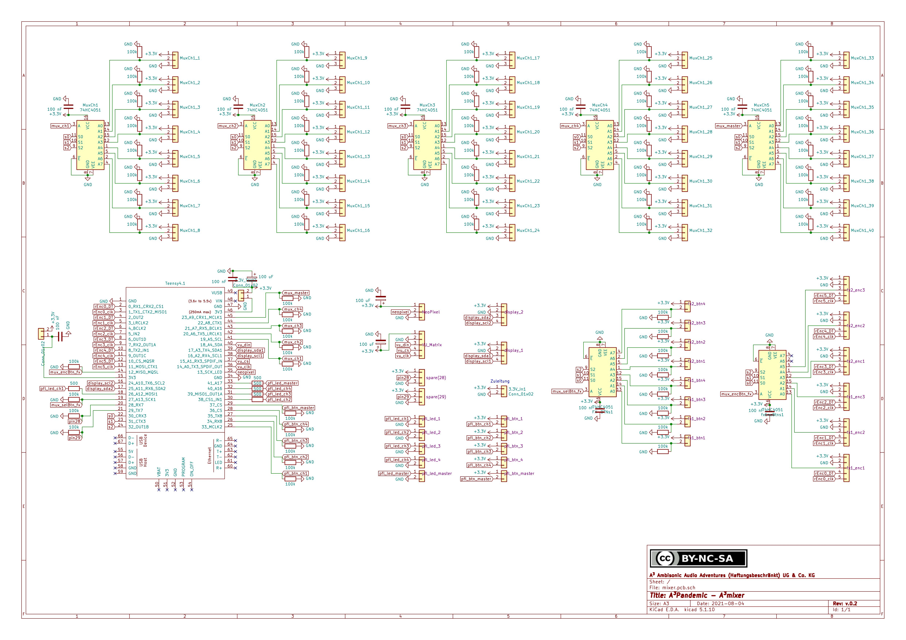
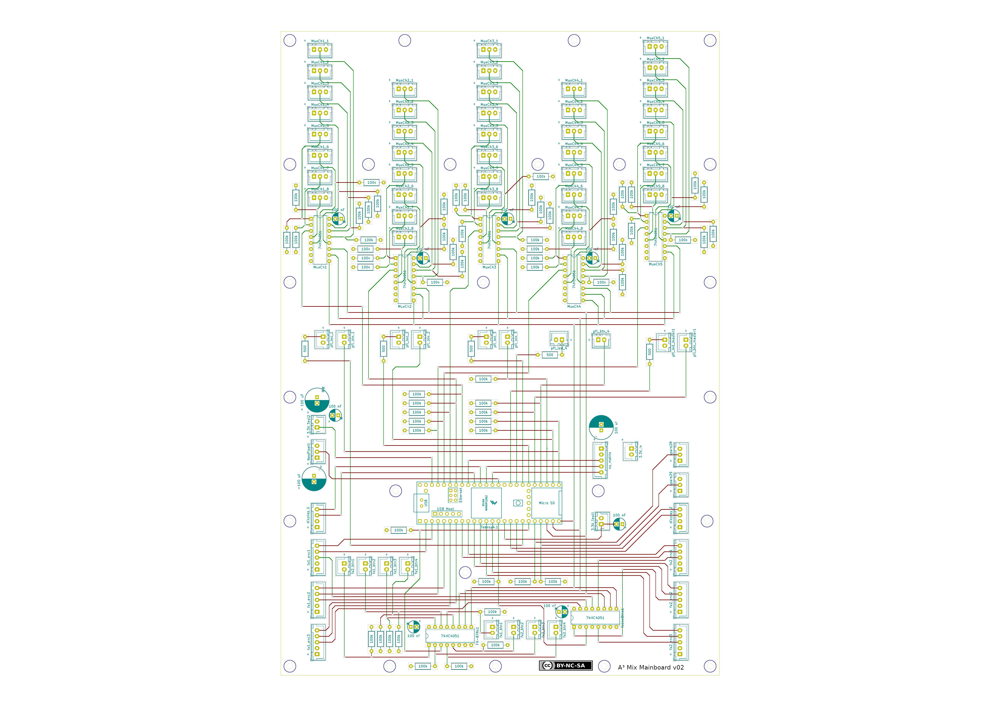
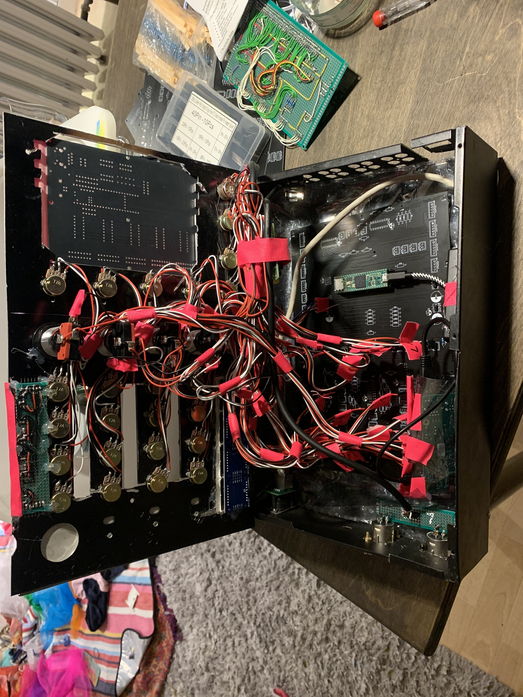
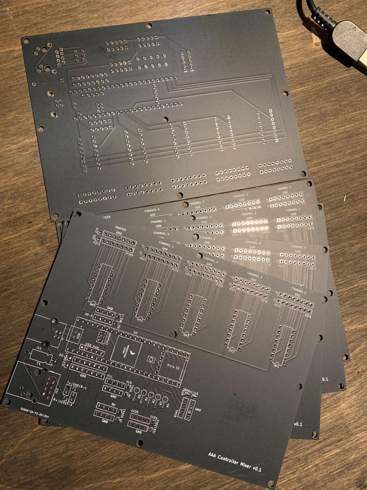
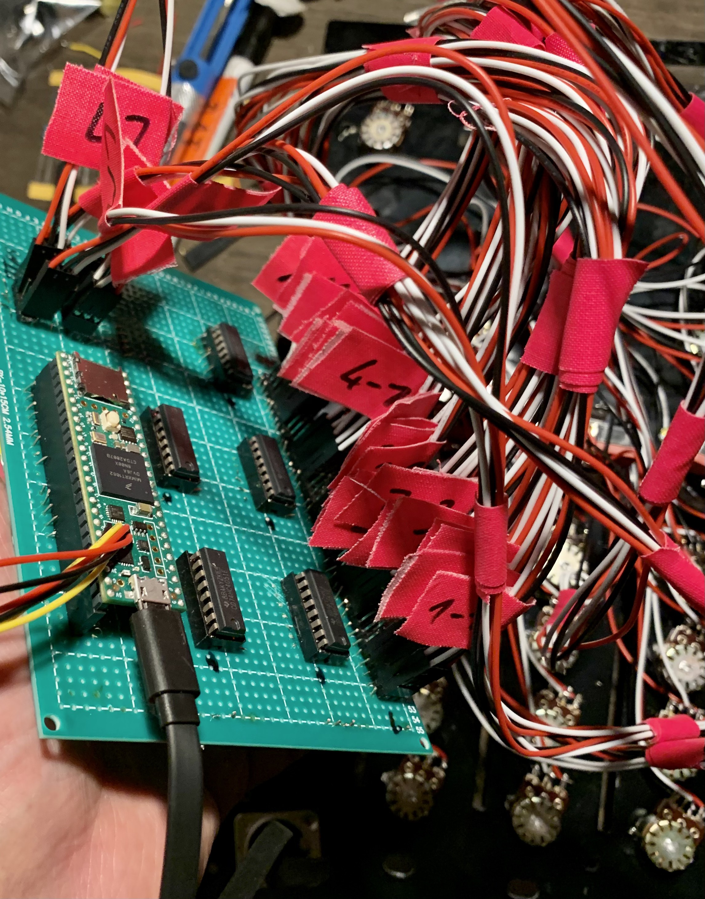

# A³ Mix Assembly
## PCB
A³ Mix Mainboard pcb is published as kicad project. It comes with ready to fabricate gerber files. You should find all information to assemble peripherals in the circuit-diagram of kicad-project:
```
/home/aaa/Ambijockey/hardware/mic/a3mix-mainboard-v0.2
```



## Housing
A³ Mix housing isn't ready yet ...

## Hardware
- Raspberry Pi 3 Model B
- powered with PoE to 5V Adapter -> downstep to 3v on Teensy
- Raspberry and Teensy are connected via usb
- Teensy 4.1
	- 4 multiplexer hc4051 (8ch each)
        function: audiochannel-control
        potis
        - gain 
        - eq hi
        - eq mid
        - eq low
        - volume
      - mode-buttons
        - 3d on/off
        - fx on/off
    - 1 hc4051
        function: masterchannel-controlorbitalwaves.net
        potis
        - master volume
        - booth volume
        - phones mix
        - headphones volume
    - 5 led-buttons for heapdphones prelisten function (pfl)
    - 1 NeoPixel-strip (ws2811) 9 leds input vu
	- 1 NeoPixel-strip (ws2811) for fx and 3d-section
    - 8x32 led-matrix for output-vu

## Power Consumption
- This device has a  estimated power consumption of
	- raspberry pi 3b: 5W
	- teensy4.1: 2.5W
	- ws2811 40 LEDs: 12W
	- max7219 128 LEDs: 4.5W


## Early versions :




