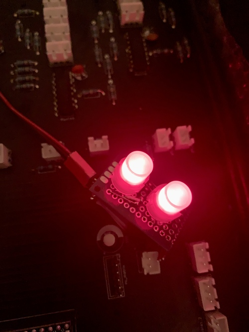

# A³ Mix v0.2 Assembly
## PCB
A³ Mix pcb is published as kicad project. You should find all information to assemble peripherals in the circuit-diagram of kicad-project:
```
a3-system/a3hardware/a3mix/a3mix_mainboard_v02/
```


## Housing
draft | print
---|---
 | 

## Headphones
2 XLR sockets on the back are connected to a 6.3mm jack socket on the front. An external headphones amp is needed

## Buttons
< | >
---|---
 | 
 | 

## A³ Mix v0.2 wires
1 | 2
---|---
 | 
 | 
 | 

## Assembled
silent | fire
---|---
 | 

## Specifications
### Multiplexer pin configuration
#### Multiplexer 1-4 (hc4051)
Function (potentiometer)| Pin
---|---
GAIN | 0 
EQ HIGH | 1 
EQ MID | 2 
EQ LOW | 3 
VOLUME | 4

#### Multiplexer 5 (hc4051)
Function (potentiometer) | Pin
---|---
MASTER | 0 
BOOTH | 1
PHONES MIX | 2
PHONES VOLUME | 3
FX FREQUENCY | 7
FX RESONANCE | 8

#### Multiplexer 6 (hc4051)
Function (buttons) | Pin
---|---
FX TOGGLE | 0-3
3D TOGGLE | 4-7

### Leds
- 4 led-buttons for heapdphones prelisten function (pfl)
- 4x9 NeoPixel for input vu (ws2811)
- 10 NeoPixel for fx and 3d-section (ws2811)

### Estimated power consumption
Device | Watts
---|---
Raspberry Pi 3 Model B | 5W
Teensy 4.1 | 2.5W
46 NeoPixel | 13W
8x32 Leds max7219 | 4.5W
---|---
Sum | 25W