# A³ Motion v0.2 Assembly
## PCB's
A³ Motion pcbs are published as kicad projects. You should find all information to assemble peripherals in the circuit-diagram of kicad-projects

### PCB v0.1
```
Kicad project:
a3-system/a3hardware/a3motion/a3motion_mainboard_pcb_v0.1/
```
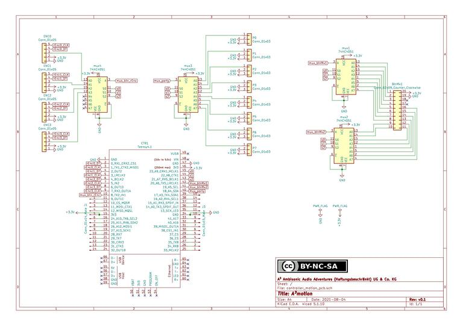
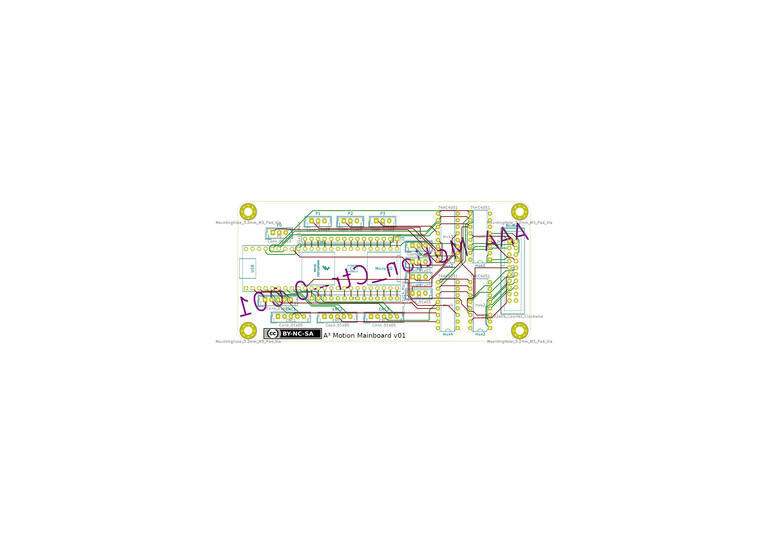

front | back
---|---
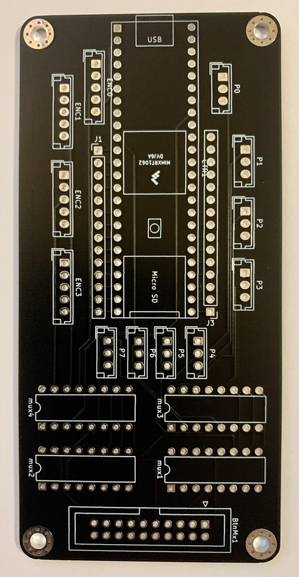 | 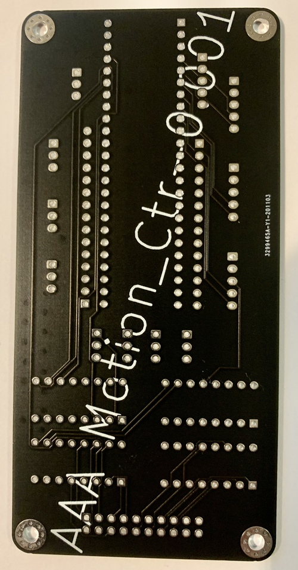

### A³ Buttonmatrix PCB v0.1
```
Kicad project:
a3-system/a3hardware/a3motion/a3motion_buttonmatrix_pcb_v0.1/
```

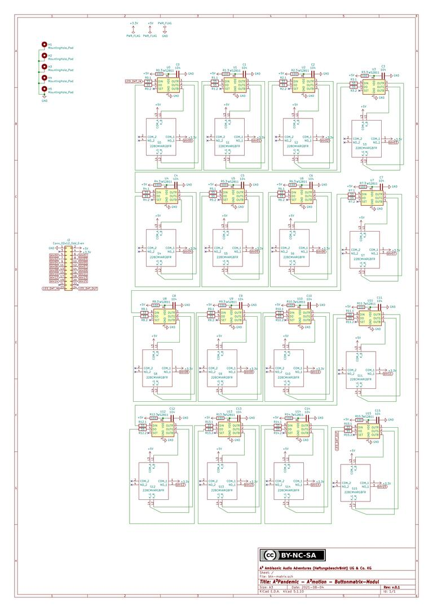
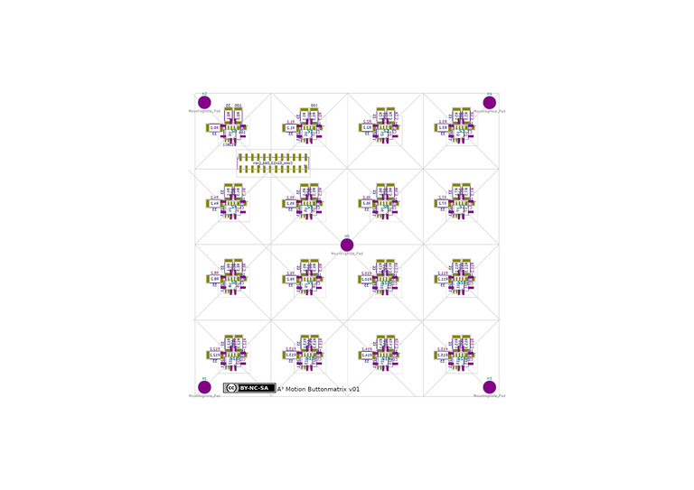

front | back | action
---|---|---
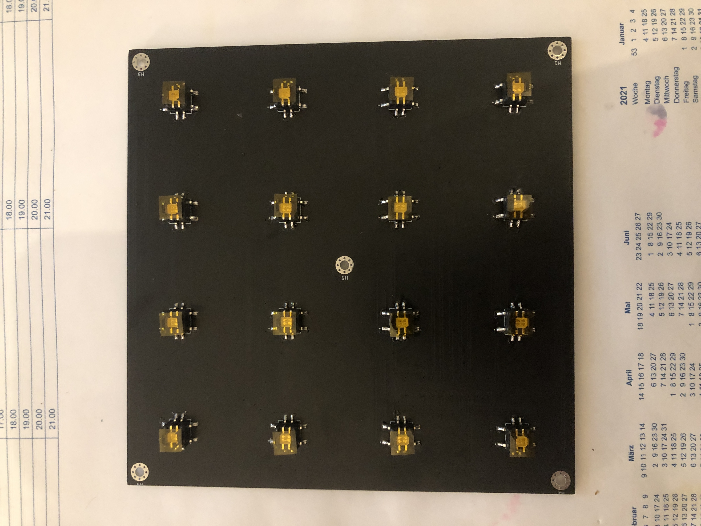 | 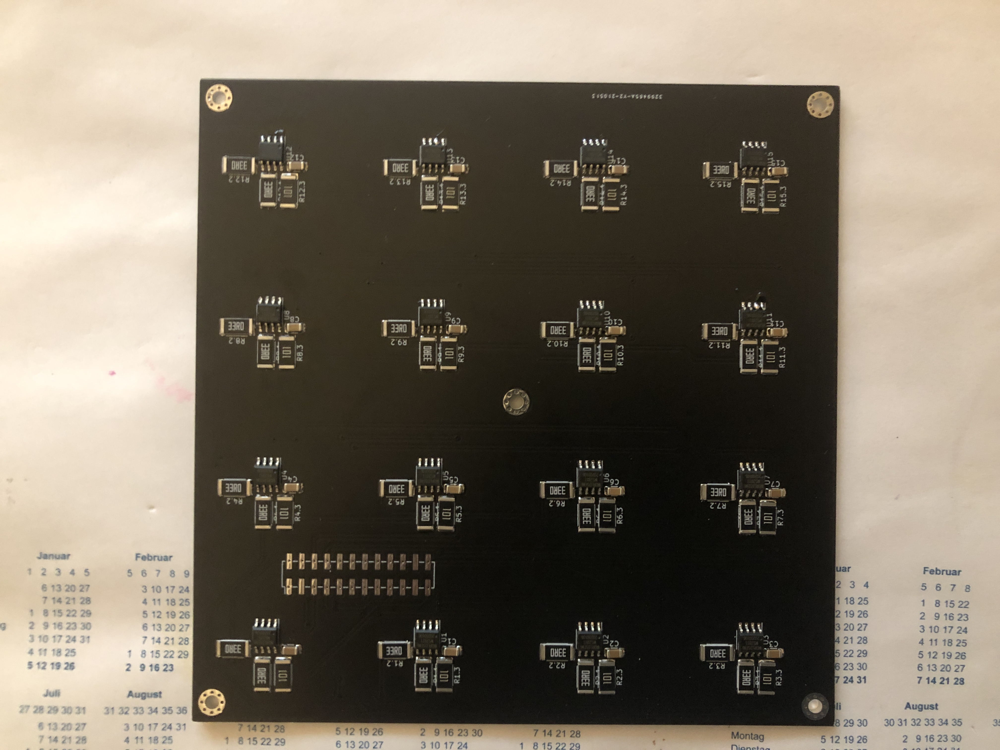 | 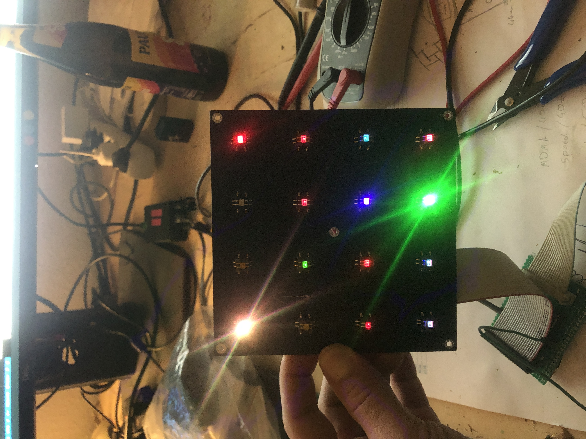

## Housing v0.2
The housing was build with Blender (*.obj) and is ready to print on a 3d-printer (*.stl).

draft | print
---|---
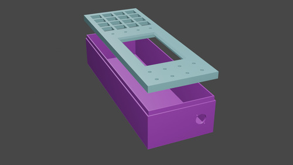 | 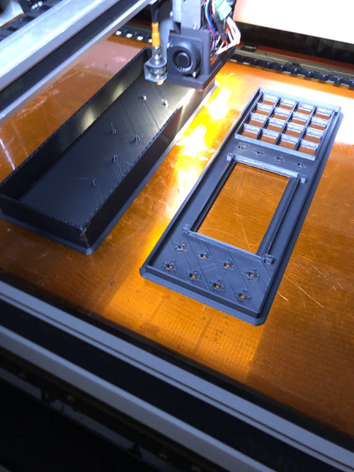

## A³ Assembled
action | new Software and action buttons
---|---
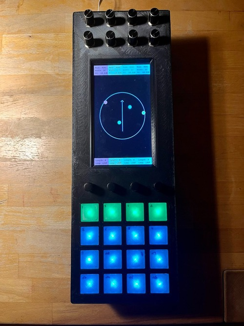 | 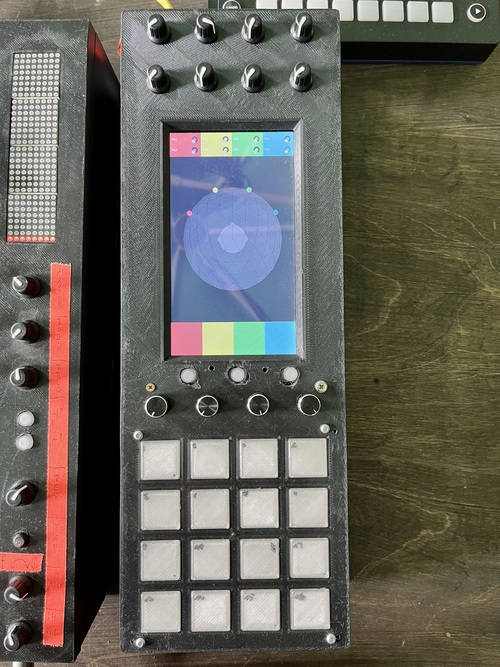 

## Estimated power consumption
Device | Watts
---|---
Raspberry Pi 4b | 15W
Teensy 4.1 | 2.5W
40 NeoPixel | 11W
SunFounder Raspberry Pi 4 Display Touchscreen 7 Inch | 3W
---|---
Sum | 31.5W