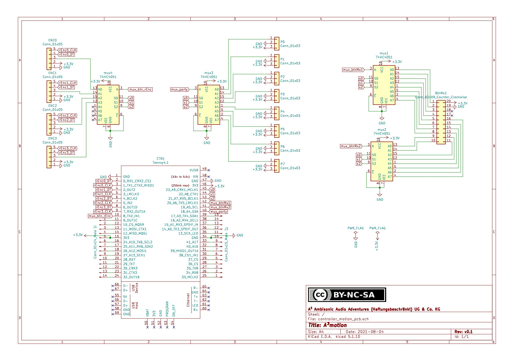
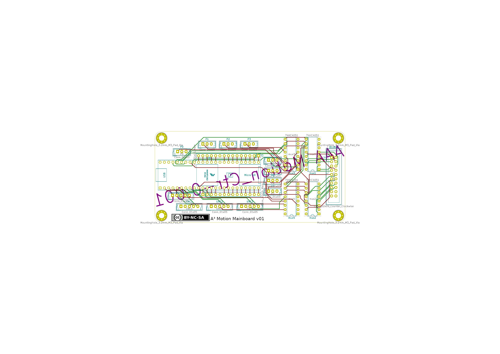
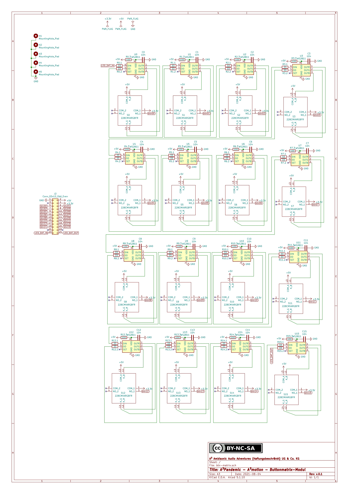
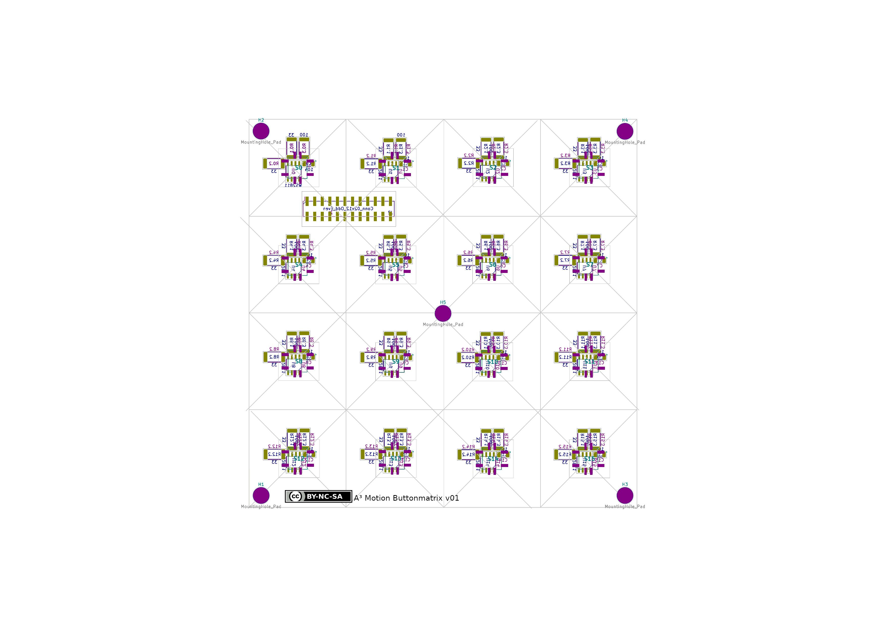
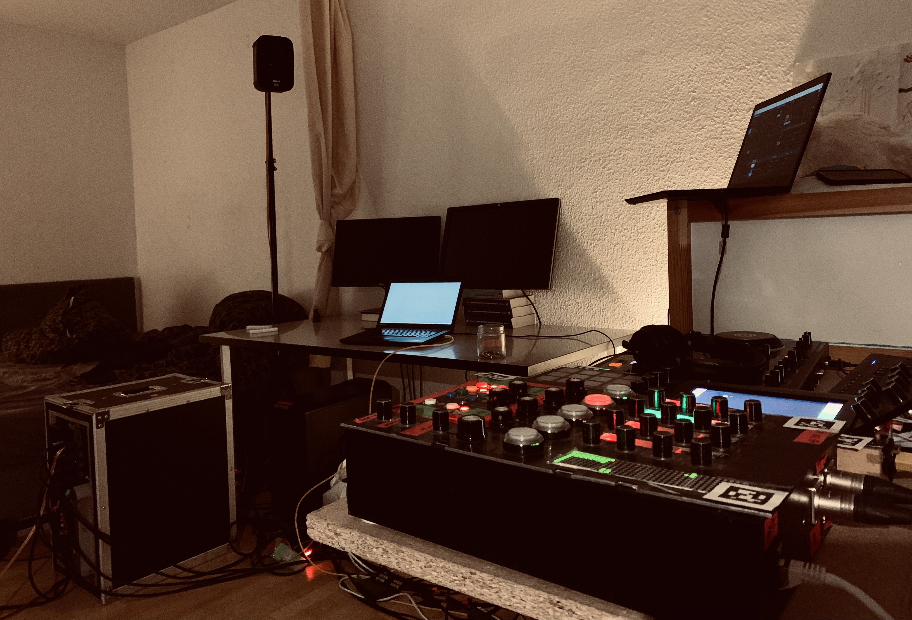
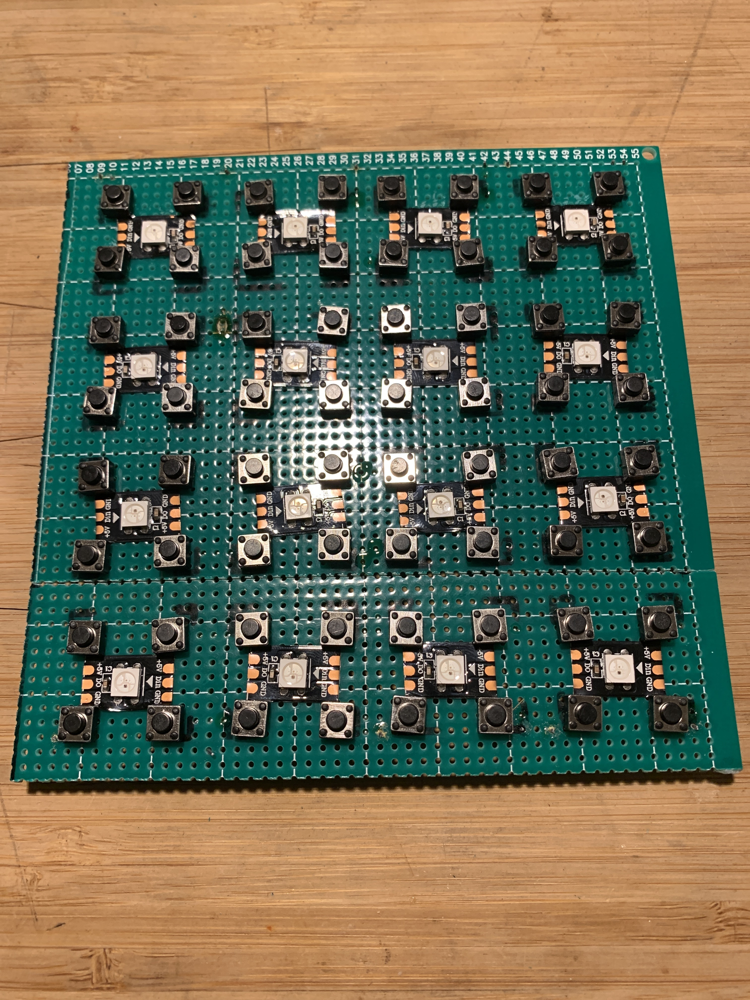
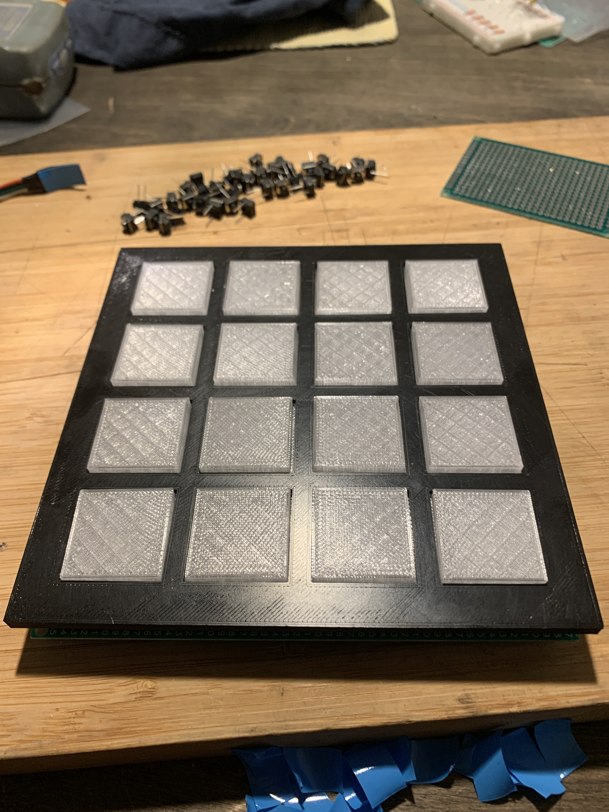

# A³ Motion Assembly
## PCB
### Mainboard




### Buttonmatrix




### Housing


The housing was build with Blender (*.obj) and is ready to print on a 3d-printer (*.stl).

```
Ambijockey/hardware/moc/housing
├── moc_housing_bottom.obj
├── moc_housing_bottom.stl
├── moc_housing_top.obj
└── moc_main_pcb.stl
```

## Hardware
- runs on a Raspberry Pi 3 Model B
- powered with PoE -> downstep to 3v on Teensy
- sbc is connected via usb (/dev/ttyACM0) to
- teensy 4.1, it has
    - 1 multiplexer hc4051 (8ch)
        function: width and 3d-boost per channel
    - 2 hc4051
        function: Buttonmatrix
    - 1 NeoPixel-strip (ws2811 led-controller)
        - 16 x status leds buttonmatrix
  
## Estimated power consumption
Device | Watts
---|---
Raspberry Pi 4b | 15W
Teensy 4.1 | 2.5W
40 NeoPixel | 11W
SunFounder Raspberry Pi 4 Display Touchscreen 7 Inch | 3W
---|---
Sum | 31.5W

- raspberry pi 4b: 15W
- teensy4.1: 2.5W
- ws2811 40 LEDs: 11W
- 

## Early versions




