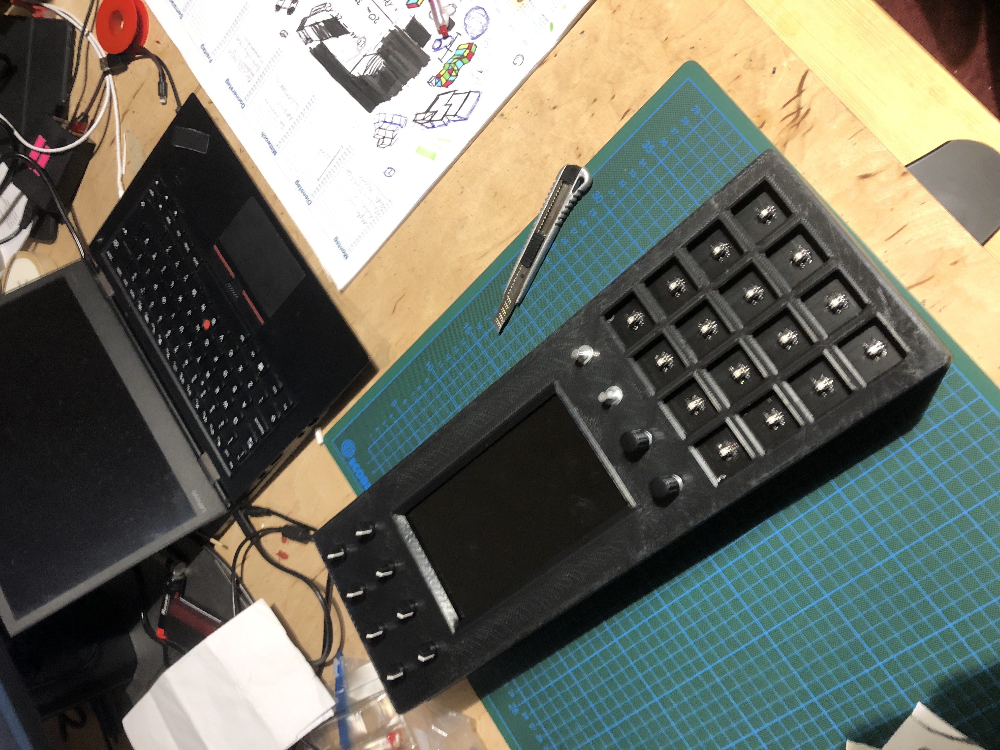
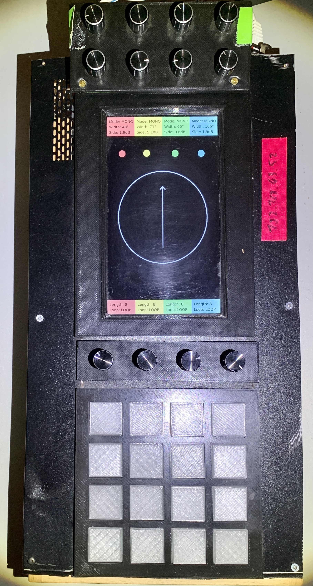
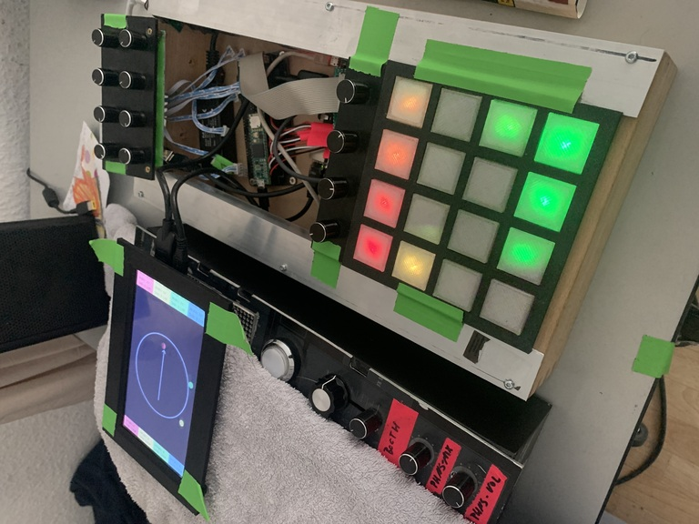
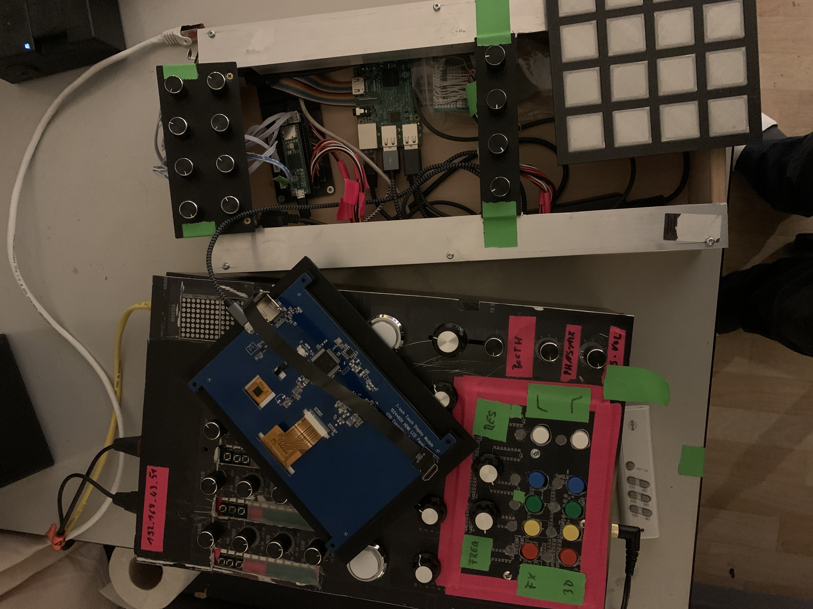
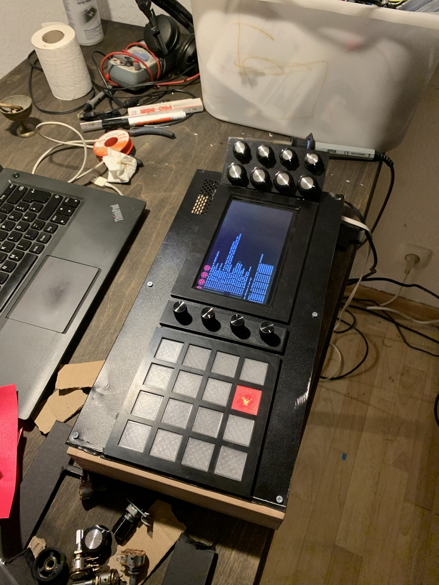
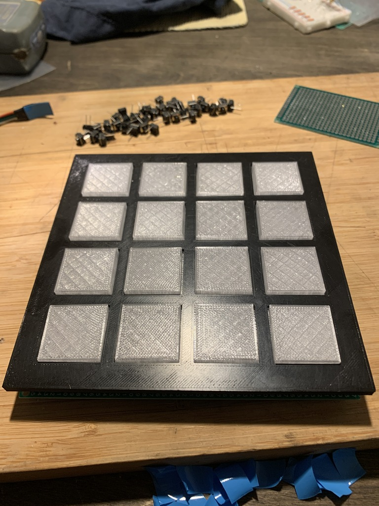
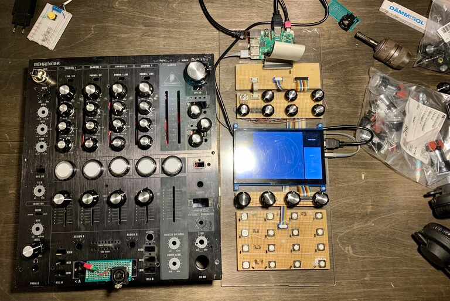

# A³ Motion Assembly
## A³ Motion v0.2



### Hardware
- PoE to USB 5V Adapter
- Raspberry Pi 3 Model B
- Teensy 4.1
- A³ Motion PCB V0.1
- 8 potentimeter
- 16 buttons
- 16 NeoPixel (ws2811)
- 1x Cat extender socket
- Bunch of cables

### PCB's
A³ Motion pcbs are published as kicad projects. You should find all information to assemble peripherals in the circuit-diagram of kicad-projects.

#### Mainboard PCB v0.1
- Kicad project:
```
Ambijockey/hardware/moc/Mainboard-pcb/
```


#### Buttonmatrix PCB v0.1
- Kicad project:
```
Ambijockey/hardware/moc/Buttonmatrix-pcb/
```


### Housing v0.2
The housing was build with Blender (*.obj) and is ready to print on a 3d-printer (*.stl).
- Blender project:
```
Ambijockey/hardware/moc/housing
├── moc_housing_bottom.obj
├── moc_housing_bottom.stl
├── moc_housing_top.obj
└── moc_main_pcb.stl
```


### Hardware
- runs on a Raspberry Pi 3 Model B
- powered with PoE -> downstep to 3v on Teensy
- sbc is connected via usb (/dev/ttyACM0) to
- teensy 4.1, it has
    - 1 multiplexer hc4051 (8ch)
        function: width and 3d-boost per channel
    - 2 hc4051
        function: Buttonmatrix
    - 1 NeoPixel-strip (ws2811 led-controller)
        - 16 x status leds buttonmatrix
  
### Estimated power consumption
Device | Watts
---|---
Raspberry Pi 4b | 15W
Teensy 4.1 | 2.5W
40 NeoPixel | 11W
SunFounder Raspberry Pi 4 Display Touchscreen 7 Inch | 3W
---|---
Sum | 31.5W

- raspberry pi 4b: 15W
- teensy4.1: 2.5W
- ws2811 40 LEDs: 11W
- 

## Early versions
### 2020-2021
#### A³ Motion v0.1




#### Buttonmatrix v0.1

#### Buttonmatrix v0.0

