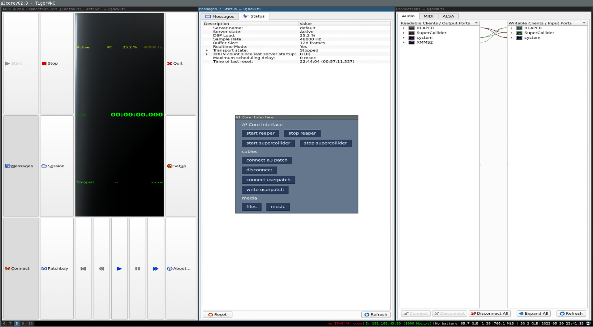

# A³ Core Configuration
[A³ Core Github](https://github.com/a3-audio/a3-core)
## OS
- Debian with Linux realtime kernel
- xfce window manager
## Python script OSC-Router
 - Routes OSC between audioengine and controller
## Supercollider script VU-Meter
- 12-Channel Jack client (could be more for ie light and vj control)
- sends vu-meter (peak and rms) via OSC
- ```VU-Meter.scd```
## User VNC interface 
To setup patching and recording
- Qjackctl (Patching)
- Reaper (Sequencer)
- Reaper (Mixer)
## IEM Pluginsuite
- [IEM-Pluginsuite](https://plugins.iem.at/) VST 3 plugins for 3D audio processing
- StereoEncoder
- AllraDecoder
- BinauralDecoder
- FDNReverb
- AllraDecoder must be configured to fit your speaker setup
## TAL-Filter-2 FX
- [TAL-Filter-2](https://tal-software.com/products/tal-filter) VST plugin for hipass lopass resonance/filter FX
## Jmess (jack audio wiring)
- [Jmess](https://github.com/jacktrip/jmess-jack) is used to store and restore jack connections
- [aj-snapshot](https://man.archlinux.org/man/aj-snapshot.1.en) can be used to store and restore alsa connections
## Reaper Audiobackend Signalflow
- ```a3-audio.RPP```


## Screenshots
### Control screen

### Sequencer  screen

### Mixer screen
