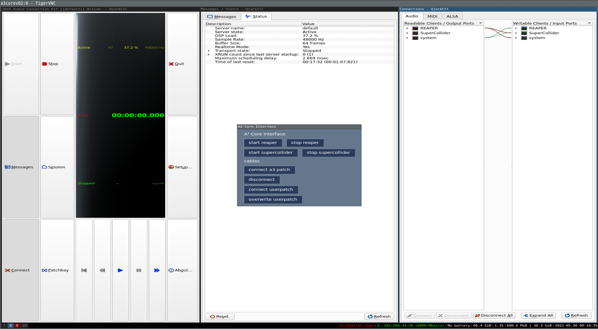

# A³ Core Configuration
## PC
Since a wide range of archlinux compatible audio hardware is able to run A³ Core software, we describe our proved configurations in [A³ Core Assembly](https://doc.a3-audio.com/assembly/core.html).

## SSD
- [Flash Device Image](https://doc.a3-audio.com/development/imaging.html)
- SSD > 64GB

## From scratch <-wip
### Install Archlinux
Follow the guide from archlinux: [Installation guide](https://wiki.archlinux.org/title/Installation_guide)

### Install realtimekernel
For low latency audio the [archlinux-rt](https://aur.archlinux.org/packages/linux-rt) kernel is needed. Edit ```/etc/pacman.conf``` and add this section:
```
[realtime]
Server = https://pkgbuild.com/~dvzrv/repos/realtime/$arch
```
Then update the system and kernel with ```pacman -Syu linux-rt```.

Some information:
https://wiki.linuxaudio.org/wiki/lowlatency_deprecated

### Configure audioengine
Follow the Professional audio guide: [Professional audio guide](https://wiki.archlinux.org/title/Professional_audio)

## Root operations on A³ Core
### Setup user
``` 
nano /etc/hostname
user-add -m aaa
groupadd realtime aaa
usermod -aG aaa aaa
usermod -aG wheel aaa
usermod -aG realtime aaa
usermod -aG users aaa
usermod -aG audio aaa
usermod -aG video aaa
chmod a+rw /dev/ttyACM0
passwd root
passwd aaa
``` 
### Install depencies
```
pacman -Syu tree vim linux-rt realtime-privileges rtirq python3 python-osc jack2 qjackctl aj-snapshot iempluginsuite supercollider git python-pip i3-wm i3lock i3status htop ttf-dejavu xterm dmenu alsa-firmware alsa-utils alsa-tools sudo x11vnc xf86-video-dummy thunar tk feh xarchiver gvfs thunar-volman lxmusic gedit

pip install numpy pysimplegui

cd /home/aaa
git clone git@github.com:a3-audio/a3-system.git

Install reaper:
  git clone https://aur.archlinux.org/yay.git
  cd yay
  makepkg -si
  yay -s reaper rtapp

- Make a copy of the reaper project and put it in your home (I us a folder named runtime_reaper but its not important). Reaper will load the last used project.
- Edit reaper preferences and add vst path "/usr/lib/vst"

Install jmess (a program to save and restore jack audio connections)
https://github.com/jacktrip/jmess-jack

Install TAL Filter
https://tal-software.com/products/tal-filter
```
### Copy files to corresponding system-folder:
```
.
├── etc
│   ├── rtirq.conf
│   ├── sudoers
│   ├── systemd
│   │   ├── network
│   │   │   └── a3.network
│   │   └── system
│   │       ├── a3xinit.service
│   │       ├── autologin@.service
│   │       ├── getty@tty1.service
│   │       ├── override.conf
│   │       └── x11vnc.service.d
│   │           └── override.conf
│   └── X11
│       ├── xorg.conf.d
│       │   └── 10-headless.conf
│       └── Xwrapper.config
└── home
    └── aaa
        ├── a3_reaper_runtime
        │   └── a3_reaper.RPP
        ├── .config
        │   ├── i3
        │   │   └── config
        │   ├── jack
        │   │   ├── esi_gigaport_ex.conf
        │   │   └── minidsp_usbstreamer.conf
        │   └── systemd
        │       └── user
        │           ├── a3_interface.service
        │           ├── a3_jack_connections.service
        │           ├── a3_osc_router.service
        │           ├── a3_reaper.service
        │           └── a3_vu_meter.service
        ├── userpatches
        │   ├── userpatch_bck.jmess
        │   └── userpatch.jmess
        ├── .vnc
        │   ├── config
        │   └── passwd
        ├── .xinitrc
        └── .Xresources

```

### Enable system services
```
systemctl enable autologin@
systemctl enable getty@tty1.service
systemctl enable a3xinit
systemctl enable rtirq
```

### rtapp / rtirq
Type ```rtcards```  to find your sound card's irq. Edit /etc/rtirq.conf described here:
http://www.audio-linux.com/html/realtime.html

## Non root operations on A³ Core
### Audiohardware
You could find out the right settings for your soundcard with qjackctl. Copy a configuration file from our repo to the following path and fill in your settings:
```/home/aaa/.config/jack/your_soundcard.conf```

### Enable user services
```
systemctl --user enable a3_osc_router.service
systemctl --user enable jack@your_soundcard

Optional: To load audioengine in and fixed wires use this services:
systemctl --user enable a3_jack_connections.service
systemctl --user enable a3_reaper.service
systemctl --user enable a3_vu_meter.service
```

### VNC Client
install tigervnc and execute ```a3core/./a3vnc.sh``` on your computer to connect to A³ Core. Make shure your client is in the same network listed in here: 
- [OSC and serial communication](https://doc.a3-audio.com/development/osc.html)

#### Control screen

#### Sequencer  screen

#### Mixer screen

#### Info screen


### Supercollider
- open scide
- execute ```Quarks.gui```
- check ```NetLib```