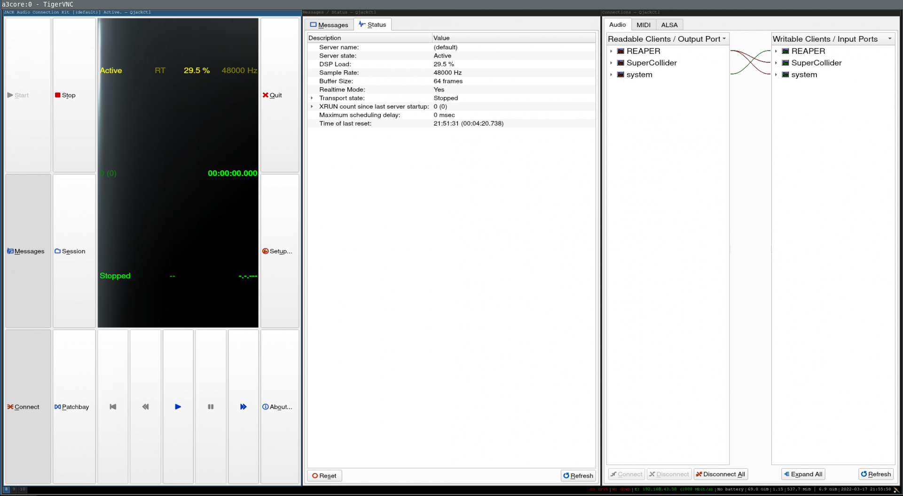
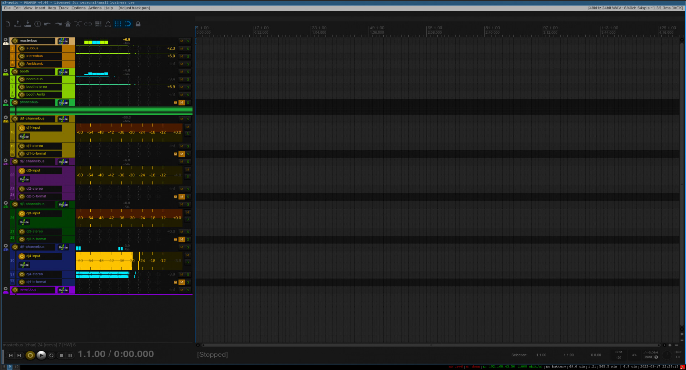
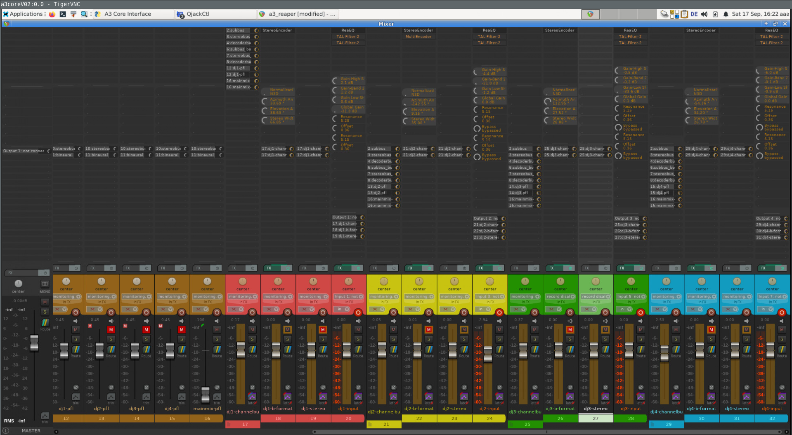

# A³ Core Configuration
## SSD
- [Flash Device Image](https://doc.a3-audio.com/development/imaging.html)
- SSD > 64GB

## Installation from scratch <-wip
### Install Archlinux
Follow the guide from archlinux: [Installation guide](https://wiki.archlinux.org/title/Installation_guide)

### Install realtimekernel
For low latency audio the [archlinux-rt](https://aur.archlinux.org/packages/linux-rt) kernel is needed. Edit ```/etc/pacman.conf``` and add this section:
```
[realtime]
Server = https://pkgbuild.com/~dvzrv/repos/realtime/$arch
```
Then update the system and kernel with ```pacman -Syu linux-rt```.

### Configure audioengine
Follow the Professional audio guide: [Professional audio guide](https://wiki.archlinux.org/title/Professional_audio)

## Root operations on A³ Core
### Setup user
``` 
user-add -m aaa
groupadd realtime
usermod -aG realtime aaa
usermod -aG users aaa
usermod -aG audio aaa
usermod -aG video aaa
chmod a+rw /dev/ttyACM0
``` 
### Install depencies
```
nano /etc/pacman.conf
	[realtime]
	Server = https://pkgbuild.com/~dvzrv/repos/realtime/$arch

pacman -Syu

pacman -S linuxrt realtime-privileges rtirq python3 python python-osc jack2 qjackctl aj-snapshot iempluginsuite supercollider git python-pip i3-wm i3lock i3status htop ttf-dejavu xterm dmenu alsa-firmware alsa-util
alsa-tools

pip install numpy pyserial

cd /home/aaa
git clone git@github.com:ambisonics-audio-association/Ambijockey.git

Download and activate reaper for Linux x86_64:
https://www.reaper.fm/download.php

- tar -xf 
- ./install-reaper.sh 

when prompt answer to install in /opt

Install jmess (a program to save and restore jack audio connections)
https://github.com/jacktrip/jmess-jack
```
### Copy files to corresponding system-folder:
```
├── etc
│   ├── dhcpcd.conf
│   ├── rtapp
│   │   └── rtapp.conf
│   ├── rtirq.conf
│   ├── systemd
│   │   └── system
│   │       ├── autologin@.service
│   │       ├── core.service
│   │       └── override.conf
│   └── X11
│       ├── xorg.conf.d
│       │   └── 10-headless.conf
│       └── Xwrapper.config
└── home
    └── aaa
        ├── .config
        │   ├── i3
        │   │   └── config
        │   ├── jack
        │   │   ├── esi_gigaport_ex.conf
        │   │   └── minidsp_usbstreamer.conf
        │   └── systemd
        │       └── user
        │           ├── a3_jack_connections.service
        │           ├── a3_osc_router.service
        │           ├── a3_reaper.service
        │           └── a3_vu_meter.service
        ├── .vnc
        │   ├── config
        │   └── passwd
        └── .xinitrc
```

### Enable system services
```
systemctl enable autologin@.service
systemctl enable core.service
```

## Non root operations on A³ Core
### Audiohardware
You could find out the right settings for your soundcard with qjackctl. Copy a configuration file from our repo to the following path and fill in your settings:
```/home/aaa/.config/jack/your_soundcard.conf```

### Enable user services
```
systemctl --user enable a3_jack_connections.service
systemctl --user enable a3_osc_router.service
systemctl --user enable a3_reaper.service
systemctl --user enable a3_vu_meter.service
systemctl --user enable jack@your_soundcard.conf
```

### VNC
Execute ```a3core/./a3vnc.sh``` on your computer to connect to A³ Core. Make shure your in the same network listed in here: 
- [OSC and serial communication](https://doc.a3-audio.com/development/osc.html)

#### Info screen

#### Sequencer  screen

#### Mixer screen


### Supercollider
- open scide
- execute ```Quarks.gui```
- check ```NetLib```