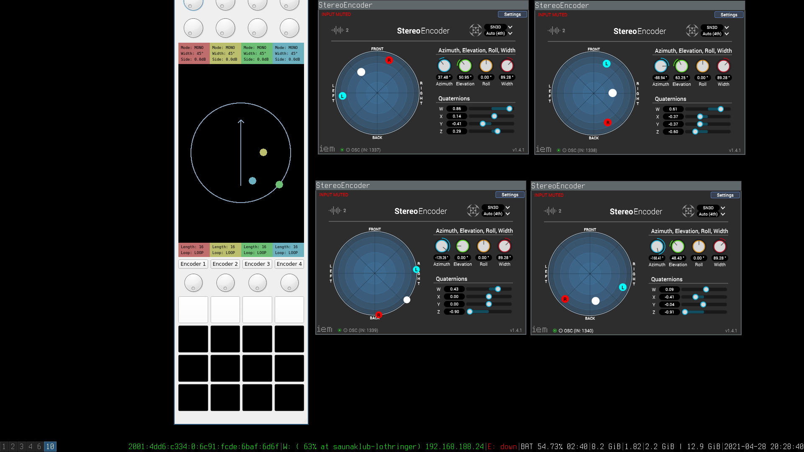
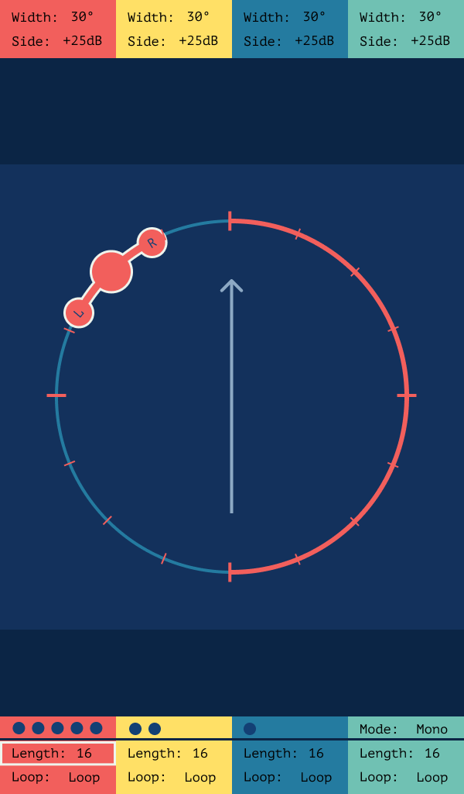
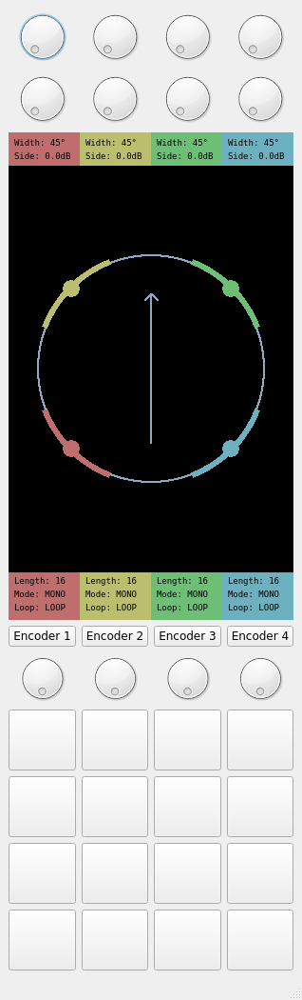

# A³ Motion Developement
## Backend
A³ Motion backend runs Arch Linux ARM. To configure your own see the [A³ Motion Configuration](https://doc.a3-audio.com/configuration/moc.html) section

## Teensy firmware
Teensy 4.1 firmware is written in c++
- ```Controller_Motion/software/teensy/src/main.cpp```

## A³ Motion Controller UI
A³ Motion Controller UI is the most complex part to develop. It is in [A³Motion - Motion Controller UI repository](https://github.com/ambisonic-audio-adventures/MotionControllerUI)

## Python script
```Controller_Motion/software/MotionControllerUI/moc_ui.py```

Motion controller UI is able to run in different modes:
-  develop mode:
```
python moc_ui.py --develop
```
- device mode:
```
moc_ui.py --serial_device /dev/ttyACM0 --server_ip "192.168.43.50" --server_port 9000 --encoder_base_port 1337
```

## Pictures
### Software Mocup



### Design sketches




