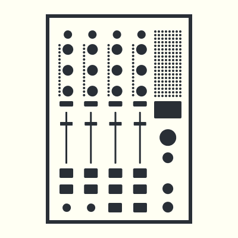
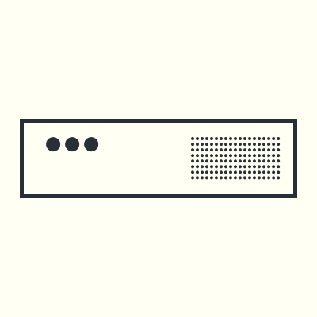

************
Introduction
************

Thanks for your interest in the A³ system.

These docs are split in two sections:

- The first section is the `User <https://doc.a3-audio.com/user/user.html>`_ section, where you will find an overview of basic functions and connections.

- The second section is the developer section wich is under heavy development and will probably never be completed. The developer section is splitted in three subsections: `Developer <https://doc.a3-audio.com/development/developer.html>`_ (about code), `Assembly <https://doc.a3-audio.com/development/assembly.html>`_ (about hardware), and `Configuration <https://doc.a3-audio.com/development/configuration.html>`_ (setup operation system).

**********
What it is
**********
The A³ system is made for 3D Audio live interaction. It is a combination of three devices:

A³ Motion (The Motion Sampler)
##############################

`A³ Motion <https://doc.a3-audio.com/user/a3motion.html>`_ is a standalone OSC controller which works like a loopstation, but instead of audio it lets you sample and playback motion from a touchscreen.

.. image:: pics_landing/a3_system_symbol_moc.png
   :height: 500px
   :width: 500 px
   :scale: 50 %

A³ Mix (The DJ Mixer)
#####################
`A³ Mix <https://doc.a3-audio.com/user/a3mix.html>`_ is a standalone OSC controller which behaves like a 4 channel DJ mixer.

A³ Core (The Sound Server)
##########################
`A³ Core <https://doc.a3-audio.com/user/a3core.html>`_  processes analog audiosignals, calculates 3D sound spheres and is remote controlled by A³ Mix and A³ Motion (or any other OSC controller). A³ Core can handle a wide range of audio hardware to fit environments like Dante, MADI or any class-compliant.

************
Requirements
************
- Soundsystem with at least 4 speakers placed around the venue.
- A venue smaller than 20m diameter. For bigger venues more spheres.

**********
Quickstart
**********
- Plug in your instruments vinyl, cd, daw ..
- Plug in your speakers
- Put speakers in regular circle around center
- Plug CAT cable from A³ Mix and A³ Motion to A³ Core
- Plug in your headphones
- Power on

**********
Quicklinks
**********

.. toctree::
   :maxdepth: 1
   :caption: A³ User

   user/user
   user/a3motion
   user/a3mix
   user/a3core
   user/advanced-user

.. toctree::
   :maxdepth: 1
   :caption: A³ Developer

   development/developer
   assembly/assembly
   configuration/configuration

.. toctree::
   :maxdepth: 1

   assembly/moc
   configuration/moc
   development/moc

.. toctree::
   :maxdepth: 1

   assembly/mic
   configuration/mic
   development/mic
   
.. toctree::
   :maxdepth: 1

   assembly/core
   configuration/core
   development/core

.. toctree::
   :maxdepth: 1
   :caption: A³ Ressources

   development/flashTeensy
   development/imaging   
   development/osc
   assembly/parts

*******
Contact
*******
- `a3-audio.com website <https://a3-audio.com>`_
- `contact@a3-audio.com <mailto:contact@a3-audio.com>`_
- `3d-audio.io forum <https://d3-audio.io>`_
- `mattermost <https://talk.lilbits.de/ambisonics>`_
