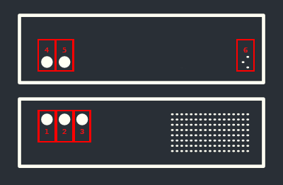

# A³ Core
## Features:
- A³ Core is a free configurable audio server
- Compatible to linux audiohardware
- VNC remote desktop control

## Box Contents
- A³ Core
- Network cable
- Quickstart Guide
- Safety & Warranty Manual

## Connecting Diagram

### [1] POWER BUTTON
- Push to turn the device on

### [2] RESET BUTTON
- Push to reboot server (just in case)

### [3] POWER LED
- Indicates power status

### [4] NETWORK SOCKET
- Connect ethernet cable to your network switch

### [5] PC SOCKETS
- Supplied by mainboard

### [6] POWER SOCKET
- Connect power cable to 230V power socket

## Misc
- Items not listed under Box Contents are sold separately.