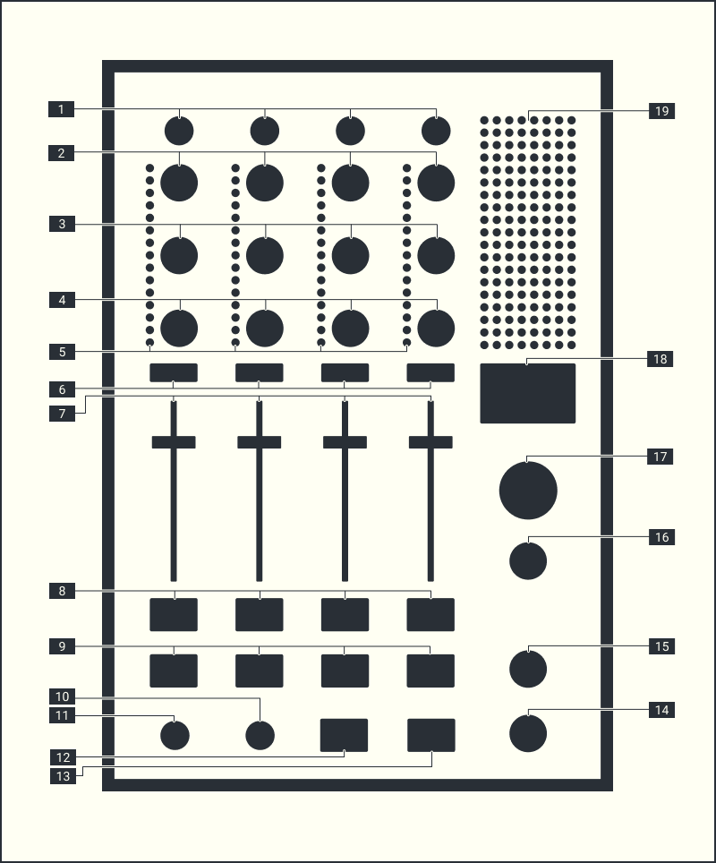

# A³ Mix
## Features:
- Standalone OSC controller
- Input vu meter per channel
- 8 Output vu meters
- WIP: USB-A 2.0 port to store presets
- WIP: „tape-in“ section for multichannel or stereo to direct (discrete, decoder, stereomap) mixbus.

## Box Contents
- A³ Motion
- Network cable
- Quickstart Guide
- Safety & Warranty Manual

## TOP VIEW

### [1] TRIM CONTROL
- Adjust the level of audio signals input in each channel
- [TRIM]: -inf dB to 0 dB

### [2] EQ HIGH
- [HIGH]: -inf dB to 0 dB (24 kHz)

### [3] EQ MID
- [MID]: -inf dB to 0 dB (1 kHz)

### [4] EQ LOW
- [LOW]: -inf dB to 0 dB (20 Hz)

### [5] INPUT VU METER
- Displays the sound level of the respective channels before passing through the channel faders

### [6] CUE BUTTON
- Presses the [CUE] button(s) for the channel(s) you want to monitor

### [7] CHANNEL FADER
- Adjust the level of audio signals output in each channel
- [FADER]: -inf dB to o dB

### [8] FILTER FX SWITCH
- Pressing the [FX] switch turns on the VCF filter for this channel
- The indicator lights if filter FX is on.

### [9]  3D SWITCH
- Pressing the [3D] switch enables 3d encoding for this channel
- The indicator lights if 3D is on

### [10] FILTER FREQUENCY
- Sets the cut off frequency of the VCF filter

### [11] FILTER RESONANCE CONTROL
- Change the "Q" or sharpness of the VCF filter

### [12] HEADPHONE LEVEL
- Sets the level of the headphone output

### [13] CUE/MIX CONTROL
- Turn left (CUE) to hear the activated channel Cue.
- If no channel Cue is activated the Mix output will be heared WIP
- Turn right (Mix) to hear the Mix output
- In the centre position the Cue signal and the main mix are summed together.

### [14] BOOTH OUTPUT LEVEL
- Sets the audio signal level for predefined monitor outputs
- [BOOTH]: -inf dB to 0 dB

### [15] MASTER OUTPUT LEVEL
- Sets the audio signal level for predefined public address outputs
- [MASTER]: -inf dB to 0 dB

### [16] DISPLAY
- shows bpm per stereo track

### [17] OUTPUT VU METER
- Displays the audio level output from 8 predefined channels

### [18] FILTER TYPE SELECT
- [HPF]: Allows signals above the cutoff frequency to pass
- [LPF]: Allows signals below the cutoff frequency to pass

## FRONT
### PHONES OUTPUT TERMINAL
- Connect headphones here
- 6.3mm stereo phone plug

## BACK
### PHONES INPUT TERMINAL
- Connect predefined Cue outputs here
-  2x female XLR Sockets

### NETWORK AND PoE
- When a plan calls for multiple devices to be connected to one PoE/PoE+ switch, it’s necessary to ensure the total wattage required by the devices do not exceed the maximum wattage of the switch.
- This device has a  estimated power consumption of 24W max. It powers up as soon as the PoE powersupply is connected.

## Misc
- Items not listed under Box Contents are sold separately.