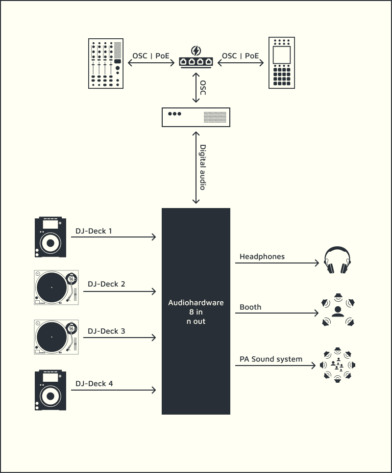

# A³ User Welcome
Custom build setup will be preset and configured by A³ Audio

## Connections
- As you can see there are the three main devices A³ Core, A³ Motion and A³ Mix. They are connected via network cable to an ethernet switch which deliveres power over ethernet (PoE)
- Your DJ-Decks and your speakers are connected to A³ Core's audiohardware

## Operating Instructions
- [A³ Core Configuration](https://doc.a3-audio.com/user/a3core.html)
- [A³ Mix Configuration](https://doc.a3-audio.com/user/a3mix.html)
- [A³ Motion Configuration](https://doc.a3-audio.com/user/a3motion.html)