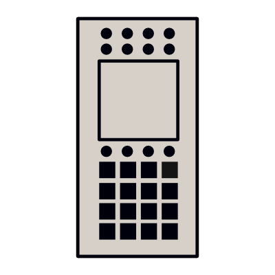
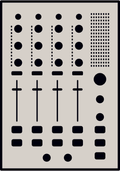
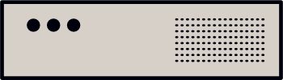

# A³ User Welcome
Custom build setup will be preset and configured by A³ Audio.
The A³ system is made for 3D audio live interaction. It is a combination of three devices:

## A³ Motion (The Motion Sampler)
[A³ Motion](https://doc.a3-audio.com/user/a3motion.html) is a standalone OSC controller which works like a loopstation, but instead of audio it lets you sample and playback motion from a touchscreen.

## A³ Mix (The DJ Mixer)
[A³ Mix](https://doc.a3-audio.com/user/a3mix.html) is a standalone OSC controller which behaves like a 4 channel DJ mixer.

## A³ Core (The Sound Server)
[A³ Core](https://doc.a3-audio.com/user/a3core.html) processes analog audiosignals, calculates 3D audio spheres and is remote controlled by A³ Mix and A³ Motion (or any other OSC controller). A³ Core can handle a wide range of audio hardware to fit environments like Dante, MADI or any class-compliant.

## Connections
- As you can see there are the three main devices A³ Core, A³ Motion and A³ Mix. They are connected via network cable to an ethernet switch which deliveres power over ethernet (PoE)
- Your DJ-Decks and your speakers are connected to A³ Core's audiohardware

## Requirements
- PA soundsystem with at least 4 speakers    
- All speaker must be placed in a most chubbiest spherical installation around listening area. Electronic corrections are possible for closer speakers    
- A venue smaller than 18m diameter. For bigger venues more speaker spheres are required

## Optional
- Booth soundsystem with at least 4 speakers placed around the DJ desk

## Quickstart
- Plug in your instruments vinyl, cd, daw ..    
- Plug in your speakers    
- Put speakers in regular circle around center    
- Plug CAT cable from A³ Mix and A³ Motion to A³ Core    
- Plug in your headphones    
- Power on