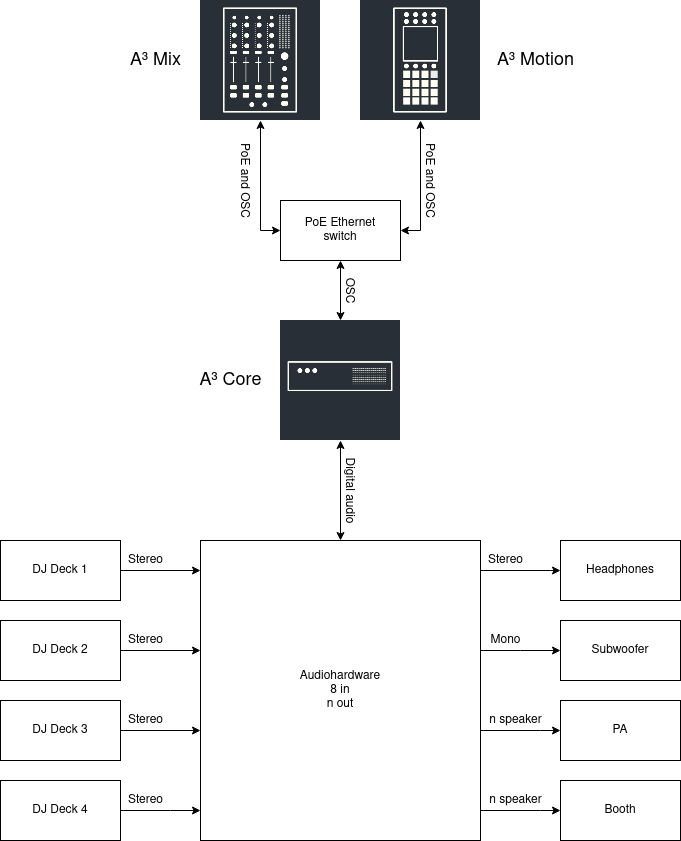

# A³ User Welcome
Custom build setup will be preset and configured by A³ Audio

## Connection Diagram

- As you can see there are the three main devices A³ Core, A³ Motion and A³ Mix. They are connected via network cable to an ethernet switch which deliveres power over ethernet (PoE).
- Your DJ-Decks and your speakers are connected to A³ Core's audiohardware.

