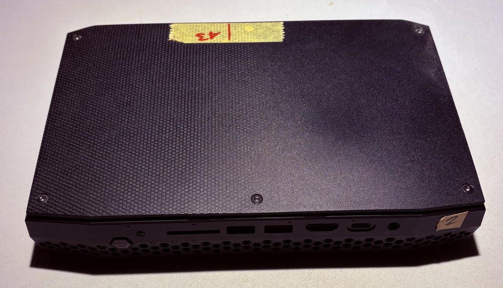
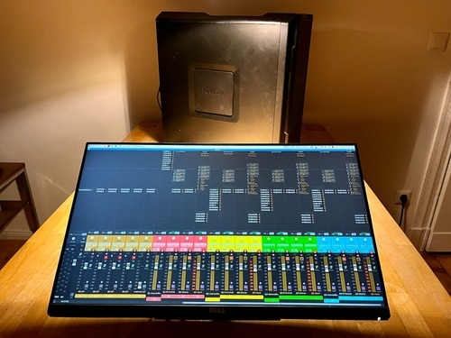
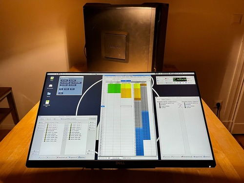
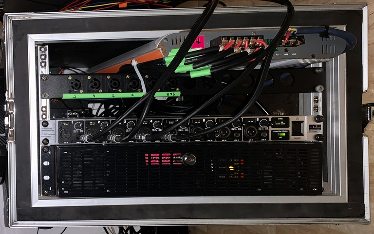
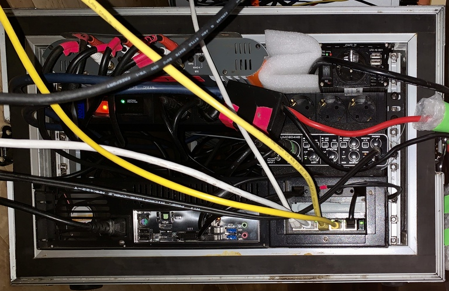

# A³ Core Assembly

- A³ Core runs Reaper, Supercollider and an osc-routing python script
- Audio Hardware (we tested: Focusrite, RME, Digigram, Motu)
- Software:
	- Reaper (Audio Backend)
	- Supercollider (Audio to osc VU-Meters)
	- Python Script (OSC I/O)
- Operating System
	- Any Linux (tested Debian)
	- macOS

## V03
- Mac Mini i7 late 2018
- Motu Ultralite AVB

The machine these pages were written on is a different box running the same
software: an **Intel NUC8i7HNK** (i7-8705G) on Debian with a realtime kernel.
A³ Core is not tied to one computer — it is that install plus REAPER,
SuperCollider and the OSC router, and it has run on a tower, a Mac and this.

## V02
- AMD Threadripper (16 Cores)
- Digigram LX Dante

## V01
- Intel i5 (4 Cores)
- MiniDSP Streamer (USB <-> ADAT io)
- Behringer ADA8000
- Behringer U-Phoria (Audio interface used as headphone Amp)
- JBL GTO6000 (6ch Car Hifi Amp)
- TP-Link 5-Port PoE Switch
