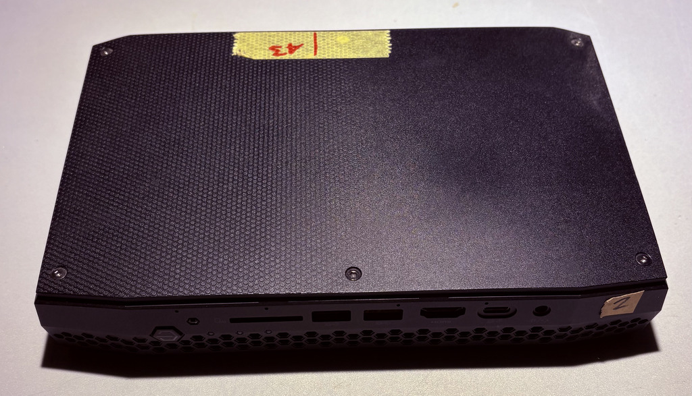
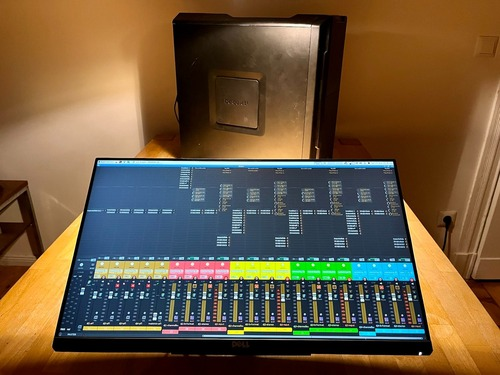
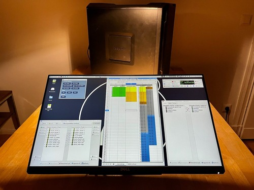
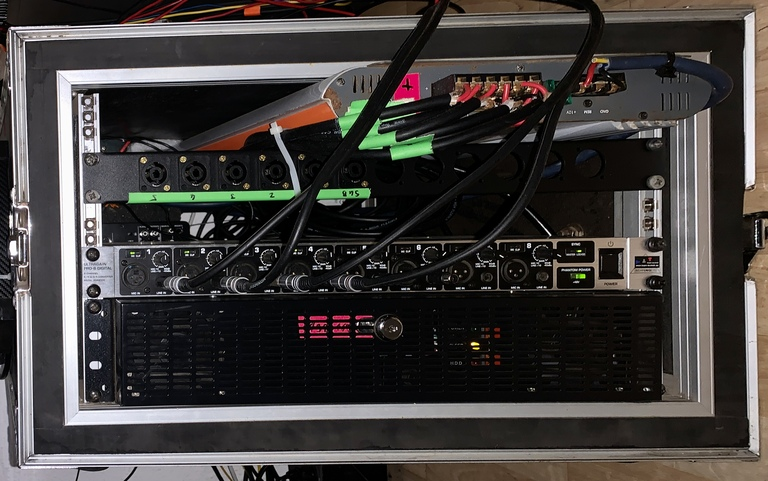
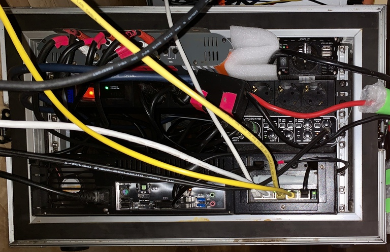

# A³ Core Assembly

A³ Core is not a particular computer: it is an install — REAPER, the beat-analyzer
and an OSC routing script — on a machine with enough audio hardware. It has run
on a tower, a Mac and a NUC.

## What it runs

| Layer | What it is |
| :--- | :--- |
| Audio backend | REAPER |
| VU metering | the beat-analyzer, audio to OSC |
| OSC I/O | a Python script |
| OS | any Linux (tested on Debian), or macOS |
| Audio hardware | tested with Focusrite, RME, Digigram, Motu |

## Revisions

| Revision | Machine | Audio hardware |
| :--- | :--- | :--- |
| **V03** | Mac Mini i7, late 2018 | Motu Ultralite AVB |
| **V02** | AMD Threadripper, 16 cores | Digigram LX Dante |
| **V01** | Intel i5, 4 cores | MiniDSP Streamer (USB ↔ ADAT), Behringer ADA8000, Behringer U-Phoria as a headphone amp, JBL GTO6000 6-channel amp, TP-Link 5-port PoE switch |

The rig runs on an **Intel NUC8i7HNK** (i7-8705G) on
Debian with a realtime kernel; it also runs A³ Motion's UI and StemDeck.

