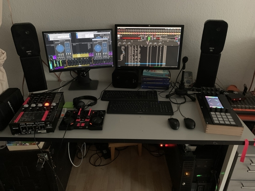
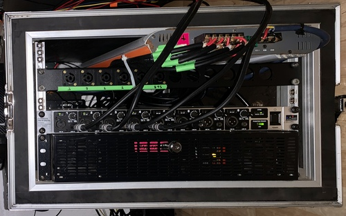
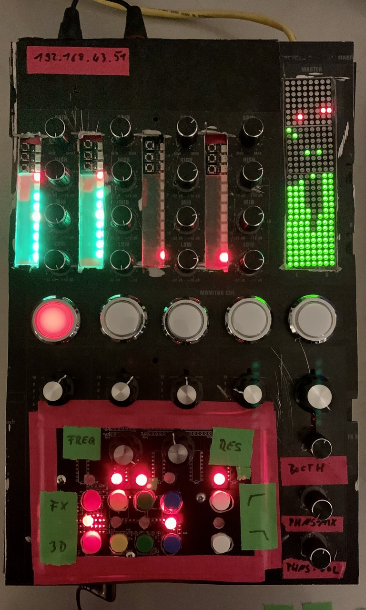
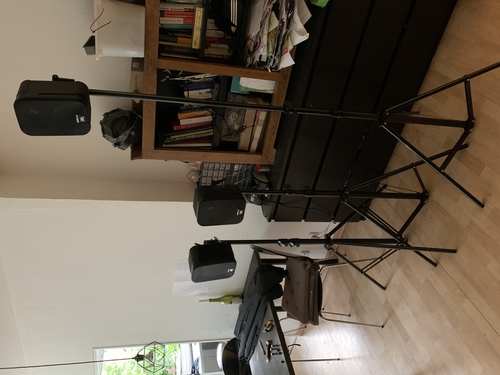
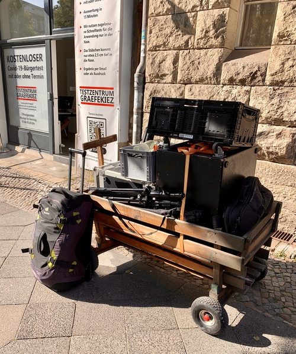
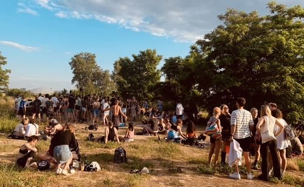
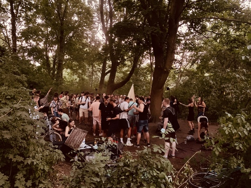
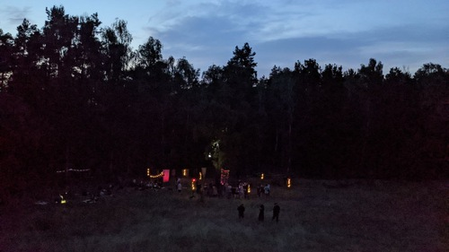
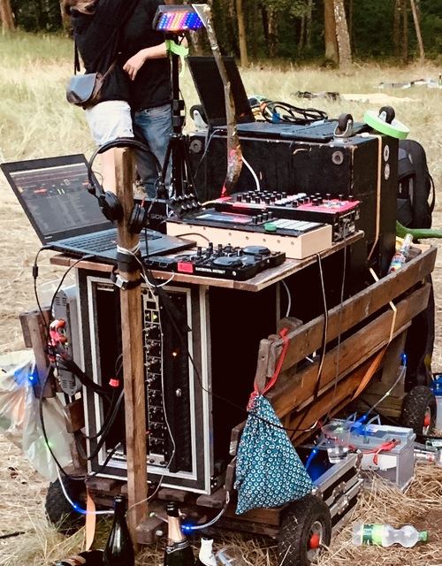

# History

# 2025

# 2019 - 2021
## A³ System V01

## A³ Core V01
A 6 channel car amplifier cramped in that case. MiniDSP Streamer and  Behringer ADA8000 as interface.

 

We put a PoE switch and a miniDSP USBstreamer mini in the core case. The Behringer UMC Interface is just the headphone amp

## A³ Mix V01

Raw

Wrapped

## A³ Motion V01

## Rock it
We bought some cheap speakers

Put everything on a handwagon

And pulled it into a park

People came and loves it

Police came and forced us to change location

Until night

And to the day after

In the end we still had power left from the batteries but no energy anymore.

# 2019

## A³ Mixer PCB V00

| Back | Front
--- | ---
 | 

# 2018

## The journey starts

Since 2018 we're working with 3d audio in live environments. Since its complex to use 3d audio software it also needs a total rework of the live perfoming setup for artists. At the beginning we always where in a situation that we, as system operators, must perform 3d panning for artists, which resolves in confusing when and which operations we have to do to fit the artist ideas - though it was kind of random. We decided to start our journey and build something an artist could use with almost no knowledge about what is behind.

### First Mocup

### Get an idea
A³ Mixer | A³ Motion
--- | ---
 | 

