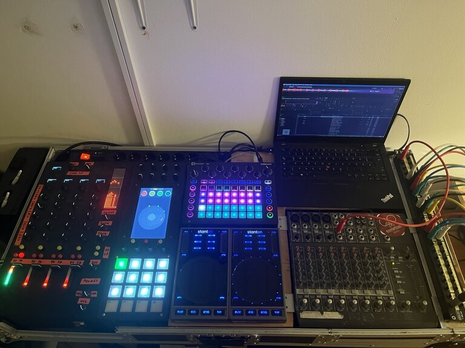
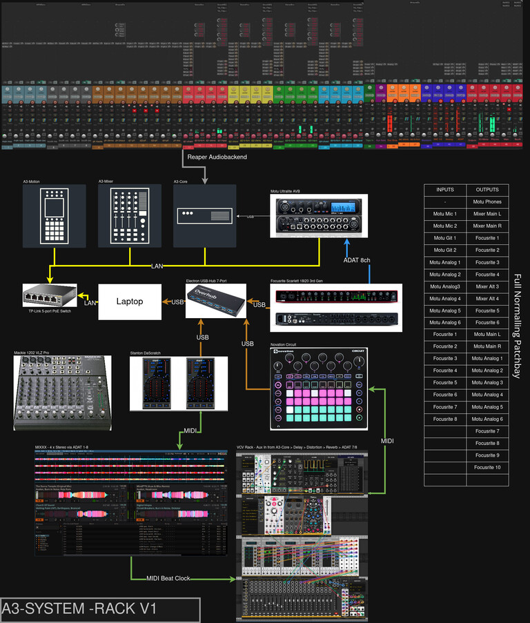
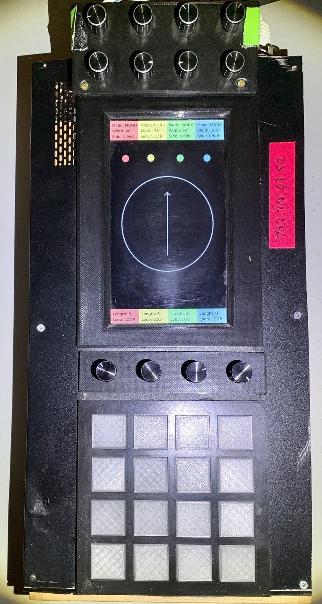

# History
Since 2018 we're working with 3d audio in live environments. Since its complex to use 3d audio software it also needs a total rework of the live perfoming setup for artists. At the beginning we always where in a situation that we, as system operators, must perform 3d panning for artists, which resolves in confusing when and which operations we have to do to fit the artist ideas - though it was kind of random. We decided to start our journey and build something an artist could use with almost no knowledge about what is behind.
## 2025 - Spatial DJ-Setup
* A³ Mixer V02
* A³ Motion V02
* A³ Core V02

## A³ Motion V01

## A³ Mixer V01

### First Mocup

### Get an idea
| A³ Mixer                              | A³ Motion                                      |
| ------------------------------------- | ---------------------------------------------- |
|  |  |
## Proof of Concept

