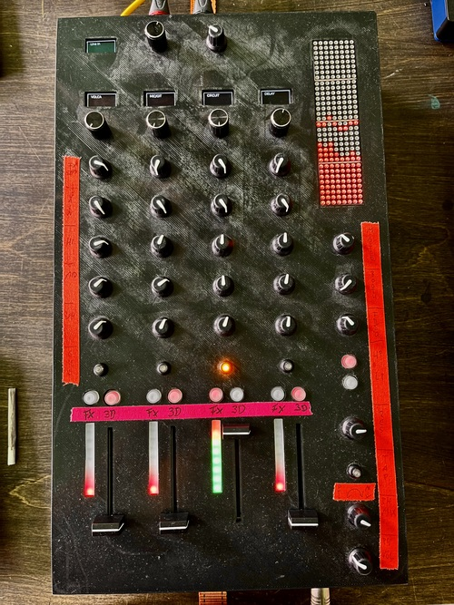
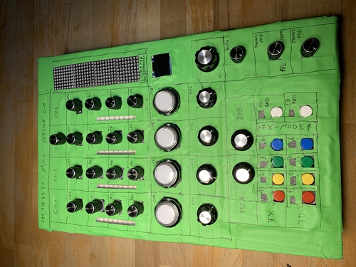

# A³ Mixer Assembly
## V02

## PCB V02

## Housing V02
draft | print
---|---
 | 

## Headphones
2 XLR sockets on the back are connected to a 6.3mm jack socket on the front. An external headphones amp is needed

## Assembly
1 | 2
---|---
 | 
 | 
 | 

## Specifications
### Multiplexer pin configuration
#### Multiplexer 1-4 (hc4051)
Function (potentiometer)| Pin
---|---
GAIN | 0 
EQ HIGH | 1 
EQ MID | 2 
EQ LOW | 3 
VOLUME | 4
FX SEND | 5

#### Multiplexer 5 (hc4051)
Function (potentiometer) | Pin
---|---
MASTER | 0 
BOOTH | 1
PHONES MIX | 2
PHONES VOLUME | 3
TAP BUTTON | 4
FX FREQUENCY | 7
FX RESONANCE | 8

#### Multiplexer 6 (hc4051)
Function (buttons) | Pin
---|---
FX TOGGLE | 0-3
3D TOGGLE | 4-7

### Leds
- 4 led-buttons for heapdphones prelisten function (pfl)
- 4x9 NeoPixel for input vu (ws2811)
- 10 NeoPixel for fx and 3d-section (ws2811)
- 1x 8x32 LED-Matrix max7219
### Displays
- 5x 0.96 inch OLED SSD1306 Display I2C 128 x 64
- TCA9548A I2C IIC Multiplexer

### Estimated power consumption
Device | Watts
---|---
Raspberry Pi 3 Model B | 5W
Teensy 4.1 | 2.5W
46 NeoPixel | 13W
8x32 Leds max7219 | 4.5W
5x 0.96 inch OLED Display | 0.2W
---|---
Sum | 25.2W

## V01

### Wrapped

### V00 

## V00

| Back | Front
--- | ---
 | 
