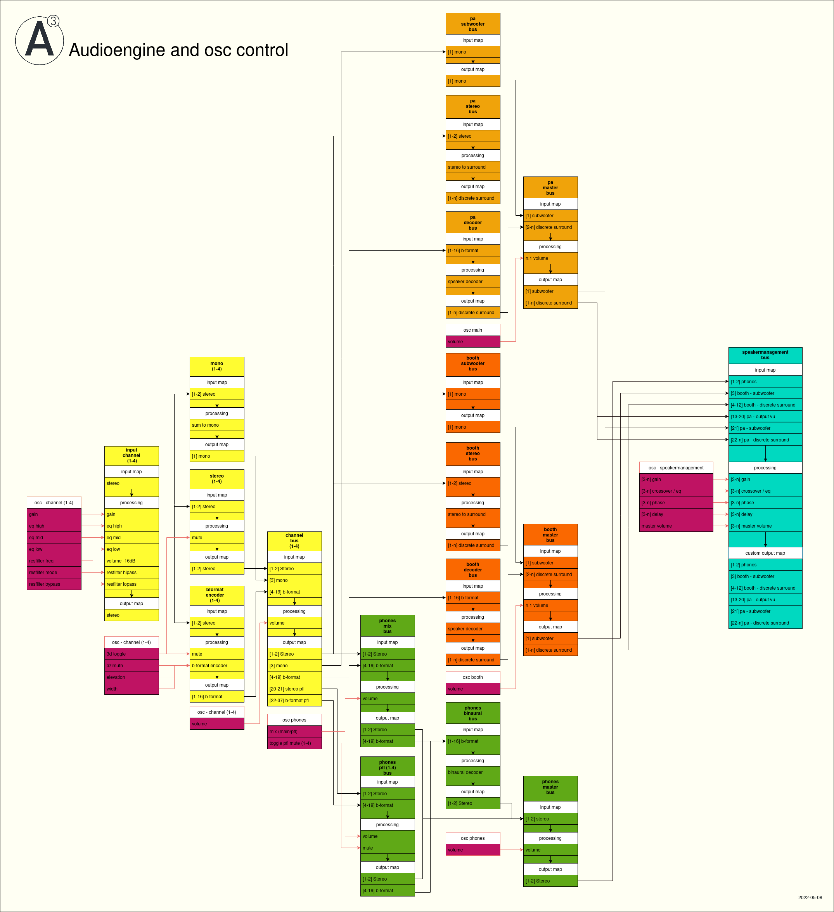
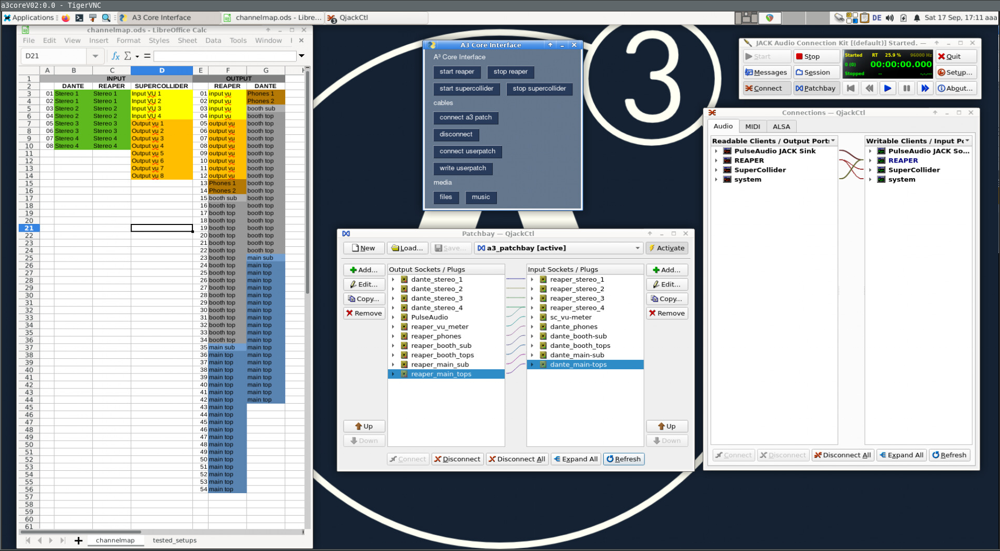
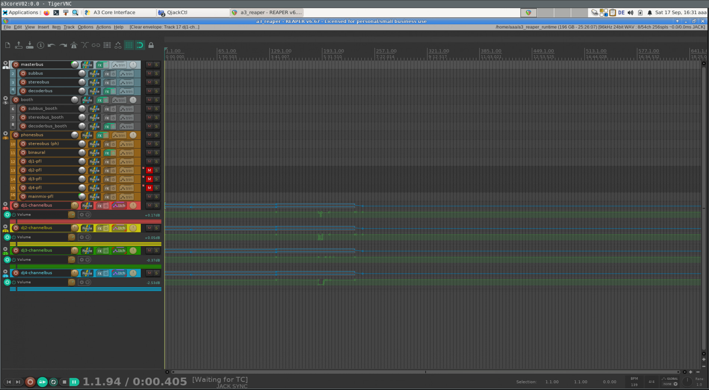
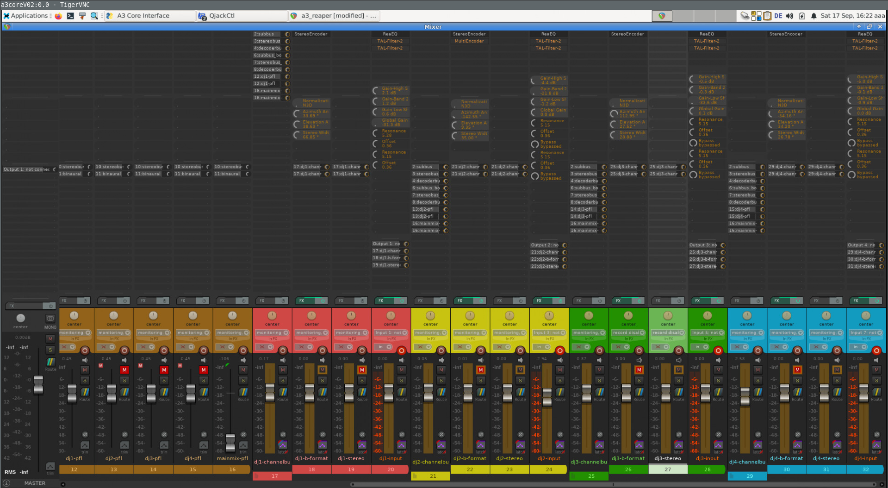

# A³ Core Configuration
## OS
- Debian with Linux realtime kernel
- xfce window manager
## Python script OSC-Router
 - Routes OSC between audioengine and controller
## Supercollider script VU-Meter
- 12-Channel Jack client (could be more for ie light and vj control)
- sends vu-meter (peak and rms) via OSC
- ```VU-Meter.scd```
## User VNC interface 
To setup patching and recording
- Qjackctl (Patching)
- Reaper (Sequencer)
- Reaper (Mixer)
## IEM Pluginsuite
- [IEM-Pluginsuite](https://plugins.iem.at/) VST 3 plugins for 3D audio processing
- StereoEncoder
- AllraDecoder
- BinauralDecoder
- FDNReverb
- AllraDecoder must be configured to fit your speaker setup
## TAL-Filter-2 FX
- [TAL-Filter-2](https://tal-software.com/products/tal-filter) Resonance Filter FX VST plugin
## Airwindows SmoothEQ
- [SmoothEQ](https://www.airwindows.com/smootheq) 3-Band EQ VST Plugin
## Reaper Audiobackend Signalflow
- ```a3-audio.RPP```




## Screenshots
### Control screen

### Sequencer  screen

### Mixer screen
