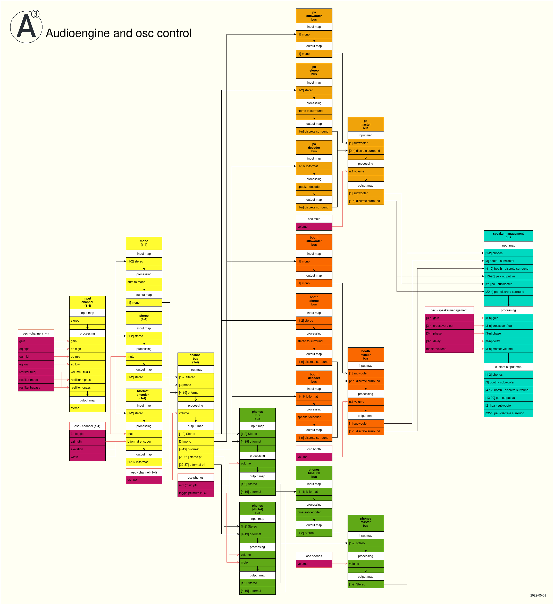
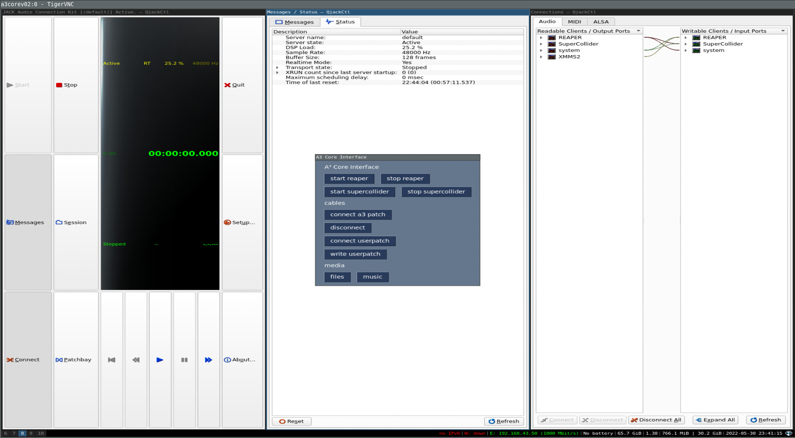
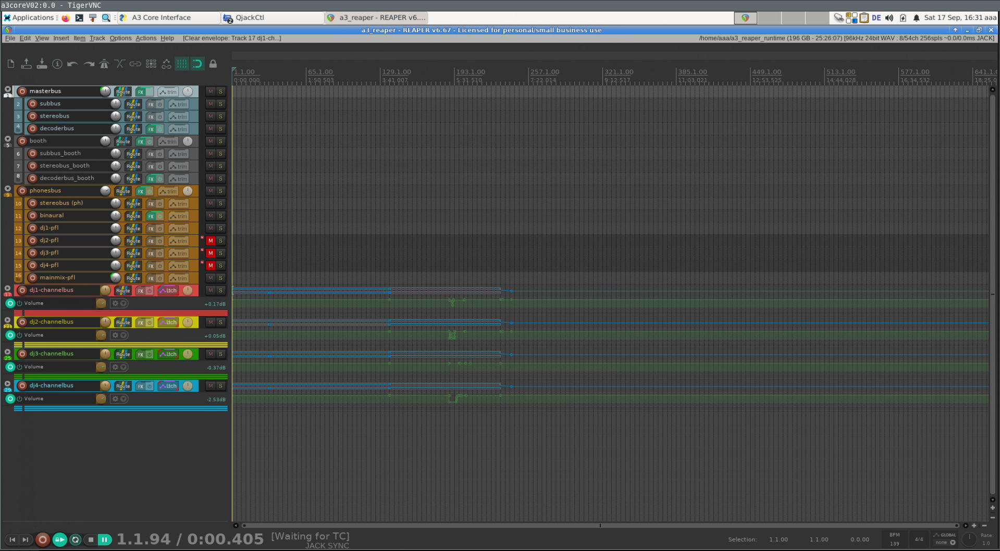
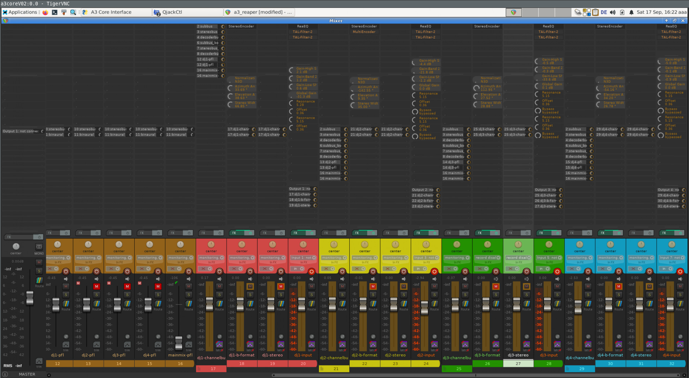

# A³ Core Configuration

| Part | What it is |
| :--- | :--- |
| OS | Debian with a Linux realtime kernel |
| Window manager | xfce |
| Audio backend | REAPER |
| VU metering | SuperCollider |
| OSC router | `~/.local/bin/a3-core.py`, started by a `systemd --user` service |

## The OSC router

A Python script that routes OSC between the audio engine and the controllers.
It is the only part of Core that knows which device is which.

### How it is started

Everything is a default that can be pointed somewhere else, which is what
makes the whole path testable on a bench instead of only in front of the rig:

| Argument | What it is |
| :--- | :--- |
| `--port 9000` | where commands arrive |
| `--feedback-port 9002` | where REAPER's feedback arrives — its own port, so REAPER's reports can never be read as commands |
| `--web-bind 127.0.0.1:9080` | the window. Localhost by default: it can send OSC into a running rig, and a control surface with no login on the show network is not a default worth setting |
| `--mixer`, `--motion` | the two devices that ship, as `host:port` |
| `--reaper`, `--dualdelay` | the audio engine's own endpoints |
| `--subscriber NAME=HOST:PORT` | **another department.** Repeatable |
| `--print-osc` | also print every message, the way Core did before the window existed. Off by default: it was 301,385 journal lines an hour on one address alone |
| `--no-web` | do not open the window at all |

### Adding a department

A light or video desk that wants to follow the show needs no change to any
source file:

```
a3-core.py --subscriber light=192.168.43.60:7771 \
           --subscriber video=192.168.43.61:7771
```

Every A³-shaped message then reaches it — every channel's gain, EQ, volume and
send, the master section, the filter, the positions, the lamps and the flags —
in exactly the form the A³ Mixer and A³ Motion get them. The name is what the
window shows in its peer column.

A subscriber that cannot be parsed stops Core from starting, rather than being
skipped. That is deliberate: a mistyped subscriber is a department that hears
nothing all evening, and OSC over UDP has no way of saying so.

See the [OSC reference](https://a3-audio.github.io/a3-doc/ressources/osc.html)
for what arrives.
## Supercollider script VU-Meter
- 12-Channel Jack client (could be more for ie light and vj control)
- sends vu-meter (peak and rms) via OSC
- ```VU-Meter.scd```
## User VNC interface 
To setup patching and recording
- Qjackctl (Patching)
- Reaper (Sequencer)
- Reaper (Mixer)
## IEM Pluginsuite
[IEM-Pluginsuite](https://plugins.iem.at/) VST3 plugins for 3D audio
processing. What the shipped project actually loads:

| Plugin | What it does here |
| :--- | :--- |
| MultiEncoder | Where a channel's sound sits in the room. A³ Core writes `azimuth` and `elevation` straight to its **own OSC port** (`127.0.0.1:1337+n`), never through a REAPER track — which is why REAPER can never report a position back, and why Core has to remember it |
| AllRADecoder | Must be configured to fit your speaker setup |
| BinauralDecoder | For headphones |
| SimpleDecoder | |
| EnergyVisualizer | Sends the energy field to A³ Motion on port 7777, once its "OSC send" is switched on in the lower left of the plug-in |
| DualDelay | On the FX bus, following the beat-analyzer's tempo |

```{warning}
**Two of these have a receiver that has to be opened by hand**, and nothing
says so when it is shut. The DualDelay needs *Listen to port* → `1340` →
**OPEN** in its status line, with `Sync` **off**; the EnergyVisualizer needs
its OSC send switched on. Both are plug-in state and live in the REAPER
project, not in any repository.
```

## TAL-Filter-2 FX
- [TAL-Filter-2](https://tal-software.com/products/tal-filter) resonance
  filter, one per channel — the high-pass and low-pass the FX key switches
  between

## Airwindows Consolidated
- [Airwindows](https://www.airwindows.com/) plugins are loaded through the
  **Consolidated** container rather than individually, which is why one
  instance has fourteen parameters and the gain of each sits on parameter
  1, 15, 29 and so on. `gain_params` in `layout.json` is that list
- Carries the channel gains, the EQ and the bus volumes
## Reaper Audiobackend Signalflow
- ```a3-audio.RPP```




## Screenshots
### Control screen

### Sequencer  screen

### Mixer screen
