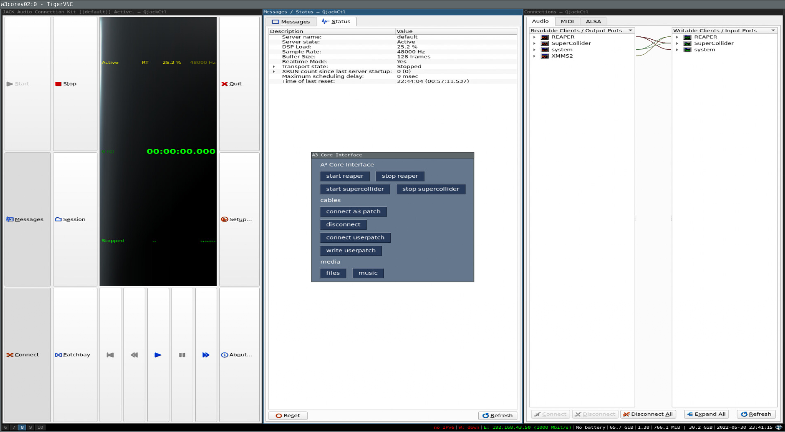
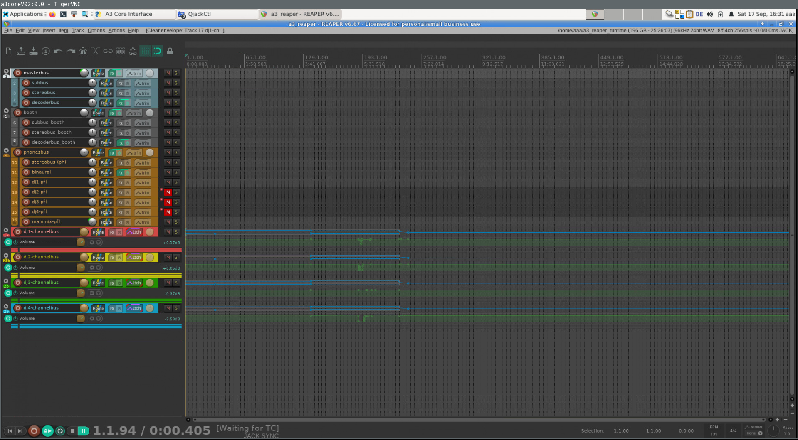
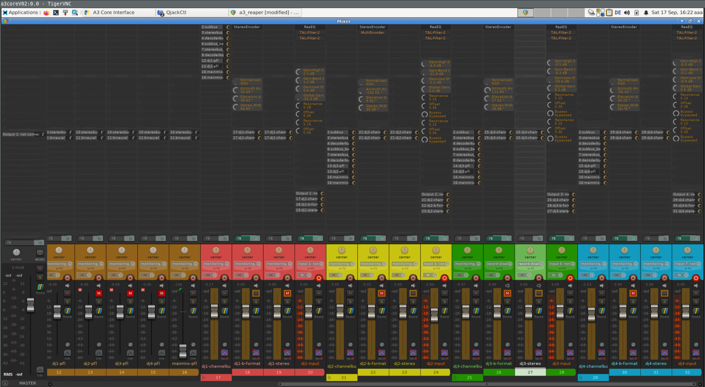

# A³ Core Configuration

A³ Core is one Debian package, `a3-core`. This page follows it onto a machine
in the order it happens:

1. [The Debian package](#core-package) — what it is, how it gets there, what
   it needs.
2. [What the installation does](#core-postinst) — the package's install
   script, step by step.
3. [The services](#core-services) — every systemd unit it ships, and what
   each one starts.
4. [The files](#core-files) — every file the installation puts on the
   machine, where it lands, and whether you are meant to edit it.

The usual way onto a machine is the a3-system {doc}`installer <install>`
(role Core): it builds this package from the version's a3-core, asks the
package's questions up front and installs it. The package then does what this
page describes either way.

| Part | What it is |
| :--- | :--- |
| OS | Debian testing with a Linux realtime kernel |
| Window manager | i3, with named workspaces — see [The screen](#core-config-screen) |
| Audio backend | JACK and REAPER, with the IEM plug-in suite |
| VU metering | the beat-analyzer — see the {ref}`VU map <core-vu-map>` |
| OSC router | `~/.local/bin/a3-core.py`, started by a `systemd --user` service |

```{note}
**No addresses and no ports on this page.** Every OSC address, port and IP of
the system is written once, in `a3-osc.json`: the contract in
`/usr/share/a3/a3-osc.json`, which this package installs, and the network
(hosts and Core's own interface) in `~/.config/a3/network.json`, which is
yours — see {ref}`Where addresses and ports live <osc-truth>`. Where a
program below talks to the network, this page names *what* it talks to, by
the name the file gives it (`core.osc`, `motion.energy`, …), and the file says
where that is.
```

(core-package)=

## 1. The Debian package

The package is built from the
[a3-core](https://github.com/a3-audio/a3-core) repository: that repository
*is* the deployment, the package tree under
`platform-config/debian-x86_64/a3-core/`, not application source. Every path
in that tree is where the file lands on the machine — `home/aaa/.local/bin/`
becomes `/home/aaa/.local/bin/`, `etc/` becomes `/etc/`. The package is built
for one user, **`aaa`**: its paths name that home directory.

### Before you start

- A blank Debian installation, without a desktop environment, with an SSH
  server.
- A user named `aaa`.
- `sudo` for that user. As root: `apt install sudo wget`, then
  `/usr/sbin/usermod -aG sudo aaa`; log out and back in.

### Installing

With the {doc}`installer <install>`, or — for the newest package from the
apt archive, on a3-core's `main` whatever version the rest is on — one
command, as `aaa`:

```sh
wget -qO- "https://raw.githubusercontent.com/a3-audio/a3-core/main/platform-config/debian-x86_64/a3-core_install.sh" | sudo bash
```

The install script (`platform-config/debian-x86_64/a3-core_install.sh`) has to
run as root and does four things:

1. Updates the package lists and installs `wget`, `gnupg` and
   `ca-certificates`.
2. Fetches the package archive's signing key and installs it as
   `/usr/share/keyrings/a3-core-archive-keyring.gpg`.
3. Adds the A³ archive as an apt source,
   `/etc/apt/sources.list.d/a3-core.sources`, pointing at
   `https://a3-audio.github.io/a3-core/`.
4. **Switches the machine to Debian testing.** It moves an existing
   `/etc/apt/sources.list` aside to `/etc/apt/sources.list.bck` and writes
   `/etc/apt/sources.list.d/debian.sources` with `testing`,
   `testing-security` and `testing-updates` (components `main` and
   `non-free-firmware`). Then `apt update`, `apt full-upgrade -y`,
   `apt install -y a3-core`, and finally `dpkg-reconfigure a3-core`.

The script exports `DEBIAN_FRONTEND=noninteractive`, so the installation's
questions (next section) take their stored or default answers instead of
being asked. Answer them afterwards yourself:

```sh
sudo dpkg-reconfigure a3-core     # network, bridge, headless screen
sudo dpkg-reconfigure jackd2      # realtime priorities for JACK
```

Once the apt source is in place, an update is an ordinary
`sudo apt update && sudo apt install a3-core`.

### The version

The archive is rebuilt by a GitHub workflow on every push to `main`. The
package version is set by that workflow, not by hand: the last `v*` tag plus
the commits since it — `v03.0` with 63 commits on top is `03.0+63`. It is
written into `DEBIAN/control` before the build. The `1.0.0` in the checked-in
`control` is only what a package built by hand gets, and apt treats it as
older than anything published. `python3 tools/package_version.py` in the
repository prints the version the next build will carry.

### What it depends on

`DEBIAN/control` pulls in, by purpose:

| Purpose | Packages |
| :--- | :--- |
| Realtime and audio | `linux-image-rt-amd64`, `jackd2`, `libjack-jackd2-dev`, `jack-example-tools`, `qjackctl`, `zita-ajbridge`, `zita-njbridge`, `libsamplerate0-dev` |
| 3D audio | `iem-plugin-suite-vst3` |
| Screen | `lightdm`, `i3`, `i3status`, `xinit`, `xserver-xorg-video-dummy`, `x11vnc`, `x11-utils`, `x11-xserver-utils`, `libgtk2.0-0`, `pcmanfm` |
| Python (Core) | `python3`, `python3-pip`, `python3-venv`, `python3-rtmidi` |
| Building the beat-analyzer | `build-essential`, `cmake`, `pkg-config`, `git` |
| Tools | `systemd`, `sudo`, `curl`, `wget`, `gpg`, `unzip`, `liblo-tools`, `net-tools`, `htop`, `vim`, `tree` |

It also **conflicts with and replaces** what does not belong on a show
machine: `network-manager`, `wpasupplicant`, `modemmanager`, `dhcpcd-base`,
the Bluetooth stack (`bluetooth`, `bluez`, `bluez-obexd`, `blueman`),
`plymouth`, `cron`, `gnome-keyring` and the GNOME themes, the `gvfs` packages
and `i3lock`. Installing `a3-core` removes them.

(core-postinst)=

## 2. What the installation does

After dpkg has unpacked the files, the package's `DEBIAN/postinst` runs. It
runs on **every** install and upgrade, on a machine that may be in the middle
of a show — so most steps are written to leave alone what is already there.
In order:

### 1. The network (optional)

**"Do you want to configure networking for a3-core?"**
(`a3-core/configure-network`, default *no*). With *no*, the network is not
touched. With *yes*:

- If `a3-core/install-default-network` is *yes*, the interface, address,
  gateway, DNS and bridge are taken from the `network` section of the one
  truth (via `a3-osc-render network`), without further questions. This
  question is not shown during the install; it is *no* unless it was set
  beforehand (for example with `debconf-set-selections`).
- Otherwise it asks for the **address** (with prefix length), **gateway** and
  **DNS** — on every install, pre-filled with the stored answer, so Enter
  keeps it. An answer still on the network the rig used before September 2026
  is reset to the template's default before it is shown. Then the
  **interface** to match (asked at debconf priority *medium*, so hidden by
  default; `eno1` unless changed).
- **"Second network socket to bridge with the first"**
  (`a3-core/bridge-with`). The router has one free port, so the A³ Mixer can
  hang on the Core's second socket. Name that socket (for example `enp5s0`)
  and both sockets become one network segment, `br0`, which carries the
  Core's address. Empty means one socket. The first time it is ever asked it
  is pre-filled with the machine's other wired socket; after that the stored
  answer stands, an empty one included.

What it writes, into `/etc/systemd/network/`, for systemd-networkd:

| Answer | Files |
| :--- | :--- |
| no bridge | `a3.network` (the address on the one interface) |
| bridge | `10-a3-bridge.netdev` (`br0`, **STP on**), `20-a3-bridge-ports.network` (both sockets into `br0`), `30-a3-bridge-address.network` (the address on `br0`, also without a cable) |

Each variant removes the other's files, so answering "no bridge" is also the
way back. STP is on because once a switch is added, two cables into it are a
loop, and a loop on a show network is a broadcast storm; the price is about
thirty seconds after boot.

The interfaces it configures are then **taken out of ifupdown's hands**: their
lines in `/etc/network/interfaces` are commented out (marked
`# a3-core: networkd owns …`), not deleted, so the change can be read and
undone. With both configuring one interface, the address the machine came up
with depended on which one was first.

`systemd-networkd` is **enabled but not started**: nothing is switched
during the install, the new network applies at the next boot.

### 2. The headless screen

**"Draw to a dummy screen instead of a monitor?"**
(`a3-core/headless-display`, default *no*). Only for a Core that runs without
a monitor and is used over VNC.

- *Yes* copies `~/.local/share/a3-core/x11/10-headless.conf` to
  `/etc/X11/xorg.conf.d/10-headless.conf`. X then draws to a virtual
  1920×1080 screen on the dummy driver, and **a monitor that is plugged in
  stays black**.
- *No* renames that file to `10-headless.conf.off` if it is there and is the
  shipped one — which mends a machine an older package left on the dummy
  screen. A config somebody wrote themselves is left alone.

X reads it on its next start. Answer *no* on a machine with a screen, such as
one that also runs A³ Motion with its touch panel.

### 3. The Python environment

A virtual environment at `~/.venv`, and into it the packages in
`~/.local/share/a3-core/recipes/requirements.txt`: `numpy`, `python-osc`,
`mido`, `FreeSimpleGUI`. Core runs on this environment's Python.

### 4. The configuration, installed into `~/.config`

The package carries its configuration under `~/.local/share/a3-core/config/`
(listed in [part 4](#core-config-tree)) and installs it into `~/.config`, file
by file:

- A file that is **missing** is installed.
- A file that is **the same** is left alone.
- A file that **differs** — left over from an older a3, or edited on this
  machine — is replaced only if its part was chosen. The install asks which
  parts to replace (`a3-core/replace-config`), offering only the parts that
  differ, all of them ticked; an unattended install takes them all. The parts
  are `reaper`, `i3`, `systemd`, `qjackctl` (QjackCtl and the patchbay), `iem`
  and `other`, by the folder a file sits in.
- Every replaced file is first copied to
  `~/.config/a3-replaced/<date_time>/`, under its own path, and the install
  names it. A file whose part was not chosen stays, and is named too.

The REAPER template can differ because it was edited on this machine. The
install never stops or starts REAPER (since 2026-10-07), so a replaced
template is read at REAPER's next start: **after an upgrade, restart
`a3-main`** when you can, not mid-set.

To compare one file with the package's version, or to bring one over on
purpose, use `tools/config-status.py` from an a3-core checkout:

```sh
python3 tools/config-status.py                  # list what differs
python3 tools/config-status.py --install PATH   # repo -> machine, one file
```

`--install` shows the diff and keeps the old file. Without a path it goes
through everything that differs.

### 5. Ownership and permissions

`~/.local` and `~/.config` are given to `aaa`. Every directory in
`~/.config` is set to `0755` and every file to `0664`.

### 6. Rendering the one truth: `a3-osc-render user`

Run as `aaa`. Some programs cannot read JSON, so their addresses are written
out from the joined truth (the package's file with `~/.config/a3/network.json`
over it) as text:

- `~/.config/a3/osc.env` — the targets of the two zita units (see
  [zita-j2n and zita-n2j](#core-zita)).
- the block between `# >>> a3-osc` and `# <<< a3-osc` in the beat-analyzer's
  `~/a3-system/beat-analyzer/build/.env`, if that file exists — its OSC
  targets, its clock port, its OSC words and the Pro DJ Link ports. Only that
  block is the package's; the rest of the file is yours. A key of the truth
  found outside the block is commented out, not deleted.

If it fails, the install says so: the zita units would start without their
addresses. Core renders the same two at **its own start**, so a changed
`network.json` reaches them with Core's restart; run `a3-osc-render user` by
hand only to refresh them without restarting Core (see
{ref}`When a port or an address has to change <osc-truth>`).

### 7. System services

`systemctl enable` for `x11vnc.service` and `set_irq_prio.service` (see
[System units](#core-system-units)).

### 8. User services and the REAPER installation

`loginctl enable-linger aaa`, so the user's systemd instance runs without a
login, then — as `aaa` — `systemctl --user daemon-reload` and **start**
`a3-user-install.service`, which runs `recipes/user_install.sh` in the
background (next section). Linger is switched off again at the end.

`a3-main.service` needs no `enable` of its own: the package ships the
`default.target.wants` links for it, for both zita units and for
`a3-bar-per-workspace` in the config tree, and step 4 copies them into
`~/.config/systemd/user/` — so the rig comes up at boot. (The postinst still
carries an `enable a3-main` line, commented out; the links made it
unnecessary.)

### 9. The boot loader

`update-grub`, which picks up the kernel command line from the shipped
`/etc/default/grub` (see [Under /etc](#core-etc)).

The postinst ends with what is left to you:

```text
use 'systemctl --user status a3-user-install.service' to check status
use 'dpkg-reconfigure a3-core' to configure network and the headless screen
use 'dpkg-reconfigure jackd2' to enable rt-priority
Please Reboot or manage a3-core manually with 'systemctl --user start a3-main.service'
```

(core-user-install)=

### `a3-user-install.service`: REAPER, the plug-ins, the beat-analyzer

`~/.local/share/a3-core/recipes/user_install.sh` installs what Debian does
not carry. Because the postinst starts it on every upgrade, on a running rig,
**each component is installed only when the file it leaves behind is
missing**. Fetching them again used to empty REAPER's directory under the
running REAPER, and quietly swapped in whatever version upstream offered that
day.

| Step | What it does | Skipped when |
| :--- | :--- | :--- |
| REAPER | downloads the current Linux x86_64 release from reaper.fm, installs it into `~/.local/opt/REAPER`, links `~/.local/bin/reaper` | `~/.local/opt/REAPER/reaper` exists |
| Plug-in paths | sets two keys in `~/.config/REAPER/reaper.ini`: `vstpath` (`~/.local/vst/` and `/usr/lib/vst3/`) and `clap_path_linux-x86_64` (`~/.local/clap` and `/usr/lib/clap`); writes a stub `reaper.ini` with just those if there is none | never — but only these two keys are touched |
| TAL-Filter-2 | downloads it and installs `~/.local/vst/TAL-Filter-2.vst3` | that file exists |
| Airwindows Consolidated | downloads the latest Linux build of the `DAWPlugin` release and installs `~/.local/clap/airwindows.clap` | that file exists |
| beat-analyzer | builds `~/a3-system/beat-analyzer` with its `./build.sh`; copies `.env.example` to `build/.env` with `cp -n` | the checkout is missing, or `build/beat-analyzer` exists |

Notes:

- `reaper.ini` is the machine's — audio device, window positions — so the
  package does not ship it; it sets only the two keys REAPER needs to find
  the plug-ins. The IEM suite comes from Debian, in `/usr/lib/vst3`.
- The beat-analyzer is **not** cloned: it is built from the a3-system
  checkout, which carries it as a submodule. If that checkout is not there
  yet, the step says so and is skipped — clone a3-system (see
  {doc}`install`), then start `a3-user-install.service` again. A `build/.env` that already exists is
  never overwritten. Without one, the analyzer reaches nothing off the
  machine.
- To fetch REAPER and the plug-ins again on purpose:

  ```sh
  A3_REINSTALL=1 bash ~/.local/share/a3-core/recipes/user_install.sh
  ```

  REAPER is stopped while its files are replaced and started again
  afterwards.

### Removing the package: `postrm`

`apt purge a3-core` removes `/etc/systemd/network/a3.network`, disables
`systemd-networkd` and reloads systemd. Nothing else is undone: the bridge
files, the commented ifupdown lines, the headless X config and everything in
the home directory stay.

(core-services)=

## 3. The services

### How they hang together

Core is a group of `systemd --user` units with **`a3-main.service`** as the
umbrella. `a3-main` does nothing itself (`Type=oneshot`, `ExecStart=/bin/true`,
`RemainAfterExit=yes`); it *wants* the components, and each component is
`PartOf=a3-main.service`:

- **Starting** `a3-main` starts `a3-jack`, `qjackctl`, `a3-reaper`,
  `a3-core`, `beat-analyzer` and `a3-motion`.
- **Stopping or restarting** `a3-main` stops or restarts everything that is
  part of it — the zita units included.
- **One component** can be stopped, restarted or fail on its own without
  taking the others along. That is why the umbrella uses `Wants=`, not
  `Requires=`: with `Requires=`, a single `systemctl --user stop a3-core` took
  down JACK, REAPER, QjackCtl and the beat-analyzer with it.

`a3-motion.service` is listed although this package does not ship it: on a
machine that also runs A³ Motion the group is then whole; where Motion has its
own machine, the name matches nothing and that is not an error.

The start order:

```text
a3-jack  (waits for the USB sound card)
 ├─ a3-core          (before REAPER)
 ├─ a3-reaper        (waits until JACK accepts clients)
 ├─ beat-analyzer
 ├─ qjackctl         (waits until JACK accepts clients, connects the patchbay)
 └─ zita-j2n, zita-n2j
```

```sh
systemctl --user start a3-main          # the whole group
systemctl --user restart a3-reaper      # one component
systemctl --user status a3-core
journalctl --user -u a3-core -f
```

### User units at a glance

All live in `~/.config/systemd/user/` (installed from the package's
configuration, see [part 4](#core-config-tree)). "RT" is `CPUSchedulingPolicy=rr` with the
priority given; "CPUs 1–3" is `CPUAffinity=1 2 3`, which keeps CPU 0 free.

| Unit | Starts | Part of `a3-main` | Ordered after | Restarts | Scheduling |
| :--- | :--- | :--- | :--- | :--- | :--- |
| `a3-main` | nothing — the umbrella | — | `graphical.target` | — | — |
| `a3-jack` | `jackd` on the USB sound card | yes | `sound.target` | no | RT 85, CPUs 1–3 |
| `qjackctl` | QjackCtl with the A³ patchbay | yes | JACK, REAPER, beat-analyzer | on failure | RT 83, CPUs 1–3 |
| `a3-reaper` | REAPER with the A³ template | yes | `graphical.target`, JACK | no | RT 75, CPUs 1–3 |
| `a3-core` | the OSC router, `a3-core.py` | yes | JACK; before REAPER | no | normal, every CPU |
| `beat-analyzer` | tempo detection and VU meters | yes | JACK | no | RT 65, CPUs 1–3 |
| `zita-j2n` | network audio out | yes (not wanted) | JACK | always, after 2 s | RT 64, CPUs 1–3 |
| `zita-n2j` | network audio in | yes (not wanted) | JACK | always, after 2 s | RT 64, CPUs 1–3 |
| `a3-bar-per-workspace` | shows or hides i3bar | no | `graphical.target` | always, after 2 s | normal |
| `a3-user-install` | `recipes/user_install.sh` | no | — | no | normal |

"Not wanted" means `a3-main` does not start the zita units, but stops them
with itself: they start at login on their own, through the
`default.target.wants` links the package ships for them (step 4 copies them
into `~/.config`). The same goes for `a3-bar-per-workspace`. Every unit is
`WantedBy=default.target`.

### `a3-jack.service` — the JACK server

Runs `jackd` with realtime priority 19 on ALSA device `hw:USB` at 44.1 kHz
and 256 frames per period. Before it starts it waits until the sound card is
actually there (`/proc/asound/USB`), not a fixed time: `jackd` fails outright
if the card has not appeared yet, and `sound.target` only says the subsystem
is up. Stopping it kills `jackd`.

### `qjackctl.service` — the patchbay

Runs QjackCtl with the A³ patchbay, `~/.config/rncbc.org/a3-patchbay.xml`,
which connects every JACK client as it appears. It waits until JACK accepts
clients (`jack_wait -w`); REAPER and the beat-analyzer do not have to be up
first, since the patchbay reconnects them when they come. Restarts on
failure.

### `a3-reaper.service` — the audio engine

Runs `~/.local/opt/REAPER/reaper` without splash screen and error dialogs,
opening the template `~/.config/REAPER/ProjectTemplates/a3-reaper.RPP`. It
waits until JACK accepts clients (`jack_wait -w`) — JACK has no readiness
notification, and "started" is not "ready". **Stopping it saves nothing**
(`-close all :nosave`, since 2026-10-07): the template is what the package
shipped, every start. What Core controls comes back through Core's start-up
recall, which replays every controlled value. What was changed **only in
REAPER** — a plug-in setting, a route — is lost on stop unless you save it
deliberately into the template. REAPER takes Core's commands on its listener
`reaper.osc` and reports back to Core's `core.reaper-feedback`.

(core-silent-start)=

#### The silent start

The template starts with the three outputs — main, booth and phones — **muted**,
so a cold start is silent instead of playing the template's levels for the
seconds before the recall lands. Core opens them once the start-up recall has
been applied: about 0.2 s later it takes each fader to minimum, unmutes the
track and fades back to the template's fader level over 1 s.

- **Only what REAPER reports muted is opened.** If Core restarts during a set,
  REAPER reports the outputs open and Core sends it nothing: a Core restart
  changes nothing audible.
- **A silent rig after a start means Core is not up**, or REAPER was restarted
  on its own, without Core to open the outputs. Restart `a3-main`. If Core
  hears no mute or fader report for a track it leaves that one shut and says so
  in the journal.
- **Rec stays open**, so the beat analyzer has its BPM input while the outputs
  are shut. The booth and phones meters read silence while shut, since they
  are measured after the track.

```sh
journalctl --user -u a3-core | grep 'gate:'
```

### `a3-core.service` — the OSC router

Runs `~/.local/bin/a3-core.py` on the venv's Python (`~/.venv/bin/python3`),
`Type=idle`, with a private `/tmp`. It is the only part of Core that knows
which device is which: it takes the controllers' messages on `core.osc`,
drives REAPER and the IEM plug-ins, and relays what REAPER reports to the A³
Mixer, A³ Motion and any further subscriber.

- **After JACK, before REAPER.** Core relays what REAPER reports, and REAPER
  announces its whole state when it starts. Since 2026-09-26 Core asks REAPER
  to say everything again once its own ports are bound, so either order
  works; Core-first stays because it gives one burst instead of two.
- **Every CPU.** The drop-in `a3-core.service.d/cpu.conf` resets the CPU
  mask. Core was pinned to CPU 0, the CPU the Motion UI draws on; whenever
  the UI peaked, Core got no time and the kernel dropped its incoming OSC.
  The audio threads on the other CPUs run realtime, so an ordinary Core only
  takes what they leave.
- **It needs the one truth.** Core reads `/usr/share/a3/a3-osc.json` once at
  start-up and does not start without it (or `$A3_OSC_TRUTH` naming another
  file). It then joins `~/.config/a3/network.json` over it, serves the result
  on `core.web` and announces it every 2 s on `devices.announce` (see
  {ref}`Where addresses and ports live <osc-truth>`).
- **No restart.** The unit has no `Restart=`.

#### Its arguments

The shipped unit passes none: every default comes from the one truth. A rig
can add arguments in a drop-in; each one points a default somewhere else,
which is what makes the whole path testable on a bench instead of only in
front of the rig.

| Argument | What it is |
| :--- | :--- |
| `--ip`, `--port` | where commands arrive; by default `core.osc` |
| `--feedback-port` | where REAPER's feedback arrives — its own port, so REAPER's reports can never be read as commands; by default `core.reaper-feedback` |
| `--web-bind` | the window, as `host:port`; by default `core.web` — every interface, since 2026-09-30. Mind that the window can send OSC into a running rig, with no login; a local address keeps it to the machine |
| `--mixer`, `--motion` | the two devices that ship, as `host:port`; by default `mixer.osc` and `motion.osc` |
| `--reaper`, `--dualdelay` | the audio engine's own endpoints; by default `reaper.osc` and `dualdelay.osc` |
| `--subscriber NAME=HOST:PORT` | **another department.** Repeatable |
| `--print-osc` | also print every message, the way Core did before the window existed. Off by default: it was 301,385 journal lines an hour on one address alone |
| `--no-web` | do not open the window at all |
| `--save-project` | ask REAPER to save its project every few minutes when something has moved. Off by default: with REAPER started from a template there is no project file, and saving opens a dialog over the panel |

(core-subscriber)=

#### Adding a department

A light or video desk that wants to follow the show needs no change to any
source file — one more argument per desk, in a drop-in for `a3-core.service`:

```
a3-core.py --subscriber light=HOST:PORT \
           --subscriber video=HOST:PORT
```

Every A³-shaped message then reaches it — every channel's gain, EQ, volume and
send, the master section, the filter, the positions, the lamps and the flags —
in exactly the form the A³ Mixer and A³ Motion get them. The name is what the
window shows in its peer column.

A subscriber that cannot be parsed stops Core from starting, rather than being
skipped. That is deliberate: a mistyped subscriber is a department that hears
nothing all evening, and OSC over UDP has no way of saying so.

See the {doc}`OSC reference <../ressources/osc>` for what arrives.

#### What it keeps across a restart

Not installed, but written by Core while it runs, under
`~/.local/state/a3-core/` (or `$XDG_STATE_HOME/a3-core/`): `state.json`, what
only Core knows, and `evening.json`, every continuous value it passed on —
both outside the package, so an update never touches them.

### `beat-analyzer.service` — tempo and meters

Runs `~/a3-system/beat-analyzer/build/beat-analyzer` from its `build/`
directory, `Type=idle`, three seconds after it is started. It takes its
configuration from `build/.env` there — its OSC targets in the block the
package renders (see [step 6](#core-postinst)), the rest is the analyzer's
own (see {ref}`Beat Analyzer <beat-analyzer-config>`). It sends `/beat` to
Core, the controllers and `radla`, and the forty `/vu/n`
meters (see the {ref}`VU map <core-vu-map>`).

(core-zita)=

### `zita-j2n.service` and `zita-n2j.service` — network audio

Network audio with the StemDeck machine that is not the Core: `zita-j2n`
sends two channels (24 bit) out of JACK to its `radla.zita-n2j` listener;
`zita-n2j` receives ten channels into JACK on `zita-n2j.audio`, with a
20 ms buffer. Both take address and port from `~/.config/a3/osc.env`
(`EnvironmentFile=`), which `a3-osc-render user` writes from the one truth.
Both wait two seconds, restart two seconds after any exit — zita can end with
status 0 — and never give up (`StartLimitIntervalSec=0`). The channels and ports are on the
{doc}`Patchbay page <../ressources/patchbay>`.

### `a3-bar-per-workspace.service` — i3bar on the tool workspaces

Runs `~/.local/bin/a3-bar-per-workspace.py` on display `:0`, after
`a3-wait-for-the-screen` has seen the screen settle. i3 has no bar per
workspace, so it follows i3's workspace events and sets the bar's mode: shown
on workspace 3 and up, hidden on 1 and 2 (see
[The screen](#core-config-screen)). It restarts whenever it ends, since an
i3 restart ends the event stream.

### `a3-user-install.service` — the user-side installer

Runs `recipes/user_install.sh` once with `bash -e`; described under
[a3-user-install.service](#core-user-install). The postinst starts it on
every install.

(core-system-units)=

### System units

In `/etc/systemd/system/`, installed by dpkg as conffiles.

| Unit | What it does | Enabled by the postinst |
| :--- | :--- | :--- |
| `x11vnc.service` | runs `x11vnc` as `aaa` on display `:0`, five seconds after `graphical.target`, shared and kept open across clients (`-shared -forever`); restarts on failure. The way to the Core's screen without a monitor | yes |
| `set_irq_prio.service` | once at boot (after `multi-user.target`), gives the USB controller's interrupt threads (`irq/…-xhci_hcd`) realtime FIFO priority 95 — the USB sound card's interrupts come before everything else | yes |
| `vnc-display.service` | runs `recipes/vnc-display.sh`: if any HDMI or DisplayPort connector reports a monitor, moves `/etc/X11/xorg.conf.d/10-headless.conf` aside to `.bak`; if none does, moves a `.bak` back | **no** — shipped only |

`x11vnc` is a network service. Its port is set on its command line in the
unit, not in `a3-osc.json`.

Over VNC you reach:

- QjackCtl, for patching
- REAPER's arrangement, for recording
- REAPER's mixer

The other services the package relies on are Debian's own: the postinst
enables `systemd-networkd` (when it configures the network), and LightDM logs
`aaa` in to i3 (see [Under /etc](#core-etc)).

(core-files)=

## 4. The files

Three ways a file reaches the machine, and they behave differently on an
update:

| How | What | On every update |
| :--- | :--- | :--- |
| **dpkg** | everything in the package tree | replaced with the package's version |
| **dpkg, conffile** | the files under `/etc` listed in `DEBIAN/conffiles` | kept if you changed them; dpkg asks |
| **postinst, file by file** | `~/.local/share/a3-core/config/*` → `~/.config/` | new files arrive; a differing file is replaced only if its part is chosen, after a backup (see [step 4](#core-postinst)) |

Plus what the postinst and `user_install.sh` *write* rather than copy: the
network files, `~/.config/a3/network.json` (once, never overwritten), the headless X config, `~/.venv`, `~/.config/a3/osc.env`, the
beat-analyzer's `.env` block, REAPER and the plug-ins.

**Edit the package, not the machine** — except where the tables below say
otherwise. A file that is replaced on update loses a local edit at the next
install.

### The one truth: `/usr/share/a3/a3-osc.json` and `~/.config/a3/network.json`

The truth is in two parts.

`/usr/share/a3/a3-osc.json` is the **contract**: every OSC address, its
arguments, its senders and receivers, the ports, the routes and the forty
meters, with the package's default hosts and network. Replaced on every
install. **Do not edit it on the machine:** change it in the a3-core
repository and install the package again.

`~/.config/a3/network.json` is the **network**, and it is yours: the `hosts`
(the machines' addresses) and `network` (Core's own interface, bridge,
gateway, DNS). The installer creates it once from the package's values and
never overwrites it. Core joins it over the contract key by key; a host the
file does not name comes from the package. A file that does not parse, or
lacks the `hosts` or `network` object, is refused: Core says why in its
journal and uses the package's values.

**To change an address:** edit `network.json`, restart Core. The beat-analyzer
and zita addresses are rendered at Core's start, and the desk restarts itself
within seconds. How Core serves the joined truth is in
{ref}`Where addresses and ports live <osc-truth>`.

(core-etc)=

### Under `/etc`

All of these are conffiles: dpkg installs them, and keeps a version you
changed.

| File | What it does |
| :--- | :--- |
| `/etc/default/grub` | one-second boot menu; kernel command line `threadirqs cpufreq.default_governor=performance reboot=cold` — interrupts in threads (so they can be prioritised), CPUs at full speed, cold reboot. `update-grub` runs in the postinst |
| `/etc/lightdm/lightdm.conf.d/99-a3-core.conf` | logs `aaa` in automatically into the `i3` session; `logind-check-graphical=false` |
| `/etc/security/limits.d/audio.conf` | the `audio` group may use realtime priority up to 95, lock unlimited memory, nice down to −19. It is the file `dpkg-reconfigure jackd2` manages |
| `/etc/rtirq.conf` | interrupt priorities for `snd-usb-audio`, `usb`, `xhci_hcd` (90, stepping down by 5, lowest 51), unthreaded where the kernel allows. Read by `rtirq`, which the package does not depend on |
| `/etc/systemd/system/*.service` | the three [system units](#core-system-units) |

Written by the postinst, not shipped:

| File | When |
| :--- | :--- |
| `/etc/systemd/network/a3.network`, or the three `*-a3-bridge*` files | network answered *yes* (see [step 1](#core-postinst)) |
| `/etc/network/interfaces` | lines for the configured interfaces commented out |
| `/etc/X11/xorg.conf.d/10-headless.conf` | headless answered *yes*; renamed to `.off` on *no* |

### `~/.local/bin` — programs

Replaced on every install.

| Program | What it is |
| :--- | :--- |
| `a3-core.py` | the OSC router, run by `a3-core.service` |
| `a3-osc-render` | writes the one truth out as text: `user` for `osc.env` and the beat-analyzer's block, `network` for the postinst's default network |
| `a3-bar-per-workspace.py` | shows i3bar on the tool workspaces, run by `a3-bar-per-workspace.service` |
| `a3-wait-for-the-screen` | waits until X reports the screen the app will run on, so a UI does not start at the wrong scale; at most a minute, then it starts anyway and says so in the journal |
| `a3-interface.py` | an older small launcher window (start/stop REAPER, media folders); started by no unit |
| `reaper` | a link to `~/.local/opt/REAPER/reaper`, made by `user_install.sh` |

### `~/.local/lib` — Core's modules

The Python modules `a3-core.py` and `a3-osc-render` import; replaced on every
install. Each does one thing:

| Module | What it does |
| :--- | :--- |
| `a3_osc.py` | reads the one truth |
| `a3_osc_render.py` | writes the one truth out for what cannot read JSON |
| `a3_core_layout.py` | where the OSC addresses and REAPER track numbers live (`layout.json`) |
| `a3_core_reaper.py` | what Core asks REAPER to do beyond setting values |
| `a3_core_reverse.py` | turns REAPER's feedback back into an A³ message |
| `a3_core_curves.py` | turns a REAPER value back into the A³ value that produced it |
| `a3_core_crossfade.py` | how much of a channel moves: the 3D law (the band's gain; the steady rest stays at 0 dB) and the filter messages for both Isolators |
| `a3_core_buttons.py` | what a button message asks for, when two senders mean two things |
| `a3_core_echo.py` | tells Core's own echo apart from news |
| `a3_core_tempo.py` | passes the tempo on, but not every flicker |
| `a3_core_subscribers.py` | who gets told, and how a new one is added |
| `a3_core_devices.py` | which truth each device speaks, and whether it is Core's own |
| `a3_core_state.py` | what only Core knows, kept across a restart |
| `a3_core_evening.py` | the evening as Core saw it, for the next start |
| `a3_core_snapshot.py` | saves in between, so a power cut does not cost the evening |
| `a3_core_gate.py` | opens main, booth and phones after the start-up recall, with a 1 s fade. See [the silent start](#core-silent-start) |
| `a3_core_recall.py` | Core saying its state again |
| `a3_core_startup.py` | what Core has to say at start-up so everyone means the same |
| `a3_core_seen.py` | the addresses Core has seen, kept across a restart |
| `a3_core_register.py` | the catalogue of addresses the system can speak, held against the traffic |
| `a3_core_traffic.py` | what went past Core, counted |
| `a3_core_web.py` | the window onto what Core is passing about |

### `~/.local/share/a3-core` — the package's own data

Replaced on every install. Not meant to be edited on the machine.

| Path | What it is |
| :--- | :--- |
| `layout.json` | the map between an A³ channel and the REAPER project: track numbers, FX slots, plug-in parameter numbers (`gain_params`, `fx_params`), REAPER's and the IEM plug-ins' addresses. It ships beside the REAPER template it has to agree with, and an update replaces it **on purpose**: a track number that no longer matches the shipped project is worse than a lost local edit |
| `curves-golden.json` | the value curves as they were recorded, which is what lets Core turn a REAPER value back into an A³ value |
| `osc-register.json` | every address the system can speak, generated from `a3-osc.json` by `tools/osc_register.py` — never edited by hand |
| `web/index.html` | Core's window onto the OSC traffic |
| `x11/10-headless.conf` | the dummy-screen X config the headless question copies to `/etc/X11/xorg.conf.d/` |
| `docs/channelmap.ods` | a channel-map spreadsheet |
| `recipes/user_install.sh` | the [user-side installer](#core-user-install) |
| `recipes/requirements.txt` | the Python packages for `~/.venv` |
| `recipes/vnc-display.sh` | the script behind `vnc-display.service` |
| `recipes/a3vnc.sh` | opens a VNC viewer on the Core, from another machine |
| `recipes/clear_home.sh` | **deletes** `~/.config/REAPER`, `~/.local`, `~/.config/rncbc.org`, `~/.config/systemd` and `~/beat-analyzer` — a reset to before the install. Not run by anything |
| `config/` | the configuration tree copied into `~/.config` — next section |

(core-config-tree)=

### `~/.config` — the configuration

From `~/.local/share/a3-core/config/`, installed file by file (see
[step 4](#core-postinst)). **These are the files that are tuned at the rig** —
and an install replaces a tuned file when its part is chosen, keeping the old
one in `~/.config/a3-replaced/`. Take a tuning worth keeping into the package
(see [Machine and package stay one](#core-mirror)).

| In `~/.config` | What it is |
| :--- | :--- |
| `REAPER/ProjectTemplates/a3-reaper.RPP` | the REAPER project every start opens, and that `a3-reaper.service` starts muted on the three outputs — tracks, routing, plug-ins and their state. See [REAPER](#core-reaper) |
| `REAPER/OSC/a3-core.ReaperOSC` | REAPER's OSC pattern file: which REAPER parameters answer to which OSC address |
| `REAPER/Effects/a3crossover.jsfx` | a JSFX crossover effect |
| `REAPER/FXChains/purestgain_8.RfxChain` | an FX chain |
| `REAPER/presets/*.ini` | plug-in presets: the IEM encoders, decoders and DualDelay, Airwindows Consolidated, the container |
| `REAPER/.config.RPP` | a REAPER project file shipped next to the template |
| `IEM/4sp_a3.json` | the loudspeaker layout for the AllRADecoder |
| `IEM/AllRADecoder.settings`, `IEM/Decoder.settings` | the IEM decoders' own settings |
| `rncbc.org/QjackCtl.conf` | QjackCtl's settings |
| `rncbc.org/a3-patchbay.xml` | the JACK patchbay `qjackctl.service` loads: which client connects where |
| `i3/config` | the window manager — see [The screen](#core-config-screen) |
| `systemd/user/*.service` | the [user units](#core-services), with `a3-core.service.d/cpu.conf` |

Not copied but written into `~/.config` by the installation:
`a3/osc.env` (by `a3-osc-render user`) and two keys in `REAPER/reaper.ini` (by
`user_install.sh`).

### Installed by `user_install.sh`

| Path | What |
| :--- | :--- |
| `~/.local/opt/REAPER/` | REAPER |
| `~/.local/vst/TAL-Filter-2.vst3` | TAL-Filter-2 |
| `~/.local/clap/airwindows.clap` | Airwindows Consolidated |
| `~/a3-system/beat-analyzer/build/` | the built beat-analyzer, and its `.env` if there was none |

(core-mirror)=

### Machine and package stay one

The development Core is mirrored back into the package: what it runs is what
the package should ship. `tools/mirror_check.py` in the a3-core repository
lists every shipped file that is changed on the machine and not in the
package; the push script runs it before every push and **stops when the
machine and the package differ**. A file that is merely an *older* version of
the package's own is named as behind instead and does not stop a push.
`mirror_check.py --take` copies the machine's version into the package; check
each diff before taking it.

`tools/config-status.py` is the same comparison for the two ways the package
writes into `$HOME`, with `--export` (machine → repository) and `--install`
(repository → machine).

(core-config-screen)=

### The screen: i3 workspaces and the bar

The i3 config (`~/.config/i3/config`, shipped as
`~/.local/share/a3-core/config/i3/config`) names the rig's workspaces and
moves each program's window to its own:

| Workspace | Rule |
| :--- | :--- |
| `1:MOTION` | `for_window [class="A3 Motion UI"]` |
| `2:STEMDECK` | `assign [class="StemDeck"]`; the main window (`title="^StemDeck$"`) gets `border none`, every other StemDeck window floats |
| `3:REAPER` | `for_window [class="REAPER"]` |
| `4:QJACKCTL` | `for_window [class="QjackCtl"]` |
| `5:SCARLETT` | `for_window [title="Scarlett 18i20 USB"]` |

The names are what the two touch apps' workspace switch and i3bar show; both
read them from i3 (`i3-msg -t get_workspaces`), so a workspace renamed or
added here shows up without a change to either app. `workspace number N`
still finds them, as do `$mod+1` … `$mod+5`.

StemDeck's main window is tiled without a border instead of set to i3's full
screen: each dialog StemDeck opened ended the full screen. Its dialogs float
over it.

**The bar.** i3bar (`bar { id a3 … }`) sits at the top, with
`strip_workspace_numbers yes` and `status_command i3status`. i3 has no bar
per workspace, so `a3-bar-per-workspace.service` follows i3's workspace
events and sets the bar's mode: `dock` on workspace 3 and up, `invisible` on
1 and 2, where A³ Motion and StemDeck fill the screen and switch between each
other themselves.

**StemDeck** runs as `stemdeck.service`, shipped in the StemDeck repository
(`.config/systemd/user/`), not in the a3-core package — see
{ref}`Always running on the Core <stemdeck-on-the-core>`. Its
`tools/rig-keep-the-screen.sh` puts back the workspace that was showing when
StemDeck (re)starts. A StemDeck restart changes the JACK graph and costs a
burst of xruns: not during a set.

The i3 config also switches the screen saver and power management off,
re-sets the touch panel's output at start-up (off and on again, rotated, as a
workaround for a first mode-set that sometimes leaves the panel black) and
hides the mouse cursor on touch.

(core-reaper)=

### REAPER: the template, the plug-ins, the routing

#### IEM Plug-in Suite

[IEM Plug-in Suite](https://plugins.iem.at/) VST3 plugins for 3D audio
processing, from Debian (`iem-plugin-suite-vst3`). What the shipped project
actually loads:

| Plugin | What it does here |
| :--- | :--- |
| MultiEncoder | Where a channel's sound sits in the room. A³ Core writes `azimuth` and `elevation` straight to the plug-in's **own OSC receiver** (`iem.multiencoder-1` … `-3` in the one truth), never through a REAPER track — which is why REAPER can never report a position back, and why Core has to remember it |
| AllRADecoder | Must be configured to fit your speaker setup (`IEM/4sp_a3.json`) |
| BinauralDecoder | For headphones |
| SimpleDecoder | |
| EnergyVisualizer | Sends the energy field to A³ Motion's `motion.energy` listener, once its "OSC send" is switched on in the lower left of the plug-in |
| DualDelay | On the FX bus, following the beat-analyzer's tempo, which Core passes to its receiver `dualdelay.osc` |

```{warning}
**Two of these have a receiver that has to be opened by hand**, and nothing
says so when it is shut. The DualDelay needs *Listen to port* → the port of
`dualdelay.osc` in `a3-osc.json` → **OPEN** in its status line, with `Sync`
**off**; the EnergyVisualizer needs its OSC send switched on. The
MultiEncoders' receivers are set inside the plug-ins the same way. All of it
is plug-in state and lives in the REAPER project, not in any repository.
```

#### TAL-Filter-2

- [TAL-Filter-2](https://tal-software.com/products/tal-filter) resonance
  filter, one per channel — the high-pass and low-pass the FX key switches
  between. Installed by `user_install.sh`.

#### Airwindows Consolidated

- [Airwindows](https://www.airwindows.com/) plugins are loaded through the
  **Consolidated** container rather than individually, which is why one
  instance has fourteen parameters and the gain of each sits on parameter
  1, 15, 29 and so on. `gain_params` in `layout.json` is that list.
  Installed by `user_install.sh`.
- Carries the channel gains, the EQ and the bus volumes.

#### Inputs and outputs

The audio inputs and outputs — REAPER's channel map, the VU meters, the
beat-analyzer's, zita's and StemDeck's ports, and the patchbay's sockets —
are all on one page, {doc}`../ressources/patchbay`. What happens inside
REAPER between its inputs and its outputs is not documented there or here
yet; it will be documented separately.

## Screenshots

### Control screen

### Sequencer  screen

### Mixer screen

