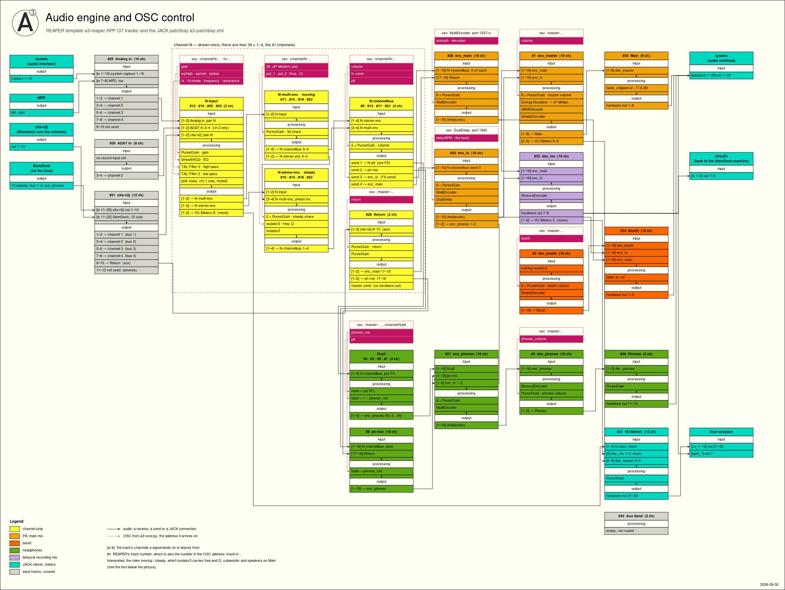

# A³ Core Configuration

| Part | What it is |
| :--- | :--- |
| OS | Debian with a Linux realtime kernel |
| Window manager | i3, with named workspaces — see [The screen](#core-config-screen) |
| Audio backend | REAPER |
| VU metering | SuperCollider |
| OSC router | `~/.local/bin/a3-core.py`, started by a `systemd --user` service |

## The OSC router

A Python script that routes OSC between the audio engine and the controllers.
It is the only part of Core that knows which device is which.

### How it is started

Everything is a default that can be pointed somewhere else, which is what
makes the whole path testable on a bench instead of only in front of the rig:

| Argument | What it is |
| :--- | :--- |
| `--port 9000` | where commands arrive |
| `--feedback-port 9002` | where REAPER's feedback arrives — its own port, so REAPER's reports can never be read as commands |
| `--web-bind 127.0.0.1:9080` | the window. Localhost by default: it can send OSC into a running rig, and a control surface with no login on the show network is not a default worth setting |
| `--mixer`, `--motion` | the two devices that ship, as `host:port` |
| `--reaper`, `--dualdelay` | the audio engine's own endpoints |
| `--subscriber NAME=HOST:PORT` | **another department.** Repeatable |
| `--print-osc` | also print every message, the way Core did before the window existed. Off by default: it was 301,385 journal lines an hour on one address alone |
| `--no-web` | do not open the window at all |

### Adding a department

A light or video desk that wants to follow the show needs no change to any
source file:

```
a3-core.py --subscriber light=192.168.43.60:7771 \
           --subscriber video=192.168.43.61:7771
```

Every A³-shaped message then reaches it — every channel's gain, EQ, volume and
send, the master section, the filter, the positions, the lamps and the flags —
in exactly the form the A³ Mixer and A³ Motion get them. The name is what the
window shows in its peer column.

A subscriber that cannot be parsed stops Core from starting, rather than being
skipped. That is deliberate: a mistyped subscriber is a department that hears
nothing all evening, and OSC over UDP has no way of saying so.

See the [OSC reference](https://a3-audio.github.io/a3-doc/ressources/osc.html)
for what arrives.
(core-config-screen)=

## The screen: i3 workspaces and the bar

The a3-core package ships the i3 config as
`~/.local/share/a3-core/config/i3/config`. It names the rig's workspaces and
moves each program's window to its own:

| Workspace | Rule |
| :--- | :--- |
| `1:MOTION` | `for_window [class="A3 Motion UI"]` |
| `2:STEMDECK` | `assign [class="StemDeck"]`; the main window (`title="^StemDeck$"`) gets `border none`, every other StemDeck window floats |
| `3:REAPER` | `for_window [class="REAPER"]` |
| `4:QJACKCTL` | `for_window [class="QjackCtl"]` |
| `5:SCARLETT` | `for_window [title="Scarlett 18i20 USB"]` |

The names are what the two touch apps' workspace switch and i3bar show; both
read them from i3 (`i3-msg -t get_workspaces`), so a workspace renamed or
added here shows up without a change to either app. `workspace number N`
still finds them, as do `$mod+1` … `$mod+5`.

StemDeck's main window is tiled without a border instead of set to i3's full
screen: each dialog StemDeck opened ended the full screen. Its dialogs float
over it.

**The bar.** i3bar (`bar { id a3 … }`) sits at the top, with
`strip_workspace_numbers yes` and `status_command i3status`. i3 has no bar
per workspace, so `a3-bar-per-workspace.service` (a `systemd --user` service
running `~/.local/bin/a3-bar-per-workspace.py`) follows i3's workspace events
and sets the bar's mode: `dock` on workspace 3 and up, `invisible` on 1 and
2, where A³ Motion and StemDeck fill the screen and switch between each other
themselves. The service restarts when i3 does, since an i3 restart ends the
event stream.

**StemDeck** runs as `stemdeck.service`, shipped in the StemDeck repository
(`.config/systemd/user/`), not in the a3-core package — see
[Always running on the Core](#stemdeck-on-the-core). Its
`tools/rig-keep-the-screen.sh` puts back the workspace that was showing when
StemDeck (re)starts. A StemDeck restart changes the JACK graph and costs a
burst of xruns: not during a set.

The package depends on `x11-utils`, `x11-xserver-utils` and `i3status` for
what the screen scripts and the bar call.

## Supercollider script VU-Meter
- 12-Channel Jack client (could be more for ie light and vj control)
- sends vu-meter (peak and rms) via OSC
- ```VU-Meter.scd```
## User VNC interface 
To setup patching and recording
- Qjackctl (Patching)
- Reaper (Sequencer)
- Reaper (Mixer)
## IEM Pluginsuite
[IEM-Pluginsuite](https://plugins.iem.at/) VST3 plugins for 3D audio
processing. What the shipped project actually loads:

| Plugin | What it does here |
| :--- | :--- |
| MultiEncoder | Where a channel's sound sits in the room. A³ Core writes `azimuth` and `elevation` straight to its **own OSC port** (`127.0.0.1:1337+n`), never through a REAPER track — which is why REAPER can never report a position back, and why Core has to remember it |
| AllRADecoder | Must be configured to fit your speaker setup |
| BinauralDecoder | For headphones |
| SimpleDecoder | |
| EnergyVisualizer | Sends the energy field to A³ Motion on port 7777, once its "OSC send" is switched on in the lower left of the plug-in |
| DualDelay | On the FX bus, following the beat-analyzer's tempo |

```{warning}
**Two of these have a receiver that has to be opened by hand**, and nothing
says so when it is shut. The DualDelay needs *Listen to port* → `1340` →
**OPEN** in its status line, with `Sync` **off**; the EnergyVisualizer needs
its OSC send switched on. Both are plug-in state and live in the REAPER
project, not in any repository.
```

## TAL-Filter-2 FX
- [TAL-Filter-2](https://tal-software.com/products/tal-filter) resonance
  filter, one per channel — the high-pass and low-pass the FX key switches
  between

## Airwindows Consolidated
- [Airwindows](https://www.airwindows.com/) plugins are loaded through the
  **Consolidated** container rather than individually, which is why one
  instance has fourteen parameters and the gain of each sits on parameter
  1, 15, 29 and so on. `gain_params` in `layout.json` is that list
- Carries the channel gains, the EQ and the bus volumes
## REAPER routing



Drawn from the two files the a3-core package ships, as they stood on
2026-09-30: the REAPER template
`~/.local/share/a3-core/config/REAPER/ProjectTemplates/a3-reaper.RPP`
(37 tracks) and the JACK patchbay
`~/.local/share/a3-core/config/rncbc.org/a3-patchbay.xml`. The OSC arrows
come from `layout.json` and `a3-core.py`. The picture is generated by
`tools/diagrams/reaper_routing.py` in this repository; change the script,
not the PNG.

Reading it:

- **One channel strip is drawn for all four.** Channel N is five tracks:
  `N-input` (gain, EQ, the FX key's high- and low-pass), then two ways
  through — `N-multi-enc`, the part that moves, and `N-stereo-enc`, the part
  that stays, which also gets the moving part phase-inverted — and
  `N-channelbus`, the channel's volume and its four sends.
- **Three sources feed a channel:** the audio interface (`Analog in`,
  inputs 1–10), and on inputs 11–22 StemDeck — straight from its own JACK
  client on the Core, or through zita-n2j from another machine. StemDeck's
  aux pair lands on `Return`.
- **The room:** `enc_main` (MultiEncoder, positions set over its own OSC
  port) → `dec_master` (AllRADecoder, SimpleDecoder) → `Main` → hardware
  outputs 1–8. `enc_fx` carries the FX sends through the DualDelay into the
  same decoders.
- **The headphones:** `N-pfl` (pre FX, muted unless PFL) and `ph-mix`
  (post fader), blended by `phones_mix`, → `enc_phones` → `dec_phones`
  (binaural) → `Phones` → outputs 11–12.
- **The recording mix:** `dec_rec` decodes `enc_main` and `enc_fx`
  binaurally onto outputs 7–8, which go to zita-j2n (back to a remote
  StemDeck's REC inputs) and to the beat-analyzer's `bpm_1`.
- **The meters:** `VU-Meters` puts twelve meter channels on outputs 21–32 for
  the beat-analyzer's `vu_1` … `vu_12`. The
  [channel map](#core-reaper-channel-map) below replaces this with forty
  meters on outputs 31–70.

What the picture interprets rather than reads, and what looks unfinished in
the files themselves:

- The names *moving* and *steady* for the two encoder tracks, and which
  Isolator3 carries freq and Q (the one in FX slot 2, from `layout.json`),
  are the maintainer's description, not something the project file says.
- That `Main` carries the subwoofer on its channel 1 and the four speakers on
  2–5 is read off the meters (`dec_master` 2–5 go to the speaker meters).
- **Meter 5 (`vu_5`, the subwoofer in the OSC reference) is fed by
  `dec_rec` 1–2**, the binaural mix, not by `dec_master`.
- **The booth path is not wired:** `dec_booth` receives nothing, and `Booth`
  sits at −inf with its hardware output on 1–8, the same outputs as `Main`.
- `ADAT In` has no record input set, so the ADAT receive on channel 2 carries
  nothing. `Aux Send` is an empty track. `Return`'s master send goes to
  REAPER's master track, which has no hardware output.
- The patchbay still carries a `screencast` socket on outputs 7–8; StemDeck
  no longer has a screencast.


(core-reaper-channel-map)=

## REAPER channel map

The inputs and outputs REAPER uses, decided on 2026-09-30. The routing picture
above still shows the template as shipped before that date; REAPER's routing
and the JACK patchbay are rebuilt to this map.

### What REAPER receives

| Hardware inputs | What |
| :--- | :--- |
| 4 stereo pairs | the A³ Mixer's channels 1–4 |
| 1 stereo pair | the return |

### What REAPER sends

The outputs come in blocks of ten:

| Out | Block | Content |
| :--- | :--- | :--- |
| 1–10 | Main | 1 sub, 2–10 tops 1–9 |
| 11–20 | Booth | 11 sub, 12–20 tops 1–9 |
| 21–30 | Stereo | 21–22 Phones, 23–24 Rec, 25–26 Aux, 27–30 free |
| 31–70 | VU meters | to the beat-analyzer, see below |

(core-vu-map)=

### The VU meters: REAPER out 31–70

Outputs 31–70 go to the beat-analyzer's forty JACK inputs, one meter each,
and the beat-analyzer sends each as `/vu/i` (peak and RMS). Input *i*,
counted from 0, is fed from REAPER out 31 + *i* and sends on `/vu/i`:

| REAPER out | beat-analyzer port | OSC | Meter |
| :--- | :--- | :--- | :--- |
| 31–34 | `vu_in1_pre` … `vu_in4_pre` | `/vu/0`–`/vu/3` | channel inputs 1–4, pre-fader, post-FX |
| 35–38 | `vu_in1_post` … `vu_in4_post` | `/vu/4`–`/vu/7` | channel inputs 1–4, post-fader |
| 39–40 | `vu_free39`, `vu_free40` | `/vu/8`, `/vu/9` | free |
| 41 | `vu_main_sub` | `/vu/10` | Main sub |
| 42–50 | `vu_main_top1` … `vu_main_top9` | `/vu/11`–`/vu/19` | Main tops 1–9 |
| 51 | `vu_booth_sub` | `/vu/20` | Booth sub |
| 52–60 | `vu_booth_top1` … `vu_booth_top9` | `/vu/21`–`/vu/29` | Booth tops 1–9 |
| 61–62 | `vu_phones_L`, `vu_phones_R` | `/vu/30`, `/vu/31` | Phones |
| 63–64 | `vu_rec_L`, `vu_rec_R` | `/vu/32`, `/vu/33` | Rec |
| 65–66 | `vu_aux_L`, `vu_aux_R` | `/vu/34`, `/vu/35` | Aux |
| 67–70 | `vu_free67` … `vu_free70` | `/vu/36`–`/vu/39` | free |

Two rules carry the whole table:

- **A meter sits 40 outputs above what it measures:** Main sub on out 1 is
  metered on out 41, Booth sub on 11 on 51, Phones on 21 on 61.
- **beat-analyzer channel = REAPER out − 30**, and the OSC index counts from
  0: out 31 is the first channel and sends `/vu/0`, out 70 the fortieth and
  sends `/vu/39`.

The beat-analyzer needs `NUM_VU_CHANNELS=40` in its `build/.env` to open all
forty inputs (see {ref}`Beat Analyzer <beat-analyzer-config>`). It sends them as
four OSC bundles, one per block of ten (inputs, Main, Booth, stereo). The port names live in its
`src/audio/vu_ports.cpp`.

```{warning}
**A³ Motion and the A³ Mixer still read the old positions.** Motion takes
`/vu/0`–`/vu/3` as the channel inputs, `/vu/4` as the subwoofer and
`/vu/5`–`/vu/8` as the speakers; the Mixer takes `/vu/0`–`/vu/3` as its input
meters and `/vu/4`–`/vu/11` as its output meters. Under this map `/vu/4` is
channel 1 post-fader, not the subwoofer. Moving both devices to the new
indices is the next step; it is not done yet.
```


## Screenshots
### Control screen

### Sequencer  screen

### Mixer screen
