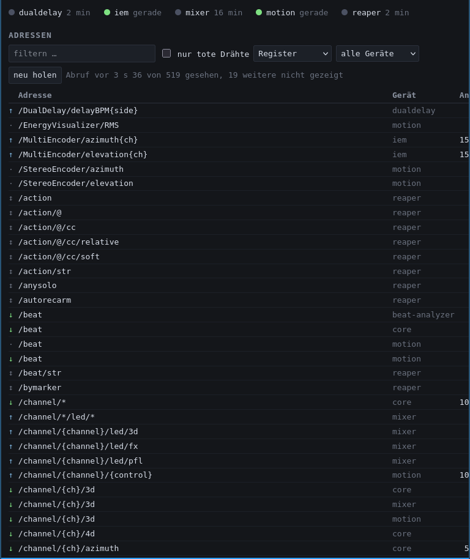

# A³ Core Development

## Python script a3-core.py
`home/aaa/.local/bin/a3-core.py` in the
[a3-core](https://github.com/a3-audio/a3-core) repository is the runtime: it
turns incoming OSC into DSP settings.

- Receives OSC on port **9000** from
	- A³ Mixer
	- A³ Motion
	- the beat-analyzer (`/beat`)
- Receives REAPER's feedback on its own port **9002**
- Serves the window over HTTP on **9080**
- Sends OSC to
	- REAPER (`127.0.0.1:9001`)
	- the IEM MultiEncoder instances (`127.0.0.1:1337+n`, one port per instance)
	- the IEM DualDelay on the FX bus (`127.0.0.1:1340`)
	- A³ Mixer
	- A³ Motion

The parameter curves — the functions that map a controller value to a DSP
setting — are pure functions of one number and live in `lib/a3_core_curves.py`.

### What is not in the source any more

Three kinds of literal were lifted out of `a3-core.py` into files beside it,
because each of them was a number whose meaning was invisible at the call site:

| File | Holds |
| :--- | :--- |
| `share/a3-core/layout.json` | the map between an A³ channel and the REAPER project — track numbers, FX slots, send numbers, and every OSC address template |
| `share/a3-core/curves.json` | the parameter curves |
| `share/a3-core/osc-register.json` | the generated catalogue of every address the system can speak |

### What the register got rid of

Holding `web/a3-doc`'s reference against the register on 2026-09-12 turned up
four addresses that were sent and never answered — two from a rotary encoder
nobody could account for, the desk's tap key, and the 3D switch's boolean.
All four are gone; the tap now goes where A³ Motion's goes.

The same round surfaced a fault in the window itself: an address Core could
not route before and can now kept its row in the **unknown** table, because
that table survives a restart while what Core can route does not. Twenty-three
of them, all reversible since that afternoon — the page called them
unrecognised while Core was routing them. An instrument that reads wrong about
itself is worse than none. The rule is now enforced where the pair comes back
from disk: an address with an incoming row is not unrecognised. "Sent out, not
understood back" still shows as both, because that pair is the truth.

`layout.json` ships with the package, beside the REAPER project it has to
agree with, and an update replaces it. That is deliberate: a track number that
no longer matches the shipped project is worse than a lost local edit.

### Total recall

Core keeps enough state to answer the question *what is sounding right now?*,
because for some values nobody else can be asked. A device sends
`/state/recall` and Core replays the whole state **as the ordinary messages**
— see the [OSC reference](https://a3-audio.github.io/a3-doc/ressources/osc.html)
for what comes back and in which order.

Two things Core holds and no one else does:

- **The position.** `azimuth` and `elevation` go straight to the IEM plugins
  on their own OSC port. The plugins are written to, not read from, so REAPER
  never reports them back.
- **The 3D blend.** It does reach REAPER — as two gains on two tracks — and a
  single number cannot be read back out of two.

The lamps and the blend survive a restart in Core's state file; the position
does not, and a position Core has never seen is left **unsaid** rather than
guessed at.

### Everything goes to everyone

There is no list of recipients anywhere in Core. Every A3-shaped message goes
to every subscriber — `lib/a3_core_subscribers.py` says why at length, and the
short version is that a per-message list is a list that goes stale silently.
The one that existed named the desk for three days after A3 Motion grew the
controls it named, and nothing failed, because a message nobody is told to
send is an absence.

A department is `--subscriber name=host:port`, repeatable, refused rather than
skipped if it cannot be parsed.

One thing is deliberately *not* broadcast, and it is not a recipient list in
disguise but a statement about what kind of message it is: **the engine's own
languages** — REAPER's `/track/…`, the MultiEncoders' `/MultiEncoder/…`, the
DualDelay's `/DualDelay/…`. Each is addressed by the one handler that has
something to say to it.

The lamps were the second such case for half a day, on the grounds that a lamp
is an instruction in the A³ Mixer firmware's convention rather than a fact.
That was true and it was the wrong conclusion: **a lamp shows a status, and a
status belongs to whoever shows one.** They are broadcast.

Which made the inversion everybody's problem instead of nobody's. Core sent
"not pfl" and `a3-mixer.py` inverted it back, the two cancelled, and
`/channel/n/led/pfl` carried the opposite of its own name. Both came out on
the same day, so what reaches the desk's LED is unchanged and the address
means what it says.

Nothing moves a lamp unless the status moved: a flag is announced only where
it changed, and `broadcast()` drops a value already passed on.

### The way back

REAPER's feedback arrives on port 9002 and is read backwards: the address says
which control, and `invert()` undoes the curve the value went out on. `lib/a3_core_reverse.py` holds that second table, and
`tools/tests/test_reverse_covers_forward.py` holds it against the forward
path in `a3-core.py` — two tables that must agree drift, and here the drift is
silent.

What comes back: the channel strip (gain, the three EQ bands, volume, the FX
send), the whole master section, and the shared filter's frequency and
resonance. The last of those is one control written to all four input tracks,
which is why an entry carries a **scope**: it is reported on a channel's track
and answered globally. A value already passed on is dropped — a gain plug-in
holds its value across eight parameters, and without that one knob would
become eight identical messages to everybody.

**The rule for what may be relayed at all is exact: can an action script drive
it?** If it can, REAPER holds base plus accent while the device holds base,
and relaying that ratchets the value up — that is `3d`, `freq` and `Q`, and
the last two were live for a few hours before being taken out. If it cannot,
REAPER's value *is* the device's value and a relay is safe.

The guard that should have caught the missing half was the one that hid it: it
asserted `entry.to == "mixer"` under the name *"nothing reports back to Motion
continuously"* — the pots' rule stated one size too large, outlawing the gain
and the volume as well. It now names the three controls an action can reach,
which is what the rule was always about.

### The tempo, on its way to the delay

`lib/a3_core_tempo.py` sits between `/beat` and the DualDelay. A tempo has to
hold still for a whole bar and differ from what the delay already has by
0.1 BPM before it is passed on. The reason is measured rather than reasoned:
the analyzer's estimate does not wobble around a value, it **ramps** — 107.7
down to 102.7 over four seconds — and a deadband alone let every beat through,
34 rewrites of the delay line in a few seconds. A delay is the one effect
where chasing a tempo is audible.

## The window

Core serves a page on `http://<core>:9080` that shows what is actually going
over the wire. It exists because every silent link in this system looks the
same from the outside: OSC over UDP has no error for *nobody was listening*.

One row per address, not a river of lines — with a count, a rate, the last
value, which peer it came from or went to, and how long ago. The arrow says
the direction; the dot beside a peer's name says whether it has been heard
from recently.

Three rules the page is built on, each of them paid for once:

- **The filter decides what crosses the wire.** A filter that only hides rows
  in the browser, while the stream keeps pushing everything, froze the
  maintainer's machine on 2026-09-10 at 25.6 MiB/s.
- **The stream and the query are separate.** Live values come over a stream;
  the big table is fetched on demand.
- **The window never keeps Core from coming up.** A broken state file, a
  register of an unknown shape, a port already taken — each is a window with a
  problem attached, never an exception. Core makes the sound; this is a
  convenience.

### The register

A traffic log cannot say what is *possible*. Looking up the FX send of a
channel bus in the window gave three rows and none of them the answer — the
address had simply never flown, and REAPER only reports sends for tracks that
happen to be in its bank window.

So the other half: `tools/osc_register.py` reads the six sources that define
addresses — Core's `layout.json`, `a3-motion-ui`'s `OscAddresses.hh`,
`a3-mixer.py`, the `a3-core.ReaperOSC` surface, `a3-core.py` itself and the
beat-analyzer — and writes `share/a3-core/osc-register.json`: 520 entries,
each with its device, direction, and the file and line it came from. A test
regenerates it and compares, so it cannot drift unnoticed; run somewhere the
other repositories are missing, that test **skips and says so** rather than
passing quietly.

Core holds the catalogue against what it has seen, which is what makes the
useful view possible: filter by device, tick *nur tote Drähte*, and what is
left is every address that exists and has never arrived.

That is the sort of finding that cost three evenings in one week: A³ Motion's
mixer page talking to the beat-analyzer for two days, the pots with no way
back, the position that never came. All three look exactly like this.

### The address list survives a restart

Core was restarted six times on one day and the window forgot everything each
time — 19,335 unknown addresses in the morning, five by the afternoon, because
REAPER counts its vocabulary out once when its OSC surface connects and never
again.

The **list** of addresses (not the history, and not the values) is therefore
written to `$XDG_STATE_HOME/a3-core/seen.json` and read back at start-up. Never
from the hot path: `seen()` runs about a hundred times a second, and a file
access in there is a file access in the way of the music. A separate thread
watches a counter of newly created rows and writes once it has stopped moving
— after REAPER's burst rather than four times during it.

Measured on this machine: 19,335 rows is 1.27 MB and 24 ms to write; the
table's cap of 50,000 rows is 3.29 MB and 62 ms.

A restored row carries a count, a peer and a time, and **no value**: the number
a knob stood at before the restart says nothing about where it stands now, and
sitting in the value column it would be indistinguishable from a live one.
What answers *where is it now* is `/state/recall`.

## SuperCollider vu-meter.scd
- Receives audio from REAPER and the system via the JACK audio server
- Sends peak and RMS VU meters as OSC messages to
	- A³ Mixer
	- A³ Motion
	- external

## Beat-Analyzer
[beat-analyzer](https://github.com/rafjagger/beat-analyzer) is a separate
C++/CMake service on the same JACK graph. It produces the beat clock every
device follows, and the VU meters that drive the A³ Motion visuals. Its clock
source is selectable at runtime with `/clockmode`: its own onset/tempo
analysis, an external `/beat` from A³ Motion, or a Pioneer Pro DJ Link master.

It lists its OSC targets in its own `.env`, and A³ Core has been one of them
all along — Core simply had nowhere to put the message until the delay needed
a tempo. The analyzer stays the central clock: it synchronises the periphery
directly rather than through REAPER's transport.
