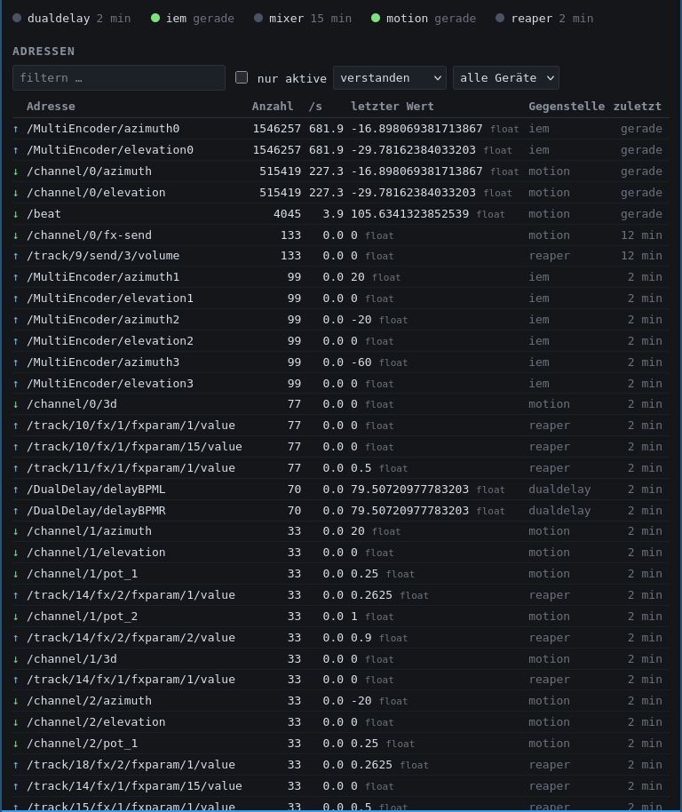
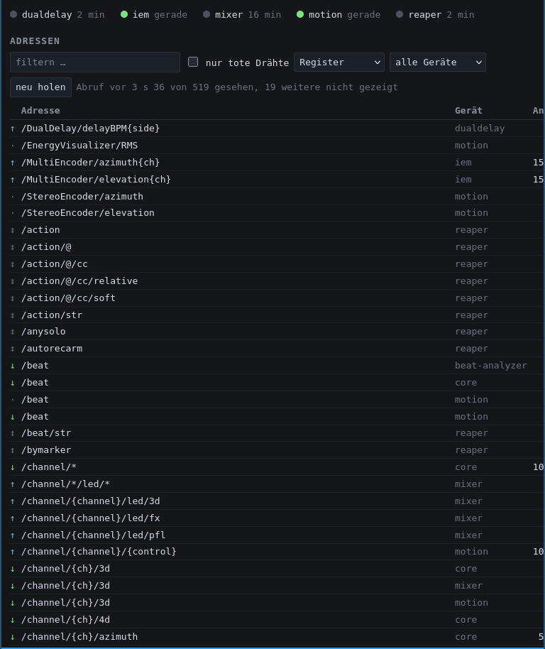

# A³ Core Development

## Python script a3-core.py
`home/aaa/.local/bin/a3-core.py` in the
[a3-core](https://github.com/a3-audio/a3-core) repository is the runtime: it
turns incoming OSC into DSP settings.

- Receives OSC on `core.osc` from
	- A³ Mixer
	- A³ Motion
	- StemDeck
	- the beat-analyzer (`/beat`)
- Receives REAPER's feedback on its own port, `core.reaper-feedback`
- Serves the window and the truth over HTTP on `core.web`
- Sends OSC to
	- REAPER (`reaper.osc`)
	- the IEM MultiEncoder instances (`iem.multiencoder-1..3`, one port per instance)
	- the IEM DualDelay on the FX bus (`dualdelay.osc`)
	- A³ Mixer, A³ Motion and StemDeck

Every one of those names, and every address it speaks, comes from
`/usr/share/a3/a3-osc.json`, read at start-up by `lib/a3_osc.py`, which joins
the maintainer's `~/.config/a3/network.json` over it (`hosts` and `network`,
key by key). Core serves the joined truth, announces it, and at start renders
zita's and the beat-analyzer's addresses — see
{ref}`Where addresses and ports live <osc-truth>`; the ports are on
{doc}`../ressources/ports`.

The parameter curves — the functions that map a controller value to a DSP
setting — are pure functions of one number and live in `lib/a3_core_curves.py`.

### Data beside the source

What would be numbers with an invisible meaning at the call site lives in
files beside `a3-core.py`: `layout.json` (the map between an A³ channel and
the REAPER project), `curves-golden.json` (the recorded value curves) and
`osc-register.json` (generated from `a3-osc.json`). What each holds and how
an update treats it is in {ref}`the package's files <core-files>`.

### Total recall

A device sends `/state/recall` and Core replays the whole state as the
ordinary messages; what comes back, in which order, and why Core holds the
position and the 3D blend itself is in {ref}`/state/recall <osc-recall>`
of the OSC reference. The modules: `a3_core_recall.py`, `a3_core_state.py`
(the lamps and the blend, kept across a restart in the state file) and
`a3_core_evening.py`.

### Everything goes to everyone

There is no list of recipients in Core: every A³-shaped message goes to every
subscriber, and the engine's own languages each go to the one handler that
speaks them. The rule and its reasons are in the OSC reference
({ref}`Everything goes to everyone <osc-everyone>`); the code is `lib/a3_core_subscribers.py`,
and a new subscriber is an argument
({ref}`Adding a department <core-subscriber>`).

### The way back

REAPER's feedback is read backwards: the address says which control, and
`invert()` undoes the curve the value went out on. `lib/a3_core_reverse.py`
holds that table, and `tools/tests/test_reverse_covers_forward.py` holds it
against the forward path in `a3-core.py` — two tables that must agree drift,
and here the drift is silent. What comes back, and the rule for what may be
relayed at all, is in the OSC reference under {ref}`The way back <osc-way-back>`.

### The tempo, on its way to the delay

`lib/a3_core_tempo.py` sits between `/beat` and the DualDelay and decides
when a tempo is passed on; the rule and why it is needed are in
{ref}`/beat, and the delay that follows it <osc-beat-delay>`.

## The window

Core serves a page on `core.web` (`http://<core>:9080`) that shows what is
actually going over the wire. It exists because every silent link in this system looks the
same from the outside: OSC over UDP has no error for *nobody was listening*.

One row per address, not a river of lines — with a count, a rate, the last
value, which peer it came from or went to, and how long ago. The arrow says
the direction; the dot beside a peer's name says whether it has been heard
from recently.

Three rules the page is built on:

- **The filter decides what crosses the wire.** A filter that only hides rows
  in the browser, while the stream keeps pushing everything, can freeze the
  browser's machine.
- **The stream and the query are separate.** Live values come over a stream;
  the big table is fetched on demand.
- **The window never keeps Core from coming up.** A broken state file, a
  register of an unknown shape, a port already taken — each is a window with a
  problem attached, never an exception. Core makes the sound; this is a
  convenience.

### Which truth each device speaks

A device on its own machine holds its own truth, and it can fall behind. The
A³ Mixer, StemDeck and A³ Motion fetch Core's on their own (see
{ref}`the desk <mic-truth>` and {ref}`Following Core <osc-follow>`), and name themselves with every state request — at
start, too — on `/device/hello`, with the sha256 of what they hold. Core
(`lib/a3_core_devices.py`) holds that against its fingerprint, and
the window shows one line per device under the peers: *a3-osc.json is Core's*,
or in red *a3-osc.json DIFFERS from Core's*. What to do about the red one is
in {ref}`the OSC reference <osc-differs>`.

### The register

A traffic log cannot say what is *possible*. Looking up the aux send of a
channel bus in the window gave three rows and none of them the answer — the
address had simply never flown, and REAPER only reports sends for tracks that
happen to be in its bank window.

So the other half: `tools/osc_register.py` writes
`share/a3-core/osc-register.json` from `a3-osc.json` — one row per address
shape and device, each with its device and its direction from Core's side (`in`,
`out`, `both`, or `aside` for traffic that passes Core by). REAPER's and the
IEM plug-ins' words are in it too, listed as `both`, because the file does not
say more about them. `tools/tests/test_osc_register.py` holds the register
against the file, so it cannot drift unnoticed.

Core holds the catalogue against what it has seen, which is what makes the
useful view possible: filter by device, tick *nur tote Drähte*, and what is
left is every address that exists and has never arrived.

### The address list survives a restart

REAPER counts its vocabulary out once, when its OSC surface connects, and
never again — so a window that forgot its rows at every restart of Core would
be nearly empty.

The **list** of addresses (not the history, and not the values) is therefore
written to `$XDG_STATE_HOME/a3-core/seen.json` and read back at start-up. Never
from the hot path: `seen()` runs about a hundred times a second, and a file
access in there is a file access in the way of the music. A separate thread
watches a counter of newly created rows and writes once it has stopped moving
— after REAPER's burst rather than four times during it.

Measured on this machine: 19,335 rows is 1.27 MB and 24 ms to write; the
table's cap of 50,000 rows is 3.29 MB and 62 ms.

A restored row carries a count, a peer and a time, and **no value**: the number
a knob stood at before the restart says nothing about where it stands now, and
sitting in the value column it would be indistinguishable from a live one.
What answers *where is it now* is `/state/recall`.

## Beat-Analyzer
[beat-analyzer](https://github.com/rafjagger/beat-analyzer) is a separate
C++/CMake service on the same JACK graph: the beat clock every device follows,
and the VU meters (see the {ref}`VU map <core-vu-map>`). It synchronises the
devices directly rather than through REAPER's transport. What it does and how
it is configured: {doc}`../user/beat-analyzer`; how to build it:
{doc}`build`.
