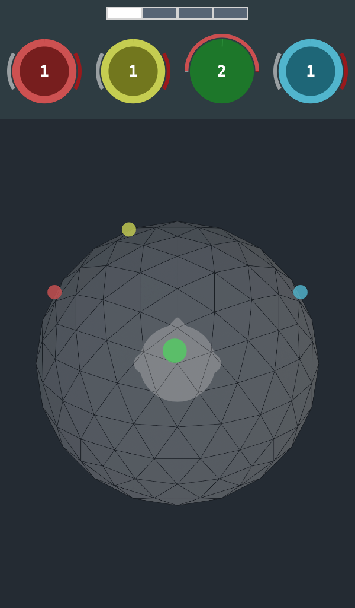
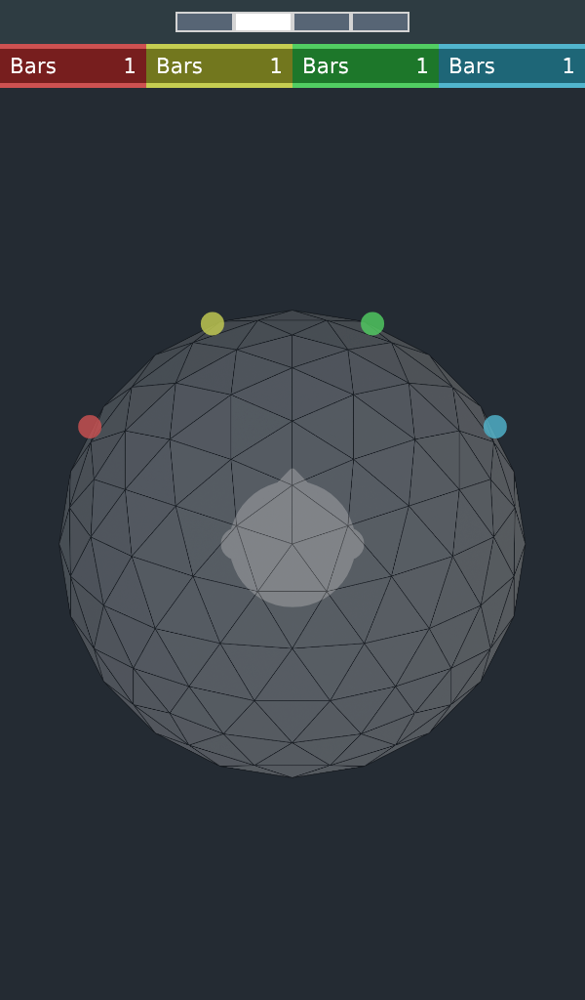
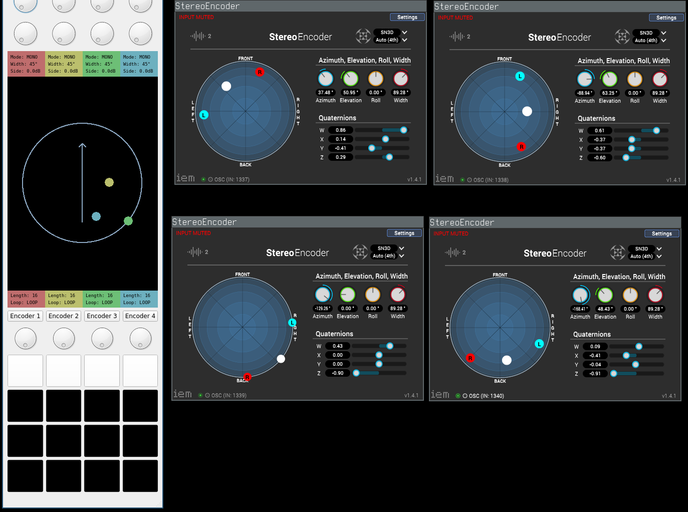
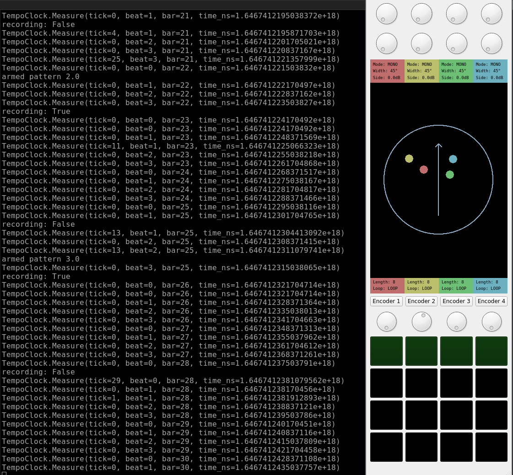

# A³ Motion Developement

## A³ Motion Controller UI
A³ Motion Controller UI is the most complex part to develop. 

## Current  Version

## Older Version

## Before

 

## Teensy firmware
Teensy 4.1 firmware is written in c++
