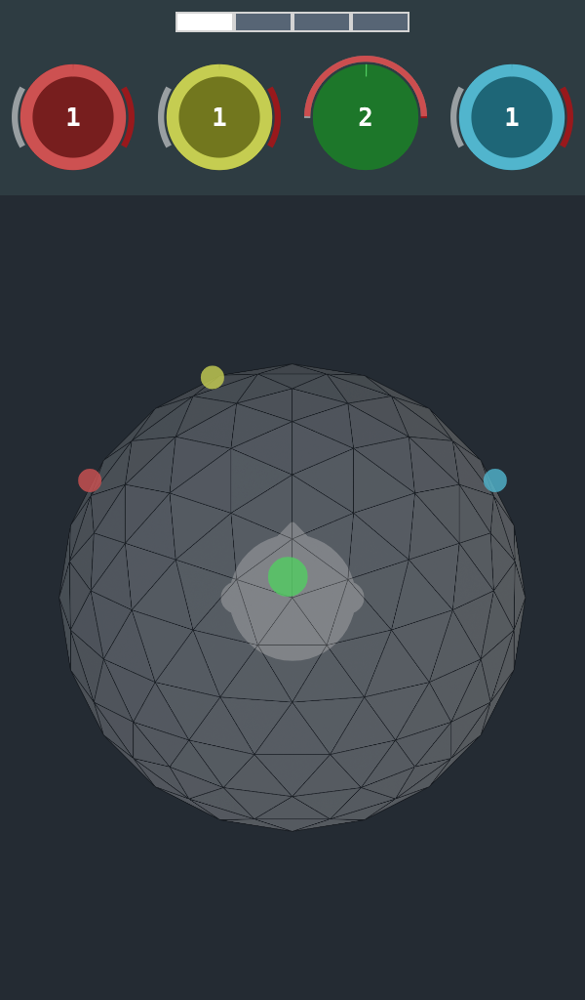
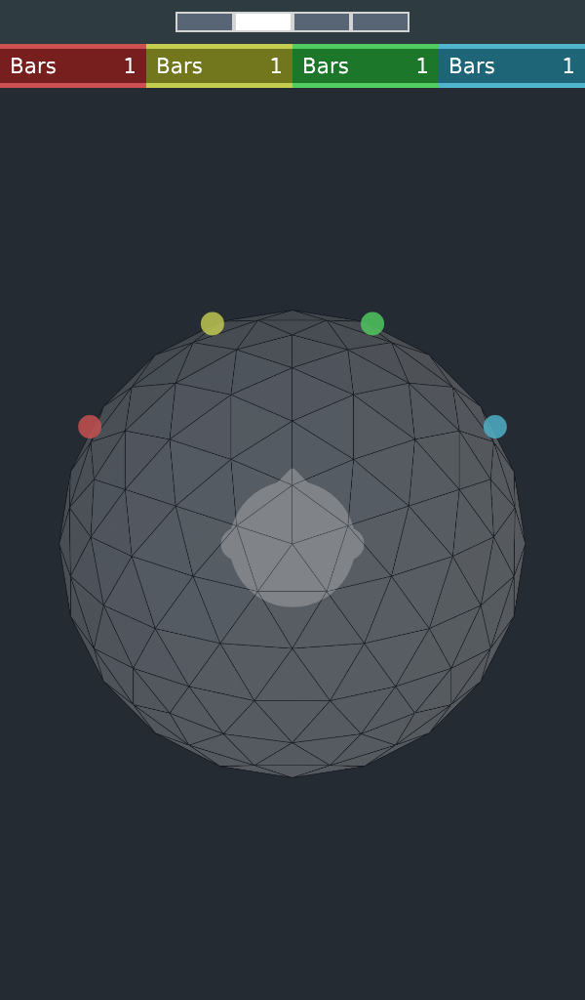
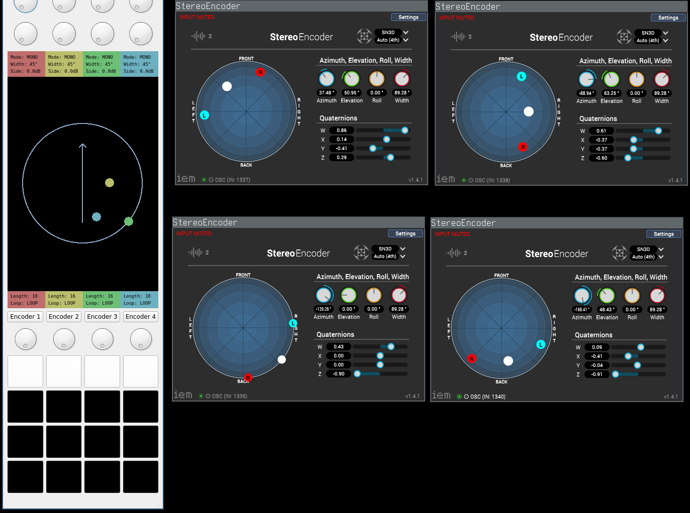
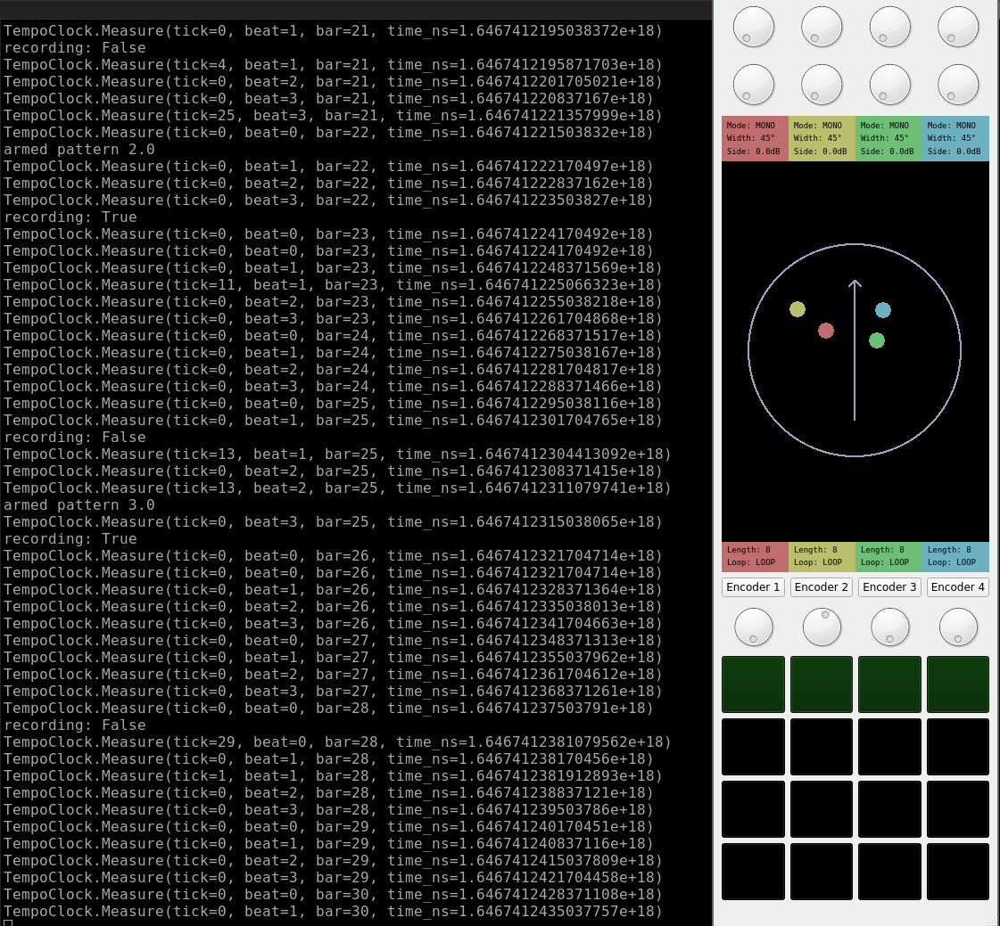

# A³ Motion Development

## A³ Motion Controller UI
The UI is the most complex part of the device: a JUCE / C++17 application
rendering the sphere with OpenGL, in its own repository
[a3-motion-ui](https://github.com/a3-audio/a3-motion-ui), wired into
[a3-motion](https://github.com/a3-audio/a3-motion) as the `ui` submodule.

It owns the motion patterns — recording them from the touchscreen, storing
them as ticks, and playing them back in time with the beat clock — and speaks
OSC to A³ Core.

Built with `build.sh`; the test suite runs with `ctest` from `build/` and is
currently around 1,100 cases.

## Current  Version


## The software mixer

Since 2026-09-10 the device carries a **channel strip of its own** on the MIX
page: the same six pots and two buttons a channel has on the A³ Mixer, plus a
second page for the summing section and the shared filter. It sends exactly
the addresses the desk sends, so A³ Core cannot tell the two apart and does
not need to.


`SEND` — how much of the channel reaches the FX bus, where the beat-synced
delay sits — was added on 2026-09-12, when the desk's FX-send knob stopped
driving the 3D blend and got its own job back.

### Rest positions

A double tap puts a control back where it belongs, but only where "belongs"
means something. Two controls have such a position:

```cpp
constexpr std::optional<float>
mixerControlRestPosition (MixerControl control)
{
  if (control == MixerControl::FxSend)
    return 0.f;
  return {};
}
```

and the Q encoder, which comes to rest shut rather than half open. Everything
else returns an empty optional and a double tap does nothing — a gain that
snaps to a default in the middle of a set is a channel that jumps in the room.

## Hearing where the sound is

The device used to know only what it had said itself. It now has an ear: one
handler, one `onChannelValue` callback, and a table of the five per-channel
values it accepts from Core — azimuth, elevation, pot 1, pot 2 and the 3D
blend.

That is what makes total recall work. At start-up the device sends
`/state/recall`, **holds its own output**, and adopts whatever comes back
before it says anything. Without the hold it announced its own idea of the
room first and the sound jumped; the hold is released by the answer, or by a
short grace period if none arrives.

Who wins, decided 2026-09-12:

- **At start-up, Core wins** — it knows what is audible.
- **When a set is loaded, the set wins** — loading a set is an explicit act.

```{warning}
**A reverse path that asks is right; one that reports is a loop.** The pots
briefly had a continuous reverse path from REAPER, and it fed back: REAPER
held a base gain plus an accent, the device held only the base, the echo
filter is consumed per address, and roughly ten of 3,382 messages slipped
through — each one raising the base a little. It was removed again. Asking
once, at start-up, is the version that holds.
```

A second, quieter bug from the same corner: the ramps that smooth the outgoing
values were marked *primed* by a tick that had sent nothing at all, so the
three of twelve values that happened to sit at 0.0 never reached Core. Priming
now happens only on a tick that actually sent.

## Older Version


## Before

 



## Panel firmware
The buttons, encoders, pots and LEDs are handled by a microcontroller of their
own, which reaches the UI over a binary poll-frame protocol on USB serial.
V02 used a Teensy 4.1; V03 uses an ESP32-S3, built with PlatformIO from
[`firmware/`](https://github.com/a3-audio/a3-motion/tree/main/firmware).
