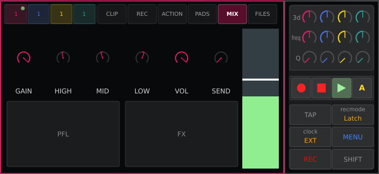
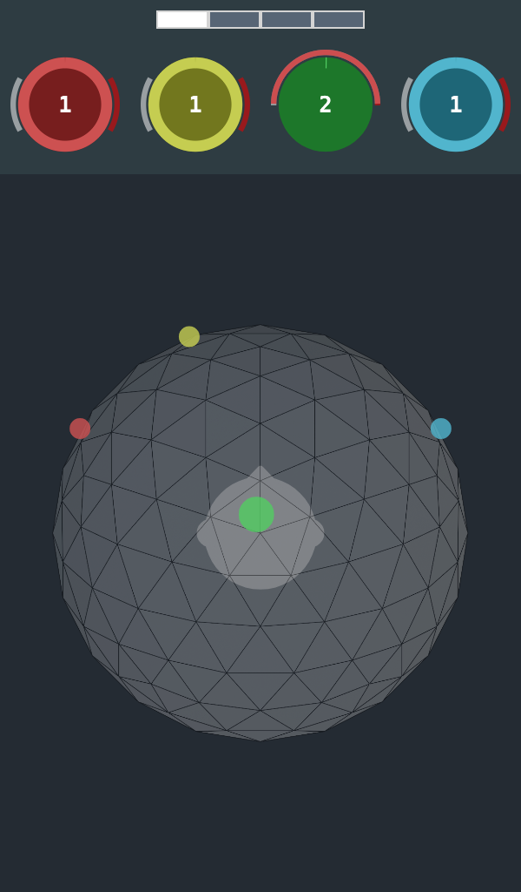
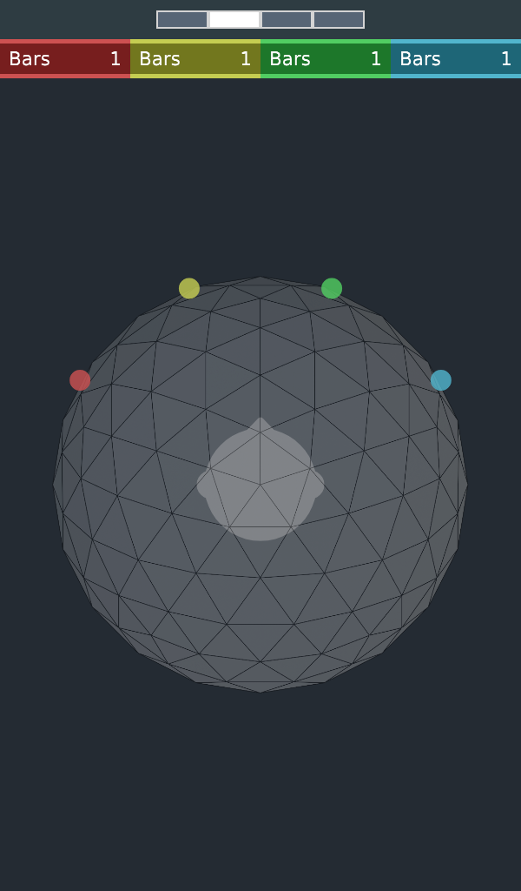
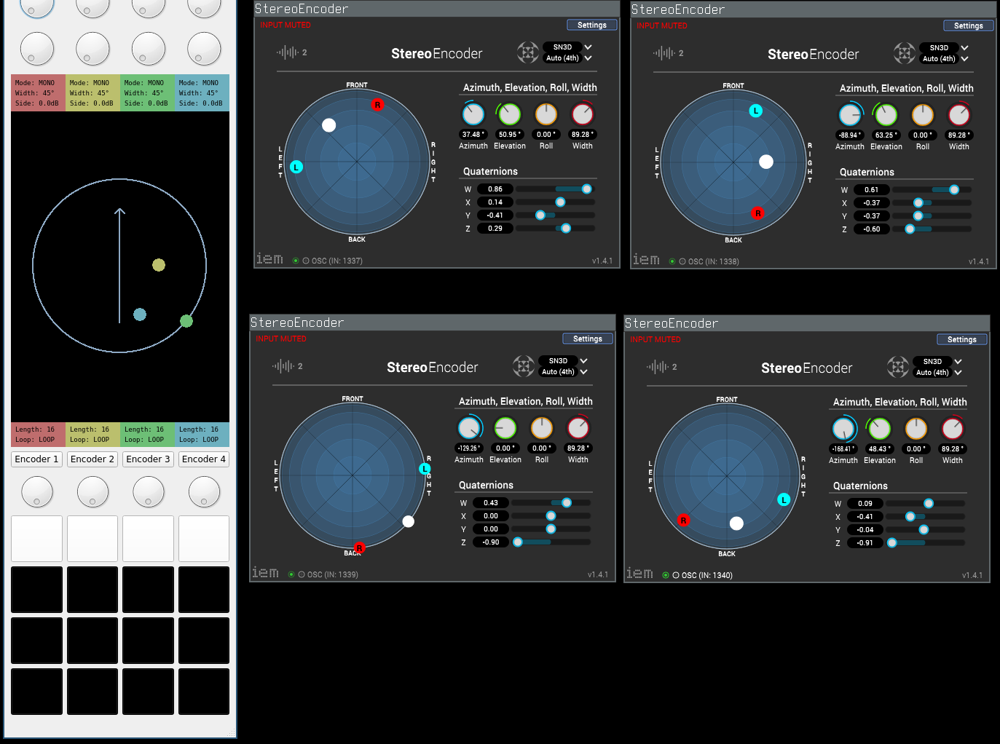
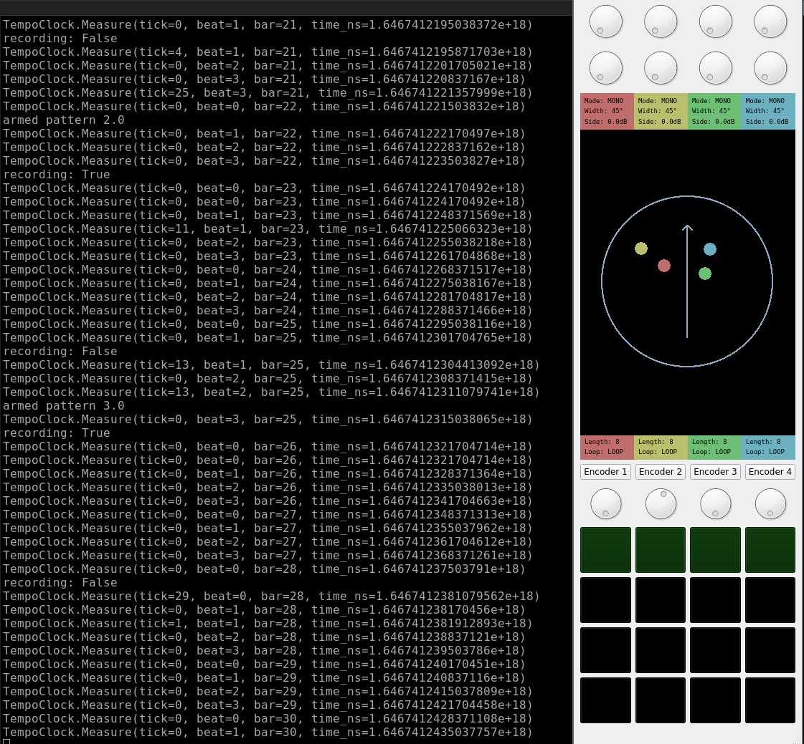

# A³ Motion Development

## A³ Motion Controller UI
The UI is the most complex part of the device: a JUCE / C++17 application
rendering the sphere with OpenGL, in its own repository
[a3-motion-ui](https://github.com/a3-audio/a3-motion-ui), wired into
[a3-motion](https://github.com/a3-audio/a3-motion) as the `ui` submodule.

It owns the motion patterns — recording them from the touchscreen, storing
them as ticks, and playing them back in time with the beat clock — and speaks
OSC to A³ Core.

How to build and test it (`./build.sh`, `./test.sh`) and which JUCE it needs:
{doc}`build`. Where it runs: {ref}`A³ Motion hardware <moc-hardware>`.

## Current Version — V03


## The software mixer

The device carries a **channel strip of its own** on the MIX page: the same six pots and two buttons a channel has on the A³ Mixer, plus a
second page for the summing section and the shared filter. It sends exactly
the addresses the desk sends, so A³ Core cannot tell the two apart and does
not need to.



`SEND` is how much of the channel reaches the FX bus, where the beat-synced
delay sits.

**The whole mixer listens as well as speaks.** A³ Core relays what REAPER reports — the channel strip, the master section, the shared
filter — and the pages adopt it — through `MixerState::setChannelFromPeer`, which sets a value *without*
sending it. That distinction is the whole provision: set-and-send on the way
back would be Core reports, Motion sets, Motion sends, Core reports, which is
the echo loop rebuilt from this side where Core's own suppression cannot reach
it.

Three tables, three ears: `onMixerChannelValue`, `onMasterValue`,
`onFilterValue`, each carrying a slot that indexes the matching table in
`OscAddresses`. The master and filter tables are walked **after** the channel
ones, because `/master/volume` and `/channel/1/volume` are one word apart and
crossing them would put the room's level on a channel fader with neither
number looking wrong.

`/filter/mode` arrives as a number, 1 for high pass — the spelling this device
already sends on that address. The word the desk's LED reads travels
`/filter/led` and never reaches this handler.

### Rest positions

A double tap puts a control back where it belongs, but only where "belongs"
means something. On the strip only SEND has such a position:

```cpp
constexpr std::optional<float>
mixerControlRestPosition (MixerControl control)
{
  if (control == MixerControl::AuxSend)
    return 0.f;
  return {};
}
```

Everything else on the strip returns an empty optional and a double tap does
nothing — a gain that snaps to a default in the middle of a set is a channel
that jumps in the room.

**The same table decides where a control starts.** Where it belongs when
nothing has said otherwise is one question, and MixerState's constructor asks
`mixerControlRestPosition` rather than keeping a second opinion. Gain and volume are the deliberate exception in the other direction:
they start at zero and have no rest position, because zero is the right place
for them to begin and the wrong place to sit two fingertips from all evening.

The channel-value strip on the right has its own table
(`channelValueRestPosition`): `3d` and `freq` rest at twelve o'clock, `Q`
rests **shut**: a filter that still resonates after being put back has not
been put back, and the Airwindows Isolator3 at the far end rests its own Q at
zero.

## Hearing where the sound is

The device has an ear: one
handler, one `onChannelValue` callback, and a table of the five per-channel
values it accepts from Core — azimuth, elevation, pot 1, pot 2 and the 3D
blend.

That is what makes total recall work: at start-up the device sends
`/state/recall`, holds its own output and adopts what comes back — see
{ref}`/state/recall <osc-recall>` and *Total recall at start-up* in the OSC
reference. The ramps that smooth outgoing values count as primed only after a
tick that actually sent, so a value that starts at 0.0 still reaches Core.

## The status bar and the signal dots

The status bar carries no VU meters. The outputs are on the MIX page's master
column, full height; each input is a **dot on its channel's own face** in the
bar below, which is where a hand looking for a channel already looks.

```cpp
struct VuDot
{
  bool visible = false;      // false below the meter's floor: silence is nothing
  std::size_t band = vuGreenBand;
  float alpha = 0.f;         // follows the level; the size stays put
};
```

Three decisions worth knowing:

- **It is a warning light, and the meter deliberately is not.** A meter's
  bands are stretches of its track, so a bar filled into the red is green at
  its foot and red only at its head — which is what lets it say *how far* over
  you are. A dot has no length. That trade is made knowingly, and the full
  meter did not go away; it moved.
- **Silence is no dot at all**, not a dim one. "Quiet" and "none" are the two
  states a hand needs told apart at a glance.
- **It reads the rms, not the peak.** A peak is a transient; through a mark
  with no length it would flicker at every drum hit and read as noise.

The colour comes from `vuBandColour` — the meter's own rule, not a second copy
— and a test insists the dot turns yellow exactly where the meter's fill
does. Two instruments disagreeing about one signal is the failure that rule
prevents.

The repaint compares the drawn *dot* rather than the level behind it: an rms
wobbles every frame and almost none of that wobble changes a band or a byte of
alpha. This bar is on screen for the whole of a set.

## Older Versions
The sphere before the touch rework, when the hardware encoders still did the
navigating:



And before that:



## Before

 



## Panel firmware
The buttons, encoders, pots and LEDs are handled by a microcontroller of their
own (see {ref}`A³ Motion hardware <moc-hardware>`), which reaches the UI over a
binary poll-frame protocol on USB serial. The firmware is a PlatformIO project
in [`firmware/`](https://github.com/a3-audio/a3-motion/tree/main/firmware);
how to build, test and flash it is on {doc}`build`.
