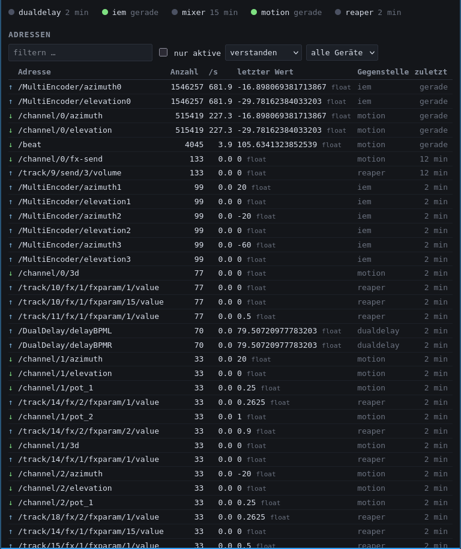
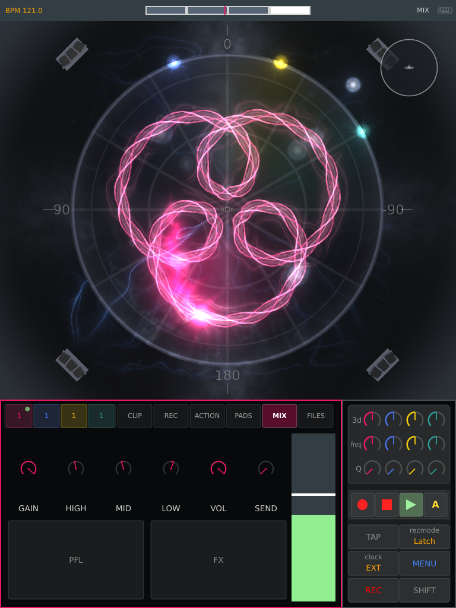
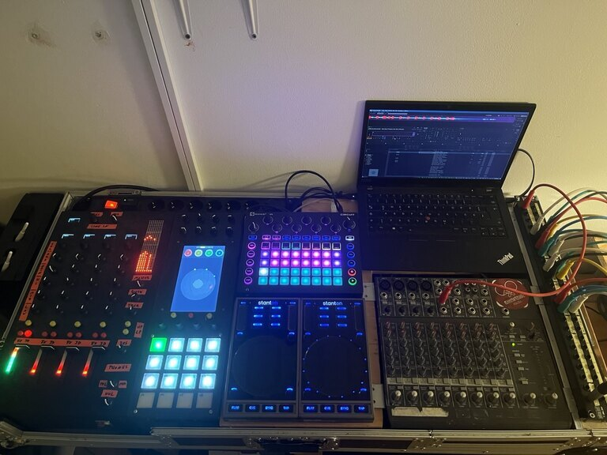
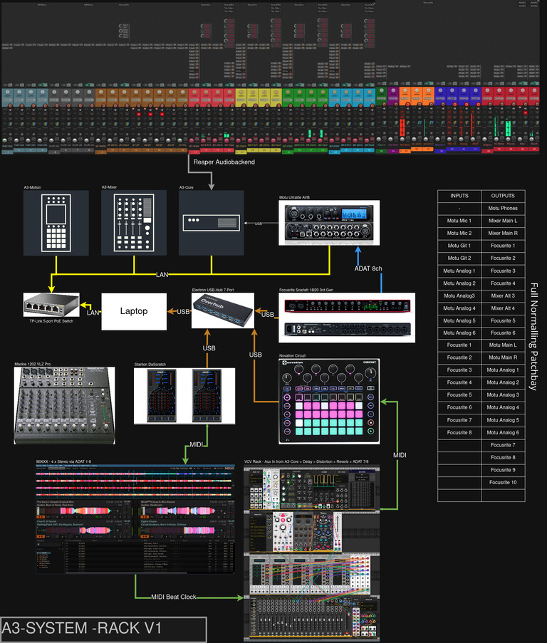
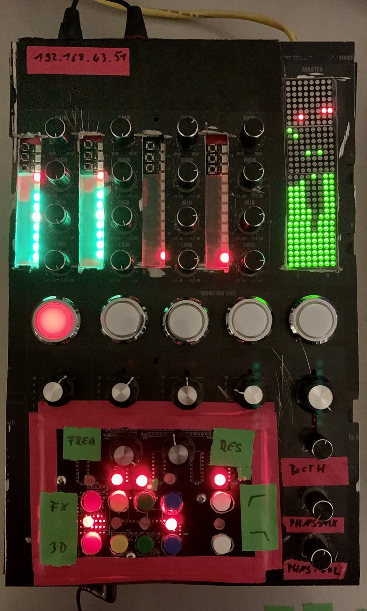
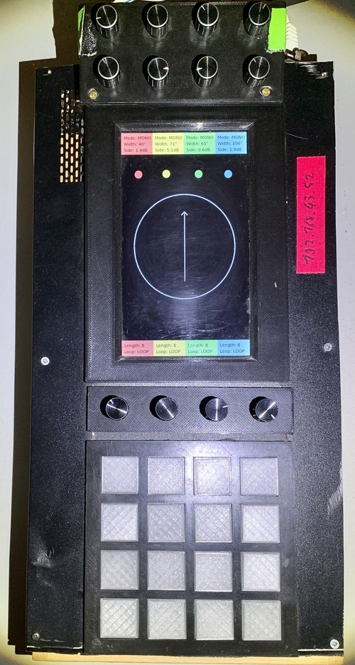
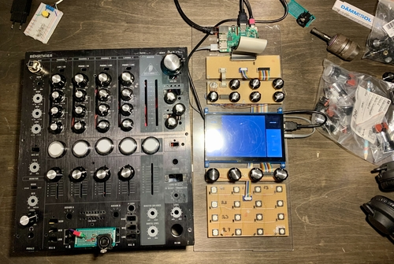
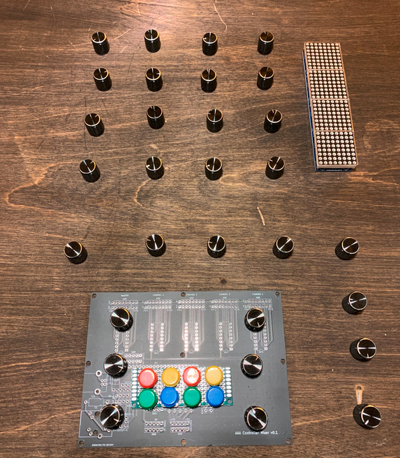
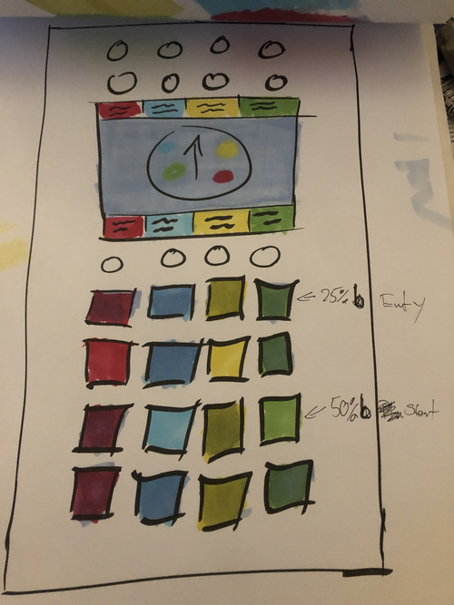
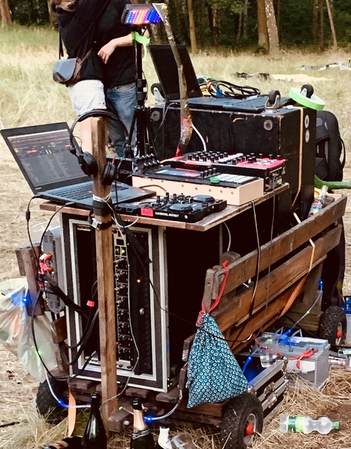

# History
## 2026
### The wire comes back

A run of work on what the three devices say to each other rather than on what
they look like. In order:

- **A³ Motion got a software mixer.** The same channel strip the desk has,
  on the MIX page, speaking the same addresses — so either one can be used
  and neither has to know about the other.
- **A³ Core got a window.** `http://<core>:9080`, one row per OSC address,
  showing what has actually gone over the wire. OSC over UDP cannot report
  that nobody was listening; this is how that stops costing evenings.
- **The window became a register.** A generated catalogue of all 520
  addresses the system can speak, read out of the six sources that define
  them and held against the traffic — so a dead wire can be seen rather than
  deduced.
- **Total recall.** A device that comes up asks A³ Core where the sound
  already is instead of announcing where it thinks it should be. The room no
  longer jumps when A³ Motion starts or the mixer is switched on.
- **The delay follows the beat.** The beat-analyzer's tempo now reaches the
  IEM DualDelay on the FX bus, held still for a bar before each change,
  because a delay line rewritten on every beat is a delay line whose pitch
  wobbles.
- **Everything goes to everyone.** The values REAPER reports back went to the
  desk alone, by a list written per message — which named the desk for three
  days after A³ Motion grew the same controls, without anything failing. The
  list is gone: every A³ message reaches every subscriber, and a light or
  video department is now a command-line argument. The master section, the
  shared filter and the PFL and FX keys got a way back at all in the process.
- **The FX send became the FX send again.** For years the desk's send knob
  drove the 3D blend, because it was the only continuous control there was
  for it. A³ Motion's pot took that over; the knob got its own job back.

- **And a clear-out.** Holding the reference against the register turned up
  four addresses that were sent and never answered, and one more where the
  window was wrong about itself. All five gone. That is the return on having
  built the register at all.

- **And the screen got quieter.** The status bar's nine level meters made the
  one band that is always in view the busiest thing on it. The outputs were
  already on the MIX page; the four channels' levels became a dot on each
  channel's own key, which is where a hand looking for a channel looks.

## 2025
### Spatial DJ-Setup
A³ Mixer V02 | A³ Motion V02

## 2022 
### A³ Mixer V01

### A³ Motion V01

## 2019
### Drafts

| A³ Mixer                             | A³ Motion                             |
| ------------------------------------ | ------------------------------------- |
|  |  |
### Proof of Concept

