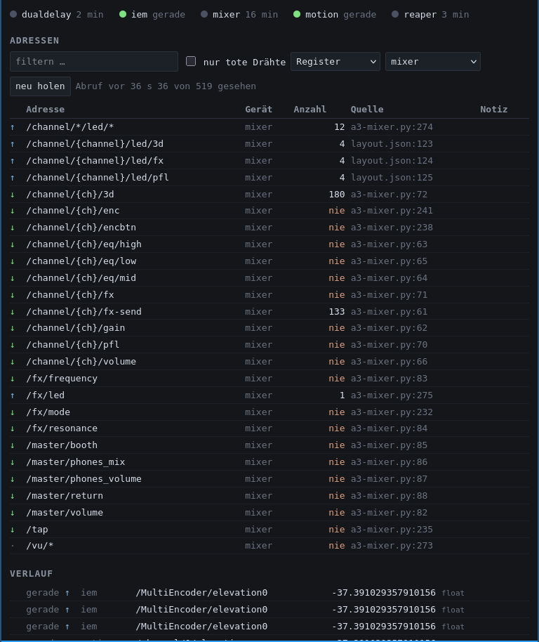

# OSC communication
## A³ Core

A³ Core listens on **three** UDP ports, and which one a message arrives at
decides what it means:

| Port | What arrives | Why it is its own port |
| :--- | :--- | :--- |
| 9000 | Commands from A³ Mixer, A³ Motion and the beat-analyzer | The room talking to Core |
| 9002 | REAPER's feedback | REAPER speaks `/track/*` and `/fx/*`, and `/fx/*` is what the Mixer's filter uses. One port for both would have Core reading REAPER's reports as commands and answering them — a loop on a rig that makes sound. |
| 9080 | HTTP, not OSC — the [window](https://a3-audio.github.io/a3-doc/development/core.html) | A browser page, no OSC at all |

### Commands in, on port 9000

| RECEIVE | SEND | DATA TYPE | DATA | DESCRIPTION
| :---| :--- | :--- | :--- | :---
| - | /vu/[0-11] | float (peak), float (rms) | [0-1], [0-1] | Peak and rms vu meter. Sent by the SuperCollider backend, not by `a3-core.py`.
| - | /channel/[0-3]/led/pfl | bool | [0 or 1] | Whether the pfl lamp is lit. **1 is lit** — see the warning below; it was the other way round until 2026-09-12.
| - | /channel/[0-3]/led/fx | bool | [0 or 1] | Whether the fx lamp is lit
| - | /channel/[0-3]/led/3d | bool | [0 or 1] | Whether the 3d lamp is lit
| - | /fx/led | string | [high_pass, low_pass] | fx mode, as the word the desk's firmware reads
| /channel/[0-3]/gain | /channel/[0-3]/gain | float | [0-1] | Channel gain. Sent back to **both** mixers when REAPER reports it — see *The way back* below.
| /channel/[0-3]/eq/high | /channel/[0-3]/eq/high | float | [0-1] | Channel eq high, relayed back the same way
| /channel/[0-3]/eq/mid | /channel/[0-3]/eq/mid | float | [0-1] | Channel eq mid, relayed back the same way
| /channel/[0-3]/eq/low | /channel/[0-3]/eq/low | float | [0-1] | Channel eq low, relayed back the same way
| /channel/[0-3]/volume | /channel/[0-3]/volume | float | [0-1] | Channel volume, relayed back the same way
| /channel/[0-3]/fx-send | - | float | [0-1] | How much of the channel reaches the FX bus. Since 2026-09-12 this is what it does again — see below.
| /channel/[0-3]/pfl | /channel/[0-3]/pfl | string or float | "1"/"0" (edge) or 0/1 (state) | Channel pfl. A string is a momentary button's edge and toggles the flag; a number is the wanted state. Core **sends** the resulting state back on the same address, always as a number.
| /channel/[0-3]/fx | /channel/[0-3]/fx | string or float | "1"/"0" (edge) or 0/1 (state) | Channel filter, same two spellings, and the state comes back the same way
| /channel/[0-3]/4d | /channel/[0-3]/4d | string or float | "1"/"0" (edge) or 0/1 (state) | Channel 3D on/off. The toggle used to live on `3d`; no device sends it today, but Core broadcasts its state — see below.
| /channel/[0-3]/3d | /channel/[0-3]/3d | float | [0-1] | How far the channel is spread into the 3D field. Core crossfades the channel's stereo and multi encoder on it, and replays it on a recall.
| /channel/[0-3]/azimuth | /channel/[0-3]/azimuth | float | [-180-180] | ambisonic azimuth, in degrees. Clamped, and the **clamped** value is what a recall replays.
| /channel/[0-3]/elevation | /channel/[0-3]/elevation | float | [-90-90] | ambisonic elevation, in degrees
| /channel/[0-3]/pot_1 | - | float | [0-1] | First encoder pot of the channel, on the stereo encoder
| /channel/[0-3]/pot_2 | - | float | [0-1] | Second encoder pot of the channel
| /master/volume | /master/volume | float | [0-1] | Master volume, relayed back from REAPER
| /master/booth | /master/booth | float | [0-1] | Booth volume, relayed back
| /master/phones_mix | /master/phones_mix | float | [0-1] | Phones mix, relayed back. The one value that goes out unbent, as a plain track volume.
| /master/phones_volume | /master/phones_volume | float | [0-1] | Phones volume, relayed back
| /master/return | /master/return | float | [0-1] | Aux return level, relayed back
| /fx/mode | /fx/mode | string or float | [high_pass, low_pass] or 0/1 | Global fx mode; as a number, 1 is high_pass. Core **sends** it as a number; the word goes to the desk on `/fx/led`.
| /fx/frequency | /fx/frequency | float | [0-1] | fx filter frequency, relayed back
| /fx/resonance | /fx/resonance | float | [0-1] | fx filter resonance, relayed back
| /state/recall | - | - | - | Ask Core to say its whole state again — see below
| /beat | - | int (beat), int (bar), float (bpm) | [1-4], [-], [-] | The beat-analyzer's clock. Only the tempo is used here, and only to drive the delay on the FX bus.

```{note}
`/channel/[0-3]/reverb`, `/channel/[0-3]/width` and `/channel/[0-3]/order`
were listed here for years and **have no handler in `a3-core.py`**. A value
sent to one of them is counted as unrecognised and dropped. They are left out
of the table above rather than described as working, because a reference that
lists an address nobody answers costs an evening to disprove.
```

### The two spellings of a button

The difference between a string and a number on `pfl`, `fx`, `4d` and
`/fx/mode` is not sloppiness — it is the difference between the devices. The
A³ Mixer passes on the serial line of a momentary button, so it sends the
**edge** `"1"` when the finger goes down and `"0"` when it comes off. A³
Motion shows a **state** on a screen and sends that state as a number. Core
resolves both, by the *type* of the argument.

This matters when changing either end: make `a3-mixer.py` send `int(value)`
and every button press becomes a state, so PFL on the desk turns into a
momentary — on only while the finger rests on it. No test in any of the repos
catches that.

### /state/recall

Sent by a device that has just come up and knows nothing about the room.
Core answers with **the ordinary messages** — every value in exactly the form
it would have arrived in — so nothing new has to be understood at the other
end, and each value goes to the device it belongs to rather than back to
whoever asked.

What comes back, in this order:

1. **The lamps** — Core's own flags, read off its state file, complete even
   on a cold start.
2. **The position and the crossfade** — `azimuth`, `elevation` and `3d` per
   channel. Core holds these because nobody else can be asked: the position
   goes straight to the IEM plugins on their own port, so REAPER never
   reports it back, and the crossfade reaches REAPER as two gains on two
   tracks, which a single number cannot be read back out of.
3. **The continuous values** — what REAPER last reported. Core relays these
   rather than holding an opinion of its own.

**A cold Core answers short.** REAPER reports on change and does not know
Core went away, so right after Core's own restart there is nothing relayed
yet and the answer is the lamps alone. A value Core has never seen is left
**out** rather than sent as zero — zero degrees is the front of the room, a
real position, and answering it would move the sound while claiming to
report where it already is.

### Everything goes to everyone

**There is no list of recipients.** Every A³-shaped message Core produces goes
to every subscriber, always — the A³ Mixer, A³ Motion, and whatever else is
plugged in.

That rule replaced a per-message device list on 2026-09-12, and the list is
why. It named the A³ Mixer for as long as only the desk had a channel strip;
A³ Motion grew one, the list stayed as it was, and **nothing failed** — a
message nobody is told to send is an absence, not an error, and OSC over UDP
has no way of reporting one. It was found three days later, as GAIN and VOL
reading zero on a rig that was making sound.

A new department is a command-line argument rather than a change to the
source:

```
a3-core.py --subscriber light=192.168.43.60:7771 --subscriber video=10.0.0.9:7771
```

Repeatable. A subscriber that cannot be parsed stops Core from starting rather
than being skipped — for the same reason as above.

```{note}
**The engine is not a subscriber.** REAPER, the IEM MultiEncoders and the
DualDelay each speak their own vendor's language — `/track/…`,
`/MultiEncoder/…`, `/DualDelay/…` — and each is addressed by the one handler
that has something to say to it.

**The lamps are broadcast too**, because a lamp shows a status and a status
belongs to whoever shows one. `/channel/[0-3]/led/*` and `/fx/led` therefore
reach every subscriber, alongside the flag itself on `/channel/[0-3]/pfl` —
two vocabularies for one fact: a lamp is a light, a flag is a setting.

Nothing is sent unless the status moved. A flag is announced only where it
actually changed, and a value already passed on is dropped — five identical
state messages produce one round of lamps, not five.
```

```{warning}
**`/channel/[0-3]/led/pfl` changed meaning on 2026-09-12.** It used to carry
the *opposite* of the lamp: Core sent "not pfl" and `a3-mixer.py` inverted it
back, the two cancelled, and the desk was right while the wire said the
reverse of its own name. That cost nothing while the desk was the only reader.

Both inversions came out together, so what reaches the desk's LED is
unchanged and the address now means **this lamp is lit**. Anything written
against the old behaviour has to drop its own inversion as well.
```

### The way back: what REAPER reports

A hand on REAPER's own mixer has to reach the devices, or the room and the
control surfaces disagree with nobody able to tell. So Core reads REAPER's
feedback on port 9002, bends the value back through the curve it went out on,
and broadcasts it.

| REAPER reports | comes back as |
| :--- | :--- |
| `/track/{12,16,20,24}/fx/1/fxparam/1/value` | `/channel/[0-3]/gain` |
| `/track/{12,16,20,24}/fx/2/fxparam/{1,2,3}/value` | `/channel/[0-3]/eq/{high,mid,low}` |
| `/track/{9,13,17,21}/fx/1/fxparam/*` | `/channel/[0-3]/volume` |
| `/track/{9,13,17,21}/send/3/volume` | `/channel/[0-3]/fx-send` |
| `/track/{12,16,20,24}/fx/3/fxparam/7/value` | `/fx/frequency` |
| `/track/{12,16,20,24}/fx/3/fxparam/6/value` | `/fx/resonance` |
| `/track/1/fx/1/fxparam/*` | `/master/volume` |
| `/track/2/fx/1/fxparam/*` | `/master/booth` |
| `/track/3/fx/2/fxparam/1/value` | `/master/phones_volume` |
| `/track/8/volume` | `/master/phones_mix` |
| `/track/25/fx/3/fxparam/*` | `/master/return` |

The filter is one control written to all four input tracks, so it is
**reported on a channel's track and answered globally**. A value already
passed on is dropped, which is what keeps one knob from becoming eight
identical messages — a gain plug-in holds its value across eight parameters.

```{warning}
**Not everything may be relayed, and the rule is exact: can an action script
drive it?**

If it can — `3d`, `freq` and `Q` — REAPER holds the base value *plus* the
running accent envelope while the device holds only the base. Writing the one
into the other makes every accent's peak the new base, so the value ratchets
up and never comes down. The two encoder pots were relayed for a few hours on
2026-09-12 and had to be taken out again.

If it cannot — gain, the EQ bands, volume — REAPER's value **is** the device's
value and there is nothing to ratchet.

`fx-send` was the one entry that was a decision rather than an impossibility,
and the decision went the other way on 2026-09-12: no action drives it, so it
is relayed as safely as the gain.
```

**What the desk does with it today: nothing.** `a3-mixer.py` subscribes to
`/vu/*`, `/channel/*/led/*` and `/fx/led` and to nothing else, so all of this
arrives there and is dropped without a word. It is still sent — the desk is
where most of those controls are, and its channel displays are the obvious ear
— but nobody should read this table and conclude the desk is being kept up to
date. It is, as of 2026-09-12, the only device in the system that does not
know its own state beyond its lamps.

### /beat, and the delay that follows it

The beat-analyzer has listed Core as one of its OSC targets all along; Core
simply had nowhere to put the message. It now takes the tempo out of it and
hands it to the **IEM DualDelay** on the FX bus, on `127.0.0.1:1340`:

```
beat-analyzer  ──/beat b bar bpm──▶  A³ Core :9000
                                       │
                                       └──/DualDelay/delayBPML,R──▶  DualDelay :1340
```

Not every beat. A delay is the one effect where chasing a tempo is audible —
rewriting a delay line's length shifts the pitch of whatever is still in it —
so a reading has to do two things before it is passed on: **hold still for a
whole bar**, and differ from what the delay already has by at least 0.1 BPM.
Measured on the rig: 55 beats received, one message sent in thirty seconds.

Both delay lines get the same tempo. They keep their own multipliers, which
is what makes the two sides a ping-pong rather than one echo, and the
multiplier is set in the plug-in rather than from here.

```{warning}
Two things live in the plug-in and not in any repository, and without them
nothing arrives: its **OSC receiver has to be open** (click the status line
at the lower left of the plug-in, *Listen to port* → `1340` → **OPEN**), and
its **`Sync` has to be off** — with Sync on, the plug-in follows REAPER's
project tempo and ignores `delayBPM`.

Going through REAPER's project tempo instead was tried and does not hold: the
plug-in takes a new tempo once, when the transport starts, and then stops
following. REAPER accepts and reports every tempo correctly; the plug-in just
does not act on it. Addressed directly, it takes the value every time.
```

### The FX send, and what happened to 3D

For years the Mixer's FX-send knob did **not** drive the FX send. It drove
the stereo/multi crossfade — the 3D function — because it was the only
continuous control the desk had for it. A³ Motion's per-channel pot took that
job over on `/channel/[0-3]/3d`, and on **2026-09-12** the desk's knob got its
own job back:

```
/channel/[0-3]/fx-send  ──▶  /track/{9,13,17,21}/send/3/volume   (normalised 0..1)
```

Send **3** of the channel bus reaches the FX bus. The number is the position
among the *sending* track's sends, which REAPER derives from the order its
receivers appear in the project — for the channel buses that is 1-pfl,
ph-mix, enc_fx, enc_main. It lives in Core's `layout.json` rather than in the
source, so a send that moves in the REAPER project can be found by reading
one file.

**The price, named:** the desk has no 3D control any more. The 3D *switch*
per channel is gone in Mixer hardware v3.2 as well, and Core's boolean —
`/channel/[0-3]/4d` — is today an address no device sends. The 3D blend is
A³ Motion's pot, and only that.

## A³ Motion

A³ Motion listens on three UDP ports (configurable in the UI's `config/config.json`,
`oscReceiver`): the main port (default 7771), a separate VU port (default 7772), and an energy
port (default 7777), so neither the high-rate VU stream nor the energy grid shares a socket with
the beat clock. All three are served by the same handler, so the split is a convention, not a
restriction.

| RECEIVE | SEND | DATA TYPE | DATA | DESCRIPTION
| :---| :--- | :--- | :--- | :---
| /vu/[0-3] | - | float (peak), float (rms) | [0-1], [0-1] | Audio channels 1-4 — drives the corona around each channel blob
| /vu/4 | - | float (peak), float (rms) | [0-1], [0-1] | Subwoofer — drives the sphere glow
| /vu/[5-8] | - | float (peak), float (rms) | [0-1], [0-1] | Speakers 1-4 — drives the speaker spotlights
| /vu/[9-11] | - | float (peak), float (rms) | [0-1], [0-1] | Received but unused — silently discarded
| /EnergyVisualizer/RMS | - | 426 × float | [0-1] each | Energy arriving from each direction, one value per point of the IEM EnergyVisualizer's sphere — lights the sphere itself. Port 7777.
| /channel/[0-3]/azimuth | /channel/[0-3]/azimuth | float | [-180-180] | Where the channel's sound is, in degrees. Sent while a blob moves; **received** since 2026-09-12, so Core can put the blob where the sound already is.
| /channel/[0-3]/elevation | /channel/[0-3]/elevation | float | [-90-90] | The same, in elevation
| /channel/[0-3]/3d | /channel/[0-3]/3d | float | [0-1] | How far the channel is spread into the 3D field, from its pot. Core crossfades the channel's stereo and multi encoder on it.
| /channel/[0-3]/pot_1 | /channel/[0-3]/pot_1 | float | [0-1] | The channel's filter frequency — the `freq` row of the channel-value strip, and the left hardware encoder
| /channel/[0-3]/pot_2 | /channel/[0-3]/pot_2 | float | [0-1] | The channel's filter resonance (`Q`), and the right hardware encoder
| /channel/[0-3]/gain | /channel/[0-3]/gain | float | [0-1] | Channel strip, MIX page. **Received** since 2026-09-12: A³ Core relays what REAPER reports.
| /channel/[0-3]/eq/high | /channel/[0-3]/eq/high | float | [0-1] | Channel strip, MIX page. Received as well.
| /channel/[0-3]/eq/mid | /channel/[0-3]/eq/mid | float | [0-1] | Channel strip, MIX page. Received as well.
| /channel/[0-3]/eq/low | /channel/[0-3]/eq/low | float | [0-1] | Channel strip, MIX page. Received as well.
| /channel/[0-3]/volume | /channel/[0-3]/volume | float | [0-1] | Channel strip, MIX page. Received as well.
| /channel/[0-3]/fx-send | /channel/[0-3]/fx-send | float | [0-1] | Channel strip, MIX page — new 2026-09-12, and relayed back since the same evening.
| /channel/[0-3]/pfl | /channel/[0-3]/pfl | float | [0 or 1] | Channel strip, MIX page — the **state**, not an edge, both ways
| /channel/[0-3]/fx | /channel/[0-3]/fx | float | [0 or 1] | Channel strip, MIX page — the state, both ways
| /master/* | /master/volume, /master/booth, /master/phones_mix, /master/phones_volume, /master/return | float | [0-1] | Summing section, MIX page. Received as well since 2026-09-12.
| /fx/* | /fx/mode, /fx/frequency, /fx/resonance | float | [0-1] | The one filter shared by all four channels. Received as well; `/fx/mode` as a number, 1 for high pass.
| - | /state/recall | - | - | Sent once at start-up: *tell me what is already sounding*
| - | /StereoEncoder/azimuth, /StereoEncoder/elevation | float | [-180-180], [-90-90] | The alternative backend, straight into an IEM plug-in chain instead of into Core
| /beat | /beat | int (beat), int (bar), int (bpm) | [1-4], [-], [-] | The beat clock — **sent** in INT mode, **received** in EXT and PIO. Always updates the status bar readout; received, it also syncs playback tempo and phase. Float arguments are accepted and truncated to int.
| - | /tap | - | - | Tap tempo, to the beat-analyzer
| - | /clockmode | int | [0-2] | 0 a3motion, 1 intern, 2 pioneer

```{note}
Every address in this section is a **default**, not a fixed part of the protocol. A³ Motion reads
them from the `oscAddresses` block of its `config/config.json`, and they can be edited on the
device under Menu → Network. `{ch}` there stands for the channel number.

The block is grouped into `out` (to Core and IEM), `in` (VU and energy) and `beatclock`. The beat
clock is neither: `beat` is *sent* in INT clock mode and *received* in EXT, one address either way.

Changing one changes only A³ Motion's side of the conversation — the peer has to be changed to
match. A mismatch does not report itself: the message is sent correctly, to an address nobody is
listening for.
```

The index ranges above exist only in A³ Motion — senders do not carry that meaning. The
`beat-analyzer`, for instance, simply emits `NUM_VU_CHANNELS` (default 12) meters, one per JACK
input, in port order. Which physical signal ends up on which index is decided by the JACK patching
alone, and changing that wiring changes what the UI shows with nothing to warn you.

Note the base mismatch when patching: the analyzer's JACK ports are 1-based (`vu_1` … `vu_12`)
while the OSC addresses are 0-based, so **`vu_N` arrives as `/vu/(N-1)`**. In the A³ setup the
speakers therefore sit on ports `vu_6`..`vu_9`, not `vu_5`..`vu_8`:

| JACK port | OSC address | Signal |
| :--- | :--- | :--- |
| vu_1 .. vu_4 | /vu/0 .. /vu/3 | Mixer channels 1-4 |
| vu_5 | /vu/4 | Subwoofer |
| vu_6 .. vu_9 | /vu/5 .. /vu/8 | Speakers 1-4 |
| vu_10 .. vu_12 | /vu/9 .. /vu/11 | currently unused |

Levels may still arrive on the unused indices if something is patched to those ports; that is not
a sign they are being evaluated.

### /channel/[0-3]/3d

A third per-channel value beside `pot_1` and `pot_2`, sent whenever the channel's potentiometer
moves. In `a3-core.py` it crossfades the channel between its stereo encoder and its multi encoder
(REAPER FX 1, parameters 1 and 15 on one, parameter 1 on the other).

**This address used to be a toggle**, flipping `toggle_3d` on the value 1 and reporting an LED
state back to A³ Mixer. That boolean now lives on `/channel/[0-3]/4d`. The Mixer button that sent
it is gone in hardware v3.2, so nothing sends the boolean today.

### /EnergyVisualizer/RMS

Sent by the [IEM EnergyVisualizer](https://plugins.iem.at/docs/energyvisualizergrid/) from version
1.0.0 on, once its "OSC send" is switched on in the lower left of the plug-in. One message carries
**426 float32 arguments**, one per point of the plug-in's own sphere grid, in the plug-in's order —
roughly 9 messages a second. Values are linear, not dB.

Which direction each index stands for comes from the plug-in's coordinate file, mirrored in the
A³ Motion UI as `resources/EnergyVisualizerGrid.json`. A message of any other length is discarded
rather than partly applied, because a short one would leave the rest of the map holding energy that
is no longer there.

Unlike the VU meters, this carries **elevation** as well as azimuth: it is the ambisonic field
itself rather than a per-loudspeaker level.

### The MIX page

Since 2026-09-10 A³ Motion carries a **software channel strip** of its own: six
pots per channel — GAIN, HIGH, MID, LOW, VOL and, since 2026-09-12, SEND — plus
PFL and FX, and a second page for the summing section and the shared filter.
Every one of them sends the same address the A³ Mixer sends, so Core cannot
tell the two apart and does not have to.


A double tap puts a control back on its **rest position**, where it has one:

| Control | Where | Rests at | Why |
| :--- | :--- | :--- | :--- |
| SEND | MIX page | 0 | An FX send you cannot get rid of in one gesture is an FX send you will not reach for. It also **starts** there: nothing relays it back, so what the knob shows is all there is, and a knob showing half while meaning nothing is worse than one showing nothing. |
| 3d, freq | channel-value strip | 0.5 | Twelve o'clock — the middle of a 270° sweep, and one place to reach for rather than two |
| Q | channel-value strip | 0 | A filter that still resonates after being put back has not been put back. The Airwindows Isolator3 at the far end rests its own Q at zero too. |

A double tap on a MIX pot other than SEND does nothing: a gain that snaps to
a default mid-set is a channel that jumps in the room.

### Total recall at start-up

A device that has just come up used to **announce** its own idea of where each
sound was, and the room jumped to it. It now **asks** first.

At start-up A³ Motion sends `/state/recall` and holds its own output for a
moment — the hold is released as soon as an answer arrives, and by a short
grace period if none does. What Core replays lands on the blobs, the pots and
the encoders, and only then does the device start talking.

The rule for who wins, decided 2026-09-12:

- **At start-up, Core wins.** It is the one that knows what is audible.
- **When a set is loaded, the set wins.** Loading a set is an explicit act,
  and it would be useless if the room overrode it.

```{note}
A reverse path that **asks** is right; one that **reports** is a loop. The
per-channel pots briefly had a continuous reverse path from REAPER and it fed
back: REAPER held the sum of a base gain and an accent, A³ Motion held only
the base, and each round trip raised the base a little. Roughly ten of 3382
messages slipped past the echo filter — enough. It was taken out again on
2026-09-12; `/state/recall` is what replaced it, because it is asked for once
rather than arriving forever.
```

## IP and Port

Ports are configurable per device; these are the defaults that ship.

| Component | Listens on | Sends to |
| :--- | :--- | :--- |
| A³ Core | 9000 commands, 9002 REAPER feedback, 9080 HTTP (the window) | REAPER `127.0.0.1:9001`, IEM MultiEncoder `127.0.0.1:1337+n`, IEM DualDelay `127.0.0.1:1340`, A³ Mixer, A³ Motion |
| A³ Mixer | 7771 | A³ Core `:9000` |
| A³ Motion | 7771 control, 7772 VU, 7777 energy grid | A³ Core `:9000`, beat-analyzer `:7775` |
| Beat-Analyzer | 7775, Pioneer Pro DJ Link 50000-50002 | A³ Core, A³ Motion, A³ Mixer |
| IEM DualDelay | 1340 — **only once opened by hand in the plug-in** | – |

### Known inconsistencies

Worth knowing before chasing a silent link. These are recorded rather than fixed
because each needs a decision about which end is right:

- `a3-core.py` addresses its peers by **hardcoded IP** (`192.168.43.54`, `.55`), and
  `a3-mixer.py` does the same for the core (`192.168.43.50`). A system on a different
  subnet has those links dead with nothing to indicate it.
- `a3-core.py` sends to A³ Motion on port **8700** by default, while the A³ Motion UI
  listens on **7771**. Since the window was built there is at least a way around it
  without editing the source: `a3-core.py --motion <host>:<port>`, which is what the
  development machine runs.
- `beat-analyzer` is configured to reach the mixer on **7773/7774**, while
  `a3-mixer.py` listens on **7771**.

## The register: which addresses exist at all

This page is written by hand and can fall behind. Since 2026-09-12 there is a
second answer that cannot: A³ Core ships a **generated catalogue** of every
address the system can speak, read out of the six places that actually define
them —

| Source | Contributes |
| :--- | :--- |
| Core's `layout.json` | Core's own templates |
| `a3-motion-ui/.../OscAddresses.hh` | what A³ Motion speaks and hears |
| `a3-mixer/software/scripts/a3-mixer.py` | the desk's pot and button tables |
| `a3-core.ReaperOSC` | everything REAPER understands |
| `a3-core.py` | the addresses Core builds itself, `/MultiEncoder/*` included |
| `beat-analyzer` | `/beat`, `/tap`, `/clockmode`, `/vu/*` |

— 520 entries, each with the device that speaks it, the direction, and the
file and line it was read from. Core's window holds that catalogue against the
traffic it has actually seen, so it can say the one thing a message log never
could: **an address that exists and has never arrived is a dead wire.**



Everything marked *nie* in that column has never been heard from. See
[A³ Core Development](https://a3-audio.github.io/a3-doc/development/core.html)
for the window itself.
