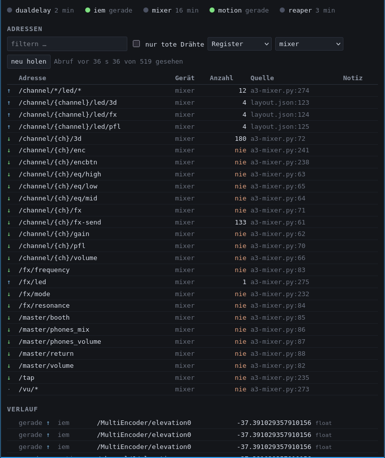

# OSC communication

Every port on every device, in one table, is in [Ports and
endpoints](ports.md). This page is about what the messages *mean*.

(osc-truth)=

## Where addresses and ports live

Every OSC address, port and IP of the system is written **once**, in
`a3-osc.json`, and since 2026-09-30 nothing else carries these facts. Since
2026-10-02 the file has **two parts** with two owners:

- **The contract** — addresses, arguments, who sends and who hears, ports,
  routes, the VU map — is the package's. The a3-core package ships it as
  `/usr/share/a3/a3-osc.json` (source:
  `platform-config/debian-x86_64/a3-core/usr/share/a3/a3-osc.json` in
  [a3-core](https://github.com/a3-audio/a3-core)) and replaces it on every
  install.
- **The network** — `hosts` (the machines' addresses) and `network` (Core's own
  interface, bridge, gateway, DNS) — is the maintainer's. It lives in
  `~/.config/a3/network.json` on the Core machine. The installer creates that
  file once, from the package's values, and never overwrites it.

Core **joins** the two, key by key: what `network.json` names wins, and a host
missing from it comes from the package. A `network.json` that does not parse,
or that lacks the `hosts` or `network` object, is **refused**: Core says why in
its journal and uses the package's values.

Core serves the joined result at `http://<core>:9080/api/truth`. The header
`X-A3-Truth` carries its **fingerprint**, the sha256 of the canonical JSON
(sorted keys, no spaces, UTF-8). The file has these sections:

| Section | What it holds |
| :--- | :--- |
| `network` | the Core machine's own network: interface, bridge, address, gateway, DNS |
| `hosts` | every machine by name — `core`, `mixer`, `radla`, `local`, `any` |
| `listeners` | who listens where: program, role, host, port |
| `routes` | who sends to which listener |
| `addresses` | our vocabulary: pattern, argument types, who sends it, who hears it, what it means |
| `vu_meters` | the forty meters by name, in `/vu/1..40` order |
| `external` | the words we speak but do not own — REAPER's and the IEM plug-ins' |

The tables on this page and on the [ports page](ports.md) are rendered from
that file, not written by hand.

### Who reads it, and how

| Device | How it gets the file |
| :--- | :--- |
| A³ Core | reads the package's contract and joins `~/.config/a3/network.json` over it (`a3_osc.py`), then serves the result |
| A³ Motion | **fetches it from Core**, the same way as the desk, and shares the cache `~/.cache/a3/a3-osc.json` with StemDeck — see {ref}`Following Core <osc-follow>`. Its `config.json` blocks `oscSender`, `oscReceiver` and `oscAddresses` are no longer read, and the **Network** page is gone from its menu |
| A³ Mixer | **fetches it from Core.** It listens for Core's `/core/here` on 7790, keeps the last truth in `~/.cache/a3/a3-osc.json` and restarts itself when Core announces a different fingerprint — see {ref}`the desk page <mic-truth>`. Without a truth it waits for the announcement; it does not exit |
| StemDeck | **fetches it from Core**, like Motion, from the shared cache — see {ref}`Following Core <osc-follow>`. It reads its Pro DJ Link ports (50000–50002) and its `stemdeck.bus` from it. Without any truth its PIO status line says `PIO: no a3-osc.json` |
| beat-analyzer | reads an `a3-osc` block in its `build/.env`, which the a3-core package writes at install (`a3-osc-render user`) — see {ref}`Beat Analyzer <beat-analyzer-config>` |
| zita-j2n, zita-n2j | the units take address and port from `~/.config/a3/osc.env`, also written by `a3-osc-render user` |
| the package's install | the "standard network" it offers comes from the package's `network` section, and it creates `~/.config/a3/network.json` from it once |

**Core needs the package's file before it starts.** It reads it once, at
start-up, and a Core without it does not come up at all. The package installs
it, so after a package install it is there; a Core started from a checkout
needs the package's file in place first (or `$A3_OSC_TRUTH` naming another
one).

**Core announces itself.** Every 2 seconds it broadcasts OSC `/core/here` to
its subnet's broadcast address, port 7790, with two strings: the URL of
`/api/truth` and the fingerprint. Broadcasts do not cross a router, so a
device on another subnet (radla) will be given Core's URL in
`~/.config/a3/core` instead — a later step; until then it needs its own copy
of the file.

(osc-follow)=

### Following Core: StemDeck and A³ Motion

StemDeck and A³ Motion run on the Core machine as user `aaa` and **share one
cache**, `~/.cache/a3/a3-osc.json`. Each one, like the desk, listens for
Core's `/core/here` on UDP 7790 (the two share the port). At start it takes
the first of these: `$A3_OSC_TRUTH` if set; the cache, if it reads as a truth;
otherwise the package's `/usr/share/a3/a3-osc.json`.

When Core announces a fingerprint the app does not hold, it fetches
`http://<core>:9080/api/truth` off the UI thread and checks that the body's
sha256, the `X-A3-Truth` header and the announcement agree, and that the
truth is usable: StemDeck needs `stemdeck.bus`, Motion needs every address it
speaks. Then it writes the cache whole and **quits with exit code 1**;
systemd (`Restart=on-failure`, 5 s) starts it again on the new truth. A
refusal is logged once per reason and the app runs on.

With `$A3_OSC_TRUTH` set, an app does not follow Core.

**What you see:** after a Core install that changes the truth, or after
editing `~/.config/a3/network.json` and restarting Core, StemDeck's and
Motion's windows close and reopen once, about 5 s. With the same truth,
nothing happens. Motion saves its state on the way out.

### When a port or an address has to change

**An address or host** (the network is yours):

1. Edit `~/.config/a3/network.json` on the Core machine.
2. Restart Core. It renders the zita units' and the beat-analyzer's
   addresses at its start (`~/.config/a3/osc.env`, the `a3-osc` block of the
   analyzer's `.env`), so they follow with it; restart those two to pick the
   change up. The desk sees Core's new fingerprint within seconds and
   restarts itself; so do StemDeck and Motion, whose windows reopen once.

**A port, an address or a word of the contract** (the package's):

1. Edit `a3-osc.json` in a3-core and install the package again on the Core
   machine; restart Core.
2. Nothing to copy: the desk, StemDeck and Motion follow Core's announcement
   (StemDeck's and Motion's windows reopen once). The beat-analyzer and zita
   follow Core's restart, as above.

Nothing is changed on a device itself: a device holding its own copy of a
port is how three files came to disagree about the A³ Mixer's address on
2026-09-24.

(osc-differs)=

### "DIFFERS from Core's"

With every state request, and so at every start, the A³ Mixer sends
`/device/hello` with its name and the sha256 of its truth; StemDeck sends it
too, hashing the cache it runs on. Core compares it
against its own **fingerprint** (the sha256 of the joined truth it serves).
Core's window shows one line per device under the peers:

- **a3-osc.json is Core's** — the device speaks what Core speaks.
- **a3-osc.json DIFFERS from Core's**, in red — the device's truth is not the
  one Core serves. The desk, StemDeck and Motion fix this
  themselves within seconds of the next announcement; if it stays red, look in
  the device's log for a refused fetch. Until then it may be sending to an
  address or port nobody listens on, and OSC over UDP will not say so.

(osc-addresses)=

## Addresses

Every address that is ours, as `a3-osc.json` states it. `{ch}` counts
**1–4** — the channel number on the wire, the same as on the panel. "Core
passes it on" means Core relays or announces it to those devices, after
acting on it itself.

<!-- a3-osc:addresses -->
| Address | Types | From | To | Meaning |
| --- | --- | --- | --- | --- |
| `/channel/{ch}/gain` | f | mixer, motion | core (Core passes it on to mixer, motion) | input trim |
| `/channel/{ch}/eq/high` | f | mixer, motion | core (Core passes it on to mixer, motion) | EQ high band |
| `/channel/{ch}/eq/mid` | f | mixer, motion | core (Core passes it on to mixer, motion) | EQ mid band |
| `/channel/{ch}/eq/low` | f | mixer, motion | core (Core passes it on to mixer, motion) | EQ low band |
| `/channel/{ch}/volume` | f | mixer, motion | core (Core passes it on to mixer, motion) | channel fader |
| `/channel/{ch}/aux-send` | f | mixer, motion | core (Core passes it on to mixer, motion) | send to the FX bus (the beat-synced DualDelay) |
| `/channel/{ch}/cue` | f | mixer, motion | core (Core passes it on to mixer, motion) | cue the channel to the headphones (its pre-fader send to enc_phones); was pfl until 2026-10-01 |
| `/channel/{ch}/cue/led` | f | core | mixer, motion | the cue lamp, 1 = lit |
| `/channel/{ch}/filter` | f | mixer, motion | core (Core passes it on to mixer, motion) | this channel through the master filter |
| `/channel/{ch}/filter/led` | f | core | mixer, motion | the filter key's lamp, 1 = lit |
| `/channel/{ch}/filter/frequency` | f | motion | core (Core passes it on to mixer, motion) | the channel's own filter cutoff (was pot_1) |
| `/channel/{ch}/filter/q` | f | motion | core (Core passes it on to mixer, motion) | the channel's own filter Q (was pot_2) |
| `/channel/{ch}/3d` | f | motion | core (Core passes it on to mixer, motion) | blend between the channel's moving and steady encoders |
| `/channel/{ch}/azimuth` | f | motion | core | the channel's direction, degrees |
| `/channel/{ch}/elevation` | f | motion | core | the channel's height, degrees |
| `/channel/{ch}/stem/turn` | i | mixer | core | the channel's encoder turned by this many clicks (signed): moves the selection, switches nothing |
| `/channel/{ch}/stem` | i | core | mixer, motion | the stems on this channel's bus as a bit mask of pairs 1-8 (bit 0 = pair 1 = deck A stem 1); 0 = the analog input |
| `/channel/{ch}/stem/push` | i | mixer | core | the channel's encoder pushed: load the selected input (A or a stem) onto the channel |
| `/channel/{ch}/stem/selected` | i | core | mixer, motion | the channel's selection: 0 = A (analog), 1-8 = stem pair |
| `/filter/frequency` | f | mixer, motion | core (Core passes it on to mixer, motion) | the master filter's cutoff (was /fx/frequency) |
| `/filter/resonance` | f | mixer, motion | core (Core passes it on to mixer, motion) | the master filter's resonance (was /fx/resonance) |
| `/filter/mode` | f\|s | mixer, motion | core (Core passes it on to mixer, motion) | high-pass or low-pass (was /fx/mode) |
| `/filter/led` | s | core | mixer, motion | the filter section's lamp: blue HPF, green LPF (was /fx/led) |
| `/master/volume` | f | mixer, motion | core (Core passes it on to mixer, motion) | the main outputs |
| `/master/booth` | f | mixer, motion | core (Core passes it on to mixer, motion) | the booth outputs |
| `/master/phones-mix` | f | mixer, motion | core (Core passes it on to mixer, motion) | cue <-> main in the headphones |
| `/master/phones-volume` | f | mixer, motion | core (Core passes it on to mixer, motion) | the headphone level |
| `/master/aux-return` | f | mixer, motion | core (Core passes it on to mixer, motion) | the aux return, the fifth stereo input (was /master/return) |
| `/aux-return/stem/turn` | i | mixer | core | the aux return's encoder turned by this many clicks (signed): moves its selection |
| `/aux-return/stem/push` | i | mixer | core | the aux return's encoder pushed: the selected stem becomes the one on the return (0: none) |
| `/aux-return/stem` | iiiiiiiii | core | mixer, motion | the aux return's selection (0 = the empty field), then pairs 1-8: 1 = on the return (AUX) |
| `/stemdeck/{deck}/{stem}/bus/{bus}` | i | core | stemdeck | set one bus switch of a stem, 1 on 0 off; bus 1-4 the desk channels, 5 AUX, 6 CUE |
| `/stemdeck/{deck}/{stem}/buses` | i | stemdeck | core | a stem's bus switches as a bit mask (bit 0 = bus 1), after every change and for all 8 stems after /stemdeck/recall |
| `/stemdeck/recall` | i | core | stemdeck | report every stem's buses once; Core asks when StemDeck's hello is news |
| `/device/hello` | ss | mixer, stemdeck | core | a device names itself and the sha256 of its truth; Core's window shows whether it is Core's own |
| `/core/here` | ss | core | mixer, motion, stemdeck, radla | Core, every 2 s by broadcast: the URL of the joined truth and its fingerprint (sha256 of the canonical JSON) |
| `/state/recall` | i | motion | core | say the state again; the answer is the ordinary messages |
| `/beat` | iif | beat-analyzer, motion | core, motion, mixer, radla, beat-analyzer | beat in bar, bar, tempo -- the clock (Motion sends it only in clock mode 0) |
| `/tap` | i | mixer, motion | beat-analyzer | a tap on the beat |
| `/clockmode` | i | motion | beat-analyzer | 0 a3motion, 1 intern, 2 pioneer |
| `/vu/{n}` | ff | beat-analyzer, stemdeck | motion, mixer, radla | peak, rms (linear) of VU channel n = REAPER out 30 + n for 1-40; 41-48 StemDeck's stems, one each (stem_a1 ... stem_b4: peak of the louder side, rms over both, after knob and mute); see vu_meters |
<!-- /a3-osc:addresses -->

### Renamed on 2026-09-30

The vocabulary was straightened on the day the file was introduced. Anything
written against the old words has to follow:

| Before | Since 2026-09-30 |
| :--- | :--- |
| `/channel/0..3/…` | `/channel/1..4/…` — channels count from 1 on the wire |
| `/fx/frequency`, `/fx/resonance`, `/fx/mode`, `/fx/led` | `/filter/frequency`, `/filter/resonance`, `/filter/mode`, `/filter/led` |
| `/channel/{ch}/fx` | `/channel/{ch}/filter` |
| `/channel/{ch}/led/pfl` | `/channel/{ch}/pfl/led` |
| `/channel/{ch}/led/fx` | `/channel/{ch}/filter/led` |
| `/channel/{ch}/pot_1`, `/channel/{ch}/pot_2` | `/channel/{ch}/filter/frequency`, `/channel/{ch}/filter/q` |
| `/master/phones_mix`, `/master/phones_volume` | `/master/phones-mix`, `/master/phones-volume` |
| `/master/return` | `/master/fx-return` (since 2026-10-01 `/master/aux-return`) |
| `/vu/0..39` | `/vu/1..40` |

On **2026-10-01** PFL became cue, on the wire too: `/channel/{ch}/pfl` is now
`/channel/{ch}/cue`, `/channel/{ch}/pfl/led` is now `/channel/{ch}/cue/led`.

Later the same day StemDeck joined the wire: the desk switches its buses
through Core (`/stemdeck/...`), `/channel/{ch}/stem` became a bit mask of the
stems on a channel, and `/stem/cue` and `/stem/cue/led` were dropped again;
the aux-return display has no C field any more. StemDeck also sends its own
stem meters, `/vu/41`–`/vu/48`.

On **2026-10-02** the desk's stem displays became a selector: turning only
moves a selection, a push loads it. New are `/channel/{ch}/stem/push` and
`/channel/{ch}/stem/selected`; `/channel/{ch}/stem/turn` and
`/aux-return/stem/turn` move a selection and switch nothing;
`/aux-return/stem/push` puts the selected stem on the return, and
`/aux-return/stem` now carries the return's selection (0 = the empty field)
before the eight flags. The channel's push no longer toggles the cue.

`/device/hello` is new; see [above](#osc-differs).

(osc-vu-meters)=

## The meters

The beat-analyzer sends forty meters, `/vu/1` to `/vu/40`, each with a peak
and an RMS value (linear, 0–1). `/vu/n` is REAPER out 30 + *n*: the whole
wiring is the {ref}`REAPER channel map <core-vu-map>`.

**A device looks a meter up by its name** in the file's `vu_meters`, not by
its number:

| Device | Shows |
| :--- | :--- |
| A³ Motion | the input dots: `in1_pre` … `in4_pre` (`/vu/1`–`/vu/4`); the sphere's glow: `main_sub` (`/vu/11`); the towers: `main_top1` … `main_top4` (`/vu/12`–`/vu/15`); the MIXER page's master column, **ten** meters: `main_sub` and `main_top1` … `main_top9` (`/vu/11`–`/vu/20`) — five until 2026-09-30 |
| A³ Mixer | its four input meters: `in1_pre` … `in4_pre`; its eight output meters: `main_sub` and `main_top1` … `main_top7` (`/vu/11`–`/vu/18`) |

<!-- a3-osc:vu -->
| Address | Meter |
| --- | --- |
| `/vu/1` | in1_pre |
| `/vu/2` | in2_pre |
| `/vu/3` | in3_pre |
| `/vu/4` | in4_pre |
| `/vu/5` | in1_post |
| `/vu/6` | in2_post |
| `/vu/7` | in3_post |
| `/vu/8` | in4_post |
| `/vu/9` | free39 |
| `/vu/10` | free40 |
| `/vu/11` | main_sub |
| `/vu/12` | main_top1 |
| `/vu/13` | main_top2 |
| `/vu/14` | main_top3 |
| `/vu/15` | main_top4 |
| `/vu/16` | main_top5 |
| `/vu/17` | main_top6 |
| `/vu/18` | main_top7 |
| `/vu/19` | main_top8 |
| `/vu/20` | main_top9 |
| `/vu/21` | booth_sub |
| `/vu/22` | booth_top1 |
| `/vu/23` | booth_top2 |
| `/vu/24` | booth_top3 |
| `/vu/25` | booth_top4 |
| `/vu/26` | booth_top5 |
| `/vu/27` | booth_top6 |
| `/vu/28` | booth_top7 |
| `/vu/29` | booth_top8 |
| `/vu/30` | booth_top9 |
| `/vu/31` | phones_L |
| `/vu/32` | phones_R |
| `/vu/33` | rec_L |
| `/vu/34` | rec_R |
| `/vu/35` | aux_L |
| `/vu/36` | aux_R |
| `/vu/37` | free67 |
| `/vu/38` | free68 |
| `/vu/39` | free69 |
| `/vu/40` | free70 |
| `/vu/41` | stem_a1 |
| `/vu/42` | stem_a2 |
| `/vu/43` | stem_a3 |
| `/vu/44` | stem_a4 |
| `/vu/45` | stem_b1 |
| `/vu/46` | stem_b2 |
| `/vu/47` | stem_b3 |
| `/vu/48` | stem_b4 |
<!-- /a3-osc:vu -->

## A³ Core

A³ Core listens on **three** ports, and which one a message arrives at
decides what it means. The numbers are `a3-osc.json`'s, given here for
orientation:

| Listener | Port | What arrives | Why it is its own port |
| :--- | :--- | :--- | :--- |
| `core.osc` | 9000 | Commands from A³ Mixer, A³ Motion and the beat-analyzer | The room talking to Core |
| `core.reaper-feedback` | 9002 | REAPER's feedback | REAPER reports what Core itself set. One port for both would have Core reading REAPER's reports as commands and answering them — a loop on a rig that makes sound. Until 2026-09-30 the filter even shared REAPER's word, `/fx/*`. |
| `core.web` | 9080 | HTTP, not OSC — the [window](https://a3-audio.github.io/a3-doc/development/core.html) | A browser page, no OSC at all |

### Everything goes to everyone

**There is no list of recipients.** Every A³-shaped message Core produces goes
to every subscriber, always — the A³ Mixer, A³ Motion, and whatever else is
plugged in.

That rule replaced a per-message device list on 2026-09-12, and the list is
why. It named the A³ Mixer for as long as only the desk had a channel strip;
A³ Motion grew one, the list stayed as it was, and **nothing failed** — a
message nobody is told to send is an absence, not an error, and OSC over UDP
has no way of reporting one. It was found three days later, as GAIN and VOL
reading zero on a rig that was making sound.

```
      what comes in                        what goes out

   A³ Mixer                                   A³ Mixer
   A³ Motion            ──▶   A³ Core   ──▶   A³ Motion
   beat-analyzer             core.osc         light    (--subscriber)
   REAPER                    core.reaper-     video    (--subscriber)
                             feedback

   One message in, the same message out to every subscriber:
       /channel/*    /master/*    /filter/*    /state/recall

   And, each in its own language, to exactly one:
       /track/…            REAPER           reaper.osc
       /MultiEncoder/…     IEM encoders     iem.multiencoder-1..3
       /DualDelay/…        IEM DualDelay    dualdelay.osc
```

A new department is a command-line argument rather than a change to the
source:

```
a3-core.py --subscriber light=192.168.43.60:7771 --subscriber video=10.0.0.9:7771
```

Repeatable. A subscriber that cannot be parsed stops Core from starting rather
than being skipped — for the same reason as above.

```{note}
**The engine is not a subscriber.** REAPER, the IEM MultiEncoders and the
DualDelay each speak their own vendor's language — `/track/…`,
`/MultiEncoder/…`, `/DualDelay/…` — and each is addressed by the one handler
that has something to say to it.

**The lamps are broadcast too**, because a lamp shows a status and a status
belongs to whoever shows one. `/channel/{ch}/cue/led`, `/channel/{ch}/filter/led` and `/filter/led` therefore reach every subscriber,
alongside the flag itself on `/channel/{ch}/cue` — two vocabularies for one
fact: a lamp is a light, a flag is a setting.

Nothing is sent unless the status moved. A flag is announced only where it
actually changed, and a value already passed on is dropped — five identical
state messages produce one round of lamps, not five.
```

```{warning}
**The cue lamp changed meaning on 2026-09-12** (it was called pfl then; its
address was `/channel/[0-3]/led/pfl`, `/channel/{ch}/pfl/led` from 2026-09-30,
and `/channel/{ch}/cue/led` since 2026-10-01). It
used to carry the *opposite* of the lamp: Core sent "not pfl" (the old name) and
`a3-mixer.py` inverted it back, the two cancelled, and the desk was right
while the wire said the reverse of its own name. That cost nothing while the
desk was the only reader.

Both inversions came out together, so what reaches the desk's LED is
unchanged and the address now means **this lamp is lit**. Anything written
against the old behaviour has to drop its own inversion as well.
```

### What the address table does not say

The [table above](#osc-addresses) says who sends what. What Core does with it, where
that is not obvious:

- **Values are 0–1**, except the position: `azimuth` −180…180 and `elevation`
  −90…90 degrees. The position is clamped, and the **clamped** value is what a
  recall replays.
- **gain, the EQ bands, volume and `aux-send`** go back to every device when
  REAPER reports them — see *The way back* below. `aux-send` has driven the FX
  send again since 2026-09-12.
- **`/channel/{ch}/cue` and `/channel/{ch}/filter`** take two spellings, see
  below, and Core **sends** the resulting state back on the same address,
  always as a number.
- **`/channel/{ch}/3d`** is how far the channel is spread into the 3D field.
  Core crossfades the channel's stereo and multi encoder on it, and replays it
  on a recall.
- **`/master/phones-mix`** is the one value that goes out unbent, as a plain
  track volume.
- **`/master/aux-return`** is the desk's aux return pot. Since 2026-09-29 it
  drives the PurestGain on REAPER track 28 "Return"; full travel is 0 dB.
- **`/filter/mode`** arrives as the word (`high_pass`, `low_pass`) or as a
  number, 1 for high pass. Core **sends** it as a number; the word goes to the
  desk on `/filter/led`.
- **`/beat`**: only the tempo is used here, and only to drive the delay on the
  FX bus.
- **`/vu/{n}`** is sent by the beat-analyzer, not by `a3-core.py`.

```{note}
**Three addresses were listed here for years and have no handler in
`a3-core.py`:** `/channel/{ch}/reverb`, `/channel/{ch}/width` and
`/channel/{ch}/order`. A value sent to one of them is counted as
unrecognised and dropped. They are left out of the table above rather than
described as working, because a reference that lists an address nobody
answers costs an evening to disprove.

**And four went the other way — sent, never documented, never answered.** All
four are gone as of 2026-09-12, found by holding this page against the
register, which is what that register is for:

| Address | Was sent by | What became of it |
| :--- | :--- | :--- |
| `/channel/{ch}/enc` | the A³ Mixer's rotary encoder | removed. Core never had a branch for it and nobody could say what it was meant to do |
| `/channel/{ch}/encbtn` | that encoder's push switch | removed |
| `/tap` | the A³ Mixer's tap key | **rerouted.** It now goes where A³ Motion's TAP goes — straight at the beat-analyzer's clock port, press only, `int 1`. Core's end is gone: the handler, its commented-out `dispatcher.map`, and the commented-out `rtmidi` import it needed. Re-enabling that one line would have raised a `NameError` in the OSC thread at the first keypress |
| `/channel/{ch}/4d` | nothing, since hardware v3.2 | **removed**, with the 3D key that used to send it, its flag, its lamp and its line in the state file. 3D per channel is A³ Motion's pot, on `/channel/{ch}/3d` |
```

### The two spellings of a button

The difference between a string and a number on `cue`, `filter` and
`/filter/mode` is not sloppiness — it is the difference between the devices.
The A³ Mixer passes on the serial line of a momentary button, so it sends the
**edge** `"1"` when the finger goes down and `"0"` when it comes off. A³
Motion shows a **state** on a screen and sends that state as a number. Core
resolves both, by the *type* of the argument.

This matters when changing either end: make `a3-mixer.py` send `int(value)`
and every button press becomes a state, so the cue key on the desk turns into a
momentary — on only while the finger rests on it. No test in any of the repos
catches that.

### /state/recall

Sent by a device that has just come up and knows nothing about the room.
Core answers with **the ordinary messages** — every value in exactly the form
it would have arrived in — so nothing new has to be understood at the other
end, and each value goes to the device it belongs to rather than back to
whoever asked.

What comes back, in this order:

1. **The lamps** — Core's own flags, read off its state file, complete even
   on a cold start.
2. **The position and the crossfade** — `azimuth`, `elevation` and `3d` per
   channel. Core holds these because nobody else can be asked: the position
   goes straight to the IEM plugins on their own port, so REAPER never
   reports it back, and the crossfade reaches REAPER as two gains on two
   tracks, which a single number cannot be read back out of.
3. **The continuous values** — what REAPER last reported. Core relays these
   rather than holding an opinion of its own.

**A cold Core asks.** REAPER reports on change and does not know Core went
away, so at its own start Core asks REAPER to report everything (action
41743 — the same request is a key in Core's window) and plays the evening
back once REAPER has finished. Until that report arrives, a recall answers
with less. A value Core has never seen is left
**out** rather than sent as zero — zero degrees is the front of the room, a
real position, and answering it would move the sound while claiming to
report where it already is.

### The way back: what REAPER reports

A hand on REAPER's own mixer has to reach the devices, or the room and the
control surfaces disagree with nobody able to tell. So Core reads REAPER's
feedback on its own port (`core.reaper-feedback`), bends the value back
through the curve it went out on, and broadcasts it. The left column is
REAPER's vocabulary, which the truth lists under `external` without spelling
out the track numbers:

| REAPER reports | comes back as |
| :--- | :--- |
| `/track/{12,16,20,24}/fx/1/fxparam/1/value` | `/channel/{ch}/gain` |
| `/track/{12,16,20,24}/fx/2/fxparam/{1,2,3}/value` | `/channel/{ch}/eq/{high,mid,low}` |
| `/track/{9,13,17,21}/fx/1/fxparam/*` | `/channel/{ch}/volume` |
| `/track/{9,13,17,21}/send/3/volume` | `/channel/{ch}/aux-send` |
| `/track/{12,16,20,24}/fx/3/fxparam/7/value` | `/filter/frequency` |
| `/track/{12,16,20,24}/fx/3/fxparam/6/value` | `/filter/resonance` |
| `/track/1/fx/1/fxparam/*` | `/master/volume` |
| `/track/2/fx/1/fxparam/*` | `/master/booth` |
| `/track/3/fx/2/fxparam/1/value` | `/master/phones-volume` |
| `/track/8/volume` | `/master/phones-mix` |
| `/track/28/fx/1/fxparam/1/value` | `/master/aux-return` |

The filter is one control written to all four input tracks, so it is
**reported on a channel's track and answered globally**. A value already
passed on is dropped, which is what keeps one knob from becoming eight
identical messages — a gain plug-in holds its value across eight parameters.

```{warning}
**Not everything may be relayed, and the rule is exact: can an action script
drive it?**

If it can — `3d`, `freq` and `Q` — REAPER holds the base value *plus* the
running accent envelope while the device holds only the base. Writing the one
into the other makes every accent's peak the new base, so the value ratchets
up and never comes down. The two encoder pots were relayed for a few hours on
2026-09-12 and had to be taken out again.

If it cannot — gain, the EQ bands, volume — REAPER's value **is** the device's
value and there is nothing to ratchet.

`aux-send` was the one entry that was a decision rather than an impossibility,
and the decision went the other way on 2026-09-12: no action drives it, so it
is relayed as safely as the gain.
```

**What the desk does with it today: nothing.** `a3-mixer.py` listens for the
meters and the lamps (`/channel/{ch}/cue/led`, `/channel/{ch}/filter/led`,
`/filter/led`) and for nothing else, so all of this arrives there and is
dropped without a word. It is still sent — the desk is where most of those
controls are, and its channel displays are the obvious ear — but nobody should
read this table and conclude the desk is being kept up to date. It is, as of
2026-09-12, the only device in the system that does not know its own state
beyond its lamps.

### /beat, and the delay that follows it

The beat-analyzer has listed Core as one of its OSC targets all along; Core
simply had nowhere to put the message. It now takes the tempo out of it and
hands it to the **IEM DualDelay** on the FX bus, on its own port
(`dualdelay.osc` in `a3-osc.json`, 1340):

```
beat-analyzer  ──/beat b bar bpm──▶  A³ Core (core.osc)
                                       │
                                       └──/DualDelay/delayBPML,R──▶  DualDelay (dualdelay.osc)
```

Not every beat. A delay is the one effect where chasing a tempo is audible —
rewriting a delay line's length shifts the pitch of whatever is still in it —
so a reading has to do two things before it is passed on: **hold still for a
whole bar**, and differ from what the delay already has by at least 0.1 BPM.
Measured on the rig: 55 beats received, one message sent in thirty seconds.

Both delay lines get the same tempo. They keep their own multipliers, which
is what makes the two sides a ping-pong rather than one echo, and the
multiplier is set in the plug-in rather than from here.

```{warning}
Two things live in the plug-in and not in any repository, and without them
nothing arrives: its **OSC receiver has to be open** (click the status line
at the lower left of the plug-in, *Listen to port* → `1340` → **OPEN**), and
its **`Sync` has to be off** — with Sync on, the plug-in follows REAPER's
project tempo and ignores `delayBPM`.

The port typed into the plug-in has to be the one `a3-osc.json` names for
`dualdelay.osc`: the plug-in cannot read the file.

Going through REAPER's project tempo instead was tried and does not hold: the
plug-in takes a new tempo once, when the transport starts, and then stops
following. REAPER accepts and reports every tempo correctly; the plug-in just
does not act on it. Addressed directly, it takes the value every time.
```

### The aux send, and what happened to 3D

For years the Mixer's aux send knob did **not** drive the aux send. It drove
the stereo/multi crossfade — the 3D function — because it was the only
continuous control the desk had for it. A³ Motion's per-channel pot took that
job over on `/channel/{ch}/3d`, and on **2026-09-12** the desk's knob got its
own job back:

```
/channel/{ch}/aux-send  ──▶  /track/{1,5,9,13}/send/1/volume   (normalised 0..1)
```

Send **1** of the channel bus reaches `enc_fx`, the aux bus (template of 2026-10-01). The number is the position
among the *sending* track's sends, which REAPER derives from the order its
receivers appear in the project — and the cue and mix sends to
`enc_phones` (3 and 4) are among them. It lives in Core's `layout.json` rather than in the
source, so a send that moves in the REAPER project can be found by reading
one file.

**The price, named:** the desk has no 3D control any more. The key is still on
the panel — it was taken out of service in software rather than removed from
the metal — and Core's boolean behind it (`/channel/{ch}/4d`) was removed on
2026-09-12, after having had a listener and no talker for as long as anybody
could remember. The 3D blend is A³ Motion's pot, and only that.

Taking the key out of service is a **guard**, not tidying: `3d` is the
continuous blend now, so a momentary key sending `"1"` into it would drive the
blend to the stop while the finger is down. What the key should do instead is
an open question.

## A³ Motion

A³ Motion listens on three ports, all three from `a3-osc.json`: `motion.osc`
(7771) for Core's relays and `/beat`, `motion.vu` (7772) for the
beat-analyzer's meters, and `motion.energy` (7777) for the IEM
EnergyVisualizer — so neither the high-rate VU stream nor the energy grid
shares a socket with the beat clock. All three are served by the same handler,
so the split is a convention, not a restriction.

What the [address table](#osc-addresses) does not say about Motion:

- **The position** — `/channel/{ch}/azimuth` and `/elevation` — is sent while
  a blob moves, and Core puts the blob back where the sound already is on a
  recall.
- **`/channel/{ch}/3d`** comes from the channel's pot; **`/channel/{ch}/filter/frequency`**
  and **`/channel/{ch}/filter/q`** are the `freq` and `Q` rows of the
  channel-value strip, and the left and right hardware encoders.
- **The channel strip, the master section and the shared filter** on the MIX
  pages send the same addresses the A³ Mixer sends, and are **received** back
  since 2026-09-12: Core relays what REAPER reports. `cue` and `filter` go
  both ways as the **state**, not an edge; `/filter/mode` as a number, 1 for
  high pass.
- **`/state/recall`** is sent once at start-up: *tell me what is already
  sounding*.
- **`/beat`** is **sent** in INT clock mode and **received** in EXT and PIO.
  It always updates the status bar readout; received, it also syncs playback
  tempo and phase. Float arguments are accepted and truncated to int.
- **`/tap`** and **`/clockmode`** go to the beat-analyzer, not to Core.

Two words it speaks are not ours, and are listed under `external` in the file:

| Address | Direction | What |
| :--- | :--- | :--- |
| `/EnergyVisualizer/RMS` | received, on `motion.energy` | Energy arriving from each direction, 426 floats, one per point of the IEM EnergyVisualizer's sphere — lights the sphere itself |
| `/StereoEncoder/azimuth`, `/StereoEncoder/elevation` | sent | The alternative backend, straight into an IEM plug-in chain instead of into Core |

```{note}
**Nothing about addresses and ports is set on the device any more.** A³
Motion reads them from `a3-osc.json`; the `oscSender`, `oscReceiver` and
`oscAddresses` blocks of its `config/config.json` are no longer read, and the
**Network** page is gone from its menu. To change one, change the file — see
[Where addresses and ports live](#osc-truth).
```

The meaning of a meter's number exists only in the file — senders do not
carry it. The `beat-analyzer` emits `NUM_VU_CHANNELS` (40) meters, one per
JACK input, in port order; which physical signal ends up on which number is
decided by the JACK patching alone. Since 2026-09-30 the A³ setup follows the
{ref}`REAPER channel map <core-vu-map>`: `/vu/n` is REAPER out 30 + *n*, and
A³ Motion and the A³ Mixer find their meters by name — see
[The meters](#osc-vu-meters).

### /channel/{ch}/3d

A third per-channel value beside `filter/frequency` and `filter/q`, sent
whenever the channel's potentiometer moves. In `a3-core.py` it crossfades the
channel between its stereo encoder and its multi encoder (REAPER FX 1,
parameters 1 and 15 on one, parameter 1 on the other).

**This address used to be a toggle**, flipping a flag on the value 1 and
reporting an LED state back to A³ Mixer. The boolean moved to
`/channel/{ch}/4d` when this address took the continuous value, and on
2026-09-12 the boolean went too. 3D per channel is this address, continuous,
and nothing else.

The Mixer's key for it is **still on the panel** and no longer sends anything:
a momentary key putting `"1"` into a continuous blend drives it to the stop for
as long as it is held.

### /EnergyVisualizer/RMS

Sent by the [IEM EnergyVisualizer](https://plugins.iem.at/docs/energyvisualizergrid/) from version
1.0.0 on, once its "OSC send" is switched on in the lower left of the plug-in. One message carries
**426 float32 arguments**, one per point of the plug-in's own sphere grid, in the plug-in's order —
roughly 9 messages a second. Values are linear, not dB.

Which direction each index stands for comes from the plug-in's coordinate file, mirrored in the
A³ Motion UI as `resources/EnergyVisualizerGrid.json`. A message of any other length is discarded
rather than partly applied, because a short one would leave the rest of the map holding energy that
is no longer there.

Unlike the VU meters, this carries **elevation** as well as azimuth: it is the ambisonic field
itself rather than a per-loudspeaker level.

### The MIX page

Since 2026-09-10 A³ Motion carries a **software channel strip** of its own: six
pots per channel — GAIN, HIGH, MID, LOW, VOL and, since 2026-09-12, SEND — plus
CUE and FX, and a second page for the summing section and the shared filter.
Every one of them sends the same address the A³ Mixer sends, so Core cannot
tell the two apart and does not have to.


A double tap puts a control back on its **rest position**, where it has one:

| Control | Where | Rests at | Why |
| :--- | :--- | :--- | :--- |
| SEND | MIX page | 0 | An aux send you cannot get rid of in one gesture is an aux send you will not reach for. It also **starts** there: nothing relays it back, so what the knob shows is all there is, and a knob showing half while meaning nothing is worse than one showing nothing. |
| 3d, freq | channel-value strip | 0.5 | Twelve o'clock — the middle of a 270° sweep, and one place to reach for rather than two |
| Q | channel-value strip | 0 | A filter that still resonates after being put back has not been put back. The Airwindows Isolator3 at the far end rests its own Q at zero too. |

A double tap on a MIX pot other than SEND does nothing: a gain that snaps to
a default mid-set is a channel that jumps in the room.

### Total recall at start-up

A device that has just come up used to **announce** its own idea of where each
sound was, and the room jumped to it. It now **asks** first.

At start-up A³ Motion sends `/state/recall` and holds its own output for a
moment — the hold is released as soon as an answer arrives, and by a short
grace period if none does. What Core replays lands on the blobs, the pots and
the encoders, and only then does the device start talking.

The rule for who wins, decided 2026-09-12:

- **At start-up, Core wins.** It is the one that knows what is audible.
- **When a set is loaded, the set wins.** Loading a set is an explicit act,
  and it would be useless if the room overrode it.

```{note}
A reverse path that **asks** is right; one that **reports** is a loop. The
per-channel pots briefly had a continuous reverse path from REAPER and it fed
back: REAPER held the sum of a base gain and an accent, A³ Motion held only
the base, and each round trip raised the base a little. Roughly ten of 3382
messages slipped past the echo filter — enough. It was taken out again on
2026-09-12; `/state/recall` is what replaced it, because it is asked for once
rather than arriving forever.
```

(osc-beat-analyzer)=

## beat-analyzer

The beat clock and the meters. It listens on **one** OSC port,
`beat-analyzer.clock` in `a3-osc.json` (7775), which reaches it as
`OSC_PORT_A3MOTION` in the `a3-osc` block of its `.env`, and on the three Pro
DJ Link ports, 50000–50002, which carry no OSC at all. What it sends goes to
every target in that block; see {ref}`Beat Analyzer <beat-analyzer-config>`.

What the [address table](#osc-addresses) does not say about it:

- **`/beat`** (beat 1–4, bar, bpm) is **sent** in every clock mode, to every
  target — in mode 0 except the target named `motion`. It is **received** on
  the clock port and relayed only in mode 0; ints and floats are both
  accepted, and a beat outside 1–4 is dropped. In mode 2 the bar is always 0.
- **`/vu/{n}`**: one meter per JACK input `vu_in1_pre` … `vu_free70` (REAPER
  out 31–70), as four bundles, one per block of ten (inputs, Main, Booth,
  stereo), 25 times a second. Sent to a target's `OSC_VU_*` entry where one is
  set, else to its `OSC_HOST_*` entry.
- **`/clockmode`**: 0 a3motion, 1 intern, 2 pioneer, int or float, clamped to
  0–2. Not stored: it starts in 1 every time.
- **`/tap`**: counted only in mode 1. A number, if one comes with it, is
  logged and otherwise unused — a tap always sets the beat to 1.

The clock modes, and which A³ Motion clock key sends which, are explained on
the {ref}`Beat Analyzer <beat-analyzer-modes>` page.

## IP and Port

Every listener, with its host and port, is on the [ports page](ports.md),
rendered from `a3-osc.json`. Two ports are set **inside a plug-in** rather
than read from the file, and have to match it by hand: the IEM DualDelay's
(`dualdelay.osc`, which only listens once opened in the plug-in) and the IEM
MultiEncoders' (`iem.multiencoder-1..3`, set in the REAPER project).

### Known inconsistencies

Worth knowing before chasing a silent link.

- **A truth that has not followed.** A device on an older truth than Core's
  shows as *DIFFERS from Core's* in Core's window — see
  [above](#osc-differs). The desk, StemDeck and Motion follow by themselves.
- **A target written by hand** into the beat-analyzer's `.env`, outside the
  `a3-osc` block, is commented out (`# was: …`) at the next install: it would
  be a second truth.

Until 2026-09-30 the addresses were in the source: `a3-core.py` defaulted to
the Mixer and Motion by literal, `a3-mixer.py` reached Core and the
beat-analyzer on a literal address and could not be pointed elsewhere, and the
beat-analyzer's targets lived only in its hand-written `.env`. All three read
`a3-osc.json` now.

## The register: which addresses exist at all

A³ Core ships a **register** of every address the system can speak. Since
2026-09-30 it is built from `a3-osc.json` — one row per address shape and
device, 70 entries at the time of writing — and no longer lifted out of the
sources of four repositories. Core's window holds that register against the
traffic it has actually seen, so it can say the one thing a message log never
could: **an address that exists and has never arrived is a dead wire.**



Everything marked *nie* in that column has never been heard from. See
[A³ Core Development](https://a3-audio.github.io/a3-doc/development/core.html)
for the window itself.
