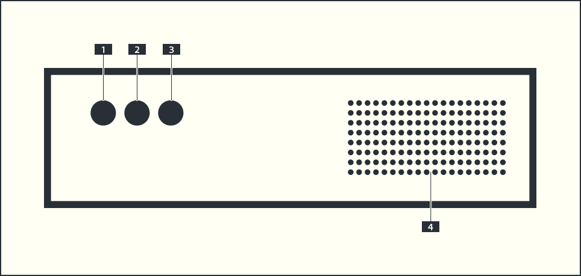

# A³ Core

- [A³ Core Repository](https://github.com/a3-audio/a3-core)
- A³ Core is a free configurable audio server
- Compatible to linux audiohardware (needed)
- VNC remote desktop control

### [1] POWER BUTTON
- Push to turn the device on

### [2] RESET BUTTON
- Push to reboot server (just in case)

### [3] POWER LED
- Indicates power status

### [4] Fan and Filter
- Clean it regular