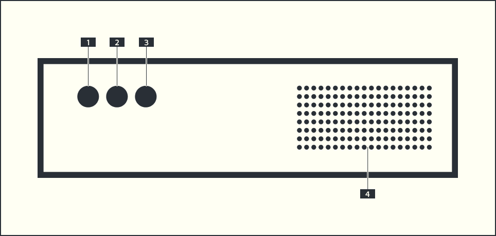

# A³ Core

- [A³ Core Repository](https://github.com/a3-audio/a3-core)
- A³ Core is a free configurable audio server
- Compatible to linux audiohardware (needed)
- VNC remote desktop control

## [1] POWER BUTTON
- Push to turn the device on

## [2] RESET BUTTON
- Push to reboot server (just in case)

## [3] POWER LED
- Indicates power status

## [4] Fan and Filter
- Clean it regular

## The window

A³ Core has no interface of its own — but it does have a window. Point a
browser at **`http://<core>:9080`** from anywhere on the same network and you
can see what the devices are actually saying to each other.

Along the top are the peers, each with a dot that says when it was last heard
from. Below that, one row per OSC address: how often it has gone past, how
fast, the last value, and which device it came from or went to.

This is the answer to *"is it the cable, the setting, or me?"*. OSC runs over
UDP, which has no way of reporting that nobody was listening — a control that
does nothing and a control that is not connected look exactly alike. In the
window they do not.

Two things worth knowing:

- The selector on the right switches between **Verkehr** (what has actually
  gone past) and **Register** (every address the system *can* speak, whether
  it has ever been used or not). Tick *nur tote Drähte* in the register view
  and you are looking at everything that exists and has never arrived.
- The list of addresses survives a restart of Core; the running values and the
  history do not. Nothing here changes anything — it is a window, not a
  control surface.
