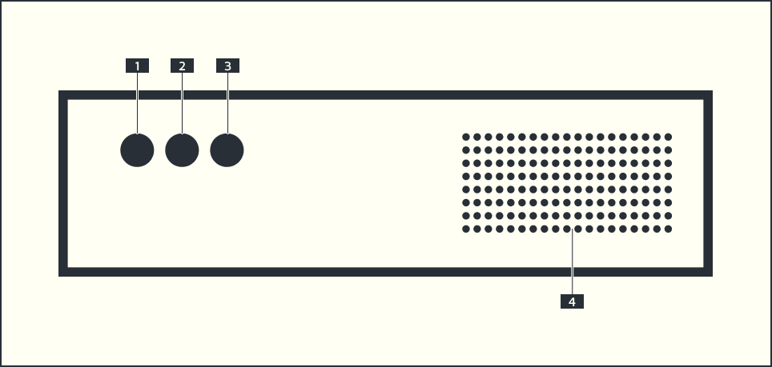

# A³ Core

Where the sound is: it takes the analog inputs, computes the 3D/ambisonics
field and sends it out, **with no interface of its own** — A³ Mixer, A³ Motion
and anything speaking the same OSC control it. It also runs the
[**Beat Analyzer**](beat-analyzer.md) (tempo and meters). Linux, remote
desktop over VNC. Source: [a3-core](https://github.com/a3-audio/a3-core).

## The front panel

Nothing here controls audio:

| № | Element | What it does |
| :--- | :--- | :--- |
| 1 | **POWER** | switches the device on |
| 2 | **RESET** | reboots the server, just in case |
| 3 | **POWER LED** | says whether it is on |
| 4 | **Fan and filter** | clean it regularly |

## Audio in and out

All of it: {doc}`Patchbay <../ressources/patchbay>`.

## Clock sources

The tempo comes from A³ Motion (**INT**), from the music (**EXT**) or from a
Pro DJ Link tempo master (**PIO**), chosen on A³ Motion's clock key. What each
mode needs: {ref}`Beat Analyzer › Clock modes <beat-analyzer-modes>`.

(core-workspaces)=

## The screen and its workspaces

The portrait touch screen (768 × 1024) shows one workspace at a time:

| Workspace | What is on it |
| :--- | :--- |
| **MOTION** (1) | [A³ Motion](a3motion.md)'s touch screen |
| **STEMDECK** (2) | [StemDeck](stemdeck.md), always running |
| **REAPER** (3) | the audio engine |
| **QJACKCTL** (4) | the JACK patching |
| **SCARLETT** (5) | the Scarlett interface's mixer, when it is open |

- **Between the touch apps**: the key at the far right of the top bar
  (STEMDECK in A³ Motion, MOTION in StemDeck), in the same spot in both. **▾**
  lists workspaces that have a window.
- **On REAPER, QJACKCTL, SCARLETT**: tap MOTION or STEMDECK in the bar at the
  top (hidden on the touch apps, which fill the screen).

## The window

**`http://<core>:9080`** from anywhere on the network shows what the devices
actually say to each other — the answer to *"cable, setting, or me?"*, since
over UDP a control nobody hears looks like one that works.

- **Top**: the peers, each with a last-heard dot; per device, *a3-osc.json is
  Core's* or, red, *DIFFERS from Core's* (an older truth;
  {ref}`what to do <osc-differs>` — desk, StemDeck and Motion fix themselves
  within seconds).
- **Rows**: one per address — count, rate, last value, device.
- **Verkehr / Register**: what went past, or every address that *can* exist;
  *nur tote Drähte* shows those that never arrived.
- The address list survives a Core restart; values and history don't. It
  only looks, it never controls.
