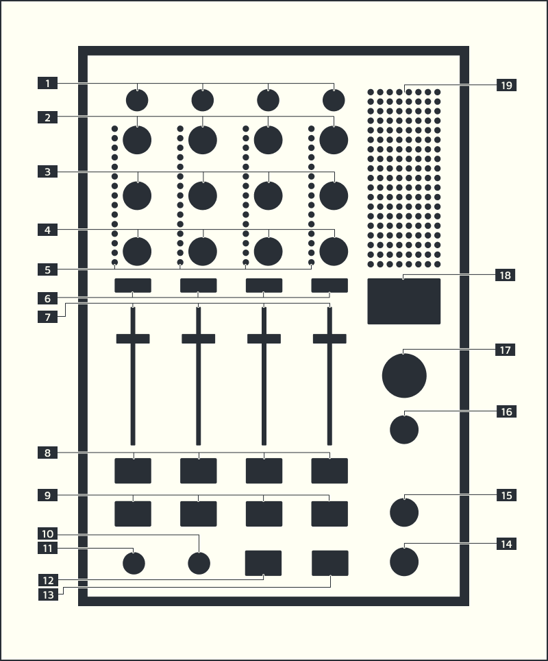

# A³ Mixer
## Features:
- Standalone OSC controller
- Input vu meter per channel
- 8 Output vu meters
- Tape-in section for multichannel or stereo to direct (discrete, decoder, stereomap) mixbus <- wip
## Prototype Pictures
- [A³ Mixer Assembly](https://a3-audio.github.io/a3-doc/assembly/mic.html)
## Part Name and functions

### [1] TRIM CONTROL
- Adjust the level of audio signals input in each channel
- [TRIM]: -inf dB to 0 dB

### [2] EQ HIGH
- [HIGH]: -inf dB to 0 dB (24 kHz)

### [3] EQ MID
- [MID]: -inf dB to 0 dB (1 kHz)

### [4] EQ LOW
- [LOW]: -inf dB to 0 dB (20 Hz)

### [5] INPUT VU METER
- Displays the sound level of the respective channels before passing through the channel faders

### [6] CUE BUTTON
- Presses the [CUE] button(s) for the channel(s) you want to monitor

### [7] CHANNEL FADER
- Adjust the level of audio signals output in each channel
- [FADER]: -inf dB to o dB

### [8] FILTER FX SWITCH
- Pressing the [FX] switch turns on the VCF filter for this channel
- The indicator lights if filter FX is on.

### [9]  3D SWITCH
- Pressing the [3D] switch enables 3d encoding for this channel
- The indicator lights if 3D is on

### [10] FILTER FREQUENCY
- Sets the cut off frequency of the VCF filter

### [11] FILTER RESONANCE CONTROL
- Change the "Q" or sharpness of the VCF filter

### [12] FILTER TYPE SELECT HI-PASS
- [HPF]: Allows signals above the cutoff frequency to pass

### [13] FILTER TYPE SELECT LOW-PASS
- [LPF]: Allows signals below the cutoff frequency to pass

### [14] HEADPHONE LEVEL
- Sets the level of the headphone output

### [15] CUE/MIX CONTROL
- Turn left (CUE) to hear the activated channel Cue.
- If no channel Cue is activated the Mix output will be heared WIP
- Turn right (Mix) to hear the Mix output
- In the centre position the Cue signal and the main mix are summed together

### [16] BOOTH OUTPUT LEVEL
- Sets the audio signal level for predefined monitor outputs
- [BOOTH]: -inf dB to 0 dB

### [17] MASTER OUTPUT LEVEL
- Sets the audio signal level for predefined public address outputs
- [MASTER]: -inf dB to 0 dB

### [18] DISPLAY <- wip
- shows bpm for master and per input channel

### [19] OUTPUT VU METER
- Displays the audio level output from 8 predefined channels

## Front
### PHONES OUTPUT TERMINAL
- Connect headphones here
- 6.3mm stereo phone plug

## Back
### PHONES INPUT TERMINAL
- Connect predefined Cue outputs here
-  2x female XLR Sockets

### ETHERNET SOCKET
- Connect ethernet cable to PoE switch here

## A³ Mix Specification
- PoE to USB 5V Adapter
- PoE cost 24W max
- Raspberry Pi 3 Model B
- Teensy 4.1
- A³ Mix PCB V0.2

## Network and PoE
- When a plan calls for multiple devices to be connected to one PoE/PoE+ switch, it’s necessary to ensure the total wattage required by the devices do not exceed the maximum wattage of the switch
- This device powers up as soon as the PoE powersupply is connected

## Box Contents
- A³ Motion
- Network cable
- Quickstart Guide
- Safety & Warranty Manual

## Misc
- Items not listed under Box Contents are sold separately
