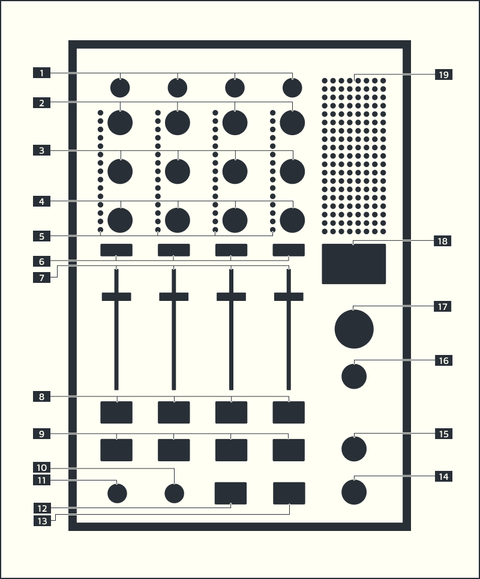

# A³ Mixer

- [A³ Mixer Repository](https://github.com/a3-audio/a3-system)
- Standalone OSC controller, four channels
- Input VU meter per channel, eight output VU meters

A³ Mixer is a DJ mixer that makes no sound: every control sends OSC to A³
Core, and Core does the audio. That is why the same values appear on A³
Motion's MIX page and move when you turn them here — there is one state and
every device is told all of it.



The numbers below refer to that picture.

## The channel strip

Four identical strips, top to bottom in the order a signal passes through
them.

| № | Control | What it does | Range |
| :--- | :--- | :--- | :--- |
| 0 | **FX SEND** | how much of this channel reaches the FX bus, where the delay that follows the beat sits | −inf … 0 dB |
| 1 | **TRIM** | the level of the signal coming in | −inf … 0 dB |
| 2 | **EQ HIGH** | high band | −inf … 0 dB (24 kHz) |
| 3 | **EQ MID** | middle band | −inf … 0 dB (1 kHz) |
| 4 | **EQ LOW** | low band | −inf … 0 dB (20 Hz) |
| 5 | **INPUT VU** | the level *before* the fader |  |
| 6 | **CUE** | sends this channel to the headphones |  |
| 7 | **FADER** | the level going out | −inf … 0 dB |
| 8 | **FX** | switches this channel's VCF filter on. Lit while it is on |  |
| 9 | **3D** | out of service — see below |  |

```{note}
Until 2026-09-12 this knob did something else entirely: it drove the **3D
blend** — how far the channel was spread into the room — because it was the
only continuous control the desk had for that. A³ Motion's per-channel pot
took that job over, and the knob got its own name back.

The price, named: the desk has no 3D control any more. The 3D blend is A³
Motion's pot, and only that.
```

```{warning}
**Out of service since 2026-09-12.** The switch is still on the panel and does
nothing: A³ Core's `3d` became a continuous blend, so a momentary key sending
into it would drive that blend to the stop for as long as it is held — the key
is therefore disconnected in software rather than left to do that. Core no
longer understands `/channel/[0-3]/4d` either.

3D per channel is set from A³ Motion, on its own pot, and it is a blend rather
than a switch. What this key should do instead has not been decided.
```

## The filter section

One filter, shared by all four channels; the **FX** key on a strip decides
which channels go through it.

| № | Control | What it does |
| :--- | :--- | :--- |
| 10 | **FREQUENCY** | the cutoff |
| 11 | **RESONANCE** | the Q, or sharpness, at the cutoff |
| 12 | **HPF** | high-pass: lets what is above the cutoff through |
| 13 | **LPF** | low-pass: lets what is below the cutoff through |

## Tempo

| № | Control | What it does |
| :--- | :--- | :--- |
| 13b | **TAP** | taps the tempo, the same as A³ Motion's TAP key |

It goes **straight to the beat-analyzer**, not through A³ Core: a tap is
timing, and timing does not want a relay in the middle. Until 2026-09-12 it
went to Core, which had never subscribed to it — the key worked, the message
left the desk, and nothing happened at the other end.

## Monitoring and outputs

| № | Control | What it does | Range |
| :--- | :--- | :--- | :--- |
| 14 | **HEADPHONE LEVEL** | the headphone output |  |
| 15 | **CUE/MIX** | left is cue only, right is the main mix, the centre sums both |  |
| 16 | **BOOTH** | the monitor outputs | −inf … 0 dB |
| 17 | **MASTER** | the public address outputs | −inf … 0 dB |
| 18 | **DISPLAY** | BPM for the master and per input channel — work in progress |  |
| 19 | **OUTPUT VU** | the level of the eight output channels |  |

## Connectors

| Where | Socket | For |
| :--- | :--- | :--- |
| Front | **PHONES OUT** | headphones, 6.3 mm stereo jack |
| Back | **PHONES IN** | the cue outputs coming back, 2× female XLR |
| Back | **ETHERNET** | the PoE switch — power and every message, on one cable |

## A³ Mix Specification

- PoE, 24 W max
- Raspberry Pi Pico with Ethernet (W5500-EVB-Pico-PoE) — see
  `hardware/mainboard/` in the repository
- A³ Mix PCB V0.3
