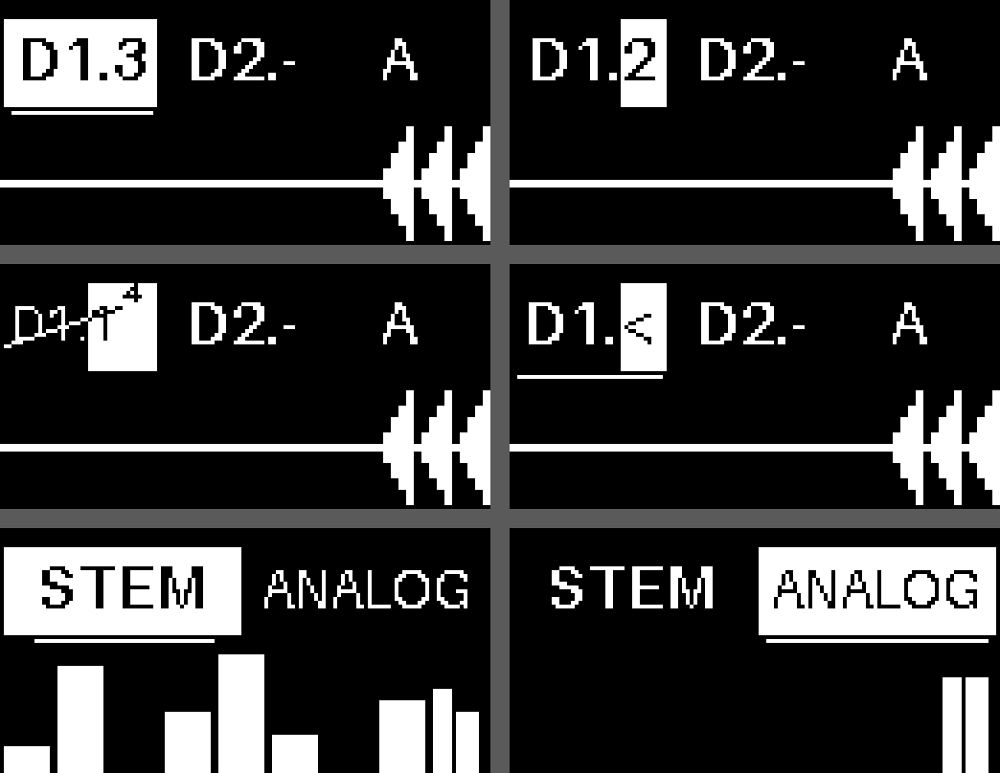

# A³ Mixer

- [A³ Mixer Repository](https://github.com/a3-audio/a3-system)
- Standalone OSC controller, four channels
- Input VU meter per channel, eight output VU meters

A³ Mixer is a DJ mixer that makes no sound: every control sends OSC to A³
Core, and Core does the audio. That is why the same values appear on A³
Motion's MIX page and move when you turn them here — there is one state and
every device is told all of it.


The numbers below refer to that picture. It is older than the V02 panel: FX
SEND and AUX RETURN are real knobs on the device but have no place in the drawing,
so they are listed without a number.

## The channel strip

Four identical strips, top to bottom in the order a signal passes through
them.

| № | Control | What it does | Range |
| :--- | :--- | :--- | :--- |
| – | **AUX SEND** | one per channel: how much of it goes to the tape delay on the FX bus, which follows the beat. Not in the picture | −inf … 0 dB |
| 1 | **TRIM** | the level of the signal coming in | −inf … 0 dB |
| 2 | **EQ HIGH** | high band | −inf … 0 dB (24 kHz) |
| 3 | **EQ MID** | middle band | −inf … 0 dB (1 kHz) |
| 4 | **EQ LOW** | low band | −inf … 0 dB (20 Hz) |
| 5 | **INPUT VU** | the level *before* the fader (`in1_pre` … `in4_pre` in the {ref}`meter map <core-vu-map>`) |  |
| 6 | **TAP** | taps the tempo — see *Tempo* below. All four strips' keys do the same, and their lamps flash red on the beat |  |
| 7 | **FADER** | the level going out | −inf … 0 dB |
| 8 | **FX** | switches this channel's VCF filter on. Lit green while it is on |  |
| 9 | **CUE** | puts this channel on the headphones: opens its cue send, taken before the fader (see *The cue* below). Lit blue while it is on |  |

```{note}
Until 2026-09-12 the AUX SEND knob did something else entirely: it drove the **3D
blend** — how far the channel was spread into the room — because it was the
only continuous control the desk had for that. A³ Motion's per-channel pot
took that job over, and the knob got its own name back.

The price, named: the desk has no 3D control any more. The 3D blend is A³
Motion's pot, and only that.
```

```{note}
**The keys were rearranged on 2026-09-19.** Key 9 used to be **3D**; on
2026-09-12 its job moved to A³ Motion's per-channel pot, where 3D is a blend
rather than a switch, and the key was left without one. It carries the cue
now, because its blue lamp is the bright one and a cue lamp has to be
readable in the dark. Key 6, where CUE used to be, has the dim red lamp and
carries the tap, which only flashes.
```

## The filter section

One filter, shared by all four channels; the **FX** key on a strip decides
which channels go through it.

| № | Control | What it does |
| :--- | :--- | :--- |
| 10 | **FREQUENCY** | the cutoff |
| 11 | **RESONANCE** | the Q, or sharpness, at the cutoff |
| 12 | **HPF** | high-pass: lets what is above the cutoff through |
| 13 | **LPF** | low-pass: lets what is below the cutoff through |

The section's lamp shows which mode is on: blue for HPF, green for LPF.

## Tempo

| № | Control | What it does |
| :--- | :--- | :--- |
| 6 | **TAP** | taps the tempo, the same as A³ Motion's TAP key — on the press, not the release |

It goes **straight to the beat-analyzer**, not through A³ Core: a tap is
timing, and timing does not want a relay in the middle. Until 2026-09-12 it
went to Core, which had never subscribed to it — the key worked, the message
left the desk, and nothing happened at the other end.

## Monitoring and outputs

| № | Control | What it does | Range |
| :--- | :--- | :--- | :--- |
| 14 | **HEADPHONE LEVEL** | the headphone output |  |
| 15 | **CUE/MIX** | the phones-mix knob: left is cue only, right is the mix, in between a crossfade at constant power (see *The cue* below) |  |
| 16 | **BOOTH** | the monitor outputs | −inf … 0 dB |
| 17 | **MASTER** | the public address outputs | −inf … 0 dB |
| – | **AUX RETURN** | the level of the aux return — the fifth stereo input beside the four channels, where an external effect comes back into the mix (the gain on REAPER's *Return* track). Not in the picture | 0 dB at full travel |
| 18 | **DISPLAY** | BPM for the master and per input channel — work in progress |  |
| 19 | **OUTPUT VU** | the level of eight main outputs: the sub and tops 1–7 (`main_sub`, `main_top1` … `main_top7`) |  |

(a3mix-cue)=

## The cue

The cue used to be called PFL (pre-fader listen); since 2026-10-01 it is the
cue everywhere, on the desk, on A³ Motion's key and on the wire
(`/channel/{ch}/cue`).

What the headphones hear is set in the REAPER project, in the sends of the
channel buses, not on separate tracks. Each channel bus sends to
`enc_phones` twice: send 3 is taken **before** the fader (the cue), send 4
**after** it (the mix). The **CUE/MIX** knob crossfades the two at constant
power, cue on the left, mix on the right. A deck's cue send opens only while
its cue key is on; the mix sends follow the knob alone.

A channel's cue is its **CUE** key on the desk, or the CUE key on A³ Motion,
and nothing else: the encoder push no longer touches it. **The cue plays what
comes in on the channel:**

- **With a stem on the channel**, Core switches that stem's **C** (CUE) switch
  in StemDeck and keeps the channel's own cue send (channel bus send 3) shut.
  The stem is heard once, dry, from StemDeck's CUE bus, before the fader.
  Push another stem onto the channel while it is cued and the C moves with it.
  The C switches are Core's: at every cue change, push or report from
  StemDeck, Core sets them from the cued channels, so a C clicked on
  StemDeck's own screen is switched back.
- **With A on the channel** it is the normal channel cue, and all of
  StemDeck's C switches are off.

The **return's cue send opens on the cue side while any deck cue is on**, so a
cued deck brings its FX along.

Two more things reach the headphones, on `dec_phones`:

- **StemDeck's own CUE bus.** Core keeps this send always open, on the cue
  side of the crossfade. What is on the bus is StemDeck's decision: a stem's CUE
  switch, or a deck's PHONES/CUE button on StemDeck, which puts the whole deck
  there before the fader. It is heard through StemDeck's headphone bus
  (REAPER inputs 23–24). That is how you pre-listen a stem that is on no
  channel.
- **The analog phones** (REAPER inputs 11–12) always go to `dec_phones`, with
  no switch.

(a3mix-displays)=

## The stem displays

The desk remote-controls [StemDeck](stemdeck.md) through A³ Core. StemDeck has
two decks with four stems each, eight stems in all. Each stem has six bus
switches in StemDeck: buses 1–4 (they feed the desk's channels 1–4), AUX
(the aux return) and CUE (StemDeck's headphone bus). **StemDeck owns these
switches**; Core only relays what the desk asks for and what StemDeck reports.

The desk has five small OLED displays: one for each channel 1–4 and one for
the aux return.



*Top left: a channel that plays deck 1's stem 3, the cursor on D1. Top right:
D1 being edited, the cursor behind the dot on 2 -- a push would load stem 2.
Middle left: `D1.1`, stem 1, which plays on channel 4 and is offered like any other stem (a push on it is refused). Middle right:
`<`, which leaves the channel as it is (still underlined: stem 3 plays on).
Bottom left: the return in STEM mode, with nine meters. Bottom right: the
return in ANALOG mode.*

**The rule.** A channel plays **one stem of each deck** -- a stem of D1, a stem
of D2, or one of each -- or its **analog input**, and a stem plays on **one
channel** at most. Core enforces it. Whatever the channel
does not play is silent: while a stem is on a channel, Core shuts the
channel's analog input.

### A channel's menu

A channel's menu is one row, **D1.3 · D2.- · A**, and it never leaves the
display: a deck's stem is edited in place, behind the dot.

- **Turn** moves the cursor over StemDeck's deck 1, deck 2 and the analog
  input. Each deck says which of its stems plays on this channel: `D1.3` is
  deck 1's stem 3, `D2.-` means nothing from deck 2.
- **Push on A** plays the analog input at once; the channel's stems leave.
- **Push on D1 or D2** moves the cursor behind that field's dot, onto the stem
  that plays (or stem 1 if none does). Nothing changes in the sound yet.
  **Turn** now steps through `1 2 3 4 <`, and the field shows the candidate:
  `D1.2`, `D1.<`.
  - **Push on a stem** loads it as the channel's stem **of that deck**,
    replacing that deck's stem there; the other deck's stem stays. The cursor
    jumps back onto the field.
  - **Push on the loaded stem** (the underlined one) takes it off the channel
    and jumps back.
  - A stem that **plays on another channel** looks like any other choice:
    the field is always `D1.` and one inverted character, with no mark for it.
    A push on it is **refused**: nothing is loaded, nothing leaves the other
    channel, and the cursor stays behind the dot. To move a stem here, take it
    off its channel first (push on the loaded stem there).
  - **Push on <** changes nothing and jumps back.

**The display.** The upper half is the menu: the cursor is inverted -- a whole
field, or only the part behind the dot while a stem is edited -- and what the
channel plays is underlined. The lower half is the **waveform** of
what the channel plays, as StemDeck draws it: a mirrored envelope along a
centre line, running right to left, the newest sound entering at the right edge
and about 13 seconds across. A channel shows its stem, or its own analog input
when it is on analog; with a stem of each deck, the louder of the two. A line
that stays flat is silence.

**One stem of each deck per channel, kept by Core.** If StemDeck shows several
stems of one deck on one channel (an old session can), Core keeps the lowest
and switches the others off, about 0.3 s after StemDeck's reports have settled.

### The aux return

The return's encoder has only **two options: STEM and ANALOG.** Turn chooses,
push switches to the one under the cursor.

- **STEM:** every stem that no channel plays goes to the return (StemDeck's
  **A** on that stem). A stem a channel loads leaves it, a stem a channel lets
  go returns to it. If you switch a free stem's **A** off in StemDeck, Core
  undoes it after about 0.3 s.
- **ANALOG:** no stem is on the return. The analog return plays as it is routed
  in REAPER.

The display shows **STEM** and **ANALOG** (the active one underlined, the
cursor inverted) and **nine meters**, with no waveform: the eight stems
(A1–A4, B1–B4) and one stereo meter for the analog return (aux L/R).

### The main VU meter

The LED meter on the desk shows the stems as well. Its **top module (rows
25–32) shows the eight stems**, one column each, A1–A4 then B1–B4. The main
meter (the sub and the seven tops) uses **rows 1–24**. This needs the new
Teensy firmware.

### Cue, and without StemDeck

- **No C field.** A channel's cue is its CUE key (see
  {ref}`the cue <a3mix-cue>`), unchanged.
- Core holds each channel's menu and the return's mode, keeps them across a
  restart and announces them. Without StemDeck, turning still moves the
  cursor, a push does nothing and every channel shows A.
- A fresh StemDeck starts with every stem on AUX only, so every channel plays
  **A** until you load a stem; a session saved earlier restores its own
  switches.

The desk shows what StemDeck reports, so a click on a bus switch on StemDeck's
own screen shows on the desk too.

StemDeck says hello to Core every 30 seconds. If it is silent for a minute,
Core shows **A** on every channel and the analog inputs play again; Core
notices at the next hello of any device, which the desk sends every 30 seconds,
so it can take up to about 90 seconds.

## Connectors

| Where | Socket | For |
| :--- | :--- | :--- |
| Front | **PHONES OUT** | headphones, 6.3 mm stereo jack |
| Back | **PHONES IN** | the cue outputs coming back, 2× female XLR |
| Back | **ETHERNET** | the PoE switch — power and every message, on one cable |

## Hardware

What the desk is made of, today and planned: {ref}`A³ Mixer hardware
<mic-hardware>`.
