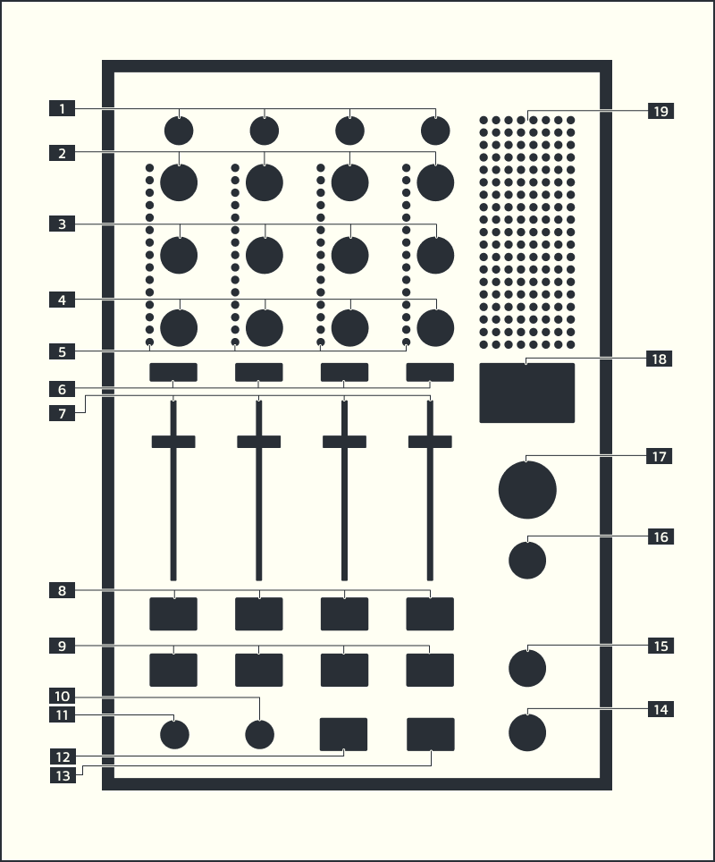

# A³ Mixer

- [A³ Mixer Repository](https://github.com/a3-audio/a3-system)
- Standalone OSC controller, four channels
- Input VU meter per channel, eight output VU meters

A³ Mixer is a DJ mixer that makes no sound: every control sends OSC to A³
Core, and Core does the audio. That is why the same values appear on A³
Motion's MIX page and move when you turn them here — there is one state and
every device is told all of it.



The numbers below refer to that picture. It is older than the V02 panel: FX
SEND and AUX RETURN are real knobs on the device but have no place in the drawing,
so they are listed without a number.

## The channel strip

Four identical strips, top to bottom in the order a signal passes through
them.

| № | Control | What it does | Range |
| :--- | :--- | :--- | :--- |
| – | **AUX SEND** | one per channel: how much of it goes to the tape delay on the FX bus, which follows the beat. Not in the picture | −inf … 0 dB |
| 1 | **TRIM** | the level of the signal coming in | −inf … 0 dB |
| 2 | **EQ HIGH** | high band | −inf … 0 dB (24 kHz) |
| 3 | **EQ MID** | middle band | −inf … 0 dB (1 kHz) |
| 4 | **EQ LOW** | low band | −inf … 0 dB (20 Hz) |
| 5 | **INPUT VU** | the level *before* the fader (`in1_pre` … `in4_pre` in the {ref}`meter map <core-vu-map>`) |  |
| 6 | **TAP** | taps the tempo — see *Tempo* below. All four strips' keys do the same, and their lamps flash red on the beat |  |
| 7 | **FADER** | the level going out | −inf … 0 dB |
| 8 | **FX** | switches this channel's VCF filter on. Lit green while it is on |  |
| 9 | **CUE** | puts this channel on the headphones: opens its cue send, taken before the fader (see *The cue* below). Lit blue while it is on |  |

```{note}
Until 2026-09-12 the AUX SEND knob did something else entirely: it drove the **3D
blend** — how far the channel was spread into the room — because it was the
only continuous control the desk had for that. A³ Motion's per-channel pot
took that job over, and the knob got its own name back.

The price, named: the desk has no 3D control any more. The 3D blend is A³
Motion's pot, and only that.
```

```{note}
**The keys were rearranged on 2026-09-19.** Key 9 used to be **3D**; on
2026-09-12 its job moved to A³ Motion's per-channel pot, where 3D is a blend
rather than a switch, and the key was left without one. It carries the cue
now, because its blue lamp is the bright one and a cue lamp has to be
readable in the dark. Key 6, where CUE used to be, has the dim red lamp and
carries the tap, which only flashes.
```

## The filter section

One filter, shared by all four channels; the **FX** key on a strip decides
which channels go through it.

| № | Control | What it does |
| :--- | :--- | :--- |
| 10 | **FREQUENCY** | the cutoff |
| 11 | **RESONANCE** | the Q, or sharpness, at the cutoff |
| 12 | **HPF** | high-pass: lets what is above the cutoff through |
| 13 | **LPF** | low-pass: lets what is below the cutoff through |

The section's lamp shows which mode is on: blue for HPF, green for LPF.

## Tempo

| № | Control | What it does |
| :--- | :--- | :--- |
| 6 | **TAP** | taps the tempo, the same as A³ Motion's TAP key — on the press, not the release |

It goes **straight to the beat-analyzer**, not through A³ Core: a tap is
timing, and timing does not want a relay in the middle. Until 2026-09-12 it
went to Core, which had never subscribed to it — the key worked, the message
left the desk, and nothing happened at the other end.

## Monitoring and outputs

| № | Control | What it does | Range |
| :--- | :--- | :--- | :--- |
| 14 | **HEADPHONE LEVEL** | the headphone output |  |
| 15 | **CUE/MIX** | the phones-mix knob: left is cue only, right is the mix, in between a crossfade at constant power (see *The cue* below) |  |
| 16 | **BOOTH** | the monitor outputs | −inf … 0 dB |
| 17 | **MASTER** | the public address outputs | −inf … 0 dB |
| – | **AUX RETURN** | the level of the aux return — the fifth stereo input beside the four channels, where an external effect comes back into the mix (the gain on REAPER's *Return* track). Not in the picture | 0 dB at full travel |
| 18 | **DISPLAY** | BPM for the master and per input channel — work in progress |  |
| 19 | **OUTPUT VU** | the level of eight main outputs: the sub and tops 1–7 (`main_sub`, `main_top1` … `main_top7`) |  |

(a3mix-cue)=

## The cue

The cue used to be called PFL (pre-fader listen); since 2026-10-01 it is the
cue everywhere, on the desk, on A³ Motion's key and on the wire
(`/channel/{ch}/cue`).

What the headphones hear is set in the REAPER project, in the sends of the
channel buses, not on separate tracks. Each channel bus sends to
`enc_phones` twice: send 3 is taken **before** the fader (the cue), send 4
**after** it (the mix). The **CUE/MIX** knob crossfades the two at constant
power, cue on the left, mix on the right. A deck's cue send opens only while
its cue key is on; the mix sends follow the knob alone.

A deck's cue puts that channel in the headphones, on the cue side. A stem that
is on that channel is in it automatically, because it comes through the
channel bus. The **return's cue send opens on the cue side while any deck cue
is on**, so a cued deck brings its FX along.

Two more things reach the headphones, on `dec_phones`:

- **StemDeck's own CUE switches.** A stem with its CUE switch on (set on
  StemDeck's screen) is heard on the cue side, through StemDeck's headphone bus
  (REAPER inputs 23–24). That is how you pre-listen a stem that is on no
  channel.
- **The analog phones** (REAPER inputs 11–12) always go to `dec_phones`, with
  no switch.

(a3mix-displays)=

## The stem displays

The desk remote-controls [StemDeck](stemdeck.md) through A³ Core. StemDeck has
two decks with four stems each, eight stems in all. Each stem has six bus
switches in StemDeck: buses 1–4 (they feed the desk's channels 1–4), AUX
(the aux return) and CUE (StemDeck's headphone bus). **StemDeck owns these
switches**; Core only relays what the desk asks for and what StemDeck reports.

Each channel has a stem display. It shows every stem StemDeck has on that
channel's bus — several can be lit if you set them so on StemDeck's screen — or
**A**, the analog input, when there is none. Above the **A**, in the top row's
fifth column, a **C** field shows that channel's cue, filled while it is on.

- **Turn a channel's encoder** to step through **A** and the stems that are on
  no other channel. A turn makes exactly one stem play on that channel; any
  other stem on that bus is switched off. A stem put on a channel loses its
  AUX; a stem that leaves a channel gets its AUX back, unless it is still on
  another channel.
- **A push on the channel's encoder** toggles the channel's cue.
- While a stem is on a channel, Core shuts the analog input of that channel:
  the channel plays the stem only. With no stem there, the analog input plays.
- The **aux-return display** lists the stems that are on no channel. Its
  encoder moves the cursor over them, and a **push** toggles AUX of the stem
  under the cursor, in StemDeck. The return has no C field.
- The desk shows what StemDeck reports, so a click on StemDeck's own screen
  shows on the desk too.

StemDeck says hello to Core every 30 seconds. If it is silent for a minute,
Core shows **A** on every channel and the analog inputs play again; Core
notices at the next hello of any device, which the desk sends every 30 seconds,
so it can take up to about 90 seconds.

## Connectors

| Where | Socket | For |
| :--- | :--- | :--- |
| Front | **PHONES OUT** | headphones, 6.3 mm stereo jack |
| Back | **PHONES IN** | the cue outputs coming back, 2× female XLR |
| Back | **ETHERNET** | the PoE switch — power and every message, on one cable |

## A³ Mix Specification

Shipping revision, V02:

- PoE, 24 W max
- Raspberry Pi 3B and Teensy 4.1
- A³ Mixer Mainboard PCB V02

**V03 is in development** and replaces that pair with a single Raspberry Pi
Pico with Ethernet (WIZnet W5500-EVB-Pico), plus USB-C, 45 mm faders and a
6.3 mm front jack. See
[Configuration](https://a3-audio.github.io/a3-doc/configuration/mic.html).
