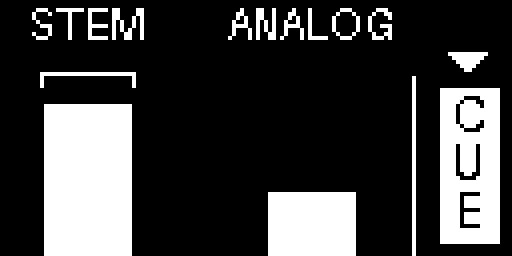

# A³ Mixer

- [A³ Mixer Repository](https://github.com/a3-audio/a3-mixer)
- Standalone OSC controller, four channels
- Input VU meter per channel, eight output VU meters

A³ Mixer is a DJ mixer that makes no sound: every control sends OSC to A³
Core, and Core does the audio. That is why the same values appear on A³
Motion's MIX page and move when you turn them here — there is one state and
every device is told all of it.

The numbers below refer to that picture. It is older than the V02 panel: FX
SEND and AUX RETURN are real knobs on the device but have no place in the drawing,
so they are listed without a number.

## The channel strip

Four identical strips, top to bottom in the order a signal passes through
them.

| № | Control | What it does | Range |
| :--- | :--- | :--- | :--- |
| – | **AUX SEND** | one per channel: how much of it goes to the tape delay on the FX bus, which follows the beat. Not in the picture | −inf … 0 dB |
| 1 | **TRIM** | the level of the signal coming in | −inf … 0 dB |
| 2 | **EQ HIGH** | high band | −inf … 0 dB (24 kHz) |
| 3 | **EQ MID** | middle band | −inf … 0 dB (1 kHz) |
| 4 | **EQ LOW** | low band | −inf … 0 dB (20 Hz) |
| 5 | **INPUT VU** | the level *before* the fader, 8 LEDs with fixed colours: four green, two yellow, two red at the top. The bar follows the peak; the LEDs light at −36, −24, −18, −12, −9, −6, −3 and 0 dBFS, so red means −3 dBFS and clipping. The louder side of the channel's stereo meter (`in1_pre_L`/`_R` … `in4_pre_L`/`_R` in the {ref}`meter table <osc-vu-meters>`) |  |
| 6 | **TAP** | taps the tempo — see *Tempo* below. All four strips' keys do the same, and their lamps flash red on the beat |  |
| 7 | **FADER** | the level going out | −inf … 0 dB |
| 8 | **FX** | switches this channel's VCF filter on. Lit green while it is on |  |
| 9 | **CUE** | puts this channel on the headphones: opens its cue send, taken before the fader (see *The cue* below). Lit blue while it is on |  |

The desk has no 3D control: how far a channel spreads into the room is A³
Motion's per-channel pot.

## The filter section

One filter, shared by all four channels; the **FX** key on a strip decides
which channels go through it.

| № | Control | What it does |
| :--- | :--- | :--- |
| 10 | **FREQUENCY** | the cutoff |
| 11 | **RESONANCE** | the Q, or sharpness, at the cutoff |
| 12 | **HPF** | high-pass: lets what is above the cutoff through |
| 13 | **LPF** | low-pass: lets what is below the cutoff through |

The section's lamp shows which mode is on: blue for HPF, green for LPF.

## Tempo

| № | Control | What it does |
| :--- | :--- | :--- |
| 6 | **TAP** | taps the tempo, the same as A³ Motion's TAP key — on the press, not the release |

It goes **straight to the beat-analyzer**, not through A³ Core: a tap is
timing, and timing does not want a relay in the middle.

## Monitoring and outputs

| № | Control | What it does | Range |
| :--- | :--- | :--- | :--- |
| 14 | **HEADPHONE LEVEL** | the headphone output |  |
| 15 | **CUE/MIX** | the phones-mix knob: left is cue only, right is the mix, in between a crossfade at constant power (see *The cue* below) |  |
| 16 | **BOOTH** | the monitor outputs | −inf … 0 dB |
| 17 | **MASTER** | the public address outputs | −inf … 0 dB |
| – | **AUX RETURN** | the level of the aux return — the fifth stereo input beside the four channels. It plays the analog inputs 11/12 or StemDeck's AUX bus, whichever the return's display selects (see {ref}`the aux return <a3mix-displays>`); the gain on REAPER's *Return* track. Not in the picture | 0 dB at full travel |
| 18 | **DISPLAY** | BPM for the master and per input channel — work in progress |  |
| 19 | **OUTPUT VU** | the level of eight main outputs: the sub and tops 1–7 (`main_sub`, `main_top1` … `main_top7`), one column each over all 32 rows of the LED matrix |  |

(a3mix-cue)=

## The cue

The cue is called cue everywhere — on the desk, on A³ Motion's key and on the
wire (`/channel/{ch}/cue`).

What the headphones hear is set in the REAPER project, in the sends of the
channel buses, not on separate tracks. Each channel bus sends to
`enc_phones` twice: send 3 is taken **before** the fader (the cue), send 4
**after** it (the mix). The **CUE/MIX** knob crossfades the two at constant
power, cue on the left, mix on the right. A deck's cue send opens only while
its cue key is on; the mix sends follow the knob alone.

A channel's cue is its **CUE** key on the desk, or the CUE key on A³ Motion,
and nothing else: the encoder push does not touch it. **The cue plays what
comes in on the channel:**

- It is always the channel's own cue send (channel bus send 3), whether the
  channel plays its analog input or a stem: you hear what the channel makes of
  it, with its filter and EQ, before the fader. Push another stem onto the
  channel while it is cued and the cue simply follows the channel.

**The return has a cue of its own**, the CUE field on its display (see
{ref}`the aux return <a3mix-displays>`). A channel's cue does not bring the
return along: it carries stems or the analog return, not a deck's effects. On
the mix side the return is always heard, like every channel.

Two more things reach the headphones:

- **StemDeck's own CUE bus**, through `enc_phones`. Core keeps this send always
  open, on the cue side of the crossfade. What is on the bus is StemDeck's decision: a stem's CUE
  switch, or a deck's PHONES/CUE button on StemDeck, which puts the whole deck
  there before the fader. It is heard through StemDeck's headphone bus
  (REAPER inputs 23–24). That is how you pre-listen a stem that is on no
  channel.
- **The analog phones** (REAPER inputs 11–12) always go to `dec_phones`, with
  no switch.

(a3mix-displays)=

## The input selectors

The desk remote-controls [StemDeck](stemdeck.md) through A³ Core. StemDeck has
two decks with four stems each, eight stems in all. Each stem has six bus
switches in StemDeck: buses 1–4 (they feed the desk's channels 1–4), AUX
(the aux return) and CUE (StemDeck's headphone bus). **StemDeck owns these
switches**; Core only relays what the desk asks for and what StemDeck reports.

The desk has five small OLED displays, each with an encoder: one for each
channel 1–4 and one for the aux return.

**The rule.** A channel plays **one input**: one stem, or its **analog
input**. A stem plays on **one channel** at most. Core enforces both. While a
stem is on a channel, Core shuts the channel's analog input.

### A channel

*Deck 1's stem 2 plays on the channel, so the bracket is over it. Music plays
on six stems; the arrow points at deck 1's stem 3, which is silent, so its
meter shows nothing. A shows a little level at the analog input. The short
ticks beside the bars mark −9 dBFS (where the channel LEDs turn yellow) and
−3 dBFS (red); the bars use the same scale as the LEDs.*

A channel's encoder is an input selector. Its display shows nine meters under
the headings **D1 | D2 | A**: deck 1's stems 1–4, deck 2's stems 1–4, and at
the right **A**, the channel's **analog input**. Thin vertical lines divide
D1, D2 and A.

The desk's **A** is the analog input. It is not StemDeck's **A** switch, which
puts a stem on the aux return.

- **Every stem meter** is a plain bar at its level. A silent stem shows
  nothing.
- **A's bar** is the level at the channel's analog input, always — also while
  a stem plays on the channel — so you see there is something on analog before
  you switch to it (the louder side of `analog<N>_L/R`, /vu 1-8).
- **The bracket**, a small "]" turned on its side over a meter, marks what
  plays on the channel: the stem that plays, or A while the analog input
  plays.
- **The cursor** is a small arrow pointing down, between the headings and
  the meters, over the selected meter. The meter under it looks the same as
  the others.

**Turn** moves the cursor over nine positions: the eight stems, then A. It
runs in a ring: one click left from the first stem is A, one click right
from A the first stem. Turning switches nothing.

**Push on a stem** makes it the channel's only input. The channel's other
stem leaves. If the stem plays on another channel, it moves here, and that
channel goes back to its analog input.

**Push on the stem that already plays** takes it off the channel: the channel
plays its analog input again. With the return in STEM mode, the stem goes to
the return. To bring it back, push it again.

**Push on A** selects the analog input:

- **While a stem plays**, the stem leaves the channel and the analog input
  plays. With the return in STEM mode, the stem goes to the return.
- **While the analog input already plays**, nothing happens.

Core does not remember which stem played: to get a stem back, turn to it and
push. After a push the cursor stays where it is.

**One stem per channel, kept by Core.** If StemDeck shows several stems on one
channel (an old session can), Core keeps the lowest and switches the others
off, about 0.3 s after StemDeck's reports have settled.

### The aux return

*Stem mode plays, so the bracket is over STEM, which is loud. ANALOG, the
analog return input, is quiet. The CUE field at the right is filled: the
return is cued. The arrow points at CUE. The ticks mark −9 and −3 dBFS.*

The return plays **one of two sources**, never both: **STEM**, StemDeck's AUX
bus, or **ANALOG**, the analog inputs 11/12. The mode chooses which; Core
opens that source's way into the return in REAPER and shuts the other.

The return's display shows **two meters**, one for each source, each under its
heading, and a **CUE field** at the right. Both meters show their input
whatever the return plays, so you see a source's level before you switch to it:

- **STEM** (left): StemDeck's AUX bus, the louder of its two sides. With an
  older StemDeck that does not send this meter, STEM shows the loudest stem on
  the return.
- **ANALOG** (middle): the analog inputs 11/12, the louder of the two
  (`aux_L`, `aux_R`).
- **CUE** (right, behind a thin line, where a channel shows A): the return's
  own cue. The field is filled while the return is cued, an outline while it
  is not.

The meters are plain bars, like the channels' meters. The **bracket** marks the
mode that plays. **Turn** moves the cursor, the same arrow as on a channel, in a
ring: STEM, ANALOG, CUE, then STEM again. **Push** does what the field under the
cursor says:

- **CUE:** switches the return's cue on or off. The mode stays as it is. While
  the cue is on, the return is in the headphones on the cue side of the
  phones-mix knob.
- **STEM, stem mode:** the return plays StemDeck's AUX bus; analog 11/12 is
  shut. Every stem that no channel plays goes to the return
  (StemDeck's **A** on that stem). A stem a channel takes leaves the return,
  a stem a channel lets go returns to it. If you switch a free stem's **A**
  off in StemDeck, Core undoes it after about 0.3 s.
- **ANALOG, analog mode:** the return plays the analog inputs 11/12; StemDeck's
  AUX is shut and no stem is on it.

### How the meters move

The meters update 10 times a second. They rise at once and fall smoothly,
20 dB a second, like a VU meter. There are no peak marks.

A meter that goes over full scale (above 0 dBFS) is drawn **hatched**, with
dark diagonal lines through the bar, and stays hatched for a second after the
last over. A clean bar at full scale stays solid, so you can tell the two apart.

### Without StemDeck

- Core holds each channel's cursor and the return's mode and cue, keeps
  them across a restart and announces them. A channel's cursor starts on A.
- **Without StemDeck**, turning still moves the cursor, a push switches
  nothing, and every channel plays its analog input.
- A fresh StemDeck starts with every stem on AUX only, so every channel plays
  its analog input until you push a stem; a session saved earlier restores
  its own switches.

Core follows what StemDeck reports, so a click on a bus switch on StemDeck's
own screen counts too: the bracket moves to the stem that plays.

StemDeck says hello to Core every 30 seconds. If it is silent for a minute,
Core takes every stem off the channels and the analog inputs play again; Core
notices at the next hello of any device, which the desk sends every 30 seconds,
so it can take up to about 90 seconds.

## Connectors

| Where | Socket | For |
| :--- | :--- | :--- |
| Front | **PHONES OUT** | headphones, 6.3 mm stereo jack |
| Back | **PHONES IN** | the cue outputs coming back, 2× female XLR |
| Back | **ETHERNET** | the PoE switch — power and every message, on one cable |

## Hardware

What the desk is made of, today and planned: {ref}`A³ Mixer hardware
<mic-hardware>`.
