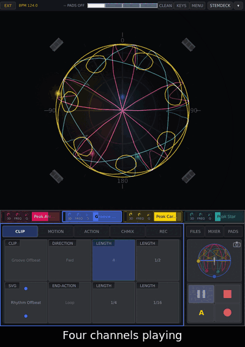
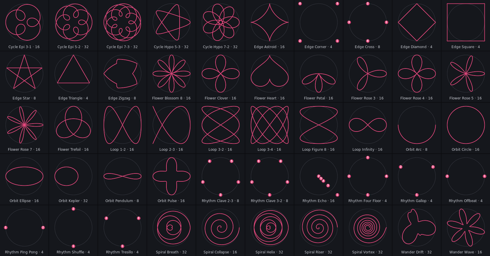
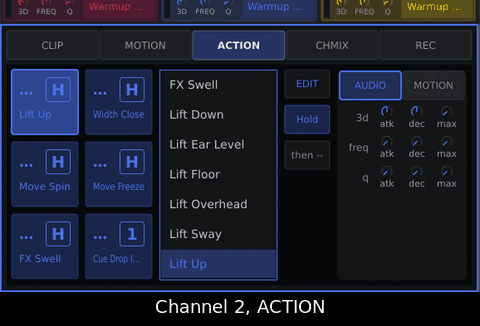

# Library and scripting

## Sets and moods

The library: **50 shapes, 70 clips, 71 actions, 14 sets**, along the arc of a
night. Names start with a prefix, so related files sort together in FILES:

| Kind | Prefix | Example |
| :--- | :--- | :--- |
| Sets | the phase | `Peak` |
| Clips | the phase | `Peak Anthem` |
| Actions | **Move**, **Lift**, **Width**, **Speed**, **Dub**, **FX**, **Cue** | `Lift Up` |
| Shapes | the family | `Flower Rose 5` |

Main arc: `Warmup · Groove · Build · Peak · Drop · Break · Dub · Deep · Float · Closing`.
Mood phases beside it: **Tribal** (after Groove), **Tension** (after Tribal),
**Acid** (after Break), **Ambient** (after Deep).

**Any action may move and change the sound at once** (3d, filter). Only A5 is
the dedicated FX and A6 the Cue. Read an unfamiliar action before pressing it
in front of a floor.

Mood quarters, named in the action tables (why: {ref}`How a movement feels <motion-how-it-feels>`):

| Quarter | Energy | Feel |
| :--- | :--- | :--- |
| **Q1** euphoric | up | open, bright |
| **Q2** driving | up | tense, dark |
| **Q3** deep | down | dark, heavy |
| **Q4** calm | down | open, soft |

### The fourteen sets

A set puts its phase's first four clips on channels 1–4 (names without the
phase: *Peak* channel 1 is `Peak Anthem`); the fifth is the **spare**. All four
channels carry the same six actions.

| Set | Clips (channels 1–4) | Spare | A1 / A2 | A3 / A4 | A5 (FX) | A6 (Cue) |
| :--- | :--- | :--- | :--- | :--- | :--- | :--- |
| Warmup | Halo, Breath, Sunrise, Horizon | Drift | Lift Up / Width Close | Move Spin / Move Freeze | FX Swell | Cue Groove Four Floor |
| Groove | Four Floor, Tresillo, Clave, Offbeat | Shuffle | Move Spin / Speed Half | Speed Double / Move Freeze | FX Punch | Cue Build Riser |
| Build | Riser, Pulse, Loop, Gallop | Vortex | Width Open / Width Close | Speed Double / Speed Half | FX Riser | Cue Peak Anthem |
| Peak | Anthem, Festival, Carousel, Star | Euphoria | Width Full / Lift Ear Level | Move Spin Fast / Move Unwind | FX Impact | Cue Drop Impact |
| Drop | Impact, Warehouse, Strobe, Whirlwind | Ping Pong | Speed Stutter / Speed Halt | Width Full / Width Point | FX Punch | Cue Break Standstill |
| Break | Standstill, Collapse, Monolith, Suspend | Heartbeat | Lift Overhead / Move Freeze | Width Open / Width Point | FX Sweep | Cue Build Pulse |
| Dub | Echo, Pendulum, Tunnel, Kepler | Skank | Dub Spring / Dub Stitch | Dub Bounce Back / Dub Echo Throw | FX Sweep | Cue Deep Undertow |
| Deep | Undertow, Sub, Fog, Lurk | Cellar | Lift Sway / Lift Floor | Move Rock / Lift Down | FX Resonate | Cue Float Aurora |
| Float | Aurora, Canopy, Blossom, Lullaby | Cloud | Lift Overhead / Width Breathe | Lift Sway / Move Unwind | FX Swell | Cue Closing Sunset |
| Closing | Sunset, Farewell, Tide, Ember | Still | Lift Up / Lift Down | Width Open / Speed Tape Stop | FX Swell | Cue Warmup Halo |
| Tribal | Gallop, Ping Pong, Clave, Zigzag | Echo | Move Stomp / Move Call | Width Drum Roll / Speed Double Gallop | FX Thunder | Cue Tension Siren |
| Tension | Siren, Vortex, Helix, Riser | Collapse | Move Siren / Lift Climb | Speed Accelerate / Width Tighten | FX Filter Rise | Cue Drop Impact |
| Acid | Loop, Infinity, Epicycle, Pulse | Hypocycle | Move Squeeze Sweep / Width Inhale | Move Phase Drift / Speed Double Twist | FX Resonance Climb | Cue Dub Echo |
| Ambient | Drift, Wave, Breath, Kepler | Ellipse | Lift Cloud / Move Wind | Width Fog / Speed Slow Tide | FX Rain | Cue Float Aurora |

**The buttons sit the same way in every set:**

| | left | right |
| :--- | :--- | :--- |
| A1 / A2 | gentle **more** | gentle **less** |
| A3 / A4 | strong **more** | strong **less** |
| A5 / A6 | **FX** (3d, filter) | **Cue** into the next phase |

*More*: towards energy and openness; *less*: towards calm and weight. Mood sets
use A1–A4 for gestures of their own mood. Each script's `Mood:` line says which.

<!-- GIF: howto-library-load-set.gif | region: 0,0,768,1024 | recorded 2026-10-01, quiet-indigo-2, --fuzz 0 (quantized before optimizing) | steps: With four channels playing, open FILES › SETS, tap Warmup, tap Load, close FILES: the set is loaded, stopped. | "Four channels playing" / "FILES › SETS" / "Tap Warmup: it only shows" / "Load: the set is on, all stopped" / "Close FILES, then ▶ when ready" | a shipped set loads stopped, so it ends with FILES closed and ▶ ready -->

### The four mood sets

| Set | Character | Sits after | A6 cues |
| :--- | :--- | :--- | :--- |
| **Tribal** | percussive, low, call and answer | Groove | Tension Siren |
| **Tension** | circling, rising, faster | Tribal or Build | Drop Impact |
| **Acid** | one figure turning slowly, resonant | Break | Dub Echo |
| **Ambient** | overhead, slow, wide | Deep | Float Aurora |

### Across a night

- **Main line:** Warmup → Groove → Build → Peak → Drop → Break → Build again.
- **Side road:** Dub → Deep → Float → Closing → Warmup.
- **Mood sets:** Tribal → Tension → Drop; Acid → Dub; Ambient → Float. Enter
  them by loading the set.
- **Onto the side road:** load Dub or Deep, or put a spare Cue on a button:
  **Cue Dub Echo** (dub escape) or **Cue Closing Still** (emergency calm).

**How a Cue plays:**

- It acts on **its own channel only**: walk the room into the next phase one
  channel at a time. For all four, load the next set.
- The clip loads and starts on the **next downbeat** (SHIFT + Cue: now) and
  **stays**: no accent, nothing comes back.
- Recording on that channel: nothing happens. Take unsaved:
  `-- SAVE THE TAKE FIRST`. Clip deleted or renamed: `-- NO SUCH CLIP`.
- A Cue can name any clip, your takes too ([Scripting actions](#motion-scripting)).

<!-- GIF: howto-library-cue.gif | region: full screen 0,0,768,1024 | steps: load set "Warmup"; play all; open PADS (730,700); tap ch1 A6 (724,255); wait for the downbeat, 3 s | "A6: the Cue into the next phase" / "Groove Four Floor on the downbeat" / "The clip stays" -->

<!-- GIF: howto-library-cue-shift.gif | region: pads 0,36,768,590 | steps: set "Warmup" playing; hold SHIFT; tap ch2 A6; release SHIFT | "SHIFT + Cue: at once" -->

### Shapes (50)

A shape is the path only; the clip adds speed, height and width. File names
start with the length in beats (`04_Rhythm_Four_Floor.svg` = one bar), shown in
brackets:

| Family | Shapes | Idea |
| :--- | :--- | :--- |
| **Rhythm** (9) | Four Floor (4), Offbeat (4), Tresillo (4), Ping Pong (4), Shuffle (4), Gallop (4), Clave 3-2 (8), Clave 2-3 (8), Echo (16) | positions that jump on the beat grid |
| **Orbit** (6) | Arc (8), Pendulum (8), Circle (16), Ellipse (16), Pulse (16), Kepler (32) | round the listener, or swinging |
| **Loop** (6) | Figure 8, Infinity, 1-2, 2-3, 3-2, 3-4 (all 16) | Lissajous loops: two tempos crossing |
| **Spiral** (5) | Collapse (16), Riser, Vortex, Helix, Breath (32) | out of the middle or into it |
| **Flower** (9) | Rose 3, Rose 4, Rose 5, Rose 7, Clover, Petal, Heart, Trefoil, Blossom 8 (all 16) | petals: smooth and open |
| **Cycle** (5) | Epi 3-1 (16), Epi 5-2, Epi 7-3, Hypo 5-3, Hypo 7-2 (32) | gears: loops inside a turn |
| **Edge** (8) | Square, Triangle, Diamond, Corner (4), Star, Zigzag, Cross (8), Astroid (16) | angular, tense |
| **Wander** (2) | Wave (16), Drift (32) | organic, no fixed shape |

Rhythm shapes are points: the sound jumps on the sixteenths of the rhythm.

| Shape | Rhythm |
| :--- | :--- |
| Four Floor | every beat: front, right, back, left |
| Offbeat | off-beat eighths, two points |
| Tresillo | 3+3+2 sixteenths |
| Clave 3-2, 2-3 | son clave over two bars |
| Ping Pong | left, right |
| Shuffle | swung eighths, two points |
| Gallop | x.xx every beat, three points |
| Echo | throws that halve, like delay repeats |

(motion-library-clips)=

### Clips (70), by phase

A clip is a shape plus speed, height, width, spin and accent. Five per phase:
four for the set, one spare. Each clip says what it is for in its own file
(`mood`); this table is written from the files.

<!-- a3-motion:clips -->
| Phase | Clip | Shape | Mood |
| --- | --- | --- | --- |
| **Warmup** | Halo | Orbit Circle | a slow halo overhead, gently breathing |
|  | Breath | Spiral Breath | one long breath above the room |
|  | Sunrise | Flower Rose 7 | a wide flower rising and sinking overhead |
|  | Horizon | Loop Infinity | a figure eight held level at ear height |
|  | Drift (spare) | Wander Drift | drifting high and open, no hurry |
| **Groove** | Four Floor | Rhythm Four Floor | a jump on every beat, at ear height |
|  | Tresillo | Rhythm Tresillo | jumps on 3+3+2, turning slowly |
|  | Clave | Rhythm Clave 3-2 | the 3-2 clave, jumps that answer |
|  | Offbeat | Rhythm Offbeat | jumps between the beats, wide |
|  | Shuffle (spare) | Rhythm Shuffle | a swung jump, turning |
| **Build** | Riser | Spiral Riser | a spiral climbing as it opens |
|  | Pulse | Orbit Pulse | a circle that swells faster and faster |
|  | Loop | Loop 3-4 | a fast loop, lifting |
|  | Gallop | Rhythm Gallop | galloping jumps that pick up pace |
|  | Vortex (spare) | Spiral Vortex | a wide vortex, the whole room turning |
| **Peak** | Anthem | Flower Rose 5 | a big flower overhead, swelling |
|  | Festival | Loop 2-3 | a fast loop over the crowd, swaying |
|  | Carousel | Cycle Epi 7-3 | a carousel turning high and fast |
|  | Star | Edge Star | a star thrown wide overhead |
|  | Euphoria (spare) | Flower Trefoil | a lifted trefoil, swelling on the bar |
| **Drop** | Impact | Edge Astroid | hard corners slamming round the room |
|  | Warehouse | Edge Square | a square that bounces back and forth |
|  | Strobe | Edge Corner | corner to corner, fast as a strobe |
|  | Whirlwind | Cycle Epi 3-1 | a whirlwind, the fastest turn there is |
|  | Ping Pong (spare) | Rhythm Ping Pong | left, right, left, wide on the beat |
| **Break** | Standstill | Orbit Arc | an arc that nearly stops, close |
|  | Collapse | Spiral Collapse | a spiral drawing in |
|  | Monolith | Edge Diamond | a small diamond, slow and heavy |
|  | Suspend | Loop Figure 8 | a slow figure eight hanging overhead |
|  | Heartbeat (spare) | Flower Heart | a heart shape beating close |
| **Dub** | Echo | Rhythm Echo | a throw and its echo, wide |
|  | Pendulum | Orbit Pendulum | a pendulum swinging near and far |
|  | Tunnel | Spiral Helix | a low helix, deep like a tunnel |
|  | Kepler | Orbit Kepler | an orbit slow far out, fast close in |
|  | Skank (spare) | Rhythm Offbeat | the offbeat, fading in and out of the room |
| **Deep** | Undertow | Spiral Collapse | a spiral pulling down and in |
|  | Sub | Orbit Circle | a small circle on the floor, shrinking |
|  | Fog | Wander Drift | low drifting, fading at the edges |
|  | Lurk | Wander Wave | a slow wave close to the floor |
|  | Cellar (spare) | Cycle Hypo 5-3 | a stretched cycle down low |
| **Float** | Aurora | Loop 1-2 | a loop overhead, breathing like light |
|  | Canopy | Cycle Hypo 7-2 | a canopy straight overhead, wide |
|  | Blossom | Flower Petal | petals opening above the room |
|  | Lullaby | Loop Figure 8 | a very slow figure eight overhead |
|  | Cloud (spare) | Flower Clover | a slow clover drifting high |
| **Closing** | Sunset | Flower Rose 4 | a flower sinking towards ear height |
|  | Farewell | Spiral Collapse | a slow spiral drawing in |
|  | Tide | Wander Wave | a wave coming in and going out |
|  | Ember | Orbit Ellipse | a small slow ellipse, low and warm |
|  | Still (spare) | Orbit Circle | a small circle at ear height, almost still |
| **Tribal** | Gallop | Rhythm Gallop | galloping jumps, low and turning |
|  | Ping Pong | Rhythm Ping Pong | left, right, turning against the beat |
|  | Clave | Rhythm Clave 2-3 | the 2-3 clave, swaying up and down |
|  | Zigzag | Edge Zigzag | a zigzag across the floor, beat by beat |
|  | Echo (spare) | Rhythm Echo | a call and its echo |
| **Tension** | Siren | Orbit Circle | a circle turning like a siren |
|  | Vortex | Spiral Vortex | a fast vortex, swaying down |
|  | Helix | Spiral Helix | a helix winding round the room |
|  | Riser | Spiral Riser | a spiral rising, swelling |
|  | Collapse (spare) | Spiral Collapse | a spiral closing in |
| **Acid** | Loop | Loop 3-4 | one loop, turning a little every lap |
|  | Infinity | Loop Infinity | a figure eight that keeps turning |
|  | Epicycle | Cycle Epi 3-1 | a slow epicycle, swelling on the bar |
|  | Pulse | Orbit Pulse | a tight circle, close and insistent |
|  | Hypocycle (spare) | Cycle Hypo 5-3 | a hypocycle tracing its rosette |
| **Ambient** | Drift | Wander Drift | a very slow drift high overhead |
|  | Wave | Wander Wave | a slow wave that swells wide |
|  | Breath | Spiral Breath | a slow breath, turning |
|  | Kepler | Orbit Kepler | an orbit near and far, unhurried |
|  | Ellipse (spare) | Orbit Ellipse | a calm ellipse round the room |
| **Space** | Anchor | Wander Drift | a small drift that stays near home |
|  | Orbit | Orbit Circle | a small circle just below ear height |
|  | Pendulum | Orbit Pendulum | a slow swing from side to side |
|  | Corners | Edge Square | a slow square, visiting each corner |
|  | Lift (spare) | Orbit Ellipse | an ellipse that sways up and down |
<!-- /a3-motion:clips -->

**Default** (no shape) is the fallback for a channel without a clip.

(motion-library-actions)=

### Actions (71)

**Hold**: acts while held. **1shot**: fires and lets go. FX actions always
change the sound; the others mostly move it.

**Move** — turns, direction, stillness:

| Action | Does | Mood | Mode |
| :--- | :--- | :--- | :--- |
| Move Spin | turns once every two bars | more, Q1 | Hold |
| Move Spin Fast | a turn every half bar | more, Q1 | Hold |
| Move Unwind | the turn runs the other way, slowly | less, Q4 | Hold |
| Move Reverse | runs backwards | less | Hold |
| Move Bounce | bounces at its ends from here on | more, Q1 | 1shot |
| Move Freeze | everything holds still at one height | less, Q3/Q4 | Hold |
| Move Tilt | leans forward and rocks | more, Q1/Q2 | Hold |
| Move Rock | swings up and down the room | more, Q1 | Hold |
| Move Mirror | turned half round and run backwards | less | Hold |
| Move Stomp | stamps round once a bar and leans to the floor | more, Q1 | Hold |
| Move Call | jumps to the opposite side and answers | dialogue | 1shot |
| Move Squeeze Sweep | is squeezed and the squeeze sweeps | hypnotic, Q2 | Hold |
| Move Phase Drift | slips a quarter turn and starts drifting, at most one turn in eight bars | hypnotic, Q2 | 1shot |
| Move Wind | a slow turn with a pull downwards | less, Q3 | Hold |
| Move Siren | circles once a bar, brighter as it goes | more, Q2 | Hold |

**Lift** — height:

| Action | Does | Mood | Mode |
| :--- | :--- | :--- | :--- |
| Lift Up | rises a third of the way to the ceiling | more, Q4 → Q1 | Hold |
| Lift Overhead | snaps to the cap above the listener | more, Q1 | 1shot |
| Lift Ear Level | a band at ear height: any clip becomes a ring | less, Q4 | Hold |
| Lift Down | sinks below ear height | less, Q3 | Hold |
| Lift Floor | the sound goes under the floor | less, Q3 | Hold |
| Lift Sway | the height sways on the bar | more, Q4 → Q1 | Hold |
| Lift Cloud | rises slowly into the ceiling and drifts there | less, Q3 | Hold |
| Lift Climb | climbs to the ceiling while held | more, Q2 | Hold |

**Width** — spread:

| Action | Does | Mood | Mode |
| :--- | :--- | :--- | :--- |
| Width Open | spreads half again as wide | more, Q1 | Hold |
| Width Full | thrown to the whole sphere | more, Q1/Q2 | 1shot |
| Width Close | halves its spread | less, Q3/Q4 | Hold |
| Width Point | everything pulls in to one point | less, Q2 | Hold |
| Width Breathe | the spread opens and closes slowly | less, Q4 | Hold |
| Width Squash | pressed flat, springs back when you let go | less, Q2/Q3 | Hold |
| Width Drum Roll | a fast squeeze sweep, front-back against left-right | more, Q1 | Hold |
| Width Inhale | the spread breathes out and in, the filter with it | hypnotic, Q2 | Hold |
| Width Fog | spreads wide and soft | less, Q3 | Hold |
| Width Tighten | narrows to a point and pulses | more, Q2 | Hold |

**Speed** — the tempo of the shape:

| Action | Does | Mood | Mode |
| :--- | :--- | :--- | :--- |
| Speed Double | plays twice as fast | more, Q1/Q2 | Hold |
| Speed Half | plays half as fast | less, Q4/Q3 | Hold |
| Speed Stutter | chatters at a sixteenth | more, Q2 | Hold |
| Speed Tape Stop | winds down and stands still | less, Q3 | 1shot |
| Speed Halt | everything that moves on its own stops, and the pass ends | less | 1shot |
| Speed Double Gallop | twice as fast, low and rolling | more, Q1 | Hold |
| Speed Double Twist | twice as fast and twisting | more, Q2 | Hold |
| Speed Slow Tide | half as fast, rising and falling like a tide | less, Q3 | Hold |
| Speed Accelerate | four times as fast and turning | more, Q2 | Hold |

**Dub** — the dub desk's moves, played in space instead of on the sound:

| Action | Does | Mood | Mode |
| :--- | :--- | :--- | :--- |
| Dub Echo Throw | the dub throw: reversed, bouncing, gliding out | less, Q3 | 1shot |
| Dub Bounce Back | a hard swing out and back | more, Q2 | 1shot |
| Dub Reverse Tape | backwards and slower, like a tape turned over | less, Q3 | Hold |
| Dub Spring | a spring-reverb shake: a fast swell, short | more, Q2 | 1shot |
| Dub Scatter | somewhere else every time it is put on a button | more | 1shot |
| Dub Stitch | the gaps in a take glide shut | less, Q4 | Hold |

**FX** — the dedicated sound actions:

| Action | Does | Mood | Mode |
| :--- | :--- | :--- | :--- |
| FX Punch | depth hits, nothing moves | more, Q2 | 1shot |
| FX Sweep | the filter opens over two bars, nothing moves | more | Hold |
| FX Resonate | the resonance creeps up | more, Q3 → Q2 | Hold |
| FX Riser | four bars of build: spread, spin, filter | more, Q2 → Q1 | Hold |
| FX Impact | the drop: everything at once, then a long fall | more, Q2 → Q1 | 1shot |
| FX Swell | depth and filter rise together, gently | more, Q4 → Q1 | Hold |
| FX Thunder | the 3d hits full and the filter goes low and dark | more, Q1 | Hold |
| FX Resonance Climb | the acid line opens: resonance high, cutoff climbing | more, Q2 | Hold |
| FX Rain | a soft wash: some 3d, the cutoff low, a long tail | less, Q3 | Hold |
| FX Filter Rise | the filter opens all the way, slowly, resonance high | more, Q2 | Hold |

**Cue** — loads a clip, starts it on the next downbeat:

| Action | Loads | On A6 of |
| :--- | :--- | :--- |
| Cue Groove Four Floor | Groove Four Floor | Warmup |
| Cue Build Riser | Build Riser | Groove |
| Cue Peak Anthem | Peak Anthem | Build |
| Cue Drop Impact | Drop Impact | Peak |
| Cue Break Standstill | Break Standstill | Drop |
| Cue Build Pulse | Build Pulse | Break |
| Cue Deep Undertow | Deep Undertow | Dub |
| Cue Float Aurora | Float Aurora | Deep |
| Cue Closing Sunset | Closing Sunset | Float |
| Cue Warmup Halo | Warmup Halo | Closing |
| Cue Dub Echo | Dub Echo | — the dub escape |
| Cue Closing Still | Closing Still | — the emergency calm |
| Cue Tension Siren | Tension Siren | Tribal |

**README** in the ACTIONS list is the scripting manual, not an action.

<!-- GIF: howto-library-assign-cue.gif | region: 0,672,578,352 | recorded 2026-09-29, 7.5 s | steps: On channel 2's ACTION page tap A6, then tap Cue Dub Echo in the list: A6 carries it. | "Channel 2, ACTION" / "Tap A6: the list shows its script" / "Tap Cue Dub Echo: A6 carries it" | A6 set to Cue Drop Impact beforehand, so Cue Dub Echo sits right below it without scrolling -->

(motion-under-the-hood)=

## Under the hood

(motion-scripting)=

### Scripting actions

The FILES editor edits sets and clips (JSON), shapes (SVG) and actions
(scripts). **README** in ACTIONS is the language manual.

- **ACTION writes one line per control** (`~spin = 3;`, `~envelopeMax = 0.5;`,
  `~then = 3;`); comments and other lines stay. A commented line is switched
  on, a missing one added, `rrand` becomes the turned number. Two taps comment
  it out again.
- The editor follows the knob, even while you type.
- Written about 0.3 s after the hand stops, and before a load, save, rename or
  delete.
- **A Cue** is one line, `~clip = "Peak Anthem";`. Save as, change the name,
  Save.
- Shipped scripts carry a `Mood:` line and a reason.

(motion-system)=

### A³ Motion and the rest of the system

All OSC; messages in the [OSC reference](../ressources/osc.md). Hosts, ports
and addresses come from `a3-osc.json` ([another Core](#motion-howto-network)).

| What | How |
| :--- | :--- |
| positions | azimuth and elevation to Core while a blob moves; asked back at [start-up](#motion-start-up) |
| 3d | crossfades the channel between its stereo and multichannel encoder in Core; freq and Q are its filter |
| CHMIX, MIXER | the A³ Mixer's messages; Core relays what REAPER reports |
| meters, lightning | levels from Core: four channels, sub, four speakers |
| clock | INT sends `/beat`; EXT follows the analyser's `/beat`; taps send `/tap` always |
| SHIFT + action | plays with messages to Core held back |

### The squeeze, in numbers

`sqzX` (front–back) and `sqzY` (left–right) are bipolar around 0 and multiply
their axis by 2^value. The squeeze comes before the turn, so it spins with the
shape.

### The panel's electronics

A microcontroller, on USB to the UI computer:
{ref}`A³ Motion hardware <moc-hardware>`.
