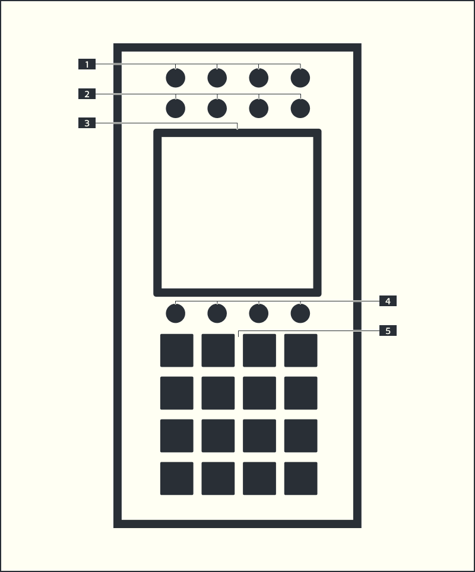

# A³ Motion

- [A³ Motion Repository](https://github.com/a3-audio/a3-motion)
- Standalone OSC controller
- 7" full-color capacitive multi-touch display

## [1] STEREO WIDTH SEPARATION
- Adjust Stereo Width separation of the two audio input channels. The current state will be displayed on top of touchdisplay (0° : 90°)

## [2] Ambisonic order
- lets you set the spatial resolution of your sound scene.

## [3] DISPLAY
- This full-color multi-touch display shows information relevant to A³Motion’s current operation. Touch the display (and use the hardware controls) to control the A3Motion interface. See Operating Instrucions to learn how to use some basic functions

The screen has three bands. Along the top sits the status bar: the current tempo
on the left, the beat grid in the middle — it fills as the bar runs — and the
clock source on the right.

The middle band is the room seen from above. Each channel is a coloured blob;
drag one and its sound moves with it. The four dark shapes at the corners are
the speakers, lit by what they are actually playing, and the field around the
sphere shows where the energy in the room is coming from.

The bottom band holds the settings of the selected clip, framed in that
channel's colour: its shape, how it is mapped in elevation, how it moves in
time — speed, direction, what happens at the end, and the fade that closes the
loop — and its filter. The narrow strip on the right is global rather than
per-channel and carries the recording mode.

## The tabs along the bottom

The row of tabs picks what the bottom band shows. `CLIP` is the one described
above; the others are:

| Tab | What it is |
| :--- | :--- |
| REC | recording settings |
| ACTION | what a pad does besides play |
| PADS | the pads, reachable without the hardware |
| MIX | a full channel strip — see below |
| FILES | sets: saving and loading |

### MIX

A software mixer for the four channels, sending the same messages the A³
Mixer sends. Anything you turn here, the desk sees too — and the other way
round.

Per channel: **GAIN**, the three EQ bands **HIGH / MID / LOW**, **VOL**, and
**SEND** — how much of that channel goes to the FX bus, where the delay that
follows the beat sits. Below them the **PFL** and **FX** buttons. A second
page holds the master, booth and headphone levels and the one filter shared by
all four channels.

**Double tap takes SEND back to zero.** It is the one control on the page you
may want to get rid of in a single gesture, mid-transition, without looking.
Nothing else on the MIX page responds to a double tap: a gain that snaps to a
default in the middle of a set is a channel that jumps in the room.

On the narrow strip to the right — `3d`, `freq` and `Q` per channel — a double
tap works too: `3d` and `freq` go back to twelve o'clock, `Q` goes back to
closed.

## When the device comes up

A³ Motion asks A³ Core where each sound already is, and adopts the answer
before it says anything itself. So switching the device on, or restarting it
mid-evening, does not move the room: the blobs appear where the sound
actually is, and the pots stand where they stood.

Loading a **set** is the other way round — that is an explicit act, and the
set wins.

## [4] Speed Encoder
- Use these encoder to adjust length of trackpattern (bars)

## [5] MOTION SAMPLE PADS
- Each channel has a column of four iluminated sample pads. See Operaton to use basic functions

## [6] Record Button
+ Hold the Rec-Button and one of the 4 pads (per channel) to start record. Record runs from next Beat for one Bar setup by Speed Encoder. 

## [7] Tempo Tap Button
* Current Tempo is indicated by top indicator on the Display

## [8] Set One Button
* Set Tempo Clock Counter to first beat

## Operating Instructions
- Set looplength with Function Encoder [4]
- Press and hold down one pad [5] to record motion from touchscreen 
	- The pad will flash green / red to indicate record mode
	- Tap on the screen and hold to grab channel soundsource
	- Release the pad and move the soundsource on touchscreen until record length is reached. Longer motion will overwrite previously recorded data
	- Release the touchscreen to end record
	- The pad will stay green to indicate play mode
- Pads without stored motion are dark
- Pads with stored motion are white
- Press white buttons to switch motion on the next beat (related to 120bpm)
- Width [2] and Reverb [3] will not be recorded

## Specs
- PoE to USB 5V Adapter
- PoE cost 31.5W max
- Raspberry Pi 3 Model B
- Teensy 4.1
- A³ Buttonmatrix PCB v0.1
- A³ Motion PCB V0.1