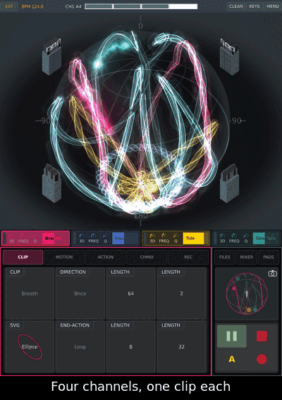
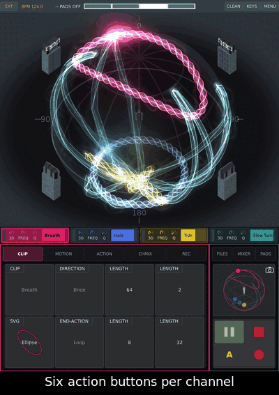
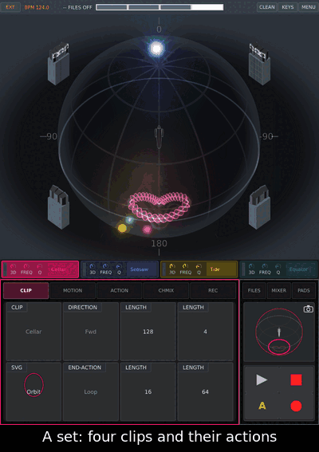

# A³ Motion

- [A³ Motion Repository](https://github.com/a3-audio/a3-motion)
- Standalone OSC controller
- 7" full-color capacitive multi-touch display

A³ Motion records and plays back **movement trajectories**: where each of the
four channels sits in the room, and how it travels through it. It makes no
sound of its own — it sends positions to A³ Core over OSC, and Core moves the
sound. A clip is one figure together with every value it is played with. Each
channel holds **one clip** and **six action buttons**, and a set is which clip
and which six actions each channel has.

Playback follows a beat clock, so a figure that takes four bars keeps taking
four bars when the tempo changes.

<!-- The screenshots and GIFs on this page are to be (re)made in the skin
quiet-indigo-2. The recording plan is kept outside this repository. -->

## Reference: the screen

### Find a window

Every window has a key with its name on it. This table says where the key is.

| Window | What it is for | How you get there | How you get back |
| :--- | :--- | :--- | :--- |
| **Main screen** | the room, the four channels, the shown clip | always there | — |
| **CLIP** | which clip, which figure, direction, end, lengths | tab in the bar | another tab |
| **MOTION** | how the figure moves and where it sits in height | tab in the bar | another tab |
| **ACTION** | the six action buttons of the shown channel | tab in the bar | another tab |
| **CHMIX** | the shown channel's mixer strip | tab in the bar | another tab |
| **REC** | setting up and making a take | tab in the bar, or ● | another tab |
| **FILES** | sets, clips, shapes and actions on disk | FILES key, top of the global strip | FILES again, any tab, or MENU |
| **MIXER** | all four mixer strips and the master | MIXER key, top of the global strip | MIXER again, any tab, or MENU |
| **PADS** | the panel's pads on screen | PADS key, top of the global strip | PADS again, any tab, or MENU |
| **Menu** | skins, network, LEDs, folders | MENU, right end of the status bar | MENU (one level back), or ✕ |
| **Keyboard** | typing names and values | KEYS, status bar; opens by itself when you type a name | KEYS again |

### Opening and closing, in one place

| Window | Opens with | Closes with |
| :--- | :--- | :--- |
| FILES, MIXER, PADS | their key in the global strip | the same key; another of the three swaps it; any tab; MENU; PAGE on the panel |
| the menu and its pages | MENU | back or MENU (one level), ✕ (all levels) |
| a list of values, a typing mask, the colour picker | double tap or Enter on a row | back, MENU or Escape (without keeping); Enter, a tap on a value or **done** (keeping) |
| the keyboard | KEYS, or typing a name | KEYS |

Only one of FILES, MIXER and PADS is open at a time. Closing FILES ends a
rename without keeping it and puts an armed Delete back to sleep; text typed
in the editor stays, marked unsaved.

### The main screen

Top to bottom:

1. the **status bar** — clock, tempo, what was last done, the beat, CLEAN, KEYS, MENU;
2. the **sphere** — the room seen from above;
3. the **channel row** — one field per channel;
4. the **bar** — five tabs and the page they open, on the left three quarters;
5. the **global strip** — FILES, MIXER, PADS, the elevation picture and the
   transport, on the right quarter.

FILES, MIXER, PADS and the menu open **over the sphere**. The channel row, the
bar and the global strip stay in view under them.

#### Status bar

| Part | What it does |
| :--- | :--- |
| **clock key** (INT / EXT / PIO) | tap to step INT → EXT → PIO. Written in the mode's colour. See Clock modes |
| **BPM** | the tempo, in the clock's colour. Read only |
| **readout** | what was last done, e.g. `-- REC ARMED`, `-- FILES ON`, `CH2 ACTION` |
| **beat display** | four cells, one per beat, filling as the bar runs. **Tap it to tap the tempo** — in INT it sets the tempo; in every mode it sends `/tap` |
| **CLEAN** | switches to the clean skin — thin lines, plain blobs, effects off — and back to the skin you had. Greyed out when the device has no clean skin |
| **KEYS** | shows or hides the on-screen keyboard |
| **MENU** | opens the menu; see The menu |

<!-- GIF: howto-statusbar-clock.gif | region: status bar 0,0,768,36 | steps: tap clock key x3 (INT→EXT→PIO→INT), 1.5 s apart | "Tap the clock key" / "INT, EXT, PIO: whose tempo" -->

<!-- GIF: howto-statusbar-tap.gif | region: status bar 0,0,768,36 | steps: clock on INT; tap the beat display 8x at ~120 BPM | "Tap the beat display" / "In INT it sets the tempo" -->

<!-- GIF: howto-statusbar-clean.gif | region: status bar and sphere 0,0,768,626 | steps: tap CLEAN, wait 3 s, tap CLEAN | "CLEAN: lines and blobs only" / "Tap again for your skin" -->

<!-- GIF: howto-statusbar-keys.gif | region: full screen 0,0,768,1024 | steps: tap KEYS, wait 2 s, tap KEYS | "KEYS shows the keyboard" / "KEYS again hides it" -->

#### The sphere

The room seen from straight above, with you — the listener — in the middle at
ear height. Each channel is a coloured blob sitting where its sound is; it
swells and throws sparks with that channel's input level. A playing clip draws
its trajectory as a braid of plasma with the blob travelling inside it. What
runs behind the sphere is drawn darker than what runs in front of it.

At the four corners stand the speakers, each a tower of tops over subs.
Lightning comes out of the tops towards the middle: thicker, and more of it,
on the speaker that is playing loudest, and none at all when the room is
silent. The subs throw ball lightning with the bass.

| Gesture | What it does |
| :--- | :--- |
| drag a blob | moves that channel's sound. The blob jumps under the finger. A playing clip keeps running and takes the blob back when you let go |
| several fingers | each takes its own blob |
| during a take | the first finger writes the take, wherever it lands — see REC |

**Camera mode** turns the view instead. Tap the **elevation picture** in the
global strip (the small sphere with the camera mark) to switch it on or off;
its field lights while it is on.

| Gesture, in camera mode | What it does |
| :--- | :--- |
| drag up / down | leans the view from straight above down to the horizon |
| drag left / right | walks the view round the room |
| pinch with two fingers, or the mouse wheel | zooms |
| double tap | back to straight above, unzoomed |

In camera mode no finger takes a blob. The view is kept over a restart.

<!-- GIF: howto-sphere-drag-blob.gif | region: sphere 0,36,768,590 | steps: clips stopped; drag channel 1's blob from its spot in an arc to the opposite side, 2 s, release | "Drag a blob" / "The sound goes where it goes" -->

<!-- GIF: howto-sphere-camera-mode.gif | region: full screen 0,0,768,1024 | steps: tap elevation picture (671,800); drag on sphere (384,300)→(384,450); drag (250,330)→(520,330); double tap (384,330); tap elevation picture | "Tap the small sphere: camera" / "Drag to lean and turn the view" / "Double tap: straight above again" -->

<!-- GIF: howto-sphere-zoom.gif | region: sphere 0,36,768,590 | steps: camera mode on; mouse wheel up 5 notches (xdotool click 4), then down 5 (click 5); double tap | "Camera mode: pinch to zoom" / "Double tap resets the zoom" -->

#### The channel row

Between the sphere and the bar: one field per channel, in its colour. Left to
right in each field:

| Part | What it does |
| :--- | :--- |
| meter | the channel's input level. Read only |
| **3D**, **FREQ**, **Q** | the channel's 3d, filter frequency and filter resonance. Drag to turn |
| progress bar | fills from the left as the clip runs; the **clip's name** stands in it |

A **tap on a field selects that channel**: the bar and the global strip then
describe its clip. Reaching for one of its knobs selects it too. The selected
field is filled and framed thicker.

A **double tap** on 3D or FREQ puts it back to twelve o'clock, on Q back to
closed — but only on a device without the panel attached; on the panel the
knob's own position decides.

<!-- GIF: howto-channelrow-select.gif | region: channel row and bar 0,626,768,398 | steps: tap face 2 (285,648), 1.5 s; tap face 3 (475,648), 1.5 s; tap face 1 (95,648) | "Tap a channel" / "The bar shows its clip" -->

<!-- GIF: howto-channelrow-pots.gif | region: channel row 0,610,768,80 | steps: drag FREQ of ch1 (63,641) up 60 px, down 30 px; drag 3D of ch2 (222,641) up 40 px | "Drag 3D, FREQ or Q" / "The channel is selected too" -->

#### The bar

Five tabs, left to right: **CLIP MOTION ACTION CHMIX REC**. A tab shows its
page in the bar; the lit tab is the page you are on. All five describe the
clip of the **selected channel**, framed in its colour. A tab also closes
FILES, MIXER or PADS if one of them is open.

A **double tap on a knob** in the bar puts it back to its rest: most knobs to
the middle, the sweeps and spin to off, `elv` to the middle of what the clips
leave. On a knob that plays a recorded lane, the double tap clears the lane
instead (see REC). Fields that step on a tap have no rest.

<!-- GIF: howto-bar-tabs.gif | region: bar 0,672,578,352 | steps: tap MOTION (175,700), ACTION (287,700), CHMIX (400,700), REC (512,700), CLIP (62,700), 1.2 s each | "Five tabs, one clip" / "CLIP MOTION ACTION CHMIX REC" -->

#### The global strip

The right quarter of the bar, the same on every page.

| Part | What it does |
| :--- | :--- |
| **FILES**, **MIXER**, **PADS** | each lays its window over the sphere; tap again to take it away. Only one at a time: another key swaps it |
| elevation picture | a small sphere from the side with the channels' positions. Tap it for camera mode |
| **▶ / ❚❚** | the shown clip's Play\|Pause: starts or pauses on the **next downbeat**, and blinks while it waits. Shows ❚❚ while the clip runs |
| **■** | stops the shown clip **now**, and flashes. During a take it ends the take |
| **A** | fires the shown channel's **chosen action button** (see ACTION) for as long as you hold it |
| **●** | arms a take on the shown clip and opens REC; see REC |

After a take, **●** turns into **SAVE** (a tick) and **A** into **DISCARD** (a
cross) until you decide.

<!-- GIF: howto-transport-play-pause.gif | region: channel row and global strip 578,626,190,398 (or bar 0,626,768,398) | steps: tap ▶ (630,915), wait for the downbeat, 3 s; tap ❚❚ (630,915), wait 3 s | "▶ starts on the next downbeat" / "It blinks while it waits" / "❚❚ pauses on the downbeat" | re-record: replaces howto-play-pause.gif -->

<!-- GIF: howto-transport-stop.gif | region: bar 0,626,768,398 | steps: clip playing; tap ■ (712,915) | "■ stops now" / "Next start is from the top" -->

<!-- GIF: howto-transport-act.gif | region: full screen 0,0,768,1024 | steps: clip playing; hold A (630,978) 2 s; release | "Hold A: the chosen action" / "Let go: the clip comes back" -->

### CLIP

The clip of the selected channel. Eight fields, four by two, the same way the
encoders stand.

| Field | What it does |
| :--- | :--- |
| **CLIP** | which clip — the preset of values — is loaded. **Drag it with a thumb** to step through the clips. A warning-coloured **drift dot** says the values have been turned since it was loaded and something is waiting to be written. `--` is a figure with no clip behind it |
| **SVG** | the figure the sound traces, with its name. **Drag it** to step through the shapes; **swapping the figure keeps the values** |
| **DIRECTION** | tap to step **Fwd → Rev → Bnce → Rnd**: forwards, backwards, there and back, or from a random point each lap |
| **END-ACTION** | tap to step **Loop → Stop → Paus**: what happens when the travel is over |
| **LENGTH** × 4 | how long one pass takes, in beats. **Tap** a key to play at that length. **Drag** a key to give it another length, out of the whole range, applied straight away. The key keeps it |

The clip field and the picture are two separate lists on purpose: one scroller
over both could quietly apply somebody's preset while you were choosing a shape.

**A length key is a ratio to the recording**, and names what it gives this
clip: the same key reads 4 on a four-beat take and 8 on an eight-beat one. The
lit key is the one the clip plays at. The four keys belong to the device and
are saved in the set.

**Stop and Paus are two different things.** Stop returns to the beginning of
the take, whichever way it was running, so the next start is visibly a start.
Paus stands still wherever the playhead landed. Any direction goes with any end.

<!-- GIF: howto-clip-choose-clip.gif | region: bar 0,672,578,352 | steps: drag CLIP field (81,800) up 40 px in 3 steps, pause 1 s each | "Drag CLIP: another preset" / "The figure's values change" -->

<!-- GIF: howto-clip-choose-shape.gif | region: sphere and bar 0,36,768,988 | steps: clip playing; drag SVG field (81,945) up 40 px in 3 steps | "Drag SVG: another figure" / "The values stay" -->

<!-- GIF: howto-clip-direction.gif | region: sphere and bar 0,36,768,988 | steps: clip playing; tap DIRECTION (218,800) x3, 2 s apart | "Tap DIRECTION" / "Fwd, Rev, Bnce, Rnd" -->

<!-- GIF: howto-clip-end-action.gif | region: bar 0,672,578,352 | steps: tap END-ACTION (218,945) x3, 1.5 s apart | "Tap END-ACTION" / "Loop, Stop, Paus" -->

<!-- GIF: howto-clip-length-tap.gif | region: sphere and bar 0,36,768,988 | steps: clip playing; tap LENGTH (356,800), 3 s; tap LENGTH (494,945), 3 s | "Tap a LENGTH" / "The clip plays at it now" -->

<!-- GIF: howto-clip-length-drag.gif | region: bar 0,672,578,352 | steps: drag LENGTH (494,800) up 36 px (3 steps), release | "Drag a LENGTH key" / "The key keeps the new length" -->

### MOTION

What is done to the figure while it plays, and where it sits in height. Eight
fields, four by two; each holds **two knobs**: on the left the movement, on the
right the standing value it moves.

| Field | Left knob (the movement) | Right knob (the standing value) |
| :--- | :--- | :--- |
| **ROTATION** | `spin` — keeps turning the figure, signed for direction | `rot` — turns the whole figure around the vertical axis |
| **REACH** | `swell` — sweeps the reach out and back | `reach` — how far down the sphere the figure's outer edge lands |
| **SQUEEZE X** | `strX` — sweeps the squeeze | `sqzX` — squeezes front-to-back |
| **SQUEEZE Y** | `strY` — sweeps the squeeze | `sqzY` — squeezes left-to-right |
| **ELEVATION** | `sway` — sweeps the base up and down | `elv` — the **base**: the height the figure is centred on |
| **ELEVATION CLIP** | `clip-top` — a ceiling | `clip-bot` — a floor |
| **TILT** | `tswp` — sweeps the tilt | `tilt` — leans the figure's plane forward or back |
| **ROLL** | `rswp` — sweeps the roll | `roll` — leans the figure's plane to the side |

Drag a knob to turn it. Everything that moves on its own is counted in **bars
off the tempo clock**, never in seconds, so a cycle comes back to where it
started on a bar line. A knob that is being moved shows the movement as a
**blue arc**; its pointer stays where your hand left it.

**How the figure sits on the sphere.** The recorded figure is a flat disc,
wrapped over the room as a cap centred on the base (`elv`). A point pushed past
`clip-top` or `clip-bot` keeps its bearing and gives up only its height, so a
figure reaching into the ceiling travels *around* it.

**`rot` is a closed ring**, the only one: a rotation comes round to itself.
**A spin that is not running turns nothing** — turned off, it stands still at
whatever angle it stopped at.

The squeezes are bipolar with their middle at zero and multiply their axis by
2^value — half at one end, double at the other. **The squeeze happens before
the turn**, so the ellipse belongs to the figure and travels with it.

<!-- GIF: howto-motion-knob.gif | region: sphere and bar 0,36,768,988 | steps: MOTION tab; drag rot (right knob of ROTATION) up 60 px; double tap it | "Drag a knob: the figure turns" / "Double tap: back to rest" -->

<!-- GIF: howto-motion-sweep.gif | region: sphere and bar 0,36,768,988 | steps: drag spin (left knob of ROTATION) up 2 steps; wait 4 s; double tap spin | "The left knob moves it" / "The blue arc shows where" / "Double tap: sweep off" -->

<!-- GIF: howto-motion-elevation.gif | region: sphere and bar 0,36,768,988 | steps: drag elv (right knob of ELEVATION) down 40 px; drag clip-top (left knob of ELEVATION CLIP) up 30 px | "elv: how high it sits" / "clip-top: a ceiling" -->

<!-- GIF: howto-motion-tilt-roll.gif | region: sphere and bar 0,36,768,988 | steps: camera mode on, lean view 45°; drag tilt up 40 px; drag roll up 40 px; double tap both | "tilt and roll lean the plane" / "Double tap: flat again" -->

### ACTION

Each channel has **six action buttons**, A1 to A6, on the panel and on this
page. An action is a short script that changes the clip for as long as its
accent lasts: it throws the figure wide, lifts it overhead, pulls it under the
floor, stops it. When the accent has fallen, the clip is itself again.

Left to right:

| Part | What it does |
| :--- | :--- |
| **A1–A6** | three rows of two, as the pads stand on the panel. Each shows its number, the name of its action and a badge, **1** (one-shot) or **H** (Hold). **A tap chooses the button** — everything right of it then shows and edits that one. It does not fire: the pads fire, on the panel and on the PADS page |
| the list | the action scripts. A tap puts that script on the chosen button; **no action** at the top clears it |
| **EDIT** | opens the chosen button's script in FILES › ACTIONS |
| **Hold** / **1shot** | the chosen button's mode: fire and let go, or hold the clip for as long as the finger is down. Tap to switch |
| **then** | what fires when this button's accent is over: another button of the channel (`then A3`), or nothing (`then --`). A tap steps it, two taps clear it |
| **AUDIO \| MOTION** | two tabs on top of the card. **AUDIO**: the accent — `atk`, `dec` and `max` for **3d**, for **freq** and for **q**. **MOTION**: what the button puts on the clip — every knob of the MOTION page and CLIP's speed, direction and end |

A field is in the channel's colour when it carries an action and grey when it
does not; the chosen one has the thick outline; and a field turns **white while
its action runs** — the same as its pad. A button with nothing on it does
nothing at all. The global strip's **A** fires the chosen button. **Pressing an
action pad** — on the panel or on the PADS page — fires it and brings up this
page with that button chosen; not with SHIFT, and not while a take is armed or
recording.

**The accent** rises while an action button is held, stays up as long as it is
held, and falls when you let go — `atk` is how long it takes to rise, `dec` how
long to fall, in bars. The hold is the finger, which is why there is no sustain
control. The **3d** row raises the channel's 3d from where you set it towards
`max`: the knob in the channel row shows the floor you set, and the arc from
there to where the accent has taken it is filled in. The **freq** and **q**
rows do the same for the filter's cutoff and resonance; a `max` of 0 switches
that row off. When the decay runs out, the clip does what its END-ACTION says —
and only on that edge, once.

<!-- TODO (maintainer): do the freq and q accents only ever raise the filter, like the 3d one, or can they lower it? The code says only "0 is off". -->

**The MOTION tab** shows each value as it will land. **Grey**: the script
leaves it to the clip — the clip's own value is shown as a hint. **In the
channel's colour**: the script sets it.

**What you set here is written into the script** — what you see is what you
get. Every knob, the mode, **then** and every MOTION value changes exactly one
line of the chosen button's script (`~spin = 3;`, `~envelopeMax = 0.5;`,
`~then = 3;`); your comments and every other line stay as you wrote them. A
line that was commented out is switched on, a missing one is added, a random
value (`rrand`) becomes the number you turned to. **Two taps** on a MOTION
value, or on **then**, comment the line out again: back to the clip's own value,
or nothing after.

- **In place, for everyone.** The script file itself changes — a shipped one
  too. Every button on every channel that carries the same script plays the
  change, and so does every set that names it. To keep the original, make a
  copy first: EDIT, then **Save as** in FILES.
- **The editor follows.** If FILES shows the same script, its text changes
  with the knob — also while you are typing in it; what you typed stays.
- **Written when the hand stops**, about a third of a second after the last
  turn, and before a set is loaded or FILES saves, renames or deletes.
- **The set only names the scripts.** What a button does is in its script.
  Sets saved before 2026-09-29 load without the values that were turned per
  button then, and without their **then** chains.

A script is worked out at the moment you press, against the clip as it is then:
an action that halves the reach halves the reach the clip has *now*. The dice
in a random action are thrown when it is put on the button and kept, so every
press lands in the same place — put it on again to throw again.

**Then — chains.** When a button's accent is over, the button its **then**
names fires, as a one-shot (no finger holds it). Chains may loop; another
action press, Play|Pause or Stop on the channel ends one.

**Two actions at once:** the last one pressed wins, and when it has fallen the
clip is back to itself, not to the first action.

**On the panel** the four upper encoders stand under the page's columns:

| Encoder | Turn | Press |
| :--- | :--- | :--- |
| 1 | chooses A1–A6 | – |
| 2 | walks a highlight through the list — the button does not change yet | puts the highlighted script on the chosen button |
| 3 | moves a ring over EDIT, the mode and **then** | does what a tap on the ringed key does |
| 4 | switches AUDIO ↔ MOTION | the same |
| 5–8 | turn the marked row of the card, left to right (AUDIO: atk, dec, max) | mark the next row |

The ring and the row's outline appear once the encoder has been used. With
SHIFT every encoder is its channel's freq or Q, as on every page.

<!-- GIF: howto-action-fire.gif | region: full screen 0,0,768,1024 | steps: clip playing; open PADS; hold the channel's A1 pad 2 s; ACTION comes up with A1 chosen | "Press the A1 pad: the action fires" / "ACTION shows it, the field turns white" / "Let go: the clip comes back" | re-record since 2026-09-28: the fields only choose, the pads fire; replaces howto-fire-an-action.gif -->

<!-- GIF: howto-action-writes-script.gif | region: full screen 0,0,768,1024 | steps: tap A1; tap MOTION tab; turn spin; tap EDIT; the ~spin line shows the value | "Turn a value" / "EDIT: the script says the same" -->

<!-- GIF: howto-action-then.gif | region: bar 0,672,578,352 | steps: tap A1; tap then (370,858) x3 | "then: what fires next" / "A1 then A3" -->

<!-- GIF: howto-action-assign.gif | region: bar 0,672,578,352 | steps: tap A2 (124,760); tap list row 3 (225,831); tap A2 again | "Choose a button" / "Tap a script in the list" / "The button carries it" | re-record: replaces howto-assign-an-action.gif -->

<!-- GIF: howto-action-clear.gif | region: bar 0,672,578,352 | steps: tap A5 (48,950); scroll list to top; tap "no action" | "Tap 'no action'" / "The button is empty" -->

<!-- GIF: howto-action-mode.gif | region: bar 0,672,578,352 | steps: tap A3 (48,855); tap mode (370,815) x2 | "Tap the mode" / "1shot or Hold, and the badge" -->

<!-- GIF: howto-action-audio.gif | region: channel row and bar 0,626,768,398 | steps: tap A1; drag 3d max (530,785) up 40 px; hold A1 1.5 s | "max: how far the 3d rises" / "Watch the 3D knob's arc" -->

<!-- GIF: howto-action-edit.gif | region: full screen 0,0,768,1024 | steps: tap A1; tap EDIT (320,750); wait 2 s; tap FILES (612,700) | "EDIT opens the script" / "in FILES › ACTIONS" -->

### CHMIX

The shown channel's strip of the mixer, in the bar — the same controls as that
channel's strip in MIXER, laid out four by two like the encoders.

| Control | What it does |
| :--- | :--- |
| **GAIN** | input gain. Double tap: full |
| **HIGH**, **MID**, **LOW** | the three EQ bands. Double tap: flat |
| **SEND** | how much of the channel goes to the FX bus, where the delay that follows the beat sits. Double tap: none |
| **PFL** | the channel on the headphones (cue). Tap to switch |
| **FX** | puts the channel through the shared filter (FX FREQ, FX RES, FX MODE in MIXER). Tap to switch |
| meter, on the right | the channel's level, and its **VOL fader**: the handle is the volume. Drag anywhere on the meter to move it, one to one from where it stood. Double tap: full volume |

Everything here goes out as the same messages the A³ Mixer sends, and shows
what is actually set rather than what this device last did — see MIXER.

<!-- GIF: howto-chmix-knobs.gif | region: bar 0,672,578,352 | steps: CHMIX tab (400,700); drag HIGH up 30 px; double tap HIGH; drag SEND up 40 px; double tap SEND | "Drag to turn" / "Double tap: EQ flat, SEND off" -->

<!-- GIF: howto-chmix-pfl-fx.gif | region: bar 0,672,578,352 | steps: tap PFL; tap FX; tap both again | "PFL and FX switch on a tap" -->

<!-- GIF: howto-chmix-volume.gif | region: bar 0,672,578,352 | steps: drag the meter from its middle down 60 px, back up 30 px | "The meter is the VOL fader" / "Drag it anywhere" -->

### REC

Making a take: a new recording of a figure, on the shown channel's clip.

| Field | What it does |
| :--- | :--- |
| **CLIP**, **SVG** | as on CLIP |
| **RECMODE** | tap to step **Touch → Latch → Write**; see below |
| **LENGTH** × 4 | as on CLIP. **The lit key is how long the take will be** |
| **GAP-CONNECTOR** | two knobs: `fade` — how long the take's closing move lasts, which closes the join where the take meets itself; `bias` — where a gap the take never wrote leads |

**Making a take, on the screen:**

1. Select the channel in the channel row.
2. Tap **●**. The take is **armed**: REC opens, ● and ▶ light, and the clip
   keeps playing. **■** or **●** again takes the arming back.
3. Choose the length, the rec mode, fade and bias.
4. Tap **▶**. The take starts on the **next downbeat**.
5. Drag on the sphere — the first finger down writes the position, wherever it
   lands. The trajectory appears as you play it in. Turn MOTION knobs and they
   are recorded too (below).
6. Tap **●** (or **■**) to end the take.
7. **SAVE** (where ● was) writes it — the shape, and a clip with every value it
   has now. **DISCARD** (where A was) asks twice and puts back what the channel
   held before.

A take waits, playing and marked unsaved, until you choose. It is dropped only
when something replaces it: a new take, a shape or set loaded, a restart.

**On the panel:** hold **REC** and press a channel's **Play\|Pause** pad — the
take starts at once, without arming. REC pressed while a take runs ends it.
REC pressed alone otherwise does nothing.

**Recording runs round and round inside the take's length**, so what a pass
writes, it writes over the pass before it. The **rec mode** says how much of
an old take a pass destroys, and it carries that on its own colour:

| Mode | What it destroys |
| :--- | :--- |
| **Touch** | mends the corner you touch and leaves the rest |
| **Latch** | holds on after the finger goes: the rest of that pass is written with the position your finger left, and the figure that was there is gone |
| **Write** | clears the pass whether you touched it or not |

**Latch is not the mode for drawing a figure**: lift your finger half way
through and the second half of the take becomes the one place you left it.
Draw in **Touch** and the take keeps what you drew. A take is always the **last
pass you finished**: stop half way through one and that half is dropped.

**Knobs are recorded too.** During a take, a MOTION knob you turn is written
into a **lane** by the same rec mode, drawn in red while it writes. On
playback the lane turns the knob; a hand on the knob wins while it holds. A
double tap on a knob with a lane clears that lane and leaves the others.

<!-- GIF: howto-rec-arm.gif | region: bar 0,672,768,352 | steps: CLIP tab; tap ● (712,978); 2 s; tap ■ (712,915) | "● arms the take" / "REC opens, the clip plays on" / "■ takes it back" -->

<!-- GIF: howto-rec-setup.gif | region: bar 0,672,578,352 | steps: on REC: tap RECMODE (218,800) x2; tap LENGTH (356,800); drag fade (left half of GAP-CONNECTOR) up 20 px | "Set the rec mode" / "The lit LENGTH is the take" -->

<!-- GIF: howto-rec-take.gif | region: full screen 0,0,768,1024 | steps: tap ● (712,978); tap ▶ (630,915); after the downbeat drag a circle on the sphere for one pass; tap ● | "● then ▶: on the downbeat" / "Draw on the sphere" / "● ends the take" -->

<!-- GIF: howto-rec-save.gif | region: bar 0,672,768,352 | steps: after a take: tap SAVE (712,978) | "SAVE keeps the take" -->

<!-- GIF: howto-rec-discard.gif | region: bar 0,672,768,352 | steps: after a take: tap DISCARD (630,978); tap it again | "DISCARD asks twice" / "The old clip comes back" -->

<!-- GIF: howto-rec-knob-lane.gif | region: sphere and bar 0,36,768,988 | steps: MOTION tab; arm and start a take; drag rot up and down for one pass; end take; wait one pass; double tap rot | "Knobs turned in a take" / "play back as a lane" / "Double tap clears the lane" -->

### FILES

The library: what is on disk. Tap **FILES** in the global strip; it lies over
the sphere until you tap FILES again, a tab, or MENU.

On the left, top to bottom: the four tabs **SETS**, **CLIPS**, **SVG** and
**ACTIONS**, two by two; **from set** / **from clip**; the filter; the list;
then the keys. On the right, the **editor** with the chosen file as text.

| Tab | What the list holds |
| :--- | :--- |
| **SETS** | which clip and which six actions each channel has, plus the channels' 3d/freq/Q and the length keys |
| **CLIPS** | clips: a figure with every value it is played with |
| **SVG** | the shapes — figures only |
| **ACTIONS** | the action scripts |

**A tap on a row only shows it** in the editor. Nothing on the device changes.
Drag the list to scroll it. When FILES opens, the list points at what the
shown channel holds; on CLIPS that clip's row carries the drift dot when its
values have been turned.

| Key | What it does |
| :--- | :--- |
| **Load** | puts the chosen row on the device: a set on all four channels, a clip or a shape on the shown channel, an action on the chosen action button |
| filter: **All** / **User** / **System** | tap to narrow the list to your own files or the shipped ones. It says what it shows now |
| **Rename** | opens the row for typing, with the keyboard. **Keep** (the same key) or Enter settles it; Escape or leaving drops it. A name already taken is refused. Renaming a clip carries it across every set that names it |
| **Delete** | says **Sure?**; the second press deletes. Anything else you do puts it back to sleep |
| **from set** / **from clip** | writes what is on the device now into the editor as text, unsaved — to be kept with Save as |
| **Cancel** | puts the file's own text back |
| **Save** | writes the editor's text over the file, and every channel using a clip, shape or action takes it up at once. A set is only written; loading it stays Load's |
| **Save as** | writes a copy into your own files, named after the original ("Lift Up 2") |

The editor edits every kind of file: sets and clips as JSON, shapes as SVG,
actions as scripts. **Unsaved text holds the list and the tabs**: a row tap,
Rename, Delete or another tab says `-- SAVE OR CANCEL` and flashes the two
keys. A set or a shape that would not load again cannot be saved; a script with
an error can, and the error stands under the editor. **Shipped files cannot be
written over** — Save stays dark on them; Save as is the way out (see Developer
Mode in the menu).

**Deleting deliberately does less.** A set's file goes and what is loaded stays
loaded; a clip's files go and the sets that named it are left alone. Everything
playing goes on playing.

Loading a **set** stops what was running; what the set says was running starts
again, from the top, on the next **downbeat**.

<!-- GIF: howto-files-open-close.gif | region: full screen 0,0,768,1024 | steps: tap FILES (612,700); 2 s; tap FILES (612,700) | "FILES lies over the sphere" / "Tap FILES again to close" -->

<!-- GIF: howto-files-tabs.gif | region: files 0,36,768,590 | steps: tap SETS (34,59), CLIPS (95,59), SVG (34,100), ACTIONS (95,100), 1.2 s each; drag list up 100 px | "Four tabs, four lists" / "Drag the list to scroll" -->

<!-- GIF: howto-files-load-set.gif | region: full screen 0,0,768,1024 | steps: tap SETS; tap row "Warmup"; tap Load (106,560); wait for the downbeat | "Tap a set: it is only shown" / "Load puts it on the device" / "It starts on the downbeat" | re-record: replaces howto-load-a-set.gif -->

<!-- GIF: howto-files-load-clip.gif | region: full screen 0,0,768,1024 | steps: tap face 2; tap CLIPS; tap a row; tap Load | "Choose the channel first" / "Load puts the clip on it" -->

<!-- GIF: howto-files-load-shape.gif | region: full screen 0,0,768,1024 | steps: tap SVG; tap a row; tap Load | "SVG: Load swaps the figure" / "The values stay" -->

<!-- GIF: howto-files-load-action.gif | region: full screen 0,0,768,1024 | steps: ACTION tab, tap A4; FILES; tap ACTIONS; tap a row; tap Load | "Load on ACTIONS" / "goes on the chosen button" -->

<!-- GIF: howto-files-filter.gif | region: files 0,36,768,590 | steps: tap CLIPS; tap filter (65,182) x3 | "All, User, System" -->

<!-- GIF: howto-files-rename.gif | region: full screen 0,0,768,1024 | steps: tap a user row; tap Rename (26,560); type "Test" with xdotool type; tap Keep | "Rename: type in the row" / "Keep settles it" -->

<!-- GIF: howto-files-delete.gif | region: files 0,36,768,590 | steps: tap a user row; tap Delete (65,560); tap Delete again | "Delete asks: Sure?" / "Press again to delete" -->

<!-- GIF: howto-files-from-clip.gif | region: files 0,36,768,590 | steps: tap CLIPS; tap from clip (65,141); tap Save as (106,601) | "from clip: the device as text" / "Save as keeps it as a new file" -->

<!-- GIF: howto-files-edit-save.gif | region: files 0,36,768,590 | steps: tap ACTIONS; tap a user row; tap in editor, type a change; tap another row (refused); tap Save (65,601) | "Type in the editor" / "Unsaved text holds the list" / "Save or Cancel" -->

### MIXER

A software mixer for the four channels, sending the same messages the A³
Mixer sends. Anything you turn here, the desk sees too — and the other way
round. Tap **MIXER** in the global strip; it lies over the sphere until you tap
MIXER again, a tab, or MENU.

<!-- Screenshot to be re-shot in quiet-indigo-2: the MIXER overlay. The old
a3-motion-ui-mixer-overlay.png shows a VOL knob, an MST knob and a filter row
that are gone. -->

The knobs show what is actually set, not what this device last did: A³ Core
passes on whatever REAPER reports, so a hand on the desk or in REAPER moves
them here too, and a restart mid-evening brings them back as they stand. That
holds for the PFL and FX keys as well.

**Four channel strips**, each with its meter on the left and, down the strip:

| Control | What it does |
| :--- | :--- |
| meter | the channel's level and its **VOL fader** — drag anywhere on it, one to one. Double tap: full volume |
| **GAIN** | input gain. Double tap: full |
| **HIGH**, **MID**, **LOW** | the EQ. Double tap: flat |
| **SEND** | to the FX bus. **SEND comes up shut, and a double tap takes it back there** |
| **PFL**, **FX** | cue, and the channel through the shared filter. Tap to switch |

**The master column**, on the right:

| Control | What it does |
| :--- | :--- |
| the column | the **master fader** — drag it, one to one. No double tap: full on the master is the one gesture that makes the whole room loud at once |
| output meters, at its foot | the subwoofer and the four speakers. Read only |
| **BTH** | booth level |
| **MIX** | headphone blend between cue and master. Double tap: the middle |
| **PHN** | headphone level |
| **RET** | the FX bus's return level. Double tap: none |
| **FX FREQ**, **FX RES** | the one filter shared by all four channels. Double tap: FREQ to the middle, RES to none |
| **FX MODE** | tap to switch the filter between **HPF** and **LPF** |

3D, FREQ and Q are not in the mixer: they stand in the channel row.

<!-- GIF: howto-mixer-open-close.gif | region: full screen 0,0,768,1024 | steps: tap MIXER (671,700); 2 s; tap MIXER | "MIXER lies over the sphere" / "Tap MIXER again to close" -->

<!-- GIF: howto-mixer-channel.gif | region: mixer 0,36,768,590 | steps: drag ch1 GAIN up 30 px; drag ch1 MID down 20 px; double tap MID; double tap SEND | "Drag to turn" / "Double tap: EQ flat, SEND off" -->

<!-- GIF: howto-mixer-volume.gif | region: mixer 0,36,768,590 | steps: drag ch2 meter from its middle down 80 px, up 40 px | "The meter is the fader" / "Drag it anywhere" -->

<!-- GIF: howto-mixer-pfl-fx.gif | region: mixer 0,36,768,590 | steps: tap ch1 PFL; tap ch3 FX; tap both again | "PFL and FX: tap to switch" -->

<!-- GIF: howto-mixer-master.gif | region: mixer 0,36,768,590 | steps: drag the master column down 40 px, back up; drag PHN up 20 px | "The master column is the fader" / "BTH, MIX, PHN, RET beside it" -->

<!-- GIF: howto-mixer-filter.gif | region: mixer 0,36,768,590 | steps: tap FX MODE x2; drag FX FREQ up 40 px; double tap FX FREQ | "FX MODE: HPF or LPF" / "One filter for all four" -->

### PADS

Eight pads per channel, in two columns of four — the same on the panel and on
the PADS window, which puts the panel on screen for a build without one. Tap
**PADS** in the global strip; it lies over the sphere until you tap PADS again,
a tab, or MENU.

| | left | right |
| :--- | :--- | :--- |
| row 1 | **Play\|Pause** | **PAGE** |
| row 2 | **A1** | **A2** |
| row 3 | **A3** | **A4** |
| row 4 | **A5** | **A6** |

The window is laid out **as the panel stands**: square pads on a grid of six
rows, the channels' pads in the bottom four. The top two rows above them stay
empty — the panel has its pots there.

**The function keys are on it too**, as on the panel:

- **right**, top to bottom: **TAP**, **clock**, **REC**, **recmode**, **MENU**,
  **SHIFT**;
- **left**, above the grey block: **TAP** and **clock**.

A key on the screen is the panel's key: down while the finger is on it, up
when it lets go. **SHIFT or REC held on the screen** changes what a pad does,
exactly as on the panel, and a key counts as down while either the panel or the
screen holds it. A key's face lights while it is active — SHIFT held, a take
running, the menu open, TAP pressed or on the beat.

- **Play\|Pause** starts or pauses the clip on the **next downbeat**.
  **SHIFT + Play\|Pause** does it now — which is also how a running clip is
  stopped from the panel: there is no Stop pad.
- **PAGE** on another channel selects that channel. On the channel the screen
  shows, it steps through CLIP → MOTION → ACTION → CHMIX → REC; with SHIFT,
  backwards. It also closes FILES, MIXER or PADS.
- **A1–A6** fire that channel's action buttons, now.
- Pressing Play\|Pause or an action selects that channel in the bar, so what
  you read is what you just touched.
- The grey **block at the left** fires one pad on **all four channels**: Play
  all (starts only the clips that stand still), **Stop all** in PAGE's place,
  and each action on every channel that has one. Screen only.

What the pads show:

- Play\|Pause shows ▶ or ❚❚ and follows the clip: lit while it plays, blinking
  while it waits for the downbeat.
- An action pad is dim when it carries an action and dark when it does not, and
  **white while its action runs**.
- PAGE is lit on the channel the screen shows.

**When a pad takes effect:**

| Pad | When |
| :--- | :--- |
| Play\|Pause | the **next downbeat**, starting and pausing alike |
| SHIFT + Play\|Pause | **now** |
| an action | **now** |
| SHIFT + an action | now, in preview, for as long as it is held |
| a Cue | its clip is loaded now and starts on the **next downbeat** |
| SHIFT + a Cue | loaded and started **now** |

<!-- GIF: howto-pads-open-close.gif | region: full screen 0,0,768,1024 | steps: tap PADS (730,700); 2 s; tap PADS | "PADS: the panel on screen" / "Tap PADS again to close" -->

<!-- GIF: howto-pads-play-pause.gif | region: pads 0,36,768,590 | steps: tap ch2 Play/Pause (344,110); wait for the downbeat; tap it again | "Play/Pause waits for the one" / "It blinks while it waits" -->

<!-- GIF: howto-pads-page.gif | region: full screen 0,0,768,1024 | steps: tap ch3 PAGE (572,110); tap ch3 PAGE again | "PAGE on a channel selects it" / "and closes PADS" -->

<!-- GIF: howto-pads-action.gif | region: pads 0,36,768,590 | steps: hold ch1 A1 (192,255) 1.5 s; hold ch4 A6 (724,547) 1.5 s | "An action pad fires now" / "White while it runs" -->

<!-- GIF: howto-pads-scene.gif | region: pads 0,36,768,590 | steps: tap Play all (40,110); wait for the downbeat, 3 s; tap Stop all (115,110) | "The grey block: all four" / "Play all, Stop all" -->

### The menu

Opened with **MENU** at the right end of the status bar, or MENU on the panel.
It lies over the sphere.

| Page | What it holds |
| :--- | :--- |
| **Skin** | which skin is loaded — a list; the skin previews as you browse it |
| **Skin Editor** | every value the loaded skin holds, grouped by what it is |
| **Network** | the OSC hosts, ports and addresses |
| **Button LEDs** | the colours of the panel's keys |
| **Pattern Folder** | where clips, shapes, actions and sets are read from |
| **Sphere in Menu** | **on**: the sphere keeps drawing behind the menu; **off**: it stops while the menu is open |
| **Developer Mode** | **on** lets Save write over shipped files. Leave it off on a gig |

**On every menu page a value changes in a mask and nowhere else:**

| Gesture | What it does |
| :--- | :--- |
| drag the list, or the empty strips left and right of it | scrolls, the way a phone does |
| tap a row | selects it |
| double tap a row, or Enter | opens it: a page, a list of its values, a typing mask, or the colour picker |
| in a list of values | tap or Enter chooses; Escape or back leaves without choosing |
| in a typing mask | type with the keyboard; Enter keeps; Escape, back or ✕ undo. A skin number also has **− / +** keys that step it while you watch |

Two fingers scroll as one.

**Getting out:** the **‹** (back) and **✕** (close) keys in the top right, and
MENU itself. Back and MENU close **one level**; ✕ closes all of it at once,
however deep. Escape does not quit the app — on a device standing in a booth
with a keyboard plugged into it, that would be one stray key from ending the
set.

<!-- GIF: howto-menu-open-close.gif | region: full screen 0,0,768,1024 | steps: tap MENU (742,17); double tap Skin Editor; tap back; tap MENU | "MENU opens the menu" / "Back or MENU: one level" / "✕ closes all of it" -->

<!-- GIF: howto-menu-scroll-select.gif | region: menu 0,36,768,590 | steps: menu open; drag left strip up 100 px; tap a row; double tap it | "Drag to scroll" / "Tap selects, double tap opens" -->

#### Skin

Double tap **Skin**: the rows give way to the list of skins. Browsing
previews each one on the sphere; a tap or Enter chooses, back puts the running
one back.

<!-- GIF: howto-menu-skin.gif | region: full screen 0,0,768,1024 | steps: double tap Skin; tap 3 skins down the list, 1.5 s each; tap back | "Browse: the skin previews" / "Back keeps the old one" -->

#### Skin Editor

Every value of the loaded skin, under headings — surfaces, text, states,
channels, sphere, type, touch, then the effects. At the top five action rows:
**» Save**, **» Save as new**, **» Rename**, **» Delete** (asks "sure?") and
**» Reset** (every value back to the shipped default, keeping the name). They
fire only on a double tap or Enter.

- A number opens the typing mask with − / + to step it live.
- A colour opens the **colour picker**: drag on the picking surface (hue,
  saturation, lightness); the change is live; **done** closes it.
- **Leaving the editor saves the skin.**

<!-- GIF: howto-menu-skin-editor-value.gif | region: full screen 0,0,768,1024 | steps: double tap Skin Editor; scroll to a sphere value; double tap it; tap + x3; tap Enter | "Double tap a value" / "− and + step it live" -->

<!-- GIF: howto-menu-skin-editor-colour.gif | region: menu 0,36,768,590 | steps: in Skin Editor double tap a colour row; drag across the picking surface; tap done | "A colour opens the picker" / "done closes it" -->

<!-- GIF: howto-menu-skin-editor-rows.gif | region: menu 0,36,768,590 | steps: double tap » Save as new; type a name; Enter | "» Save as new: a copy" / "Name it and press Enter" -->

#### Network, Button LEDs, Pattern Folder

Each shows only its own part of the device's configuration, as rows: Network
the OSC sender, receiver and addresses; Button LEDs the key colours; Pattern
Folder the folder the library is read from. Double tap a row to type a new
value, or to pick a colour. The page is written back when you leave it.

A changed OSC address changes only *this* side: the other device has to listen
for, or send, the same one. A typo does not fail loudly — the device sends to
an address nobody listens to.

<!-- GIF: howto-menu-network.gif | region: menu 0,36,768,590 | steps: double tap Network; scroll the rows; double tap a port; Escape | "Network: hosts, ports, addresses" / "Double tap to type, Esc undoes" -->

<!-- GIF: howto-menu-button-leds.gif | region: menu 0,36,768,590 | steps: double tap Button LEDs; double tap a colour; drag; tap done | "Button LEDs: the key colours" -->

<!-- GIF: howto-menu-pattern-folder.gif | region: menu 0,36,768,590 | steps: double tap Pattern Folder; double tap the row; Escape | "Where the library is read from" -->

#### Sphere in Menu, Developer Mode

Double tap the row, tap **on** or **off**.

<!-- GIF: howto-menu-sphere-in-menu.gif | region: full screen 0,0,768,1024 | steps: double tap Sphere in Menu; tap off; 2 s; double tap; tap on | "off: the sphere rests" / "while the menu is open" -->

<!-- GIF: howto-menu-developer-mode.gif | region: full screen 0,0,768,1024 | steps: FILES › ACTIONS, shipped row, type one character in the editor: Save dark; Cancel; MENU, double tap Developer Mode, tap on; repeat: Save lit; Cancel; set Developer Mode off | "Developer Mode on:" / "shipped files can be saved" -->

### The on-screen keyboard

The device has its own keyboard. It takes the **bar's place** — where CLIP,
MOTION, ACTION, CHMIX and REC stand — so the sphere, the channel row, the tabs
and the global strip stay in view, and every field you type into lies over the
sphere, never under the keys.

- **KEYS** in the status bar shows or hides it; its icon follows.
- It comes up by itself when there is something to type — a Rename in FILES
  (every tab, sets too), a touch in the FILES editor, a name or a value in the
  Skin Editor and the menu — and goes again when that is done.
- **HIDE** puts it away and leaves the field open.

**QWERTZ**, with ä ö ü and ß where a German hand looks for them. Four rows of
twelve, standing on the bar's eight fields — each field holds two rows of three
keys, so every key stands above exactly one encoder:

| Row | Letters | Symbols (**123**) |
| :--- | :--- | :--- |
| 1 | q w e · r t z · u i o · p ü **DEL** | 1 2 3 · 4 5 6 · 7 8 9 · 0 . **DEL** |
| 2 | a s d · f g h · j k l · ö ä **ENTER** | - / " · : ; = · ~ \ ' · , + **ENTER** |
| 3 | **SHIFT** y x · c v b · n m ß · . - _ | ( ) { · } [ ] · < > * · _ \| ! |
| 4 | **123** ◀ ▶ · **SPACE** · **ESC** **HIDE** | the same, with **ABC** for 123 |

The symbols page holds what scripts, clips and sets are written with.

- **SHIFT** once: the next letter is a capital. Twice: caps lock. A third
  time: off. The panel's SHIFT held while you tap a key also gives a capital.
- **DEL** and the arrows act at once and repeat while held. Every other key
  types when you **let go** — slide off a wrong key and nothing is typed.
- **ENTER** keeps what you typed and closes, in a name; in the FILES editor it
  is a new line, and **ESC** or **HIDE** put the keyboard away. **ESC** in a
  name, and Back or Close in the Skin Editor, undo it.

**From the panel:** an encoder walks the six keys of the field above it — the
upper encoder rows 1–2, the lower rows 3–4; the first detent only shows the
ring. A **press** types the ringed key. SHIFT + encoder stays freq and Q.
Pads, pots, TAP, clock, REC, recmode and MENU do what they always do.

<!-- GIF: howto-keyboard-rename.gif | region: full screen 0,0,768,1024 | steps: FILES; Rename; type a name on the keyboard; ENTER | "Rename: the keyboard comes up" / "ENTER keeps it" -->

## Reference: the panel

The hardware beside the screen. Each channel has a column: two encoders, a
potentiometer and eight pads.

| Control | What it does |
| :--- | :--- |
| Encoders, two per channel | turn the field of the page that stands above them — see below |
| SHIFT + encoder | upper: that channel's **freq**, lower: that channel's **Q**, whatever page is shown |
| Potentiometer, per channel | **3d** — crossfades the channel between its stereo and its multichannel encoder in A³ Core |
| Pads, eight per channel | Play\|Pause and PAGE, then the six action buttons A1–A6 (see PADS) |
| Function keys, six | TAP, clock, REC, recmode, MENU, SHIFT |
| Touchscreen | everything else |

**The eight encoders stand four by two, and so do the fields of CLIP, MOTION,
REC and CHMIX.** Without SHIFT an encoder turns the field above it:

| Page | Upper row of encoders | Lower row of encoders | A press on an encoder |
| :--- | :--- | :--- | :--- |
| CLIP | clip, direction, two lengths | shape, end, two lengths | on a length: plays at that length |
| MOTION | spin, swell, strX, strY | sway, clip-top, tswp, rswp | swaps to the other knob of the field: rot, reach, sqzX, sqzY / elv, clip-bot, tilt, roll |
| REC | clip, rec mode, two lengths | shape, fade, two lengths | on fade: swaps to bias |
| CHMIX | GAIN, HIGH, MID, LOW | SEND, PFL, FX, VOL | on PFL or FX: switches it |
| ACTION | A1–A6, the list, the key ring, AUDIO/MOTION | the four values of the card's marked row | list: assigns; key ring: presses; lower row: marks the next row — see ACTION |

Where an encoder has two knobs to choose from, the bar marks the one it is on.
The choice is remembered.

The six function keys sit as a **vertical column at each end of the panel**,
mirrored so either hand reaches them; a key is down while either side is down.
`clock` and `recmode` step their value on a press, as their screen twins do.
**SHIFT is on the panel and on the PADS window** — the SHIFT gestures below
need one of the two.

## How it thinks

### Clock modes

| Mode | Where the tempo comes from |
| :--- | :--- |
| **INT** | this device. The beat display (or TAP on the panel) sets it, and `/beat` goes out |
| **EXT** | an incoming `/beat` over OSC — the beat-analyzer |
| **PIO** | Pioneer Pro DJ Link |

The clock key in the status bar and `clock` on the panel both step it. Clock
mode is deliberately **not** in the menu: a setting in two places is a setting
whose location you have to remember. It is also not saved in a set — it
depends on what is plugged into the switch at the venue. The rec mode is not
saved in a set either.

### When the device comes up

A³ Motion asks A³ Core where each sound already is, and adopts the answer
before it says anything itself. So switching the device on, or restarting it
mid-evening, does not move the room: the blobs appear where the sound actually
is, and the pots stand where they stood.

Loading a **set** is the other way round — that is an explicit act, and the set
wins. Loading a set stops what was running; what the set says was running
starts again, from the top, on the next **downbeat** — four clips starting
together is the whole point of a set. Play all on PADS starts all four.

### The touchscreen

**The touchscreen is not optional.** Menus, lists and the bar are driven by
touch; with the screen out the device cannot be operated. That trade was made
knowingly.

## The library

### Sets and moods

The library ships **50 shapes, 50 clips, 50 actions and 10 sets**, laid out along
**the arc of a night**: from the first half-empty hour, through the build and the
peak, to the last record. Every name starts with a **prefix** that says where it
belongs, so things that belong together stand together in every list in FILES:

| Kind | Prefix | Example |
| :--- | :--- | :--- |
| Sets | the phase of the night — the set *is* the prefix | `Peak` |
| Clips | the phase they are made for | `Peak Anthem` |
| Actions | what they do: **Move**, **Lift**, **Width**, **Speed**, **Dub**, **FX**, **Cue** | `Lift Up`, `FX Riser`, `Cue Peak Anthem` |
| Shapes | the family of the figure | `Flower Rose 5` |

The ten phases, in the order a night usually runs:

`Warmup · Groove · Build · Peak · Drop · Break · Dub · Deep · Float · Closing`

**Only FX changes the sound.** Every other action moves the sound through the
room and leaves the channel's 3d, filter and resonance alone. So a button you
have never pressed before can be pressed in front of a full floor: at worst the
sound ends up somewhere unexpected in the room, while the mix stays as you left it.

What makes a movement read one way or the other is well studied:

- **Speed carries energy.** Faster turns and tempo-locked cycles read as more energetic; long,
  slow cycles as calm.
- **Height carries lift.** Up and overhead reads as open and bright, low and under the floor as
  heavy and dark.
- **Coming closer raises the tension.** Sound that approaches is heard as more arousing than
  sound that recedes, above all when it is already dark.
- **Smooth or angular.** Circles, roses and Lissajous figures read as pleasant; corners, zigzags
  and sudden jumps as tense.

The moods are placed on the **mood meter**: energy, from calm to driving, against
pleasantness, from dark to open. The actions name the quarter they move the room
towards:

| Quarter | Energy | Feel |
| :--- | :--- | :--- |
| **Q1** euphoric | up | open, bright |
| **Q2** driving | up | tense, dark |
| **Q3** deep | down | dark, heavy |
| **Q4** calm | down | open, soft |

And the vocabulary the shapes and actions are made from:

- **Smalley's motion typology.** Rising and falling, oscillation, rotation around a centre,
  flying out from it or into it, dilation and contraction, vortex.
- **Rhythm cells.** The four-to-the-floor kick, the off-beat hi-hat, the tresillo (3+3+2) that EDM
  builds its tension on, the son clave in both directions, the shuffle and the gallop. A position
  that jumps on their sixteenths grooves in space.
- **Dub.** The desk as instrument: throws into the delay, repeats that fall away, filter
  sweeps, spring reverb, reversed tape.
- **Build-up, drop, breakdown.** The build widens, rises and opens the filter; the drop releases
  it all at once; the breakdown strips it back.

#### The ten sets

One set per phase. Each loads the phase's first four clips onto channels 1–4;
the fifth clip of the phase is the **spare**, for a Cue or for loading by hand
from FILES › CLIPS.

| Set | Clips (channels 1–4) | Spare | A1 / A2 | A3 / A4 | A5 (FX) | A6 (Cue) |
| :--- | :--- | :--- | :--- | :--- | :--- | :--- |
| Warmup | Halo, Breath, Sunrise, Horizon | Drift | Lift Up / Width Close | Move Spin / Move Freeze | FX Swell | Cue Groove Four Floor |
| Groove | Four Floor, Tresillo, Clave, Offbeat | Shuffle | Move Spin / Speed Half | Speed Double / Move Freeze | FX Punch | Cue Build Riser |
| Build | Riser, Pulse, Loop, Gallop | Vortex | Width Open / Width Close | Speed Double / Speed Half | FX Riser | Cue Peak Anthem |
| Peak | Anthem, Festival, Carousel, Star | Euphoria | Width Full / Lift Ear Level | Move Spin Fast / Move Unwind | FX Impact | Cue Drop Impact |
| Drop | Impact, Warehouse, Strobe, Whirlwind | Ping Pong | Speed Stutter / Speed Halt | Width Full / Width Point | FX Punch | Cue Break Standstill |
| Break | Standstill, Collapse, Monolith, Suspend | Heartbeat | Lift Overhead / Move Freeze | Width Breathe / Width Point | FX Sweep | Cue Build Pulse |
| Dub | Echo, Pendulum, Tunnel, Kepler | Skank | Dub Spring / Dub Stitch | Dub Bounce Back / Dub Echo Throw | FX Sweep | Cue Deep Undertow |
| Deep | Undertow, Sub, Fog, Lurk | Cellar | Lift Sway / Lift Floor | Move Rock / Lift Down | FX Resonate | Cue Float Aurora |
| Float | Aurora, Canopy, Blossom, Lullaby | Cloud | Lift Overhead / Width Close | Width Breathe / Move Unwind | FX Swell | Cue Closing Sunset |
| Closing | Sunset, Farewell, Tide, Ember | Still | Lift Up / Lift Down | Width Open / Speed Tape Stop | FX Swell | Cue Warmup Halo |

The clip names in the table leave out the phase: channel 1 of *Peak* plays
`Peak Anthem`. All four channels of a set carry the same six actions.

**The six buttons stand the same way in every set**, so the hands learn one
panel rather than ten:

| | left | right |
| :--- | :--- | :--- |
| **top row** (A1 / A2) | a gentle **more** | a gentle **less** |
| **middle row** (A3 / A4) | a strong **more** | a strong **less** |
| **bottom row** (A5 / A6) | **FX** — the one button that changes the sound | **Cue** into the next phase |

*More* moves the room towards energy and openness, *less* towards calm and
weight. Every action script says which it is on its `Mood:` line.

<!-- GIF: howto-library-load-set.gif | region: full screen 0,0,768,1024 | steps: tap FILES (612,700); tap SETS (34,59); tap row "Warmup"; tap Load (106,560); wait for the downbeat, 3 s; tap FILES (612,700) | "SETS: one set per phase" / "Load: four clips, six buttons" / "It starts on the downbeat" -->

#### Across a night

The A6 Cues chain the sets into the arc of a night:

- **The main line:** Warmup → Groove → Build → Peak → Drop → Break, and Break
  cues **Build** again, because after a breakdown comes the next build and the
  next drop. Round that loop as often as the floor asks for it.
- **The side road:** Dub → Deep → Float → Closing, and Closing cues **Warmup**
  for the next night (or the next DJ).
- **Getting onto the side road** is up to you: load the Dub or the Deep set in
  FILES, or put one of the two spare Cues on a button — **Cue Dub Echo**, the dub
  escape, or **Cue Closing Still**, the emergency calm for when the fire alarm
  goes off.

**A Cue works on its own channel.** A6 on channel 2 puts the next phase's clip on
channel 2 and nowhere else, so you can walk the room into the next phase one
channel at a time. The grey block on PADS fires A6 on all four channels at once
— which gives you the same clip four times over. That is a choice, and a loud
one; for all four clips of the next phase, **Load the next set** in FILES.

**How a Cue plays:**

- The clip is loaded onto the channel and starts on the **next downbeat**; the
  old clip plays on until then. **SHIFT + Cue** starts it at once.
- The clip **stays**. A Cue fires no accent and nothing comes back afterwards:
  it changes *what* plays, not *how* it plays, like a clip launcher.
- While a take is recording on that channel a Cue does nothing; with a take
  waiting to be saved it says `-- SAVE THE TAKE FIRST`. A Cue whose clip has been
  deleted or renamed says `-- NO SUCH CLIP`.
- The Cue is a script with one line, `~clip = "Peak Anthem";`. Copy one with
  **Save as**, change the name in the quotes, **Save**, and it cues any clip you
  like — your own takes included.

<!-- GIF: howto-library-cue.gif | region: full screen 0,0,768,1024 | steps: load set "Warmup"; play all; open PADS (730,700); tap ch1 A6 (724,255); wait for the downbeat, 3 s | "A6: the Cue into the next phase" / "Groove Four Floor on the downbeat" / "The clip stays" -->

<!-- GIF: howto-library-cue-shift.gif | region: pads 0,36,768,590 | steps: set "Warmup" playing; hold SHIFT; tap ch2 A6; release SHIFT | "SHIFT + Cue: at once" -->

#### Shapes (50)

<!-- IMAGE: pics_user/a3-motion-shapes-50.png still shows the library before v2 (Random, Lissajous 3-5, Hypo 8-3 ...). Regenerate it from pattern/system/*.svg, then put it back here:  -->

Shapes are figures only — no speed, no height, no width; the clip adds those.
They are named `<Family> <Name>`. On disk the file name starts with the
figure's **length in beats**: `04_Rhythm_Four_Floor.svg` is one bar,
`32_Spiral_Riser.svg` eight. The number in brackets below is that length.

| Family | Shapes | Idea |
| :--- | :--- | :--- |
| **Rhythm** (9) | Four Floor (4), Offbeat (4), Tresillo (4), Ping Pong (4), Shuffle (4), Gallop (4), Clave 3-2 (8), Clave 2-3 (8), Echo (16) | positions that jump on the beat grid |
| **Orbit** (6) | Arc (8), Pendulum (8), Circle (16), Ellipse (16), Pulse (16), Kepler (32) | round the listener, or swinging |
| **Loop** (6) | Figure 8, Infinity, 1-2, 2-3, 3-2, 3-4 (all 16) | Lissajous loops: two tempos crossing |
| **Spiral** (5) | Collapse (16), Riser, Vortex, Helix, Breath (32) | out of the middle or into it |
| **Flower** (9) | Rose 3, Rose 4, Rose 5, Rose 7, Clover, Petal, Heart, Trefoil, Blossom 8 (all 16) | petals: smooth and open |
| **Cycle** (5) | Epi 3-1 (16), Epi 5-2, Epi 7-3, Hypo 5-3, Hypo 7-2 (32) | gears: loops inside a turn |
| **Edge** (8) | Square, Triangle, Diamond, Corner (4), Star, Zigzag, Cross (8), Astroid (16) | angular, tense |
| **Wander** (2) | Wave (16), Drift (32) | organic, no fixed figure |

The rhythm figures are points, not lines — the sound jumps from one to the next
on the sixteenths of its rhythm:

- **Four Floor:** a jump on every beat, front → right → back → left.
- **Offbeat:** a jump on every off-beat eighth between two points — the house hi-hat.
- **Tresillo:** 3+3+2 sixteenths, the cell EDM builds its tension on before a drop.
- **Clave 3-2** and **Clave 2-3:** the son clave over two bars, either way round.
- **Ping Pong:** left and right.
- **Shuffle:** swung eighths between two points.
- **Gallop:** the sixteenth gallop, x.xx on every beat, over three points.
- **Echo:** throws that halve, like a delay's repeats.

#### Clips (50), by phase

A clip is a shape plus everything it is played with: speed, height, width,
spin, the accent. Five per phase, named `<Phase> <Name>`; the first four are
the set's, the fifth is the spare.

| Phase | Clips (shape) | Character |
| :--- | :--- | :--- |
| **Warmup** | Halo (Orbit Circle), Breath (Spiral Breath), Sunrise (Flower Rose 7), Horizon (Loop Infinity) · spare: Drift (Wander Drift) | slow, high, open |
| **Groove** | Four Floor (Rhythm Four Floor), Tresillo (Rhythm Tresillo), Clave (Rhythm Clave 3-2), Offbeat (Rhythm Offbeat) · spare: Shuffle (Rhythm Shuffle) | jumps on the beat grid, at ear height |
| **Build** | Riser (Spiral Riser), Pulse (Orbit Pulse), Loop (Loop 3-4), Gallop (Rhythm Gallop) · spare: Vortex (Spiral Vortex) | opening, speeding up, rising |
| **Peak** | Anthem (Flower Rose 5), Festival (Loop 2-3), Carousel (Cycle Epi 7-3), Star (Edge Star) · spare: Euphoria (Flower Trefoil) | wide, fast, lifted |
| **Drop** | Impact (Edge Astroid), Warehouse (Edge Square), Strobe (Edge Corner), Whirlwind (Cycle Epi 3-1) · spare: Ping Pong (Rhythm Ping Pong) | hard, angular, close |
| **Break** | Standstill (Orbit Arc), Collapse (Spiral Collapse), Monolith (Edge Diamond), Suspend (Loop Figure 8) · spare: Heartbeat (Flower Heart) | still, suspended, drawn in |
| **Dub** | Echo (Rhythm Echo), Pendulum (Orbit Pendulum), Tunnel (Spiral Helix), Kepler (Orbit Kepler) · spare: Skank (Rhythm Offbeat) | throws, swings, near and far |
| **Deep** | Undertow (Spiral Collapse), Sub (Orbit Circle), Fog (Wander Drift), Lurk (Wander Wave) · spare: Cellar (Cycle Hypo 5-3) | low, slow, dark |
| **Float** | Aurora (Loop 1-2), Canopy (Cycle Hypo 7-2), Blossom (Flower Petal), Lullaby (Loop Figure 8) · spare: Cloud (Flower Clover) | overhead, slow, smooth |
| **Closing** | Sunset (Flower Rose 4), Farewell (Spiral Collapse), Tide (Wander Wave), Ember (Orbit Ellipse) · spare: Still (Orbit Circle) | descending, slowing, settling |

Plus **Default**: no shape. It is what a channel with no clip falls back on,
not something to play.

Some shapes turn up in several phases — Orbit Circle is a calm *Halo* in the
warm-up, a heavy *Sub* in Deep and a *Still* at closing time. The shape is the
figure; the clip decides whether it floats overhead or rumbles under the floor.

#### Actions (50)

An action changes the clip for as long as its accent lasts, then the clip comes
back to itself (see ACTION). The prefix says what it changes:

- **Move, Lift, Width, Speed, Dub** only move the sound: turns, height, spread,
  tempo of the figure, dub tricks in space. 3d, filter and resonance stay where
  you set them.
- **FX** are the only actions that change the sound — 3d and the filter.
- **Cue** loads a clip and plays it (see *Across a night* above).

**Mode**: **Hold** acts for as long as the pad is held; **1shot** fires and lets
go. In the tables, *more* moves the room towards energy and openness, *less*
towards calm and weight, and Q1–Q4 is the quarter of the mood meter it heads for.

**Move** — turns, direction, stillness:

| Action | What it does | Mood | Mode |
| :--- | :--- | :--- | :--- |
| Move Spin | the figure turns once every two bars | more — a steady turn; groove (Q1) | Hold |
| Move Spin Fast | a turn every half bar | more — rush; peak energy (Q1) | Hold |
| Move Unwind | the turn runs the other way, slowly | less — release; the turn let go (Q4) | Hold |
| Move Reverse | the figure runs backwards | less — the same idea from behind | Hold |
| Move Bounce | the figure bounces at its ends from here on | more — back and forth; playful (Q1) | 1shot |
| Move Freeze | everything holds still at one height | less — time stops; suspended (Q3/Q4) | Hold |
| Move Tilt | the figure leans forward and rocks | more — the room tips towards you (Q1/Q2) | Hold |
| Move Rock | the figure swings up and down the room | more — a swing; groove (Q1) | Hold |
| Move Mirror | the figure turned half round and run backwards | less — a reflective turn | Hold |

**Lift** — height:

| Action | What it does | Mood | Mode |
| :--- | :--- | :--- | :--- |
| Lift Up | the figure rises a third of the way to the ceiling | more — lifts gently; bright (Q4 → Q1) | Hold |
| Lift Overhead | the figure snaps to the cap above the listener | more — up and bright (Q1) | 1shot |
| Lift Ear Level | a band at ear height: any clip becomes a ring | less — grounded, steady (Q4) | Hold |
| Lift Down | the figure sinks below ear height | less — weight; darker (Q3) | Hold |
| Lift Floor | the sound goes under the floor | less — heavy, dark (Q3) | Hold |
| Lift Sway | the height sways on the bar | more — a slow swell of height (Q4 → Q1) | Hold |

**Width** — spread:

| Action | What it does | Mood | Mode |
| :--- | :--- | :--- | :--- |
| Width Open | the figure spreads half again as wide | more — opens the room (Q1) | Hold |
| Width Full | the figure thrown to the whole sphere | more — everything, everywhere (Q1/Q2) | 1shot |
| Width Close | the figure halves its spread | less — focused, intimate (Q3/Q4) | Hold |
| Width Point | everything pulls in to one point | less — the sound comes close; tension (Q2) | Hold |
| Width Breathe | the spread opens and closes slowly | less — a calm breath (Q4) | Hold |
| Width Squash | pressed flat, springs back when you let go | less — pressure (Q2/Q3) | Hold |

**Speed** — the tempo of the figure:

| Action | What it does | Mood | Mode |
| :--- | :--- | :--- | :--- |
| Speed Double | the figure plays twice as fast | more — energy up, same figure (Q1/Q2) | Hold |
| Speed Half | the figure plays half as fast | less — energy down, same figure (Q4/Q3) | Hold |
| Speed Stutter | the figure chatters at a sixteenth | more — nervous; a stutter edit in space (Q2) | Hold |
| Speed Tape Stop | the figure winds down and stands still | less — the motor stops; the end of a phrase (Q3) | 1shot |
| Speed Halt | everything that moves on its own stops, and the pass ends | less — the reset | 1shot |

**Dub** — the dub desk's moves, played in space instead of on the sound:

| Action | What it does | Mood | Mode |
| :--- | :--- | :--- | :--- |
| Dub Echo Throw | the dub throw: reversed, bouncing, gliding out | less — a repeat that trails away (Q3) | 1shot |
| Dub Bounce Back | a hard swing out and back | more — a throw that returns (Q2) | 1shot |
| Dub Reverse Tape | backwards and slower, like a tape turned over | less — the reverse tape trick (Q3) | Hold |
| Dub Spring | a spring-reverb shake: a fast swell, short | more — a splash (Q2) | 1shot |
| Dub Scatter | somewhere else every time it is put on a button | more — a surprise; playful | 1shot |
| Dub Stitch | the gaps in a take glide shut | less — smooth, calm (Q4) | Hold |

**FX** — the only ones that change the sound:

| Action | What it does | Mood | Mode |
| :--- | :--- | :--- | :--- |
| FX Punch | depth hits, nothing moves | more — weight on the one; driving (Q2) | 1shot |
| FX Sweep | the filter opens over two bars, nothing moves | more — the dub woosh; tension that lifts | Hold |
| FX Resonate | the resonance creeps up | more — slow tension (Q3 → Q2) | Hold |
| FX Riser | four bars of build: spread, spin, filter | more — the build before the drop (Q2 → Q1) | Hold |
| FX Impact | the drop: everything at once, then a long fall | more — the release; impact (Q2 → Q1) | 1shot |
| FX Swell | depth and filter rise together, gently | more — a warm lift (Q4 → Q1) | Hold |

**Cue** — load a clip, play it on the next downbeat:

| Action | Loads | On A6 of |
| :--- | :--- | :--- |
| Cue Groove Four Floor | Groove Four Floor | Warmup |
| Cue Build Riser | Build Riser | Groove |
| Cue Peak Anthem | Peak Anthem | Build |
| Cue Drop Impact | Drop Impact | Peak |
| Cue Break Standstill | Break Standstill | Drop |
| Cue Build Pulse | Build Pulse | Break |
| Cue Deep Undertow | Deep Undertow | Dub |
| Cue Float Aurora | Float Aurora | Deep |
| Cue Closing Sunset | Closing Sunset | Float |
| Cue Warmup Halo | Warmup Halo | Closing |
| Cue Dub Echo | Dub Echo | — the dub escape |
| Cue Closing Still | Closing Still | — the emergency calm |

Every action script carries a `Mood:` line under its title that says which way
it moves the room, and a line that says why. **README** in the ACTIONS list is
not an action: it is the language's manual, written as a script whose every
line is a comment — firing it changes nothing.

<!-- GIF: howto-library-assign-cue.gif | region: bar 0,672,578,352 | steps: ACTION tab (287,700); tap A6 (124,950); scroll list to "Cue Dub Echo"; tap it | "Put a Cue on a button" / "Cue Dub Echo: the dub escape" -->

The research this rests on:

- Russell's circumplex model of affect, and the Mood Meter built on it;
- studies of approaching and receding sound (Tajadura-Jiménez et al., *Embodied auditory
  perception*, 2010);
- the mapping of pitch and height;
- Denis Smalley's *Spectromorphology* (1997);
- Stockhausen's work with rotating sound, which found that past about sixteen rotations a second,
  movement stops being heard as movement at all;
- dub and dance-music production practice.

## Specs

Current revision, V03:

- PoE, 31.5 W max
- Raspberry Pi 5 running the touchscreen UI
- ESP32-S3 (`esp32-s3-devkitc-1-n16r8`) for the panel's buttons, encoders,
  pots and LEDs, over a binary poll-frame protocol on USB serial
- 7" capacitive multi-touch display
- A³ Motion Buttonmatrix PCB V03, A³ Motion Mainboard PCB V03

Earlier revisions are listed under
[Configuration](https://a3-audio.github.io/a3-doc/configuration/moc.html).
