# A³ Motion

(motion-at-a-glance)=

## At a glance

A³ Motion moves up to four channels of your mixer through the room, in time
with the music. Each channel's sound travels along a **shape** — a circle, a
rose, a zigzag, a jump on every beat — past the speakers around the floor and
over the heads of the crowd. It makes no sound of its own: it tells A³ Core
where each channel should be, and Core moves the sound.

Think of each channel as a deck. It has one **clip** loaded (a shape, plus how
fast, how wide and how high it runs) and six **action pads** for the accents
you play by hand. A **set** loads all four channels in one go.

Everything runs on a beat clock, so a shape that takes four bars keeps taking
four bars when the tempo changes.

- [A³ Motion Repository](https://github.com/a3-audio/a3-motion)
- Standalone OSC controller: a panel of encoders, pots and pads beside a
  7" full-colour multi-touch screen

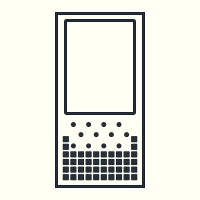

<!-- GIF: howto-hero-sphere.gif | region: 0,36,768,624 | recorded 2026-09-29, 5.8 s | steps: A set playing on all four channels; no interaction. | "Four channels, one room" | bonus -->

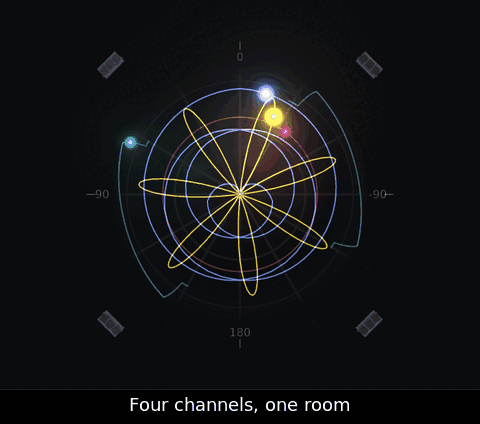

<!-- The screenshots and GIFs on this page are to be (re)made in the skin
quiet-indigo-2. The recording plan is kept outside this repository. -->

(motion-glossary)=

### Words you will meet

| Word | What it means here |
| :--- | :--- |
| **channel** | one of the four mixer channels A³ Motion moves. Channel 1 is the leftmost field on the screen and the leftmost column on the panel. Each channel keeps its own colour wherever it appears |
| **selected channel** | the one the bar shows and edits. Tap its field in the channel row to select it |
| **shape** | the path the sound traces. The screen labels it **SVG**, after the file format it is kept in |
| **clip** | a shape plus every value it is played with: speed, height, width, spin, direction. Each channel has one |
| **pass** | one time through the shape |
| **action** | a short script on one of a channel's six action pads, **A1–A6**. It changes the clip while you hold the pad (or once, on a tap), then lets go |
| **set** | which clip and which six actions each of the four channels has, plus their 3d, freq and Q |
| **take** | a new recording of a shape, drawn with your finger on the sphere |
| **lane** | a knob movement recorded in a take |
| **downbeat** | the one: the first beat of a bar. Play waits for it |
| **3d** | how much of a channel is in the room. Fully down: plain stereo, like any mixer. Up: the channel follows its blob |
| **bar** and **global strip** | the bottom of the screen. The **bar** is the five tabs and their page, on the left three quarters; the **global strip** is the column of keys on the right quarter |
| **LENGTH** | how long one pass takes, **counted in beats**: 16 is four bars, 4 is one bar |

(motion-get-started)=

## Get started: your first ten minutes

You need A³ Motion, A³ Core and the A³ Mixer on the A³ network switch, and
music playing on at least one mixer channel.

1. **Plug in.** Connect A³ Motion to the A³ switch. It is powered over the
   network cable and starts by itself. It is ready when the screen shows the
   sphere — the room, seen from above — with the four channel fields under it.
   Play some music on the mixer: the meters in the channel row move. If they
   stay still, see [Troubleshooting](#motion-troubleshooting).
2. **Check the clock.** Top left of the screen is the clock key with the BPM
   beside it. Tap the key until it reads **PIO** if your CDJs are on Pro DJ
   Link, **EXT** if the beat analyser is listening to the music, or **INT** if
   you want to tap the tempo yourself. The BPM should match your deck.
3. **Load a set.** Tap **FILES** (top of the global strip), then **SETS**, tap
   *Warmup* and tap **Load**. All four channels now have a clip and six
   actions. Tap **FILES** again to close it.
4. **Turn 3d up** on the channel your track is on: that channel's pot on the
   panel (above its pads), or **3D** in its field in the channel row.
   **At 3d = 0 you hear no movement.** The channel stays in plain stereo,
   whatever its blob does on the screen.
5. **Press Play.** Press that channel's **Play\|Pause** pad (top left of its
   eight pads). It blinks while it waits for the next downbeat, then the clip
   starts and your track travels the room.
6. **Fire an action.** Hold the channel's **A1** pad. The movement changes
   while you hold it and comes back when you let go. In every shipped set the
   left pads push the energy up and the right pads take it down; the top row
   is gentle, the middle row strong.
7. **Stop.** Press **Play\|Pause** again: the clip stops on the next downbeat,
   and the sound stays where it is.

That's the whole loop. Before your first gig, read
[Get me out of here](#motion-panic). The [how-to](#motion-howto) tasks below
cover everything else you will want to do; the reference after them lists
every control.

(motion-howto)=

## How to …

(motion-howto-load)=

### How to load a set or a clip

1. Tap **FILES** in the global strip. It opens on top of the sphere.
2. Tap **SETS** for a set, **CLIPS** for a clip. To load a clip, select its
   channel first.
3. Tap a row. **A tap only shows it** in the editor on the right; nothing on
   the device changes yet.
4. Tap **Load**. A set goes onto all four channels, a clip onto the selected
   channel. The shipped sets load standing still: start them with Play\|Pause
   or PADS › **Play all**. A set you saved while clips were playing starts
   those clips again, together, on the next downbeat.
5. Tap **FILES** again (or any tab) to close it.

```{warning}
**Loading a set mid-set** stops all four clips and jumps every channel's 3d,
freq and Q to the set's values — the room hears it. A shipped set then stands
still until you press Play; a set saved while playing starts again on the
next downbeat.
```

<!-- GIF: howto-files-load-set.gif | region: 0,36,768,664 | recorded 2026-09-29, 9.5 s | steps: In FILES › SETS tap Warmup, tap Load, close FILES: all four channels carry the set, stopped. | "FILES › SETS" / "Tap a set: it only shows" / "Load: all four channels take it" / "Stopped, ready for your ▶" | a shipped set loads stopped, so it ends on "ready for your ▶"; replaced howto-load-a-set.gif -->

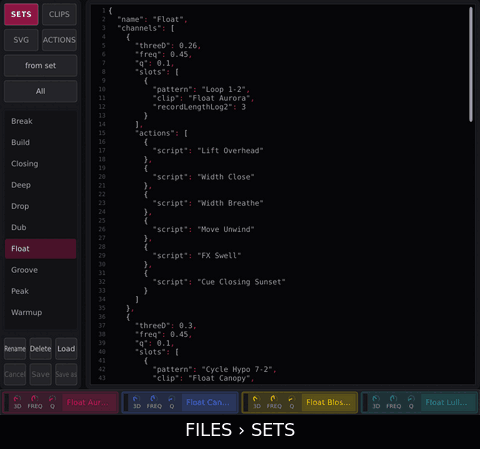

<!-- GIF: howto-files-load-clip.gif | region: 0,0,768,1024 | recorded 2026-10-01, quiet-indigo-2, --fuzz 0 (quantized before optimizing) | steps: Tap channel 2, open FILES › CLIPS, tap a clip, tap Load: channel 2 gets the clip. | "Choose the channel first" / "FILES › CLIPS" / "Tap a clip: it only shows" / "Load puts it on channel 2" -->

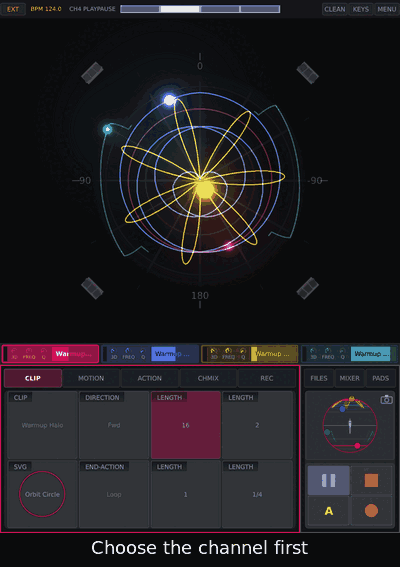

(motion-howto-play)=

### How to play and stop a clip

- **Start:** press the channel's **Play\|Pause** pad, or select the channel
  and tap **▶** in the global strip. It starts on the **next downbeat** and
  blinks while it waits.
- **Stop on the beat:** press **Play\|Pause** again, or tap **❚❚** (the same
  key on the screen). The clip stops on the next downbeat.
- **Stop now:** tap **■** on the screen, or hold **SHIFT** and press
  **Play\|Pause** on the panel.
- **Call off a start that is still waiting:** press Play\|Pause again while
  it blinks.
- **Start all four:** open **PADS** and tap **Play all** in the scene column
  on the left: it starts every clip that is standing still. To stop all four,
  stop each channel (■, or SHIFT + Play\|Pause); there is no Stop all.

Every start begins at the top of the shape. A stop leaves the sound where it
is; it doesn't jump anywhere.

<!-- QUESTION (maintainer): the key is called Play|Pause and shows ❚❚, but in the code a "pause" is a stop: every start begins at position 0 (MotionEngine::startPlaying), so ❚❚, SHIFT + Play|Pause and ■ all end in the same state and differ only in timing. The page describes it that way. Is that the intent (and the label stays), or should ❚❚ resume where it stopped? -->

<!-- GIF: howto-transport-play-pause.gif | region: 0,626,768,398 | recorded 2026-09-29, 9.8 s | steps: Tap ▶: it blinks until the downbeat, then plays. Tap ❚❚: it pauses on the next downbeat. | "Clip stopped" / "▶ blinks: waiting for the downbeat" / "On the one: it plays" / "❚❚ waits for the downbeat too" / "Paused, right on the one" | replaced howto-play-pause.gif -->

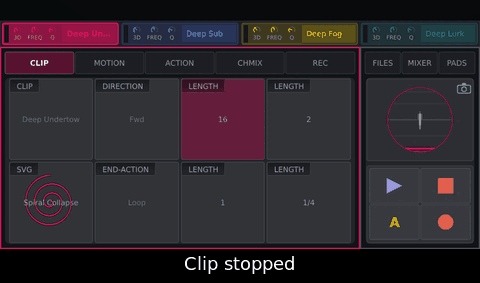

<!-- GIF: howto-transport-stop.gif | region: 0,626,768,398 | recorded 2026-09-29, 9.0 s | steps: With the clip playing tap ■: it stops at once. Tap ▶: it starts from the top on the downbeat. | "Channel 1 plays" / "■ stops now, no waiting" / "Next ▶ starts from the top" -->

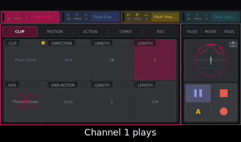

<!-- GIF: howto-pads-scene.gif | region: 0,36,768,590 | steps: PADS; Play all; downbeat; 2 s | "The scene column plays all four" / "Play all: in on the downbeat" | round 1, no. 7; Stop all is gone since 2026-09-30 -->

<!-- GIF: howto-pads-shift-now.gif | region: pads 0,36,768,590 | steps: clip playing; hold SHIFT on PADS; tap the channel's Play|Pause | "SHIFT + Play|Pause: stop now" | blocked: needs two pointers, xdotool has one -->

(motion-howto-drag)=

### How to move a sound by hand

1. Put a finger **on** a channel's blob on the sphere and drag. The finger has
   to land on the blob (or right beside it): a drag that starts on empty
   sphere moves nothing. The sound goes where your finger goes. **A drag is
   live and doesn't wait for the beat**: the room hears every centimetre.
2. Let go. A playing clip takes the sound back onto its shape; a stopped one
   leaves it where you let go.

Two fingers take two blobs. The top of the sphere is the front of the room.

**Steer round the other blobs.** A dragged blob pushes every blob it comes
close to out of its way, and their sound moves with them. Drag straight
through a crowd and you carry the others along.

<!-- QUESTION (maintainer): MotionComponent::disoccludeBlobs pushes every blob near a held one aside and writes the new position to the engine (setChannel3DPosition), so the pushed channels move in the room too. In the recording one drag gathered three other blobs and carried them. Is moving the other channels' sound intended, or should the push be screen-only? -->

<!-- QUESTION (maintainer): which way is "front" in a venue? The osc reference says 0° azimuth is the front of the room; the page now says the top of the sphere is the front. A DJ needs to know where that is before dragging: the booth side, the stage, or wherever Core was set up? -->

To look at the room from another angle **without moving anything**, use
camera mode: tap the small sphere in the global strip, drag up on the sphere
to lean the view towards the horizon (down brings it back), drag sideways to
walk round, and double tap to go back to straight above. In camera mode no
finger can move a sound.

<!-- GIF: howto-sphere-drag-blob.gif | region: 0,36,768,620 | recorded 2026-09-29, 9.0 s | steps: With channel 1 playing, drag its blob across the sphere and let go: the clip takes it back. | "Channel 1 plays its clip" / "Drag a blob: the sound follows" / "Let go: the clip takes it back" | the drag path goes round the other blobs, which a dragged blob pushes aside -->

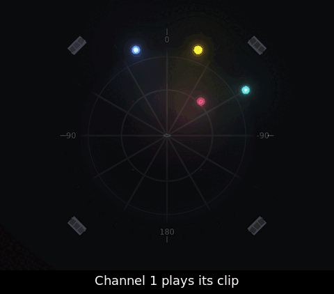

<!-- GIF: howto-sphere-camera-mode.gif | region: 0,36,768,988 | recorded 2026-09-29, 10.2 s | steps: Tap the small sphere, drag up, drag sideways, double tap, tap the small sphere again: camera on, lean, turn, reset, off. | "Tap the small sphere: camera" / "Drag up: lean to the horizon" / "Drag sideways: walk round" / "Double tap: straight above" / "Small sphere again: camera off" | from straight above only a drag UP leans the view; a drag down does nothing -->

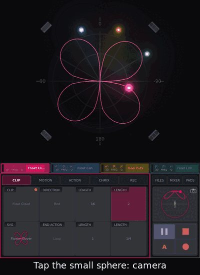

<!-- GIF: howto-sphere-zoom.gif | region: 0,36,768,624 | recorded 2026-10-01, quiet-indigo-2, --fuzz 0 (quantized before optimizing), 12.2 s | steps: In camera mode turn the mouse wheel in and out, then double tap: back to normal. | "Camera mode on" / "Mouse wheel (or pinch): zoom in" / "...and out" / "Double tap: back to normal" | mouse wheel (xdotool click 4/5), so no finger ring on the zoom -->

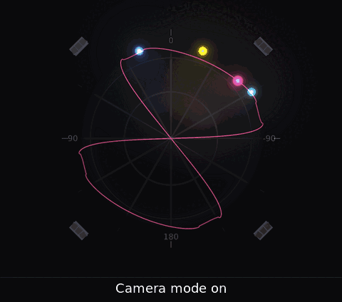

(motion-howto-clip)=

### How to change the shape, the speed and the direction

On the **CLIP** tab, for the selected channel:

- **Another shape, same values:** drag the **SVG** field with a thumb. Each
  step is a new shape; speed, height and everything else stay put.
- **Another clip, shape and values together:** drag the **CLIP** field.
- **Faster or slower:** tap one of the four **LENGTH** keys. The number is how
  many beats one pass takes: fewer beats, faster laps. Drag a key up or down to
  give it another length; the key keeps it.
- **Direction:** tap **DIRECTION** to step forwards, backwards, there and
  back, or a random start each pass.
- **What happens at the end of a pass:** tap **END-ACTION** to step Loop,
  Stop, or Paus (pause).

CLIP and SVG are separate on purpose, so browsing shapes never sneaks someone
else's preset onto your channel mid-set.

<!-- GIF: howto-clip-length-tap.gif | region: 0,36,768,988 | recorded 2026-09-29, 9.5 s | steps: With the clip playing at LENGTH 16, tap LENGTH 2, then LENGTH 1: the laps get faster. | "LENGTH 16: a lap every four bars" / "Tap 2: the same lap in two beats" / "Tap 1: fewer beats, faster laps" -->

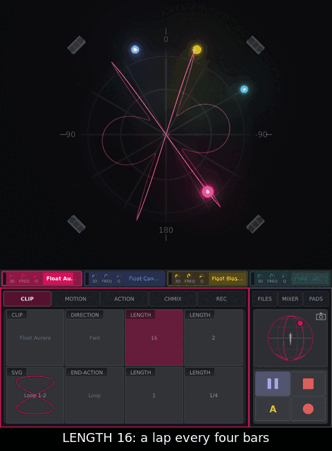

<!-- GIF: howto-clip-choose-shape.gif | region: 0,36,768,988 | recorded 2026-09-29, 9.0 s | steps: With the clip playing, drag the SVG field up three steps: the shape changes, speed and values stay. | "The SVG field: the shape" / "Drag it: a new shape each step" / "Speed and values stay put" -->

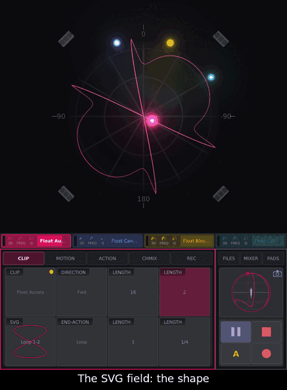

<!-- GIF: howto-clip-choose-clip.gif | region: 0,36,768,988 | recorded 2026-09-29, 9.0 s | steps: With the clip playing, drag the CLIP field up three steps: each step is a new preset with its own shape and speed. | "The CLIP field: a whole preset" / "Drag it: new shape, new values" / "Each clip brings its own speed" -->

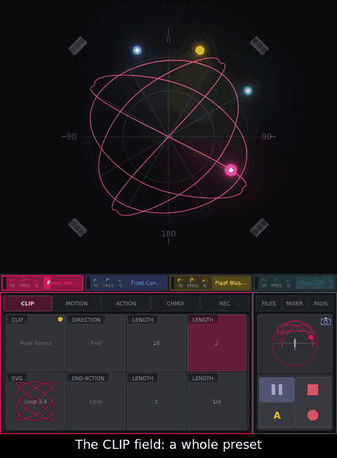

<!-- GIF: howto-clip-direction.gif | region: 0,36,768,988 | recorded 2026-09-29, 9.8 s | steps: With the clip playing, tap DIRECTION three times: Rev, Bnce, Rnd. | "DIRECTION: Fwd" / "Tap: Rev runs it backwards" / "Bnce: there and back again" / "Rnd: a random start each pass" -->

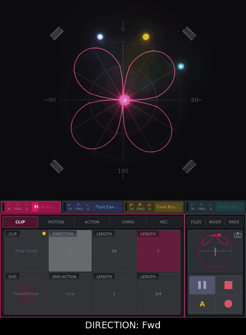

<!-- GIF: howto-clip-length-drag.gif | region: 0,672,578,352 | recorded 2026-09-29, 8.4 s | steps: Drag a LENGTH key up: 4 becomes 8, then 16, and the key keeps it. | "A LENGTH key reads 4" / "Drag it up: 8, then 16" / "The key keeps its new length" -->

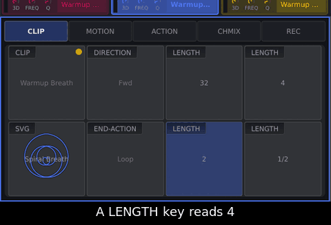

<!-- GIF: howto-clip-stop-vs-paus.gif | region: sphere and bar 0,36,768,988 | steps: short LENGTH; END-ACTION on Stop, let a pass run out; then Paus, let a pass run out | "Stop: back to the start" / "Paus: stays where it ends" | round 2; replaces howto-clip-end-action.gif -->

(motion-howto-motion)=

### How to shape the movement

On the **MOTION** tab every field has two knobs: **the right knob sets a
value, the left knob moves it** in time with the bars.

- **Point the shape somewhere else:** `rot`. **Keep it turning:** `spin` —
  one way or the other.
- **Wider or tighter:** `reach`. **Breathing in and out:** `swell`.
- **Higher or lower:** `elv`. **Rising and falling:** `sway`.
- **A ceiling and a floor** the sound can't pass: `clip-top` and `clip-bot`
  (the one field where both knobs set a value).
- **Squash it** front to back or side to side: `sqzX`, `sqzY`.
- **Lean it** forward or back: `tilt`. **Sideways:** `roll`.
- **Back to rest:** double tap the knob.

Whatever moves on its own counts in bars, never seconds, so it comes back to
where it started on a bar line.

<!-- QUESTION (maintainer): in the recording (2026-09-29) clip-top dragged 40-60 px after elv changed nothing visible, and a double tap on elv left the shape at the bottom rather than at ear level (its rest is "the middle of the clip band", ClipKnobs.hh elevationKnobSpec). Is that the intended rest, and what does clip-top need to show its ceiling? Needs a look at the device. -->

<!-- GIF: howto-motion-rotation.gif | region: 0,36,768,988 | recorded 2026-10-01, quiet-indigo-2, --fuzz 0 (quantized before optimizing), 12.6 s | steps: On MOTION drag rot: the shape turns. Drag spin: it keeps turning. Double tap spin: it stops. | "MOTION › ROTATION" / "Drag rot: the shape turns" / "Drag spin: it keeps on turning" / "Double tap spin: off again" | channel 1 alone on Break Heartbeat (the notch shows the turn; spin 0 in the clip); spin is dragged far, since its first steps take 32 and 16 bars a turn -->

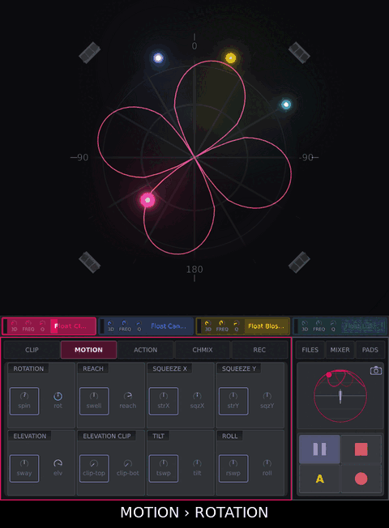

<!-- GIF: howto-motion-elevation.gif | region: 0,36,768,988 | recorded 2026-09-29, 6.1 s | steps: On MOTION drag elv up: the small sphere and the sphere show the shape rising. | "The small sphere shows the height" / "Drag elv: the shape rises" | elv only: clip-top showed nothing visible and is missing (see the QUESTION under How to shape the movement) -->

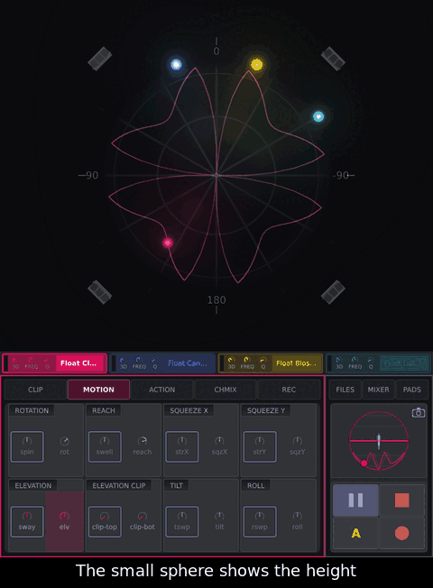

<!-- GIF: howto-motion-tilt-roll.gif | region: 0,36,768,988 | recorded 2026-10-01, quiet-indigo-2, --fuzz 0 (quantized before optimizing), 12.7 s | steps: With the camera leant, drag tilt up, drag roll up, double tap both: the shape's plane leans and comes back flat. | "Camera leant, MOTION tab" / "tilt leans the plane forward" / "roll leans it sideways" / "Double tap both: flat again" | channel 1 alone on Break Heartbeat; the double taps go tilt first, then roll -->

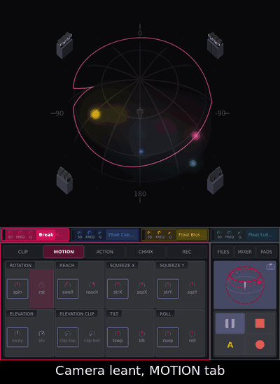

(motion-howto-action)=

### How to fire and assign actions

**Fire an action:**

- **From the pads:** hold one of the channel's action pads, A1–A6, on the
  panel or on the PADS window. It fires **at once**. The ACTION page comes up
  with that button chosen.
- **From the screen:** on the ACTION tab, tap a button (A1–A6) to choose it —
  a tap only chooses, it doesn't fire — then hold **A** in the global strip.
- **Audition it privately:** hold **SHIFT** and press an action pad. It plays
  on the screen only; the room hears nothing until you let go of the pad.

**Put another action on a button:**

1. Open the ACTION tab and tap the button, A1–A6.
2. Tap a script in the list next to it. It is on the button now.
3. **no action** at the top of the list empties the button.

```{warning}
**Turning a value on ACTION changes the action everywhere.** What you set
there is saved into the action's script — for every channel and every set
that uses that action, shipped sets included. To experiment, make a copy
first: **EDIT**, change something in the text in FILES (a comment will do —
**Save as** stays dark until the text differs from the file), then **Save
as**. The copy goes onto the button you came from.
```

<!-- GIF: howto-action-fire.gif | region: 0,36,768,988 | recorded 2026-09-29, 9.8 s | steps: With channel 1 playing, open ACTION, tap A1, hold A in the global strip: the action moves the clip; let go and the clip comes back. | "Channel 1 plays its clip" / "ACTION: tap A1 to choose it" / "Hold A: Move Spin takes over" / "Let go: the clip is itself again" -->

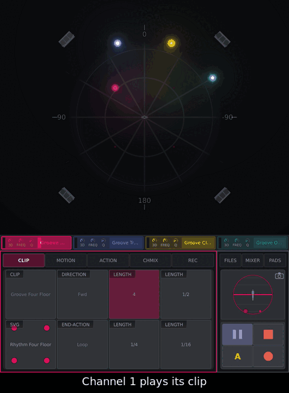

<!-- GIF: howto-action-assign.gif | region: 0,672,578,352 | recorded 2026-09-29, 9.9 s | steps: Tap A2, tap a script in the list: A2 carries it. Drag the list back to the top and tap "no action": A2 is empty again. | "Six buttons, one list" / "Tap a button to choose it" / "Tap a script: now it's on it" / "Drag the list back to the top" / ""no action" clears the button" | the list glides on after a drag, so pick the row from a still frame; replaced howto-assign-an-action.gif -->

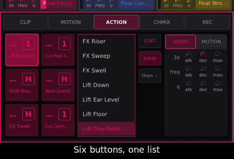

<!-- GIF: howto-action-audio.gif | region: 0,626,578,398 | recorded 2026-09-29, 9.8 s | steps: Tap A3, drag the 3d max knob up, hold A: the arc on the channel's 3D pot fills in and falls back when you let go. | "AUDIO: the button's accent" / "Choose A3" / "max: how far the 3d accent goes" / "Hold A: the 3D arc fills in" / "Let go: the accent falls" | recorded with A3 (Width Breathe, Hold): with A1 (Lift Overhead, 1shot) no arc showed; the arc is faint on a ~12 px pot -->

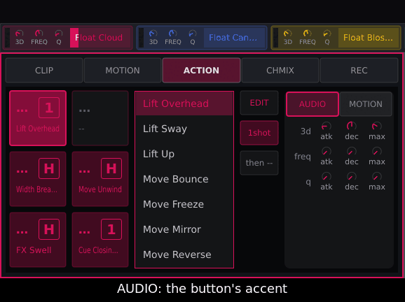

<!-- GIF: howto-action-writes-script.gif | region: 0,36,768,988 | recorded 2026-09-29, 9.8 s | steps: Tap A1, open the card's MOTION tab, turn spin, tap EDIT: FILES shows the script with ~spin = 4. | "ACTION, the card's MOTION tab" / "Choose A1" / "Turn spin on the card" / "EDIT: the script says ~spin = 4" / "Every set using it hears it too" -->

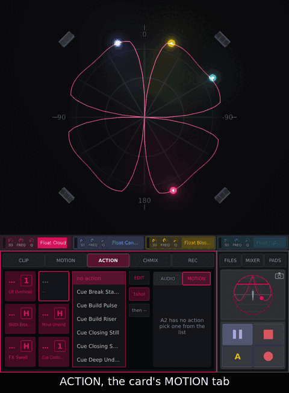

<!-- GIF: howto-action-then.gif | region: 0,672,578,352 | recorded 2026-09-29, 9.0 s | steps: Tap A1, tap the then key three times: then A1, then A2, then A3. | "then: what fires next" / "Choose A1" / "Tap then: A1, round again" / "Tap again: A2" / "A1, then A3" -->

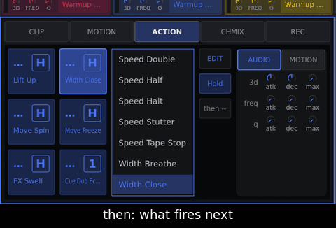

<!-- GIF: howto-action-mode.gif | region: 0,672,768,352 | recorded 2026-09-29, 10.2 s | steps: Tap A3, tap the mode key: 1shot, a short A runs it through. Tap the mode again: Hold, the action ends when A is released. | "Under EDIT: the mode" / "Choose A3" / "Tap: 1shot, the badge says 1" / "A quick A: it runs its course" / "Tap again: Hold, badge H" / "Hold: over when you let go" -->

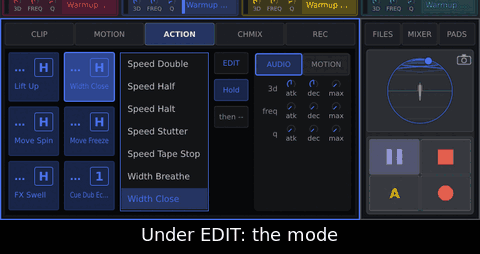

(motion-howto-take)=

### How to record a take, and keep it or throw it away

1. Select the channel in the channel row.
2. Tap **●**. The take is **armed**: REC opens, ● and ▶ light, and the clip
   keeps playing. **■** or **●** again disarms it.
3. On REC, choose the length (the lit **LENGTH** key is how long the take
   will be) and the rec mode — **Touch** to draw a shape.
4. Tap **▶**. The take starts on the **next downbeat**.
5. Drag on the sphere: the first finger down writes the position, wherever it
   lands. The line appears as you draw. Knobs you turn on MOTION are recorded
   too, see [below](#motion-howto-lanes).
6. Tap **●** (or **■**) to end the take. A take is always the **last full
   pass**: stop halfway through one and that half is dropped.
7. Tap **SAVE** (where ● was) to keep it: the shape, and a clip with every
   value it has now. **DISCARD** (where A was) asks twice, then puts back what
   the channel held before — stopped. Press Play to hear it again.

**A take is live**: the room hears what you draw. To practise without the
room, turn the channel's 3d down first.

Nothing is lost while you decide. The take keeps playing, marked unsaved,
until you tap SAVE or DISCARD, or something replaces it: a new take, a shape
or a set loaded, a restart.

**On the panel:** hold **REC** and press the channel's **Play\|Pause** pad.
That skips arming; the take starts on the next downbeat. Press REC again to
end it.

<!-- GIF: howto-rec-take.gif | region: 0,36,768,988 | recorded 2026-09-29, 10.2 s | steps: With the clip playing tap ●, tap ▶, draw circles on the sphere from the downbeat, tap ●: the last full lap is the take. | "Channel 1 plays" / "● arms the take" / "▶ starts it on the downbeat" / "Draw on the sphere, lap after lap" / "● ends it: the last full lap stays" -->

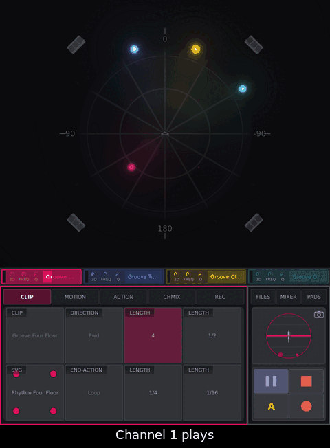

<!-- GIF: howto-rec-save-discard.gif | region: 0,626,768,398 | recorded 2026-09-29, 9.0 s | steps: After a take tap DISCARD once (it asks), then tap SAVE: the take is kept. | "The take waits: ✕ DISCARD, ✓ SAVE" / "DISCARD asks twice, on purpose" / "Changed your mind? SAVE keeps it" -->

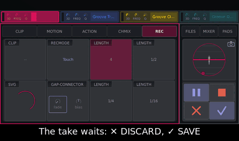

<!-- GIF: howto-rec-setup.gif | region: 0,672,578,352 | recorded 2026-09-29, 7.0 s | steps: On REC tap LENGTH 4, then LENGTH 2: the lit key is the take's length. | "The lit LENGTH is the take length" / "Tap 4: a take of four beats" / "Tap 2: two beats, quick laps" -->

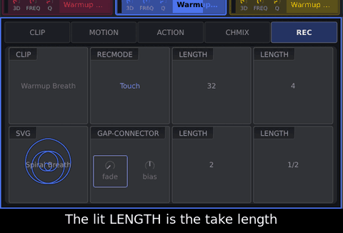

(motion-howto-lanes)=

### How to record knob moves

● opens REC, and the knobs are on MOTION: after ●, tap **MOTION** again,
then ▶. (On REC the same spot is the CLIP field, and a drag there steps
through clips mid-take.)

During a take, turn any knob on MOTION. It is written into a **lane**, drawn
in red while it writes, with the same rec mode as the shape. On playback the
lane turns the knob by itself; your hand on the knob wins while it holds.
Double tap a knob to clear its lane; the other lanes stay.

<!-- GIF: howto-rec-knob-lane.gif | region: 0,36,768,988 | recorded 2026-09-29, 10.2 s | steps: On MOTION tap ●, tap MOTION again, tap ▶, turn rot during the take, tap ●: rot plays back as a lane. Double tap rot: the lane is cleared. | "MOTION, channel 2" / "● arms: REC opens" / "Back to MOTION, then ▶" / "Turn rot while the take runs" / "● ends it: rot plays a lane" / "Double tap rot: lane cleared" | ● switches the bar to REC, so MOTION is tapped again before ▶; the take is left unsaved -->

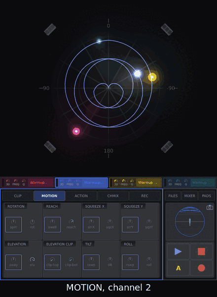

(motion-howto-save)=

### How to keep a tweak and save your set

- **Keep a clip you changed.** A warning-coloured **drift dot** on the CLIP
  field means its values have been turned since it was loaded. Open FILES ›
  **CLIPS**, tap **from clip**, then **Save as**. Your copy lands in your own
  files, named after the original ("Warmup Halo 2"). The channel keeps playing
  the original, drift dot and all: **Load** the copy to play it.
- **Keep tonight's set.** FILES › **SETS**, tap **from set**, then
  **Save as**. The copy is named after the row the editor showed; with no row
  shown it is called "Action". Give it a name (below).
- **Give it a name.** Tap the row, tap **Rename**, type, and tap **Keep** (or
  ENTER).
- **Clear out the library.** Tap the row, tap **Delete**, and tap it again
  when it asks **Sure?**. Delete removes the file, not the music: whatever is
  loaded keeps playing.

<!-- QUESTION (maintainer): Save as names a copy after the file the editor shows (copyBaseFor(_panelFile)); with no file shown it falls back to "Action" on every tab, so SETS › from set › Save as straight after opening SETS wrote a set called "Action" (recorded 2026-09-29). Should a set copy be named after the loaded set instead? -->

<!-- GIF: howto-files-keep-tweak.gif | region: 0,36,768,988 | recorded 2026-10-01, quiet-indigo-2, --fuzz 0 (quantized before optimizing), 12.2 s | steps: The CLIP field shows the drift dot. Open FILES › CLIPS, tap from clip, tap Save as: the tweak is a new clip. | "The dot: this clip was changed" / "FILES › CLIPS" / "from clip: the device as text" / "Save as: your tweak, a new clip" | the channel keeps the original clip; the copy has to be loaded -->

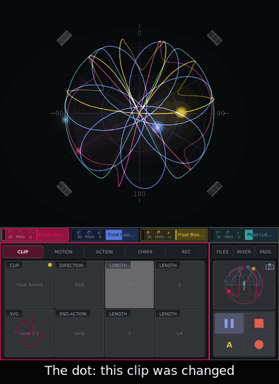

<!-- GIF: howto-files-save-set.gif | region: 0,36,768,620 | recorded 2026-09-29, 9.0 s | steps: In FILES › SETS tap from set, then Save as: the device's set is kept as a new set of your own. | "FILES › SETS" / "from set: the device as text" / "Save as: kept as your own set" | no row shown before from set, so the copy was named "Action" -->

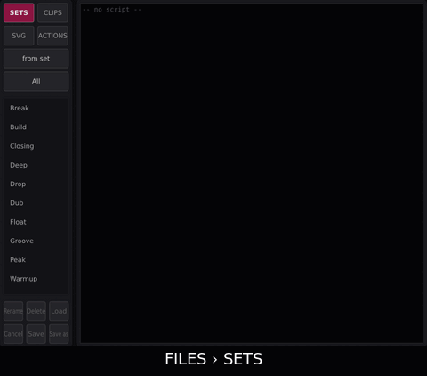

<!-- GIF: howto-keyboard-rename.gif | region: 0,0,768,1024 | recorded 2026-09-30, quiet-indigo-2, the panel keyboard | steps: In FILES tap your own file, tap Rename: the keyboard comes up; DEL back to "Speed ", type Riff, ENTER. | "Rename: the keyboard comes up" / "DEL takes the old name back" / "Type the new one" / "ENTER keeps the name" -->

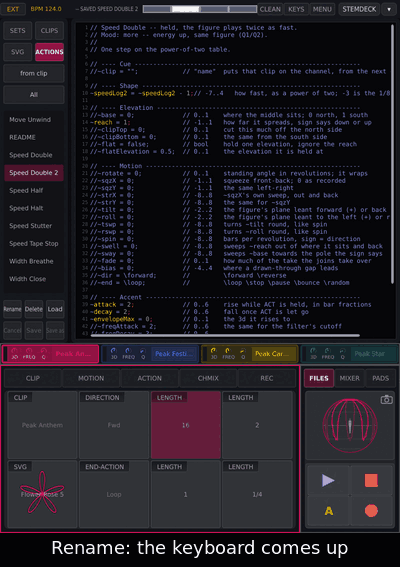

<!-- GIF: howto-files-delete.gif | region: 0,36,768,620 | recorded 2026-09-29, 8.4 s | steps: In FILES › CLIPS tap one of your own clips, tap Delete (it asks Sure?), tap Delete again: the row is gone. | "Your own clips can go" / "Tap the row" / "Delete asks: Sure?" / "Press again: gone" -->

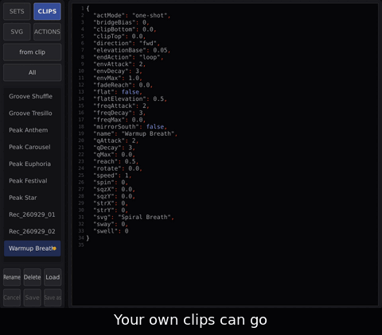

<!-- GIF: howto-files-edit-save.gif | region: 0,0,768,1024 | recorded 2026-09-30, quiet-indigo-2, the panel keyboard | steps: In FILES › ACTIONS tap your own copy, type in the editor, tap another row (refused), tap Save. | "FILES › ACTIONS, your own copy" / "Tap in the editor and type" / "Another row? Save or Cancel first" / "Save: written, keyboard gone" -->

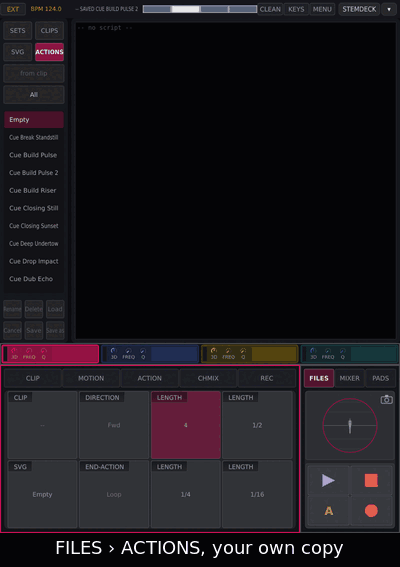

(motion-howto-mix)=

### How to mix from the screen

- **One channel:** select it and open the **CHMIX** tab — its gain, EQ,
  send, CUE, FX and volume.
- **All four and the master:** tap **MIXER** in the global strip.
- **Volume:** the meter *is* the VOL fader, and the handle on it is the fader
  cap. Grab the **handle** and drag, one to one. A drag that starts anywhere
  else on the meter does nothing, so a finger landing low on a loud channel
  can't pull it down.
- **Back to a default:** double tap a knob (EQ flat, SEND off, volume full).
  The master fader has no double tap, on purpose.

These are the A³ Mixer's own controls, and the two follow each other. The A³
Mixer has no motor faders, though: turn something on the screen and the
hardware control stays where it is. The next time you touch it, the level
jumps to wherever the hardware control sits.

<!-- GIF: howto-chmix-volume.gif | region: 0,672,578,352 | recorded 2026-09-29, 9.9 s | steps: On CHMIX drag the handle on the meter down and up, then double tap the meter: full volume. | "The meter is the VOL fader" / "Drag the handle, one to one" / "Double tap: full volume" -->

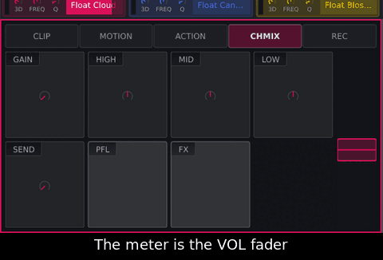

<!-- GIF: howto-chmix-knobs.gif | region: 0,700,390,320 | recorded 2026-09-29, 9.8 s | steps: On CHMIX drag HIGH up, double tap it: flat. Drag SEND up, double tap it: off. | "CHMIX: drag a knob to turn it" / "HIGH up" / "Double tap: EQ flat" / "SEND up" / "Double tap: SEND off" -->

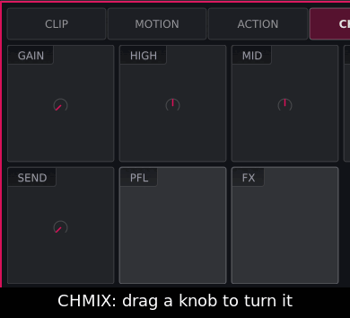

<!-- GIF: howto-mixer-master.gif | region: 0,36,768,624 | recorded 2026-09-29, 9.5 s | steps: In MIXER drag the master handle down and back up, then drag PHN up. | "The master column, far right" / "Drag its handle: master volume" / "PHN beside it: the headphones" -->

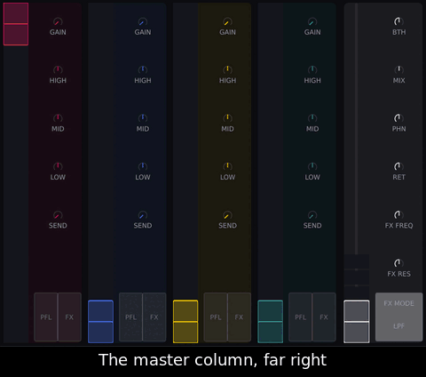

<!-- GIF: howto-mixer-filter.gif | region: 0,36,768,624 | recorded 2026-09-29, 9.5 s | steps: In MIXER tap FX MODE twice (HPF, LPF), drag FX FREQ up, double tap it: back to the middle. | "One filter for all four" / "FX MODE: HPF or LPF" / "FX FREQ: where it cuts" / "Double tap: FREQ to the middle" -->

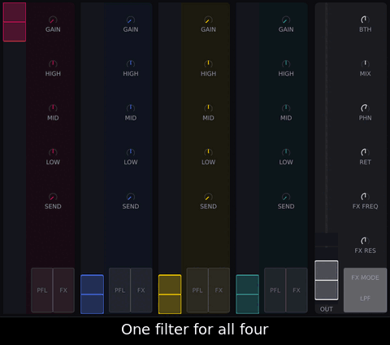

(motion-howto-tempo)=

### How to set the tempo by hand

1. Tap the clock key (top left) until it reads **INT**.
2. Tap the beat display — the four cells beside the readout — in time with
   the music, or press **TAP** on the panel. The first tap after a pause is
   the one; the BPM follows your taps.

In EXT and PIO the tempo comes from outside, and your taps are passed on to
the beat analyser.

**Stepping the clock key all the way round loses your taps.** Back on INT,
the tempo is the one INT had the first time you left it, not the one you
tapped since. Tap it in again.

<!-- QUESTION (maintainer): A3MotionUIComponent::applyClockMode saves _internalBPM only when it is still 0 (the first time INT is left) and taps never update it, so INT → EXT → PIO → INT restores a stale tempo (recorded: 116 BPM tapped, 60 BPM after the round trip). Bug? The page describes it as it is. -->

<!-- GIF: howto-statusbar-tap.gif | region: 0,0,500,36 | recorded 2026-10-01, quiet-indigo-2, --fuzz 0 (quantized before optimizing), --width 500 (the strip at its own size) | steps: Tap the clock key to INT, tap the beat display eight times: the BPM follows. | "The clock key says whose tempo" / "INT: the tempo is yours" / "Tap the beat display in time" / "The BPM follows your taps" -->

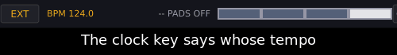

(motion-howto-look)=

### How to change the look

- **Calm the screen down:** tap **CLEAN** in the status bar. Thin lines,
  plain blobs, no effects: easier to read in a dark booth, and lighter on the
  machine. Tap again for your skin. The shipped default skin *is* the clean
  look, so on it CLEAN changes nothing you can see; it matters once you have
  chosen a richer skin.
- **Another skin:** MENU, then double tap **Skin**. Browse with the arrow keys
  ↑ ↓: each skin previews on the sphere, ENTER keeps it, and Escape or back
  keeps the one you had. **A tap on a skin chooses it at once** and keeps it,
  no preview — dragging the list only scrolls it.
- **Your own colours and sizes:** MENU › **Skin Editor**. Opening it on the
  shipped default skin makes a copy called **custom** as you leave, even if you
  changed nothing, and switches to it.

<!-- QUESTION (maintainer): CLEAN on the shipped default: clean.json and default.json are byte-identical since 648628d, so the key lights and nothing else changes (howto-statusbar-clean.gif could not be recorded). Intended, or should one of the two differ? -->

<!-- QUESTION (maintainer): closing the Skin Editor always saves (closeSkinEditor → saveEditedSkin), and on "default" that means writing custom.json and switching to "custom" (skinNameToWriteTo) even when nothing was changed -- recorded 2026-09-29, a look was enough. Should an unchanged editor leave the skin alone? -->

<!-- GIF: howto-statusbar-clean.gif | region: 0,0,768,626 | steps: tap CLEAN; 3 s; tap CLEAN | "CLEAN: lines and blobs only" / "Tap again: your skin is back" | round 1, no. 23 -->

<!-- GIF: howto-menu-skin.gif | region: 0,0,768,1024 | recorded 2026-10-01, quiet-indigo-2, --fuzz 0 (quantized before optimizing), --fps 6 to stay under 3 MB | steps: In MENU double tap Skin, step down three skins with the arrow key (each previews), press Escape: the old skin stays. | "MENU › Skin: double tap" / "Browse: each skin previews" / "Back: the old one stays" | arrow keys (xdotool key Down x3, Escape), so no finger ring on the browse; a tap would choose and save a skin -->

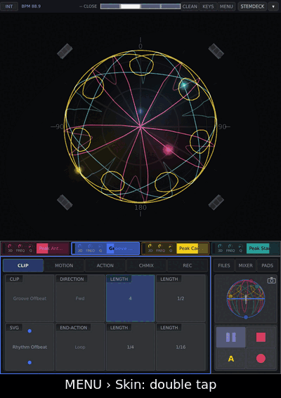

<!-- GIF: howto-menu-skin-editor-value.gif | region: 0,0,768,1024 | recorded 2026-10-01, quiet-indigo-2, --fuzz 0 (quantized before optimizing), the panel keyboard | steps: In the Skin Editor (All values and skin actions) double tap netGain, tap + three times, press Escape: the value is back. | "Skin Editor: double tap a value" / "+ steps it: 0.55, 0.605, 0.665" / "Esc: back to 0.500, nothing kept" | the edit box covers the sphere, so only the number shows the step; Escape (the panel keyboard's ESC), not Enter, keeps the sandbox skin as it was -->

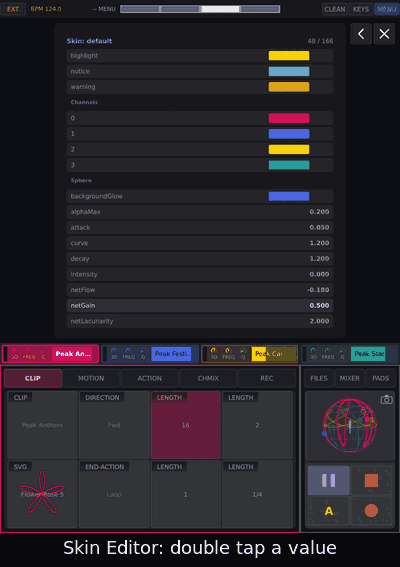

<!-- GIF: howto-menu-skin-editor-colour.gif | region: 0,36,768,624 | recorded 2026-10-01, quiet-indigo-2, --fuzz 0 (quantized before optimizing), 12.2 s | steps: In the Skin Editor (All values and skin actions) double tap channel 1's colour, drag across the picker and the hue strip, tap done. | "Double tap a colour: the picker" / "Drag: channel 1 recolours live" / "The hue strip for another hue" / "done keeps it" | Escape does not close the picker, only done; recorded on quiet-indigo-2, whose name the editor keeps (the sandbox's copy of the skin) -->

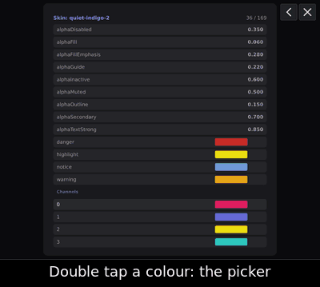

### How to type on the device

You rarely have to ask: the [on-screen keyboard](#motion-keyboard) comes up by
itself when there is something to type — a Rename in FILES, the FILES editor,
a value in the menu — and goes away when you're done. **KEYS** in the status
bar shows or hides it by hand.

(motion-howto-network)=

### How to point the device at another Core

**Not on the device.** Since 2026-09-30 A³ Motion reads every host, port and
OSC address from `a3-osc.json`, the one file the a3-core package installs for
the whole system, and the **Network** page is gone from the menu. Motion takes
that file **from Core**: when Core's truth changes (a Core install, or an edit
of `~/.config/a3/network.json` and a Core restart), Motion's window closes and
reopens once, about 5 s, and saves its state on the way out. With the same
truth nothing happens. To point it at another Core, that file changes — and
with it every other device, so nothing can end up sending to an address nobody
listens to. See {ref}`Where addresses and ports live <osc-truth>` and
{ref}`Following Core <osc-follow>`.

(motion-panic)=

## Get me out of here

(motion-stop-now)=

### Stop the movement, now

| You want | Do this |
| :--- | :--- |
| one channel to stand still, now | select it and tap **■**; on the panel, hold **SHIFT** and press its **Play\|Pause** |
| all four to stand still, now | on the panel, SHIFT + Play\|Pause on each channel; on the screen, select each channel and tap **■**. There is no Stop all |
| a channel back to plain stereo | turn its **3d** pot down. The track stays in the mix, just no longer in the room |
| a chain of actions to end | press Play\|Pause, ■ or another action pad on that channel |
| a take gone wrong to go away | **■** ends it, **DISCARD** twice puts back what was there, stopped |

After a stop the sound stays where it was; it doesn't jump home. And
restarting the device doesn't move the room either: it asks A³ Core where
every sound is before it says anything itself.

(motion-not-mid-set)=

### Not in the middle of a set

These are fine in soundcheck and loud in front of a crowd:

- **Loading a set** stops all four clips and jumps each channel's **3d, freq
  and Q** to the set's values. A shipped set then stands still until you press
  Play.
- **Turning values on ACTION** rewrites that action for every channel and
  every set that uses it. See the warning in
  [How to fire and assign actions](#motion-howto-action).
- **Developer Mode** (in the menu) lets Save write over the shipped files.
  Leave it off on a gig.

And the ones people worry about that are safe: deleting a file (whatever is
loaded keeps playing), scrolling through the menu (a value only changes in
its edit box), and pressing Escape on a keyboard (it never quits the app).

(motion-before-the-gig)=

### Before the gig

- The clock key reads what the booth has: **PIO** for CDJs on a link, **EXT**
  for the beat analyser, **INT** otherwise — and the BPM matches the deck.
- Developer Mode is off.
- The sets you plan to use are loaded once and saved as your own
  (**Save as**), so a tweak on the night can't touch the shipped ones.
- You know where front is on the sphere for this room.

(motion-troubleshooting)=

### Troubleshooting

| Symptom | What to do |
| :--- | :--- |
| The blob moves, the sound doesn't | Turn **3d** up. At 0 the channel is plain stereo |
| A drag on the sphere moves nothing | Start the drag on the blob itself. Or camera mode is on: tap the small sphere to switch it off |
| A drag on a meter moves nothing | Grab the handle, not the meter |
| The channel meters don't move and the speakers throw no lightning | Nothing is coming back from A³ Core. Check the network cable and that Core is running |
| ▶ blinks for a moment before it starts | That's the wait for the next downbeat, up to a bar. Press again to call the start off |
| The clips run off the beat, or the BPM is wrong | Check the clock key. INT: tap the tempo. EXT or PIO: check the source; if its beats stop, A³ Motion carries on at the last tempo it had |
| An action pad does nothing | The button is empty: grey on ACTION, dark on PADS. Put an action on it |
| An action plays differently from yesterday | Someone turned its values on ACTION, and that is saved in the script. Open it with **EDIT** to see what it says now |
| You tapped a set or a clip in FILES and nothing changed | A tap only shows it. **Load** puts it on the device |
| You loaded a set and nothing moves | The shipped sets load standing still. Press Play\|Pause, or PADS › **Play all** |
| **Save** is dark | It's a shipped file. Use **Save as** |
| FILES won't change row and says `-- SAVE OR CANCEL` | The editor has unsaved text. Save it or Cancel it |
| Your drawn shape parks in one spot halfway through the take | The rec mode is **Latch**. Draw in **Touch** |
| A Cue says `-- NO SUCH CLIP` | Its clip was deleted or renamed |
| A Cue says `-- SAVE THE TAKE FIRST` | Tap SAVE or DISCARD on the take |
| **CLEAN** is greyed out | The device has no clean skin installed |
| A double tap on **3D** does nothing | The panel is attached, and its pot decides. Turn the pot |
| The mixer's hardware control and the screen disagree | The A³ Mixer has no motor faders. Touch the hardware control and it takes over |
| You changed an OSC address and nothing reacts | The other side must use the same one. Put it back, or change both |
| The screen is frozen | Restart the device. The room doesn't move: it asks Core where every sound is |

<!-- QUESTION (maintainer): "restart the device" in the last row: what is the DJ-safe way on the rig, pulling the network cable (PoE)? And how long until it is back? -->

(motion-reference-screen)=

## Reference: the screen

### Windows at a glance

Every window opens from a key with its name on it. Here's where each key lives.

| Window | What it's for | Opens with | Closes with |
| :--- | :--- | :--- | :--- |
| **Main screen** | the room, the four channels, the selected clip | always there | — |
| **CLIP** | which clip, which shape, direction, end, lengths | its tab in the bar | another tab |
| **MOTION** | how the shape moves, and how high it sits | its tab in the bar | another tab |
| **ACTION** | the selected channel's six action buttons | its tab in the bar | another tab |
| **CHMIX** | the selected channel's mixer strip | its tab in the bar | another tab |
| **REC** | setting up and making a take | its tab in the bar, or ● | another tab |
| **FILES** | sets, clips, shapes and actions on disk | FILES, top of the global strip | FILES again; MIXER or PADS (swaps it); any tab; MENU; PAGE on the panel |
| **MIXER** | all four mixer strips and the master | MIXER, top of the global strip | the same as FILES |
| **PADS** | the panel's pads on the screen | PADS, top of the global strip | the same as FILES |
| **Menu** and its pages | skins, network, LEDs, folders | MENU in the status bar, or MENU on the panel | ‹ (back) or MENU: one level; ✕: all of it |
| a list of values, an edit box | changing one menu value | double tap or ENTER on a menu row | ENTER or a tap on a value (keeps it); back, MENU or Escape (drops it) |
| the colour picker | changing one colour in the Skin Editor | double tap a colour row | **done**, back or MENU. The colour stays either way: it is changed as you drag. Escape does nothing here |
| **Keyboard** | typing names and values | KEYS, status bar; comes up by itself when there is something to type | KEYS again, or HIDE |
| the workspace list | going to another of the Core's screens | ▾, right end of the status bar | a tap on a workspace (goes there), or a tap beside the list |

Only one of FILES, MIXER and PADS is open at a time; each opens on top of the
sphere, and the channel row, the bar and the global strip stay in view under
it. Closing FILES ends a rename without keeping it and cancels an armed
Delete; text typed in the editor stays, marked unsaved.

<!-- GIF: howto-overlays.gif | region: 0,36,768,712 | recorded 2026-10-01, quiet-indigo-2, --fuzz 0 (quantized before optimizing), PADS as the panel | steps: Tap FILES, MIXER, PADS: each lies over the sphere, one at a time. Tap CLIP: it closes. | "FILES, MIXER, PADS: over the sphere" / "FILES" / "MIXER: one at a time" / "PADS" / "A bar tab closes it" -->

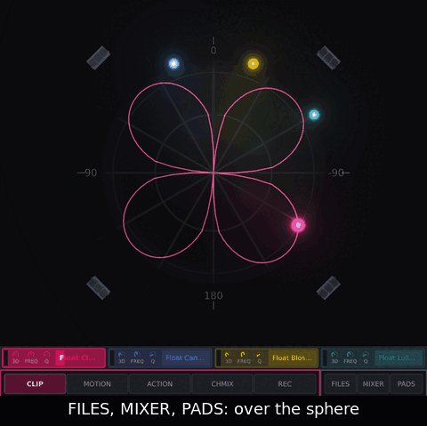

### The main screen

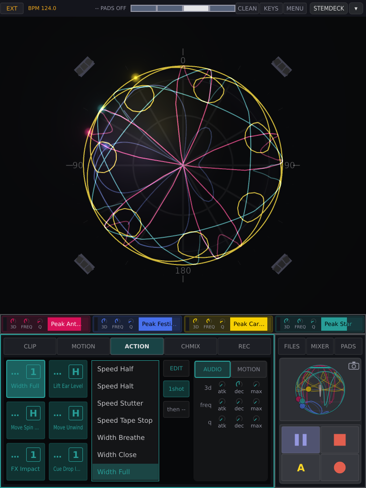

<!-- The main screen, the channel row and the ACTION page were taken on 2026-09-30 from the rig's running A³ Motion, which runs the skin "custom" (quiet-indigo-2's colours with the maintainer's effect settings), not quiet-indigo-2 itself: the sandbox would have stopped the live service. Re-shoot in quiet-indigo-2 when the sandbox may run. -->

Top to bottom:

1. the **status bar**: clock, tempo, what was last done, the beat, CLEAN,
   KEYS, MENU, and the workspace switch STEMDECK ▾;
2. the **sphere**: the room seen from above;
3. the **channel row**: one field per channel;
4. the **bar**: five tabs and the page they open, on the left three quarters;
5. the **global strip**: FILES, MIXER, PADS, the elevation picture and the
   transport, on the right quarter.

#### Status bar

| Part | What it does |
| :--- | :--- |
| **clock key** (INT / EXT / PIO) | tap to step INT → EXT → PIO. Written in the mode's colour. See [Clock modes](#motion-clock) |
| **BPM** | the tempo, in the clock's colour. Read only |
| **readout** | what was last done, e.g. `-- REC ARMED`, `-- FILES ON`, `CH2 ACTION` |
| **beat display** | four cells, one per beat, filling as the bar runs. **Tap it to tap the tempo**: in INT it sets the tempo; in EXT and PIO the taps go on to the beat analyser |
| **CLEAN** | switches to the clean skin — thin lines, plain blobs, effects off — and back to the skin you had. Greyed out when the device has no clean skin |
| **KEYS** | shows or hides the on-screen keyboard |
| **MENU** | opens the menu; see [The menu](#motion-menu) |
| **STEMDECK** | shows [StemDeck](stemdeck.md), on the Core's screen. StemDeck has the same key, reading MOTION, at exactly the same place, so a second tap brings you back |
| **▾** | opens the list of the Core's workspaces — MOTION, STEMDECK, REAPER, QJACKCTL, and SCARLETT while the Scarlett mixer runs; only those with a window on them. The one on the screen is highlighted; tap one to go there, beside the list to close it |

The switch at the right end looks like StemDeck's keys, not like your skin:
it belongs to the rig rather than to A³ Motion, and it is the same key in
both apps. On REAPER, QJACKCTL and SCARLETT a bar at the top of the screen
names the workspaces; tap MOTION there to come back.

#### The sphere

The room seen from straight above, with you — the listener — in the middle at
ear height. The top of the sphere is the front of the room. Each channel is a
coloured blob sitting where its sound is; it swells and throws sparks with
that channel's input level. A playing clip draws its path as a braid of
plasma, with the blob travelling inside it. Whatever is on the far side of the
sphere from your view is drawn darker: from straight above, that is
everything below ear height.

The four corners are your speakers, each a tower of tops over subs. Lightning
runs from the tops towards the middle — thicker, and more of it, on the
speaker working hardest, and none at all when the room is silent. The subs
throw ball lightning with the bass. No lightning anywhere while music plays?
Nothing is coming back from Core; see [Troubleshooting](#motion-troubleshooting).

| Gesture | What it does |
| :--- | :--- |
| drag a blob | moves that channel's sound, live. Start the drag **on the blob**: then it jumps under the finger. A drag that starts on empty sphere moves nothing. A playing clip keeps running and takes the blob back when you let go. Other blobs in the way are pushed aside, and their sound moves with them |
| several fingers | each takes its own blob |
| during a take | the first finger writes the take, wherever it lands; see [REC](#motion-rec) |

**Camera mode** turns the view instead. Tap the **elevation picture** in the
global strip (the small sphere with the camera mark) to switch it on or off;
its field lights while it is on.

| Gesture, in camera mode | What it does |
| :--- | :--- |
| drag up | leans the view from straight above down towards the horizon |
| drag down | leans it back up. From straight above there is nowhere higher to go, so a drag down does nothing |
| drag left / right | walks the view round the room |
| pinch with two fingers, or the mouse wheel | zooms |
| double tap | back to straight above, unzoomed |

In camera mode no finger takes a blob. The view is kept over a restart.

#### The channel row

Between the sphere and the bar: one field per channel, in its colour, channel
1 on the left. Left to right in each field:

| Part | What it does |
| :--- | :--- |
| meter | the channel's input level. Read only |
| **3D**, **FREQ**, **Q** | the channel's 3d, filter frequency and filter resonance. Drag to turn |
| progress bar | fills from the left as the clip runs, with the **clip's name** in it |

**Tap a field to select that channel**: the bar and the global strip then
show its clip. Reaching for one of its knobs selects it too. The selected
field is filled and framed thicker.

**On the panel, the pot is the truth.** Without a panel attached, a double
tap puts 3D or FREQ back to twelve o'clock and Q back to closed. With the
panel, the pot's own position decides.

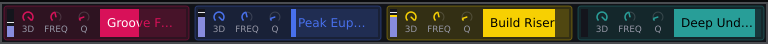

<!-- GIF: howto-channelrow-select.gif | region: 0,626,768,398 | recorded 2026-09-29, 8.4 s | steps: Tap channel 2, channel 3, then channel 1 in the channel row: the bar follows the channel and takes its colour. | "Tap a channel to work on it" / "Channel 2: the bar turns blue" / "Channel 3: its clip, its keys" / "Channel 1: back where you were" -->

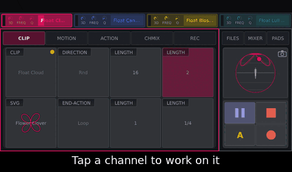

<!-- GIF: howto-channelrow-pots.gif | region: 0,626,768,398 | recorded 2026-09-29, 9.5 s | steps: Drag channel 1's FREQ pot up and down, then drag channel 2's 3D pot: channel 2 becomes selected. | "3D, FREQ, Q: right in the row" / "Drag FREQ up, then down" / "3D on channel 2: now selected" -->

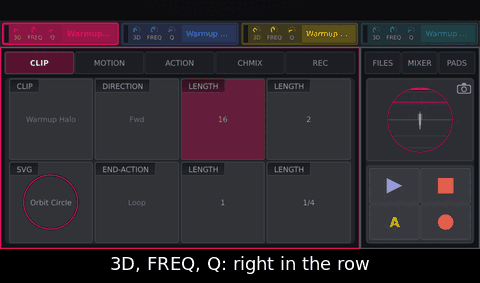

#### The bar

Five tabs, left to right: **CLIP MOTION ACTION CHMIX REC**. A tab shows its
page in the bar; the lit tab is the page you are on. All five show the clip of
the **selected channel**, framed in its colour. A tab also closes FILES, MIXER
or PADS if one of them is open.

**Double tap a knob** in the bar to put it back to its rest: most knobs to the
middle, the moving ones (the sweeps and spin) to off. On a knob that plays a
recorded lane, the double tap clears the lane instead (see
[How to record knob moves](#motion-howto-lanes)). Fields that step on a tap
have no rest.

#### The global strip

The right quarter of the bottom of the screen, beside the bar. It is the same
whichever tab is open.

| Part | What it does |
| :--- | :--- |
| **FILES**, **MIXER**, **PADS** | each opens its window on top of the sphere; tap again to close it. Only one at a time: another key swaps it |
| elevation picture | a small sphere seen from the side, with the channels' positions. Tap it for camera mode |
| **▶ / ❚❚** | the selected clip's Play\|Pause: starts, or stops, on the **next downbeat**, and blinks while it waits. Shows ❚❚ while the clip runs |
| **■** | stops the selected clip **now**, and flashes. During a take it ends the take |
| **A** | fires the selected channel's **chosen action button** — the one last tapped on ACTION — for as long as you hold it |
| **●** | arms a take on the selected clip and opens REC; see [REC](#motion-rec) |

After a take, **●** turns into **SAVE** (a tick) and **A** into **DISCARD** (a
cross) until you decide.

(motion-clip)=

### CLIP

The clip of the selected channel. Eight fields, four by two, laid out like
the encoders.

| Field | What it does |
| :--- | :--- |
| **CLIP** | which clip — the preset of values — is loaded. **Drag it with a thumb** to step through the clips. A warning-coloured **drift dot** says the values have been turned since it was loaded and something is waiting to be saved. `--` is a shape with no clip behind it |
| **SVG** | the shape the sound traces, with its name. **Drag it** to step through the shapes; **swapping the shape keeps the values** |
| **DIRECTION** | tap to step **Fwd → Rev → Bnce → Rnd**: forwards, backwards, there and back, or from a random point each pass |
| **END-ACTION** | tap to step **Loop → Stop → Paus**: what happens when a pass is over |
| **LENGTH** × 4 | how long one pass takes, **in beats**. **Tap** a key to play at that length. **Drag** a key to give it another length out of the whole range, applied straight away. The key keeps it |

**The LENGTH keys scale the clip's own length.** The number on a key is what
it gives this clip: the same key reads 4 on a four-beat shape and 8 on an
eight-beat one, and can read a fraction such as 3/8 on a short one. The lit
key is the one the clip plays at; when none is lit, the clip plays at a length
none of the four holds, until you tap one. The four keys belong to the device
and are saved in the set.

**Stop and Paus (pause) are two different ends.** Stop goes back to the
beginning of the shape, whichever way it was running, so the next start is
visibly a start. Paus stays wherever the pass ended. Any direction works with
any end.

(motion-motion)=

### MOTION

What happens to the shape while it plays, and how high it sits. Eight fields,
four by two; each holds **two knobs**: on the left the movement, on the right
the value it moves.

| Field | Left knob (the movement) | Right knob (the value) |
| :--- | :--- | :--- |
| **ROTATION** | `spin`: keeps turning the shape; up for one way, down for the other | `rot`: turns the whole shape around the vertical axis |
| **REACH** | `swell`: sweeps the reach out and back | `reach`: how far down the sphere the shape's outer edge lands |
| **SQUEEZE X** | `strX`: sweeps the squeeze | `sqzX`: squeezes front to back |
| **SQUEEZE Y** | `strY`: sweeps the squeeze | `sqzY`: squeezes left to right |
| **ELEVATION** | `sway`: sweeps the height up and down | `elv`: the height the shape is centred on |
| **ELEVATION CLIP** | `clip-top`: a ceiling | `clip-bot`: a floor |
| **TILT** | `tswp`: sweeps the tilt (tilt sweep) | `tilt`: leans the shape forward or back |
| **ROLL** | `rswp`: sweeps the roll (roll sweep) | `roll`: leans the shape to the side |

Drag a knob to turn it. Everything that moves on its own counts in **bars off
the tempo clock**, never in seconds, so a cycle comes back to where it started
on a bar line. A knob that is being moved shows the movement as a **blue
arc**; its pointer stays where your hand left it.

How the shape sits on the sphere, and why a ceiling makes it travel round
rather than stop, is in [How it thinks](#motion-shape-on-sphere).

(motion-action)=

### ACTION

Each channel has **six action buttons**, A1 to A6, on the panel and on this
page. An action changes the clip for as long as its accent lasts: it throws
the shape wide, lifts it overhead, pulls it under the floor, stops it. When the
accent has fallen, the clip is itself again.

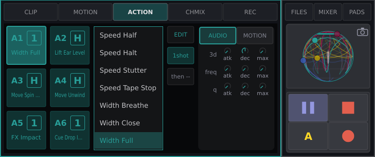

Left to right:

| Part | What it does |
| :--- | :--- |
| **A1–A6** | three rows of two, as the pads sit on the panel. Each shows its number, the name of its action and a badge, **1** (one-shot) or **H** (Hold). **A tap chooses the button**; everything to its right then shows and edits that one. It doesn't fire: the pads fire, on the panel and on PADS, and so does **A** in the global strip |
| the list | the action scripts. A tap puts that script on the chosen button; **no action** at the top clears it |
| **EDIT** | opens the chosen button's script in FILES › ACTIONS |
| **Hold** / **1shot** | the chosen button's mode: hold the clip for as long as the finger is down, or fire and let go. Tap to switch |
| **then** | what fires when this button's accent is over: another button of the channel (`then A3`), or nothing (`then --`). A tap steps it, two taps clear it |
| **AUDIO \| MOTION** | two tabs on top of the card. **AUDIO**: the accent — `atk`, `dec` and `max` for **3d**, for **freq** and for **q**. **MOTION**: what the button puts on the clip — every knob of the MOTION page, and CLIP's speed, direction and end |

A field is in the channel's colour when it carries an action and grey when it
doesn't; the chosen one has the thick outline; and a field turns **white while
its action runs**, the same as its pad. A button with nothing on it does
nothing at all. **Pressing an action pad** — on the panel or on PADS — fires
it and brings up this page with that button chosen; not with SHIFT, and not
while a take is armed or recording.

**The AUDIO tab** sets the accent: `atk` is how long it takes to rise, `dec`
how long to fall, in bars, and `max` how far it goes. The **3d** row raises the
channel's 3d from where you set it towards `max`; the **freq** and **q** rows
do the same for the filter's cutoff and resonance. A `max` of 0 switches that
row off.

<!-- QUESTION (maintainer): do the freq and q accents only ever raise the filter, like the 3d one, or can they lower it? The code says only "0 is off". -->

**The MOTION tab** shows each value as it will land. **Grey**: the action
leaves it to the clip, and the clip's own value is shown as a hint. **In the
channel's colour**: the action sets it. **Two taps** on a MOTION value, or on
**then**, hand it back to the clip (or to nothing after).

```{warning}
**What you set here is saved into the action — for everyone.** The script
file itself changes, a shipped one too. Every button on every channel that
carries the same action plays the change, and so does every set that names
it. To keep the original, make a copy first: **EDIT**, change something in
the text (a comment will do), then **Save as** in FILES.
```

<!-- QUESTION (maintainer): Save as is lit only while the editor holds unsaved text (scriptKeysFor: saveAs = unsaved), so an unchanged file can't be copied as it is -- the page now tells the DJ to change a comment first. Should Save as copy an unchanged file? -->

<!-- QUESTION (maintainer): FILES protects shipped files (Save stays dark unless Developer Mode is on, shippedFileMayBeOverwritten), but ACTION writes a turned value into the script in place, shipped or not (decided 2026-09-29, "always in place"). So a DJ with Developer Mode off can change a factory action by turning a knob, but can't save the same change typed in FILES. The page describes both as they are. Which one should give way? -->

How an accent rises and falls, what "the clip as it is now" means, chains and
two actions at once: see [How actions play](#motion-actions-play). How the
script is written: see [Scripting actions](#motion-scripting).

**On the panel** the four upper encoders sit under the page's columns:

| Encoder | Turn | Press |
| :--- | :--- | :--- |
| 1 | chooses A1–A6 | – |
| 2 | walks a highlight through the list; the button doesn't change yet | puts the highlighted script on the chosen button |
| 3 | moves a ring over EDIT, the mode and **then** | does what a tap on the ringed key does |
| 4 | switches AUDIO ↔ MOTION | the same |
| 5–8 | turn the marked row of the card, left to right (AUDIO: atk, dec, max) | mark the next row |

The ring and the row's outline appear once the encoder has been used. With
SHIFT every encoder is its channel's freq or Q, as on every page.

(motion-chmix)=

### CHMIX

The selected channel's strip of the mixer, in the bar: the same controls as
that channel's strip in [MIXER](#motion-mixer), laid out four by two like the
encoders.

| Control | What it does |
| :--- | :--- |
| **GAIN** | input gain. Double tap: full |
| **HIGH**, **MID**, **LOW** | the three EQ bands. Double tap: flat |
| **SEND** | how much of the channel goes to the FX bus, where the delay that follows the beat sits. Double tap: none |
| **CUE** | the channel on the headphones (its pre-fader cue send). Tap to switch |
| **FX** | puts the channel through the shared filter (FX FREQ, FX RES, FX MODE in MIXER). Tap to switch |
| meter, on the right | the channel's level, and its **VOL fader**: the handle is the volume. **Grab the handle** and drag, one to one; a drag that starts elsewhere on the meter does nothing. Double tap the meter: full volume |

(motion-rec)=

### REC

Making a take: a new recording of a shape, on the selected channel's clip.
The steps are in [How to record a take](#motion-howto-take).

| Field | What it does |
| :--- | :--- |
| **CLIP**, **SVG** | as on CLIP |
| **RECMODE** | tap to step **Touch → Latch → Write**; see [Touch, Latch, Write](#motion-rec-modes) |
| **LENGTH** × 4 | as on CLIP. **The lit key is how long the take will be** |
| **GAP-CONNECTOR** | two knobs. `fade`: how long the take's closing move lasts, which smooths the join where the end of the take meets its start. `bias`: where a gap the take never wrote leads. If in doubt, leave both alone |

On the panel, **REC** alone does nothing unless a take is running; then it
ends it.

(motion-files)=

### FILES

The library: what is on disk. Tap **FILES** in the global strip; it opens on
top of the sphere until you tap FILES again, a tab, or MENU. **FILES is for
preparing.** During a set you need **Load** and nothing else.

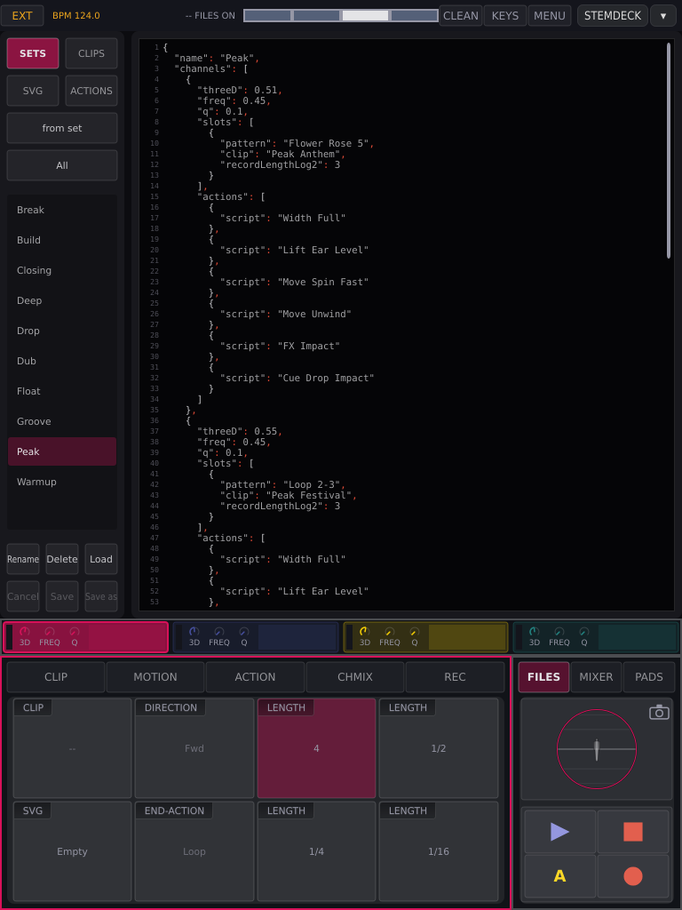

On the left, top to bottom: the four tabs **SETS**, **CLIPS**, **SVG** and
**ACTIONS**, two by two; **from set** / **from clip**; the filter; the list;
then the keys. On the right, the **editor** with the chosen file as text.

| Tab | What the list holds |
| :--- | :--- |
| **SETS** | which clip and which six actions each channel has, plus the channels' 3d, freq and Q and the length keys |
| **CLIPS** | clips: a shape with every value it is played with |
| **SVG** | the shapes, and nothing else |
| **ACTIONS** | the action scripts |

**Tapping a row only shows it** in the editor. Nothing on the device changes.
Drag the list to scroll it. When FILES opens, the list points at what the
selected channel holds; on CLIPS that clip's row carries the drift dot when
its values have been turned.

| Key | What it does |
| :--- | :--- |
| **Load** | puts the chosen row on the device: a set on all four channels, a clip or a shape on the selected channel, an action on the chosen action button |
| filter: **All** / **User** / **System** | tap to narrow the list to your own files or the shipped ones. It says what it shows now |
| **Rename** | opens the row for typing, with the keyboard. **Keep** (the same key) or ENTER settles it; Escape or leaving drops it. A name already taken is refused. Renaming a clip carries the new name into every set that uses it |
| **Delete** | says **Sure?**; the second press deletes. Anything else you do cancels it |
| **from set** / **from clip** | writes what is on the device now into the editor as text, unsaved, for Save as to keep |
| **Cancel** | puts the file's own text back |
| **Save** | writes the editor's text over the file, and every channel using that clip, shape or action picks it up at once. A set is only written; loading it stays Load's job |
| **Save as** | writes a copy into your own files, named after the file the editor shows ("Lift Up 2"); with no file shown, "Action". Lit only while the editor holds unsaved text — after **from set** / **from clip**, or once you have typed. The copy is not loaded: Load it to play it; a copy of an action made after EDIT goes onto that button |

**Unsaved text holds the list and the tabs**: a row tap, Rename, Delete or
another tab says `-- SAVE OR CANCEL` and flashes the two keys. A set or a shape
that would not load again cannot be saved; a script with an error can, and the
error shows under the editor. **Shipped files can't be written over**: Save
stays dark on them, and Save as is the way out (see Developer Mode in
[the menu](#motion-menu)). What the editor shows for each kind of file is in
[Under the hood](#motion-under-the-hood).

**Delete only removes the file.** Whatever is loaded keeps playing: a set's
file goes and the set stays loaded; a clip's files go and the sets that named
it are left alone. So you can tidy the library mid-set and the room won't
notice.

(motion-mixer)=

### MIXER

A software mixer for the four channels, with the A³ Mixer's own controls.
Anything you turn here, the desk sees too, and the other way round. Tap
**MIXER** in the global strip; it opens on top of the sphere until you tap
MIXER again, a tab, or MENU.

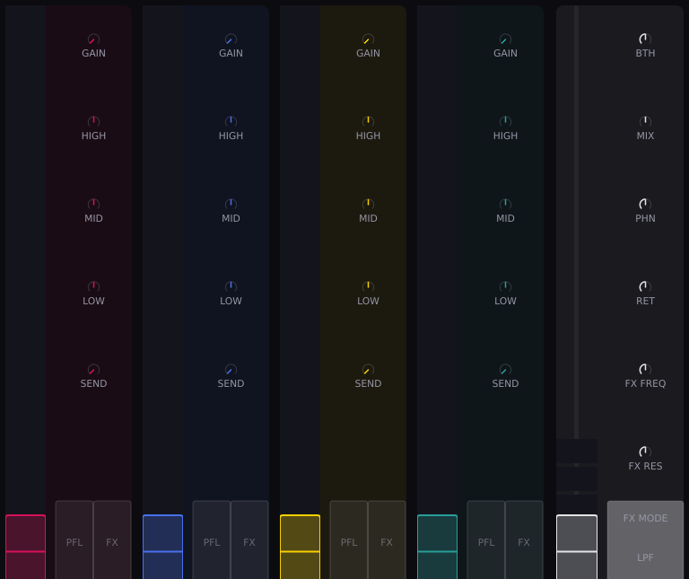

The knobs show what is really set, not what this device last did: a hand on
the desk moves them here too, and a restart mid-evening brings them back as
they are. That holds for the CUE and FX keys as well. The A³ Mixer has no
motor faders: turn a knob here and the hardware one stays put, and the next
touch on it takes over from wherever it sits.

**Four channel strips**, each with its meter on the left and, down the strip:

| Control | What it does |
| :--- | :--- |
| meter | the channel's level and its **VOL fader**: grab the handle and drag, one to one; elsewhere on the meter a drag does nothing. Double tap: full volume |
| **GAIN** | input gain. Double tap: full |
| **HIGH**, **MID**, **LOW** | the EQ. Double tap: flat |
| **SEND** | to the FX bus. **SEND comes up shut, and a double tap takes it back there** |
| **CUE**, **FX** | cue, and the channel through the shared filter. Tap to switch |

**The master column**, on the right:

| Control | What it does |
| :--- | :--- |
| the column | the **master fader**: grab its handle and drag, one to one. No double tap: full on the master is the one gesture that makes the whole room loud at once |
| output meters, at its foot | ten: the main sub and tops 1–9. Read only |
| **BTH** | booth level |
| **MIX** | headphone blend between cue and master. Double tap: the middle |
| **PHN** | headphone level |
| **RET** | the FX bus's return level. Double tap: none |
| **FX FREQ**, **FX RES** | the one filter shared by all four channels. Double tap: FREQ to the middle, RES to none |
| **FX MODE** | tap to switch the filter between **HPF** and **LPF** |

3D, FREQ and Q are not in the mixer: they are in the channel row.

(motion-pads)=

### PADS

Eight pads per channel, in two columns of four — the same on the panel and on
the PADS window, which puts the panel on the screen for a build without one.
Tap **PADS** in the global strip; it opens on top of the sphere until you tap
PADS again, a tab, or MENU.

| | left | right |
| :--- | :--- | :--- |
| row 1 | **Play\|Pause** | **PAGE** |
| row 2 | **A1** | **A2** |
| row 3 | **A3** | **A4** |
| row 4 | **A5** | **A6** |

The window is **the panel, key for key**: 44 square keys on the panel's grid
of ten columns and six rows, each where its button is on the device.

- **the four channels** in the middle, two columns of four each, in the bottom
  four rows. The top two rows stay empty, where the panel has its pots;
- **right**, top to bottom: **TAP**, **clock**, **REC**, **recmode**, **MENU**,
  **SHIFT**;
- **left**, top to bottom: **TAP** and **clock**, then the **scene column**
  (▶ A A A): **Play all**, **A1**, **A3** and **A5** on every channel.

A key on the screen is the panel's key: down while the finger is on it, up
when it lets go. **SHIFT or REC held on the screen** changes what a pad does,
exactly as on the panel, and a key counts as down while either the panel or the
screen holds it. A key's face lights while it is active: SHIFT held, a take
running, the menu open, TAP pressed or on the beat.

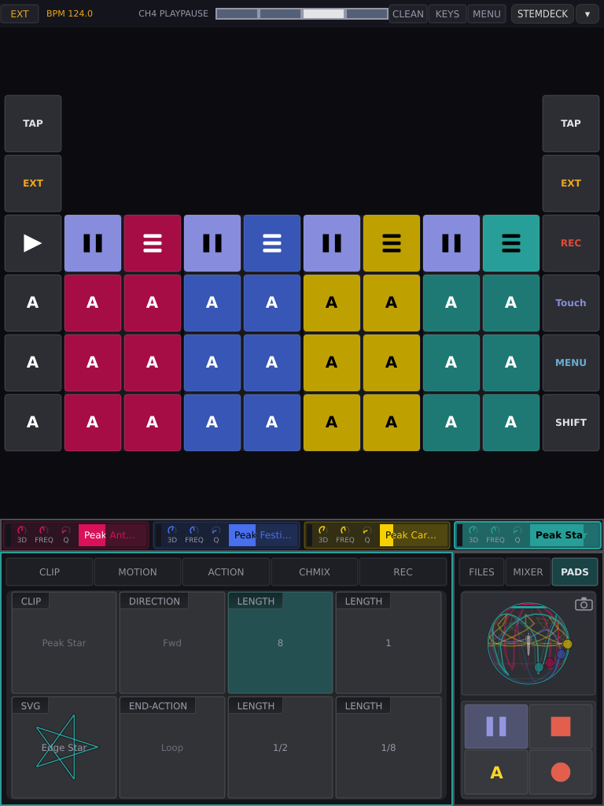

- **Play\|Pause** starts or stops the clip on the **next downbeat**.
  **SHIFT + Play\|Pause** does it now, which is also how you stop a running
  clip at once from the panel: there is no Stop pad.
- **PAGE** on another channel selects that channel. On the selected channel it
  steps through CLIP → MOTION → ACTION → CHMIX → REC; with SHIFT, backwards.
  It also closes FILES, MIXER or PADS.
- **A1–A6** fire that channel's action buttons, now.
- Pressing Play\|Pause or an action selects that channel in the bar, so what
  you read is what you just touched.
- The **scene column** on the left fires one pad on **all four channels**:
  **Play all** starts only the clips that are standing still; **A1**, **A3**
  and **A5** fire that action on every channel that has one. It is screen
  only: on the panel, the left column's lower four buttons are REC, recmode,
  MENU and SHIFT. There is no Stop all and no A2, A4 or A6 across channels any
  more.

What the pads show:

- Play\|Pause shows ▶ or ❚❚ and follows the clip: lit while it plays, blinking
  while it waits for the downbeat.
- An action pad is dim when it carries an action and dark when it doesn't, and
  **white while its action runs**.
- PAGE is lit on the selected channel.

**When it happens:**

| You press | It happens |
| :--- | :--- |
| Play\|Pause | on the **next downbeat**, starting and stopping alike |
| SHIFT + Play\|Pause | **now** |
| ■ on the screen | **now** |
| an action pad | **now** |
| SHIFT + an action pad | now, as a preview only the screen sees, for as long as it is held |
| a Cue | its clip is loaded now and starts on the **next downbeat** |
| SHIFT + a Cue | loaded and started **now** |
| Load a set | all four stop **now**; what the set says was playing starts together on the **next downbeat** (a shipped set: nothing) |
| a drag on the sphere | **now**, all the way |

<!-- GIF: howto-pads-page.gif | region: full screen 0,0,768,1024 | steps: tap ch3 PAGE (572,110); tap ch3 PAGE again | "PAGE on a channel selects it" / "PAGE again closes PADS" | round 2 -->

(motion-menu)=

### The menu

Opened with **MENU** in the status bar, left of STEMDECK, or MENU on the panel.
It opens on top of the sphere. **Nothing in the menu is needed to play.**

| Page | What it holds |
| :--- | :--- |
| **Skin** | which skin is loaded, as a list; the skin previews as you browse it with the arrow keys |
| **Skin Editor** | every value the loaded skin holds, grouped by what it is |
| **Button LEDs** | the colours of the panel's keys |
| **Pattern Folder** | where clips, shapes, actions and sets are read from |
| **Sphere in Menu** | **on**: the sphere keeps drawing behind the menu; **off**: it rests while the menu is open |
| **Developer Mode** | **on** lets Save write over shipped files |

```{warning}
**Developer Mode: leave it off on a gig.** With it on, Save in FILES writes
over the shipped sets, clips, shapes and actions.
```

**In the menu, a value only changes in its edit box**, never by brushing past
it:

| Gesture | What it does |
| :--- | :--- |
| drag the list, or the empty strips left and right of it | scrolls, the way a phone does |
| tap a row that leads to a page (Skin Editor, Button LEDs, Pattern Folder) | opens that page, at once |
| tap any other row | selects it |
| double tap a row, or ENTER | opens it: a list of its values (Skin, Sphere in Menu, Developer Mode), an edit box, or the colour picker |
| in a list of values | tap or ENTER chooses, and a tap chooses at once; Escape or back leaves without choosing |
| in an edit box | type with the keyboard; ENTER keeps; Escape, back or ✕ undo. A skin number also has **− / +** keys that step it while you watch |

Two fingers scroll as one. Inside a page — the Skin Editor and the
others — a tap selects a row and a double tap opens it, as above. **Mind the
double tap on the main menu's page rows:** the first tap has already opened
the page, and the second lands on whatever row is under your finger there.

**Getting out:** the **‹** (back) and **✕** (close) keys in the top right, and
MENU itself. Back and MENU close **one level**; ✕ closes all of it at once,
however deep. **Escape never quits the app.** In a booth, one elbow on a
keyboard shouldn't end your set.

<!-- GIF: howto-menu-navigate.gif | region: 0,0,768,660 | recorded 2026-09-30 (after the Network page left the menu), quiet-indigo-2, --fuzz 1% | steps: Tap MENU, tap Skin Editor, tap All values, drag the list, tap back, tap ✕. | "MENU opens it over the sphere" / "Tap a row: its page" / "Drag to scroll" / "‹ back: one level up" / "✕ closes all of it" | a page row opens on ONE tap; a double tap lands the second tap inside the page -->

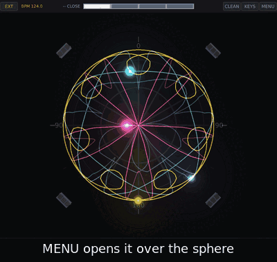

#### Skin

Double tap **Skin**: the rows give way to the list of skins. The arrow keys
↑ ↓ walk the list and preview each skin on the sphere; ENTER keeps the one
you are on, Escape or back puts the running one back. **A tap on a skin
chooses it straight away**, with no preview, and writes it into the device's
settings. Dragging the list only scrolls it.

<!-- QUESTION (maintainer): the preview is reachable only by the arrow keys (GlobalSettingsComponent::keyPressed → onPickerBrowsed); a drag scrolls without previewing, a tap applies and writes config.json (applySkin), and the panel's encoders don't reach the menu at all (handleEncoderTurn has no menu case, although previewSkin's comment speaks of "the encoder"). So on the device without a keyboard there is no way to look at a skin before it is chosen. Intended? -->

#### Skin Editor

Every value of the loaded skin, under headings: surfaces, text, states,
channels, sphere, type, touch, then the effects. At the top, five action rows:
**» Save**, **» Save as new**, **» Rename**, **» Delete** (asks "sure?") and
**» Reset** (every value back to the shipped default, keeping the name). They
fire only on a double tap or ENTER.

- A number opens the edit box with − / + to step it live, by a tenth of its
  value each press (whole numbers by one). Escape puts the number back.
- A colour opens the **colour picker**: drag on the picking surface (hue,
  saturation, lightness); the change is live; **done** closes it. There is no
  undo in the picker: whatever you dragged to is kept, and Escape doesn't
  close it. The picker counts channels from zero, so channel 1's colour is
  labelled `channels.0`.
- **Leaving the editor saves the skin**, changed or not. On the shipped
  default skin it saves a copy called **custom** and switches to it, so the
  default itself is never written over.

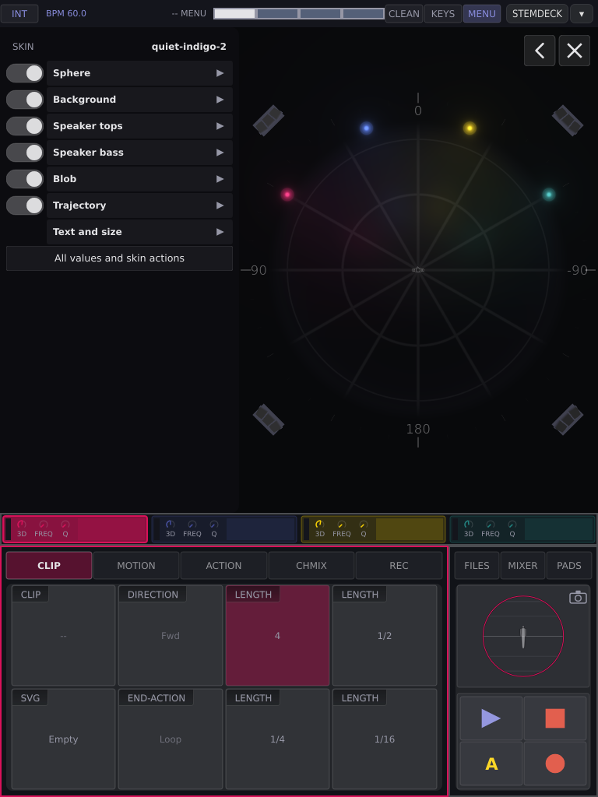

<!-- QUESTION (maintainer): the colour picker has no undo (closeColourPicker keeps what applyPickedColour already wrote into the document) and no Escape, while the edit box undoes the whole document on Escape (_documentBeforeMask). Should the picker undo on back/Escape like the edit box? -->

#### Button LEDs, Pattern Folder

Each shows only its own part of the device's settings, as rows: Button LEDs
the key colours; Pattern Folder the folder the library is read from. Double
tap a row to type a new value, or to pick a colour. The page is saved when you
leave it. Hosts, ports and addresses are not in the menu any more: see
[How to point the device at another Core](#motion-howto-network).

#### Sphere in Menu, Developer Mode

Double tap the row, tap **on** or **off**.

(motion-keyboard)=

### The keyboard

The device has its own keyboard. It takes the **bar's place** — where CLIP,
MOTION, ACTION, CHMIX and REC are — so the sphere, the channel row, the tabs
and the global strip stay in view, and every field you type into sits on top
of the sphere, never under the keys.

- **KEYS** in the status bar shows or hides it; its icon follows.
- It comes up by itself when there is something to type — a Rename in FILES
  (every tab, sets too), a touch in the FILES editor, a name or a value in the
  Skin Editor and the menu — and goes again when that is done.
- **HIDE** puts it away and leaves the field open.

**The keyboard is the panel.** Its 44 keys stand on the same grid as the
panel's 44 buttons and the [PADS](#motion-pads) window — ten columns, six
rows — so every key on the screen is the button in the same place on the
device. The letters are **QWERTY**:

| Row | col 0 | cols 1–8 | col 9 |
| :--- | :--- | :--- | :--- |
| 0 | **ESC** | — | **DEL** |
| 1 | **123** | — | **ENTER** |
| 2 | q | w e r t y u i o | p |
| 3 | a | s d f g h j k l | - |
| 4 | z | x c v b n m , . | / |
| 5 | **SHIFT** | ◀ ▶ **SPACE** (four wide) ' " | **HIDE** |

**123** swaps rows 2–4 for what scripts, clips and sets are written with, and
reads **ABC** there to come back:

| Row | Symbols (**123**) |
| :--- | :--- |
| 2 | 1 2 3 4 5 6 7 8 9 0 |
| 3 | - / : ; ( ) = + _ * |
| 4 | { } [ ] < > \ \| ! ~ |

There are no umlauts and no ß.

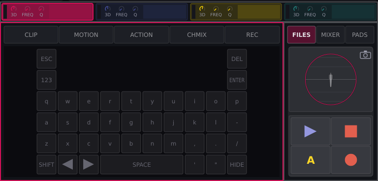

- **SHIFT** once: the next letter is a capital. Twice: caps lock. A third
  time: off.
- On the screen a key types when you **let go**: slide off a wrong key and
  nothing is typed. **DEL** and the arrows act at once and repeat while held.
- **ENTER** keeps what you typed and closes, in a name; in the FILES editor it
  is a new line, and **ESC** or **HIDE** put the keyboard away. **ESC** in a
  name, and Back or Close in the Skin Editor, undo it.

**From the panel: while the keyboard is up, the whole panel types.** Each of
the 44 buttons is the key drawn in its place — the pads are the letters; on
the left TAP is ESC and SHIFT is SHIFT, on the right TAP is DEL and SHIFT is
HIDE — and it types **as you press** it; DEL
and the arrows repeat while held. The pads and key LEDs show the keyboard: the
letters dim, the other keys in the skin's accent colour.

- **No clip fires and no key does its own job** while you type: no pad
  starts or stops anything, TAP taps no tempo, REC, MENU and SHIFT do nothing
  else. Clips that are running go on.
- **HIDE or ESC gives the panel back.** A key you pressed while typing is
  released to the keyboard too, so letting go of ESC never taps a tempo. A pad
  you were already holding when the keyboard came up lets go as usual.
- **Encoder 1** (channel 1, upper) moves the text cursor. The other encoders,
  SHIFT + encoder (freq and Q), the pots and the faders keep their jobs: the
  mix stays under your hands.

This reverses the earlier rule that the pads keep playing while you type:
open the keyboard only when you mean to type, and put it away with HIDE or
ESC before the next clip has to start.

(motion-reference-panel)=

## Reference: the panel

The hardware beside the screen. Each channel has a column: two encoders, a
pot and eight pads.

| Control | What it does |
| :--- | :--- |
| Encoders, two per channel | turn the field just above them on the screen; see below |
| SHIFT + encoder | upper: that channel's **freq**, lower: that channel's **Q**, whatever page is open |
| Pot, one per channel | **3d**: how much of the channel is in the room. Fully down, it's plain stereo, like any mixer. Turn it up, and the channel follows its blob |
| Pads, eight per channel | Play\|Pause and PAGE, then the six action buttons A1–A6 (see [PADS](#motion-pads)) |
| Function keys, six | TAP, clock, REC, recmode, MENU, SHIFT |
| Touchscreen | everything else |

**The eight encoders sit four by two, and so do the fields of CLIP, MOTION,
REC and CHMIX.** Without SHIFT an encoder turns the field above it:

| Page | Upper row of encoders | Lower row of encoders | A press on an encoder |
| :--- | :--- | :--- | :--- |
| CLIP | clip, direction, two lengths | shape, end, two lengths | on a length: plays at that length |
| MOTION | spin, swell, strX, strY | sway, clip-top, tswp, rswp | swaps to the other knob of the field: rot, reach, sqzX, sqzY / elv, clip-bot, tilt, roll |
| REC | clip, rec mode, two lengths | shape, fade, two lengths | on fade: swaps to bias |
| CHMIX | GAIN, HIGH, MID, LOW | SEND, CUE, FX, VOL | on CUE or FX: switches it |
| ACTION | A1–A6, the list, the key ring, AUDIO/MOTION | the four values of the card's marked row | list: assigns; key ring: presses; lower row: marks the next row; see [ACTION](#motion-action) |

Where an encoder has two knobs to choose from, the bar marks the one it is on.
The choice is remembered.

The six function keys sit as a **vertical column at each end of the panel**,
mirrored so either hand reaches them; a key is down while either side is down.
**clock** and **recmode** step their value on a press, as their screen twins
do. **SHIFT is on the panel and on the PADS window**: the SHIFT gestures on
this page need one of the two.

**While the keyboard is up, the panel is the keyboard:** every button types,
no pad fires and no function key does its own job; encoder 1 moves the text
cursor. HIDE or ESC gives the panel back. See [The keyboard](#motion-keyboard).

(motion-how-it-thinks)=

## How it thinks

(motion-clock)=

### Beat clock and clock modes

| Mode | Where the tempo comes from |
| :--- | :--- |
| **INT** | this device. Tap the beat display, or TAP on the panel |
| **EXT** | the beat analyser, listening to the music |
| **PIO** | Pioneer Pro DJ Link: the tempo master on the link |

**Which one?** PIO when you play CDJs on a link, or [StemDeck](stemdeck.md)
as master; INT and tap for vinyl or a lone laptop; EXT when the beat analyser
is fed the music. What each one needs on the other end is on the
[Beat Analyzer](beat-analyzer.md) page.

In EXT and PIO, A³ Motion counts on by itself between beats and pulls itself
gently onto each beat that arrives. If the beats stop coming, it carries on at
the last tempo it had: clips keep playing, and slowly drift off the music
until the beats come back.

**The clock lives in one place**: the clock key top left, or **clock** on the
panel. It is not in the menu, and not saved in a set, because every booth is
wired differently. Check it at soundcheck, not at the drop. The rec mode isn't
saved in a set either.

(motion-start-up)=

### When the device comes up

A³ Motion asks A³ Core where each sound already is, and takes the answer
before it says anything itself. So switching the device on, or restarting it
mid-evening, doesn't move the room: the blobs appear where the sound actually
is, and the pots are where they were.

Loading a **set** is the other way round. That is a deliberate act, so the set
wins: it stops what was running, sets each channel's 3d, freq and Q, and
starts what the set says was running again, from the top, on the next
**downbeat**. Four clips starting together is the whole point of a set. The
shipped sets say nothing was running, so they load standing still; Play all on
PADS starts all four.

(motion-shape-on-sphere)=

### How a shape sits on the sphere

The recorded shape is a flat disc, wrapped over the room like a cap centred on
the height `elv` sets. A point pushed past `clip-top` or `clip-bot` keeps its
direction and only gives up its height, so a shape reaching into the ceiling
travels *around* it.

**`rot` goes all the way round**, the only knob that does: turn it far enough
and the shape is back where it began. **A spin that isn't running turns
nothing**: switched off, the shape stays at whatever angle it stopped at.

**The squeeze belongs to the shape.** Squeeze a circle into an ellipse and set
it spinning, and the ellipse turns with it.

(motion-rec-modes)=

### Touch, Latch, Write

Recording runs round and round inside the take's length, so each pass writes
over the pass before it. The **rec mode** says how much of the old take a pass
destroys, and it shows its own colour. If you know DAW automation, these are
the same three modes:

| Mode | What it does | Use it for |
| :--- | :--- | :--- |
| **Touch** | only changes where your finger is. Lift it, and the old movement carries on | drawing, and fixing a corner |
| **Latch** | once you've touched, the rest of the pass follows your finger's last spot, and the shape that was there is gone | parking a sound |
| **Write** | records over the whole pass, finger or not | starting clean |

**Drawing a shape? Use Touch, not Latch.** In Latch, lifting your finger
halfway parks the rest of the pass on that spot: a shape that goes somewhere
and then just… stays there.

A take is always the **last pass you finished**: stop halfway through one and
that half is dropped. Knob lanes are written with the same rec mode.

(motion-actions-play)=

### How actions play

**The accent** rises while an action pad is held, stays up as long as it is
held, and falls when you let go: `atk` is how long it takes to rise, `dec` how
long to fall, in bars. Your finger is the sustain, which is why there is no
sustain control. On the 3d row, the knob in the channel row shows the floor
you set, and the arc from there to where the accent has taken it is filled in.
When the fall is over, the clip does what its END-ACTION says, once.

**Hold or 1shot.** A Hold action belongs to your finger: it lasts while the
pad is down. A 1shot fires and runs its course on its own, like a sample pad.

**Actions are relative.** An action is worked out the moment you press,
against the clip as it is then: *half* halves whatever the clip is doing right
now, so the same pad hits harder on a wide clip than on a tight one.

**A random action is random once**, when you put it on the button. After that,
the pad lands in the same place every time, so you can learn it. Put it on
again to roll the dice again.

**Chains.** When a button's accent is over, the button its **then** names
fires, as a one-shot (no finger holds it). Chains may loop; to get out, press
another action pad, Play\|Pause or ■ on that channel.

**Two actions at once:** the last one pressed wins, and when it has fallen the
clip is back to itself, not to the first action.

**The set only names the actions.** What a button does lives in its script,
so every set that uses an action plays it the same way.

(motion-touchscreen)=

### Why the screen is not optional

The screen *is* the instrument. Menus, lists and the bar are driven by touch;
without the screen, the panel can't drive the device. Treat it like your CDJ
screens, and keep the drinks on the other side.

## The library

### Sets and moods

The library ships **50 shapes, 50 clips, 50 actions and 10 sets**, laid out along
**the arc of a night**: from the first half-empty hour, through the build and the
peak, to the last record. Every name starts with a **prefix** that says where it
belongs, so things that belong together sit together in every list in FILES:

| Kind | Prefix | Example |
| :--- | :--- | :--- |
| Sets | the phase of the night — the set *is* the prefix | `Peak` |
| Clips | the phase they are made for | `Peak Anthem` |
| Actions | what they do: **Move**, **Lift**, **Width**, **Speed**, **Dub**, **FX**, **Cue** | `Lift Up`, `FX Riser`, `Cue Peak Anthem` |
| Shapes | the family of the shape | `Flower Rose 5` |

The ten phases, in the order a night usually runs:

`Warmup · Groove · Build · Peak · Drop · Break · Dub · Deep · Float · Closing`

**Only FX changes the sound.** Every other action moves the sound through the
room and leaves the channel's 3d, filter and resonance alone. So a button you
have never pressed before can be pressed in front of a full floor: at worst the
sound ends up somewhere unexpected in the room, while the mix stays as you left it.

What makes a movement read one way or the other is well studied:

- **Speed carries energy.** Faster turns and tempo-locked cycles read as more energetic; long,
  slow cycles as calm.
- **Height carries lift.** Up and overhead reads as open and bright, low and under the floor as
  heavy and dark.
- **Coming closer raises the tension.** Sound that approaches is heard as more arousing than
  sound that recedes, above all when it is already dark.
- **Smooth or angular.** Circles, roses and Lissajous figures read as pleasant; corners, zigzags
  and sudden jumps as tense.

The moods are placed on the **mood meter**: energy, from calm to driving, against
pleasantness, from dark to open. The actions name the quarter they move the room
towards:

| Quarter | Energy | Feel |
| :--- | :--- | :--- |
| **Q1** euphoric | up | open, bright |
| **Q2** driving | up | tense, dark |
| **Q3** deep | down | dark, heavy |
| **Q4** calm | down | open, soft |

And the vocabulary the shapes and actions are made from:

- **Smalley's motion typology.** Rising and falling, oscillation, rotation around a centre,
  flying out from it or into it, dilation and contraction, vortex.
- **Rhythm cells.** The four-to-the-floor kick, the off-beat hi-hat, the tresillo (3+3+2) that EDM
  builds its tension on, the son clave in both directions, the shuffle and the gallop. A position
  that jumps on their sixteenths grooves in space.
- **Dub.** The desk as instrument: throws into the delay, repeats that fall away, filter
  sweeps, spring reverb, reversed tape.
- **Build-up, drop, breakdown.** The build widens, rises and opens the filter; the drop releases
  it all at once; the breakdown strips it back.

#### The ten sets

One set per phase. Each loads the phase's first four clips onto channels 1–4;
the fifth clip of the phase is the **spare**, for a Cue or for loading by hand
from FILES › CLIPS.

| Set | Clips (channels 1–4) | Spare | A1 / A2 | A3 / A4 | A5 (FX) | A6 (Cue) |
| :--- | :--- | :--- | :--- | :--- | :--- | :--- |
| Warmup | Halo, Breath, Sunrise, Horizon | Drift | Lift Up / Width Close | Move Spin / Move Freeze | FX Swell | Cue Groove Four Floor |
| Groove | Four Floor, Tresillo, Clave, Offbeat | Shuffle | Move Spin / Speed Half | Speed Double / Move Freeze | FX Punch | Cue Build Riser |
| Build | Riser, Pulse, Loop, Gallop | Vortex | Width Open / Width Close | Speed Double / Speed Half | FX Riser | Cue Peak Anthem |
| Peak | Anthem, Festival, Carousel, Star | Euphoria | Width Full / Lift Ear Level | Move Spin Fast / Move Unwind | FX Impact | Cue Drop Impact |
| Drop | Impact, Warehouse, Strobe, Whirlwind | Ping Pong | Speed Stutter / Speed Halt | Width Full / Width Point | FX Punch | Cue Break Standstill |
| Break | Standstill, Collapse, Monolith, Suspend | Heartbeat | Lift Overhead / Move Freeze | Width Breathe / Width Point | FX Sweep | Cue Build Pulse |
| Dub | Echo, Pendulum, Tunnel, Kepler | Skank | Dub Spring / Dub Stitch | Dub Bounce Back / Dub Echo Throw | FX Sweep | Cue Deep Undertow |
| Deep | Undertow, Sub, Fog, Lurk | Cellar | Lift Sway / Lift Floor | Move Rock / Lift Down | FX Resonate | Cue Float Aurora |
| Float | Aurora, Canopy, Blossom, Lullaby | Cloud | Lift Overhead / Width Close | Width Breathe / Move Unwind | FX Swell | Cue Closing Sunset |
| Closing | Sunset, Farewell, Tide, Ember | Still | Lift Up / Lift Down | Width Open / Speed Tape Stop | FX Swell | Cue Warmup Halo |

<!-- QUESTION (maintainer): the layout rule below says A3 is a strong "more", but Break and Float carry Width Breathe on A3, whose own Mood: line says "less" (library agent, 37b2001). The table shows what ships. Swap the actions, or change the rule? -->

The clip names in the table leave out the phase: channel 1 of *Peak* plays
`Peak Anthem`. All four channels of a set carry the same six actions.

**The six buttons sit the same way in every set**, so the hands learn one
panel rather than ten:

| | left | right |
| :--- | :--- | :--- |
| **top row** (A1 / A2) | a gentle **more** | a gentle **less** |
| **middle row** (A3 / A4) | a strong **more** | a strong **less** |
| **bottom row** (A5 / A6) | **FX** — the one button that changes the sound | **Cue** into the next phase |

*More* moves the room towards energy and openness, *less* towards calm and
weight. Every action script says which it is on its `Mood:` line.

<!-- GIF: howto-library-load-set.gif | region: 0,0,768,1024 | recorded 2026-10-01, quiet-indigo-2, --fuzz 0 (quantized before optimizing) | steps: With four channels playing, open FILES › SETS, tap Warmup, tap Load, close FILES: the set is loaded, stopped. | "Four channels playing" / "FILES › SETS" / "Tap Warmup: it only shows" / "Load: the set is on, all stopped" / "Close FILES, then ▶ when ready" | a shipped set loads stopped, so it ends with FILES closed and ▶ ready -->


#### Across a night

The A6 Cues chain the sets into the arc of a night:

- **The main line:** Warmup → Groove → Build → Peak → Drop → Break, and Break
  cues **Build** again, because after a breakdown comes the next build and the
  next drop. Round that loop as often as the floor asks for it.
- **The side road:** Dub → Deep → Float → Closing, and Closing cues **Warmup**
  for the next night (or the next DJ).
- **Getting onto the side road** is up to you: load the Dub or the Deep set in
  FILES, or put one of the two spare Cues on a button — **Cue Dub Echo**, the dub
  escape, or **Cue Closing Still**, the emergency calm for when the fire alarm
  goes off.

**A Cue works on its own channel.** A6 on channel 2 puts the next phase's clip on
channel 2 and nowhere else, so you can walk the room into the next phase one
channel at a time. PADS' scene column fires only A1, A3 and A5 across the
channels, so no key cues the same clip onto all four at once; for all four
clips of the next phase, **Load the next set** in FILES.

**How a Cue plays:**

- The clip is loaded onto the channel and starts on the **next downbeat**; the
  old clip plays on until then. **SHIFT + Cue** starts it at once.
- The clip **stays**. A Cue fires no accent and nothing comes back afterwards:
  it changes *what* plays, not *how* it plays, like a clip launcher.
- While a take is recording on that channel a Cue does nothing; with a take
  waiting to be saved it says `-- SAVE THE TAKE FIRST`. A Cue whose clip has been
  deleted or renamed says `-- NO SUCH CLIP`.
- A Cue can cue any clip, your own takes included: copy one and change the
  clip it names (see [Scripting actions](#motion-scripting)).

<!-- GIF: howto-library-cue.gif | region: full screen 0,0,768,1024 | steps: load set "Warmup"; play all; open PADS (730,700); tap ch1 A6 (724,255); wait for the downbeat, 3 s | "A6: the Cue into the next phase" / "Groove Four Floor on the downbeat" / "The clip stays" -->

<!-- GIF: howto-library-cue-shift.gif | region: pads 0,36,768,590 | steps: set "Warmup" playing; hold SHIFT; tap ch2 A6; release SHIFT | "SHIFT + Cue: at once" -->

#### Shapes (50)


A shape is the path alone — no speed, no height, no width; the clip adds those.
They are named `<Family> <Name>`. On disk the file name starts with the
shape's **length in beats**: `04_Rhythm_Four_Floor.svg` is one bar,
`32_Spiral_Riser.svg` eight. The number in brackets below is that length.

| Family | Shapes | Idea |
| :--- | :--- | :--- |
| **Rhythm** (9) | Four Floor (4), Offbeat (4), Tresillo (4), Ping Pong (4), Shuffle (4), Gallop (4), Clave 3-2 (8), Clave 2-3 (8), Echo (16) | positions that jump on the beat grid |
| **Orbit** (6) | Arc (8), Pendulum (8), Circle (16), Ellipse (16), Pulse (16), Kepler (32) | round the listener, or swinging |
| **Loop** (6) | Figure 8, Infinity, 1-2, 2-3, 3-2, 3-4 (all 16) | Lissajous loops: two tempos crossing |
| **Spiral** (5) | Collapse (16), Riser, Vortex, Helix, Breath (32) | out of the middle or into it |
| **Flower** (9) | Rose 3, Rose 4, Rose 5, Rose 7, Clover, Petal, Heart, Trefoil, Blossom 8 (all 16) | petals: smooth and open |
| **Cycle** (5) | Epi 3-1 (16), Epi 5-2, Epi 7-3, Hypo 5-3, Hypo 7-2 (32) | gears: loops inside a turn |
| **Edge** (8) | Square, Triangle, Diamond, Corner (4), Star, Zigzag, Cross (8), Astroid (16) | angular, tense |
| **Wander** (2) | Wave (16), Drift (32) | organic, no fixed shape |

The rhythm shapes are points, not lines — the sound jumps from one to the next
on the sixteenths of its rhythm:

- **Four Floor:** a jump on every beat, front → right → back → left.
- **Offbeat:** a jump on every off-beat eighth between two points — the house hi-hat.
- **Tresillo:** 3+3+2 sixteenths, the cell EDM builds its tension on before a drop.
- **Clave 3-2** and **Clave 2-3:** the son clave over two bars, either way round.
- **Ping Pong:** left and right.
- **Shuffle:** swung eighths between two points.
- **Gallop:** the sixteenth gallop, x.xx on every beat, over three points.
- **Echo:** throws that halve, like a delay's repeats.

#### Clips (50), by phase

A clip is a shape plus everything it is played with: speed, height, width,
spin, the accent. Five per phase, named `<Phase> <Name>`; the first four are
the set's, the fifth is the spare.

| Phase | Clips (shape) | Character |
| :--- | :--- | :--- |
| **Warmup** | Halo (Orbit Circle), Breath (Spiral Breath), Sunrise (Flower Rose 7), Horizon (Loop Infinity) · spare: Drift (Wander Drift) | slow, high, open |
| **Groove** | Four Floor (Rhythm Four Floor), Tresillo (Rhythm Tresillo), Clave (Rhythm Clave 3-2), Offbeat (Rhythm Offbeat) · spare: Shuffle (Rhythm Shuffle) | jumps on the beat grid, at ear height |
| **Build** | Riser (Spiral Riser), Pulse (Orbit Pulse), Loop (Loop 3-4), Gallop (Rhythm Gallop) · spare: Vortex (Spiral Vortex) | opening, speeding up, rising |
| **Peak** | Anthem (Flower Rose 5), Festival (Loop 2-3), Carousel (Cycle Epi 7-3), Star (Edge Star) · spare: Euphoria (Flower Trefoil) | wide, fast, lifted |
| **Drop** | Impact (Edge Astroid), Warehouse (Edge Square), Strobe (Edge Corner), Whirlwind (Cycle Epi 3-1) · spare: Ping Pong (Rhythm Ping Pong) | hard, angular, close |
| **Break** | Standstill (Orbit Arc), Collapse (Spiral Collapse), Monolith (Edge Diamond), Suspend (Loop Figure 8) · spare: Heartbeat (Flower Heart) | still, suspended, drawn in |
| **Dub** | Echo (Rhythm Echo), Pendulum (Orbit Pendulum), Tunnel (Spiral Helix), Kepler (Orbit Kepler) · spare: Skank (Rhythm Offbeat) | throws, swings, near and far |
| **Deep** | Undertow (Spiral Collapse), Sub (Orbit Circle), Fog (Wander Drift), Lurk (Wander Wave) · spare: Cellar (Cycle Hypo 5-3) | low, slow, dark |
| **Float** | Aurora (Loop 1-2), Canopy (Cycle Hypo 7-2), Blossom (Flower Petal), Lullaby (Loop Figure 8) · spare: Cloud (Flower Clover) | overhead, slow, smooth |
| **Closing** | Sunset (Flower Rose 4), Farewell (Spiral Collapse), Tide (Wander Wave), Ember (Orbit Ellipse) · spare: Still (Orbit Circle) | descending, slowing, settling |

<!-- QUESTION (maintainer): the Character column comes from the library plan; the clip JSON files carry no mood text of their own. Should they, like the actions' Mood: line? -->

Plus **Default**: no shape. It is what a channel with no clip falls back on,
not something to play.

Some shapes turn up in several phases — Orbit Circle is a calm *Halo* in the
warm-up, a heavy *Sub* in Deep and a *Still* at closing time. The shape is the
path; the clip decides whether it floats overhead or rumbles under the floor.

#### Actions (50)

An action changes the clip for as long as its accent lasts, then the clip comes
back to itself (see ACTION). The prefix says what it changes:

- **Move, Lift, Width, Speed, Dub** only move the sound: turns, height, spread,
  tempo of the shape, dub tricks in space. 3d, filter and resonance stay where
  you set them.
- **FX** are the only actions that change the sound — 3d and the filter.
- **Cue** loads a clip and plays it (see *Across a night* above).

**Mode**: **Hold** acts for as long as the pad is held; **1shot** fires and lets
go. In the tables, *more* moves the room towards energy and openness, *less*
towards calm and weight, and Q1–Q4 is the quarter of the mood meter it heads for.

**Move** — turns, direction, stillness:

| Action | What it does | Mood | Mode |
| :--- | :--- | :--- | :--- |
| Move Spin | the shape turns once every two bars | more — a steady turn; groove (Q1) | Hold |
| Move Spin Fast | a turn every half bar | more — rush; peak energy (Q1) | Hold |
| Move Unwind | the turn runs the other way, slowly | less — release; the turn let go (Q4) | Hold |
| Move Reverse | the shape runs backwards | less — the same idea from behind | Hold |
| Move Bounce | the shape bounces at its ends from here on | more — back and forth; playful (Q1) | 1shot |
| Move Freeze | everything holds still at one height | less — time stops; suspended (Q3/Q4) | Hold |
| Move Tilt | the shape leans forward and rocks | more — the room tips towards you (Q1/Q2) | Hold |
| Move Rock | the shape swings up and down the room | more — a swing; groove (Q1) | Hold |
| Move Mirror | the shape turned half round and run backwards | less — a reflective turn | Hold |

**Lift** — height:

| Action | What it does | Mood | Mode |
| :--- | :--- | :--- | :--- |
| Lift Up | the shape rises a third of the way to the ceiling | more — lifts gently; bright (Q4 → Q1) | Hold |
| Lift Overhead | the shape snaps to the cap above the listener | more — up and bright (Q1) | 1shot |
| Lift Ear Level | a band at ear height: any clip becomes a ring | less — grounded, steady (Q4) | Hold |
| Lift Down | the shape sinks below ear height | less — weight; darker (Q3) | Hold |
| Lift Floor | the sound goes under the floor | less — heavy, dark (Q3) | Hold |
| Lift Sway | the height sways on the bar | more — a slow swell of height (Q4 → Q1) | Hold |

**Width** — spread:

| Action | What it does | Mood | Mode |
| :--- | :--- | :--- | :--- |
| Width Open | the shape spreads half again as wide | more — opens the room (Q1) | Hold |
| Width Full | the shape thrown to the whole sphere | more — everything, everywhere (Q1/Q2) | 1shot |
| Width Close | the shape halves its spread | less — focused, intimate (Q3/Q4) | Hold |
| Width Point | everything pulls in to one point | less — the sound comes close; tension (Q2) | Hold |
| Width Breathe | the spread opens and closes slowly | less — a calm breath (Q4) | Hold |
| Width Squash | pressed flat, springs back when you let go | less — pressure (Q2/Q3) | Hold |

**Speed** — the tempo of the shape:

| Action | What it does | Mood | Mode |
| :--- | :--- | :--- | :--- |
| Speed Double | the shape plays twice as fast | more — energy up, same shape (Q1/Q2) | Hold |
| Speed Half | the shape plays half as fast | less — energy down, same shape (Q4/Q3) | Hold |
| Speed Stutter | the shape chatters at a sixteenth | more — nervous; a stutter edit in space (Q2) | Hold |
| Speed Tape Stop | the shape winds down and stands still | less — the motor stops; the end of a phrase (Q3) | 1shot |
| Speed Halt | everything that moves on its own stops, and the pass ends | less — the reset | 1shot |

**Dub** — the dub desk's moves, played in space instead of on the sound:

| Action | What it does | Mood | Mode |
| :--- | :--- | :--- | :--- |
| Dub Echo Throw | the dub throw: reversed, bouncing, gliding out | less — a repeat that trails away (Q3) | 1shot |
| Dub Bounce Back | a hard swing out and back | more — a throw that returns (Q2) | 1shot |
| Dub Reverse Tape | backwards and slower, like a tape turned over | less — the reverse tape trick (Q3) | Hold |
| Dub Spring | a spring-reverb shake: a fast swell, short | more — a splash (Q2) | 1shot |
| Dub Scatter | somewhere else every time it is put on a button | more — a surprise; playful | 1shot |
| Dub Stitch | the gaps in a take glide shut | less — smooth, calm (Q4) | Hold |

**FX** — the only ones that change the sound:

| Action | What it does | Mood | Mode |
| :--- | :--- | :--- | :--- |
| FX Punch | depth hits, nothing moves | more — weight on the one; driving (Q2) | 1shot |
| FX Sweep | the filter opens over two bars, nothing moves | more — the dub woosh; tension that lifts | Hold |
| FX Resonate | the resonance creeps up | more — slow tension (Q3 → Q2) | Hold |
| FX Riser | four bars of build: spread, spin, filter | more — the build before the drop (Q2 → Q1) | Hold |
| FX Impact | the drop: everything at once, then a long fall | more — the release; impact (Q2 → Q1) | 1shot |
| FX Swell | depth and filter rise together, gently | more — a warm lift (Q4 → Q1) | Hold |

**Cue** — load a clip, play it on the next downbeat:

| Action | Loads | On A6 of |
| :--- | :--- | :--- |
| Cue Groove Four Floor | Groove Four Floor | Warmup |
| Cue Build Riser | Build Riser | Groove |
| Cue Peak Anthem | Peak Anthem | Build |
| Cue Drop Impact | Drop Impact | Peak |
| Cue Break Standstill | Break Standstill | Drop |
| Cue Build Pulse | Build Pulse | Break |
| Cue Deep Undertow | Deep Undertow | Dub |
| Cue Float Aurora | Float Aurora | Deep |
| Cue Closing Sunset | Closing Sunset | Float |
| Cue Warmup Halo | Warmup Halo | Closing |
| Cue Dub Echo | Dub Echo | — the dub escape |
| Cue Closing Still | Closing Still | — the emergency calm |

**README** in the ACTIONS list is not an action but the scripting manual.
Firing it changes nothing.

<!-- GIF: howto-library-assign-cue.gif | region: 0,672,578,352 | recorded 2026-09-29, 7.5 s | steps: On channel 2's ACTION page tap A6, then tap Cue Dub Echo in the list: A6 carries it. | "Channel 2, ACTION" / "Tap A6: the list shows its script" / "Tap Cue Dub Echo: A6 carries it" | A6 set to Cue Drop Impact beforehand, so Cue Dub Echo sits right below it without scrolling -->


### The research behind it

The research this rests on:

- Russell's circumplex model of affect, and the Mood Meter built on it;
- studies of approaching and receding sound (Tajadura-Jiménez et al., *Embodied auditory
  perception*, 2010);
- the mapping of pitch and height;
- Denis Smalley's *Spectromorphology* (1997);
- Stockhausen's work with rotating sound, which found that past about sixteen rotations a second,
  movement stops being heard as movement at all;
- dub and dance-music production practice.

(motion-under-the-hood)=

## Under the hood

For scripters and technicians. Nothing here is needed to play.

(motion-scripting)=

### Scripting actions

**The FILES editor** edits every kind of file: sets and clips as JSON, shapes
as SVG, actions as scripts.

**What ACTION writes.** Every knob on the ACTION page, the mode, **then** and
every MOTION value changes exactly one line of the chosen button's script
(`~spin = 3;`, `~envelopeMax = 0.5;`, `~then = 3;`); your comments and every
other line stay as you wrote them. A line that was commented out is switched
on, a missing one is added, and a random value (`rrand`) becomes the number
you turned to. **Two taps** on a MOTION value, or on **then**, comment the line
out again.

- **The editor follows.** If FILES shows the same script, its text changes
  with the knob — also while you are typing in it; what you typed stays.
- **Written when the hand stops**, about a third of a second after the last
  turn, and before a set is loaded or FILES saves, renames or deletes.

**A Cue** is a script with one line, `~clip = "Peak Anthem";`. Copy one with
**Save as**, change the name in the quotes, **Save**, and it cues any clip you
like — your own takes included.

**Every shipped action script** carries a `Mood:` line under its title that
says which way it moves the room, and a line that says why. **README** in the
ACTIONS list is the language's manual, written as a script whose every line is
a comment.

(motion-system)=

### A³ Motion and the rest of the system

A³ Motion talks to A³ Core, the A³ Mixer and the beat analyser over OSC. The
full list of messages is in the [OSC reference](../ressources/osc.md).

- **Positions:** each channel's azimuth and elevation go to Core while its
  blob moves. At start-up Core is asked where each sound already is (see
  [When the device comes up](#motion-start-up)).
- **3d** crossfades the channel between its stereo and its multichannel
  encoder in A³ Core; **freq** and **Q** are its filter.
- **CHMIX and MIXER** send the same messages the A³ Mixer sends. Core passes
  on whatever REAPER reports, which is why a hand on the desk or in REAPER
  moves the knobs on the screen too.
- **The meters and the lightning** are the levels Core's audio engine sends
  back: the four channels, the subwoofer and the four speakers.
- **The clock:** in INT the device sends `/beat`; in EXT it follows the
  `/beat` the beat analyser sends; a tap on the beat display or on TAP sends
  `/tap` in every mode.
- **SHIFT + an action pad** plays the action with the messages to Core held
  back, which is why only the screen sees the preview.
- **Hosts, ports and addresses** come from `a3-osc.json`, not from the
  device's own settings. See
  [How to point the device at another Core](#motion-howto-network).

### The squeeze, in numbers

The squeezes `sqzX` and `sqzY` are bipolar, with their middle at zero, and
multiply their axis by 2^value: half at one end, double at the other. X is
front to back, Y is left to right. **The squeeze happens before the turn**, so
the ellipse belongs to the shape and travels with it.

### The panel's electronics

An ESP32-S3 (`esp32-s3-devkitc-1-n16r8`) reads the panel's buttons, encoders,
pots and LEDs, and talks to the Raspberry Pi over a binary poll-frame protocol
on USB serial.

## Specs

Current revision, V03:

- PoE, 31.5 W max
- Raspberry Pi 5 running the touchscreen UI
- ESP32-S3 for the panel's buttons, encoders, pots and LEDs
- 7" capacitive multi-touch display
- A³ Motion Buttonmatrix PCB V03, A³ Motion Mainboard PCB V03

Earlier revisions are listed under
[Configuration](https://a3-audio.github.io/a3-doc/configuration/moc.html).
