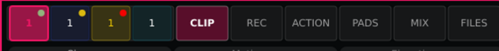
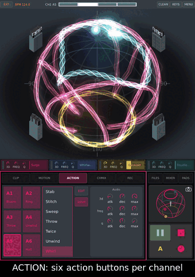

# A³ Motion

- [A³ Motion Repository](https://github.com/a3-audio/a3-motion)
- Standalone OSC controller
- 7" full-color capacitive multi-touch display

A³ Motion records and plays back **movement trajectories**: where each of the
four channels sits in the room, and how it travels through it. It makes no
sound of its own — it sends positions to A³ Core over OSC, and Core moves the
sound. A clip is one figure together with every value it is played with. Each
channel holds **one clip** and **six action buttons**, and a set is which clip
and which six actions each channel has.

Playback follows a beat clock, so a figure that takes four bars keeps taking
four bars when the tempo changes.

## The panel

Every control has one job and keeps it whatever is on screen. A knob that
means something different depending on the page is a knob you have to look at.

| Control | What it does |
| :--- | :--- |
| Upper encoder, per channel | **freq** — that channel's filter frequency |
| Lower encoder, per channel | **Q** — that channel's filter resonance |
| Potentiometer, per channel | **3d** — crossfades the channel between its stereo and its multichannel encoder in A³ Core |
| Pads, eight per channel | Play\|Pause and PAGE, then the six action buttons A1–A6 (see PADS below) |
| Function keys, six | TAP, clock, REC, recmode, MENU, SHIFT |
| Touchscreen | everything else |

Pressing an encoder does nothing. The six function keys sit as a **vertical
column at each end of the panel**, mirrored so either hand reaches them; a key
is down while either side is down.

**The touchscreen is not optional.** Since the touch rework the encoders no
longer navigate anything, so with the screen out the device cannot be driven.
That trade was made knowingly.

## [3] DISPLAY
- This full-color multi-touch display shows information relevant to A³Motion’s current operation. Touch the display (and use the hardware controls) to control the A3Motion interface. See Operating Instrucions to learn how to use some basic functions

The screen has three bands. Along the top sits the status bar, and it is
deliberately almost empty: the current tempo on the left, the beat grid in the
middle — it fills as the bar runs — and the MIX key on the right. It carried
nine level meters for two days and they made the one band that is always in
view the busiest thing on the screen.

The middle band is the room seen from straight above, with you — the listener —
in the middle at ear height. Each channel is a coloured blob sitting where its
sound is; it swells and throws sparks with that channel's input level, and
dragging it moves the sound. A playing clip draws its trajectory as a braid of
three strands of plasma with the blob travelling inside it. What runs behind
the sphere is drawn darker than what runs in front of it.

At the four corners stand the speakers, each a tower of three tops over four
subs, on a dark floor below your feet. Lightning comes out of the tops and
flickers across the floor towards the middle: thicker, and more of it, on the
speaker that is playing loudest, and none at all when the room is silent. The
subs throw ball lightning with the bass. The field around the sphere shows
where the energy in the room is coming from.

The small ball in the top right corner is the view. Drag on it to tilt and
turn the room; a double tap on it takes the view back to straight above.

The four coloured cells at the left of the tab row are the channels. Each
carries a **signal dot** in its top right corner: the channel's input level,
in the same green / yellow / red the meters use, brighter the louder it is —
and **gone entirely when the channel is silent.**

That is the question you actually have mid-set — *is this channel making
sound, and roughly how hot* — asked where the answer belongs, on the channel
itself. For reading a level properly, the MIX page has the full meters.

The bottom band holds the settings of the selected clip, framed in that
channel's colour: its shape, how it is mapped in elevation, how it moves in
time — speed, direction, what happens at the end, and the fade that closes the
loop — and its filter. The narrow strip on the right is global rather than
per-channel and carries the recording mode.
## The channel row and the tabs

Between the sphere and the bar runs the **channel row**: one field per channel,
in its colour, with its level, its 3D, FREQ and Q pots, and a bar that the
clip's progress fills from the left. The **clip's name** stands in that bar.
Which channel it is, the colour already says.

A touch on a field selects that channel: the bar below then describes its
clip.

| Tab | What it is |
| :--- | :--- |
| **CLIP** | the clip: which one, its shape, direction, end and lengths |
| **MOTION** | how the figure moves while it plays |
| **ACTION** | the channel's six action buttons and how each one plays |
| **CHMIX** | the channel's strip of the mixer |
| **REC** | making a take |

At the top of the global strip, to the right, stand **FILES**, **MIXER** and
**PADS**. Each opens over the sphere, and only one of them at a time.

## CLIP — the settings of one clip

A **double tap on a knob** puts it back to the middle of its range. Only
knobs — a list has no middle.

### Shape — which figure, and how fast

| Control | What it does |
| :--- | :--- |
| picture | the figure the sound traces. Scroll it with a thumb to step through the shapes; **swapping the figure keeps the values** |
| clip field | which settings preset is loaded. Its own list, scrolled separately — one scroller over both could quietly apply somebody's preset while you were choosing a shape |
| drift dot | warning-coloured, in the clip field: the values have been turned since they were loaded and something is waiting to be written |
| four speed keys | tap to play at that speed. **Drag a key to give that key another speed**, out of the whole range, applied straight away. The key keeps it, so a speed the four do not yet name is reached once and found again next time |
| `dir` | **Fwd** or **Rev** — which way the figure is travelled |
| `end` | what happens when a pass runs out: **Loop**, **Stop**, **Paus**, **Bnce**, **Rnd** |

**Stop and Paus are two different things.** Stop returns to the beginning of
the take, whichever way it was running, so the next start is visibly a start.
Paus stands still wherever the playhead landed.

### Elevation — how the flat figure is wrapped onto the sphere

The recorded figure is a flat disc. Elevation decides how that disc is laid
over the room: the radius becomes the angular distance from a base direction,
and the disc's angle becomes the bearing around it. The figure is a cap
centred on the base and grows out of it in every direction.

| Control | What it does |
| :--- | :--- |
| the graphic | drag the chord to set the **base** — the direction the figure is centred on |
| `reach` | how far down the sphere the figure's outer edge lands |
| `sway` | sweeps the base up and down, in bars off the tempo clock. The stretch it covers is filled in on the graphic |
| `clip-top` | a ceiling: a point pushed past it keeps its bearing and gives up only its height, so a figure reaching into the ceiling travels *around* it rather than heaping on one spot |
| `clip-bot` | the same for the floor |
| `pole` | mirrors the figure to the southern hemisphere |
| `flat` | ignores elevation and holds the figure at one height |

### Motion — what is done to the figure while it plays

Five rows, and each is a standing value next to the movement that works on
it. Everything that moves on its own is counted in **bars off the tempo
clock**, never in seconds, so a cycle comes back to where it started on a bar
line instead of drifting through the loop underneath it.

| Pair | Standing value | Its movement |
| :--- | :--- | :--- |
| 1 | `rot` — turn the whole figure around the vertical axis | `spin` — keep turning, signed for direction |
| 2 | `reach` — see Elevation | `swell` — sweep the reach out and back |
| 3 | `sqzX` — squeeze front-to-back | `strX` — sweep that squeeze |
| 4 | `sqzY` — squeeze left-to-right | `strY` — sweep that squeeze |
| 5 | `fade` — how long the take's closing move lasts | `bias` — what happens to what a take never wrote |

**`rot` is a closed ring**, the only control in the bar that is: a rotation
comes round to itself, so a scale with two ends and a dead zone between them
would read as an amount rather than as a position. Its pointer says where your
hand left it; the blue says where the spin is holding it now.

**A spin that is not running turns nothing.** Turned off, it stands still at
whatever angle it stopped at rather than counting on invisibly.

The two squeezes are bipolar with their middle at zero and multiply their axis
by 2^value — half at one end, double at the other, and the middle of the
travel is the take as recorded. **The squeeze happens before the turn**, so
the ellipse belongs to the figure and travels with it.

### The accent

Not a movement: it rises while an **action button is held**, stays up as long
as it is held, and falls when you let go. The hold is the finger, which is why
there is no sustain control — on a pad, how long a thing lasts is a gesture.
How an accent rises and falls belongs to each action button; see ACTION
below.

What it drives is the channel's **3d**, and only upwards: the knob shows the
floor you set, and the arc from there to where the accent has taken it is
filled in. When the decay runs out, the clip does what its `end` says — and
only on that edge, once.

## ACTION — six buttons per channel

Each channel has **six action buttons**, A1 to A6, on the panel and on this
page. An action is a short script that changes the clip for as long as its
accent lasts: it throws the figure wide, lifts it overhead, pulls it under the
floor, stops it. When the accent has fallen, the clip is itself again.

Left to right:

| Part | What it does |
| :--- | :--- |
| **A1–A6** | three rows of two, as the pads stand on the panel. Each shows its number and the name of its action. **Pressing one fires it**, exactly as its pad does, and makes it the chosen one |
| the list | the scripts in `pattern/actions`. A tap puts that script on the **chosen** button; "no action" at the top clears it |
| **EDIT** | opens the chosen button's script in FILES › ACTIONS, beside the list there |
| mode | **1shot** or **Hold** for the chosen button: fire and let go, or hold the clip for as long as the finger is down |
| **Audio** | the chosen button's accent: attack, decay and ceiling for the 3d, the filter's cutoff and its resonance |

A field is in the channel's colour when it carries an action and grey when it
does not; the chosen one has the thick outline; and a field turns **white while
its action runs** — the same as its pad. A button with nothing on it does
nothing at all.

The first encoder (top left) steps through A1…A6.

**What a button remembers.** The script's own accent values are read when it is
put on the button; from then on they are that button's, and the knobs change
them for that button only. The set remembers what you changed. A script is
worked out at the moment you press, against the clip as it is then: an action
that halves the reach halves the reach the clip has *now*. The dice in a random
action are thrown when it is put on the button and kept, so every press lands in
the same place — put it on again to throw again.

**Two actions at once:** the last one pressed wins, and when it has fallen the
clip is back to itself, not to the first action.

## REC — making a take

Record is a **toggle wherever it is pressed**: the panel key, the bar's key,
the tab.

1. Choose a length — eight keys, from a quarter bar to 32.
2. Press REC, or hold the panel's REC and press a channel's Play\|Pause pad.
3. Drag the blob across the sphere. The trajectory appears as you play it in.
4. The pass ends when the length is reached.

Only the Shape card turns over for this — you are still looking at the
elevation and the motion the take will get. `fade` closes the join where the
take meets itself.

The **rec mode** says how much of an old take a pass destroys, and it carries
that on its own colour:

| Mode | What it destroys |
| :--- | :--- |
| **Touch** | mends the corner you touch and leaves the rest |
| **Latch** | holds on after the finger goes: the rest of that pass is written with the position your finger left, and the figure that was there is gone |
| **Write** | clears the pass whether you touched it or not |

**Recording runs round and round inside the take's length**, so what a pass
writes, it writes over the pass before it. That is what makes mending a corner
possible in Touch — and it is why **Latch is not the mode for drawing a
figure**: lift your finger half way through and the second half of the take
becomes the one place you left it. The hold stops at the end of that pass and
writes nothing in the next one, so it cannot eat the whole take, but the pass
it was in is spent. Draw in **Touch** and the take keeps what you drew.

A take is always the **last pass you finished**: stop half way through one and
that half is dropped rather than joined to what stood there before, which
would show as a jump mid-figure.

## PADS

Eight pads per channel, in two columns of four — the same on the panel and on
the PADS page, which puts the panel on screen for a build without one:

| | left | right |
| :--- | :--- | :--- |
| row 1 | **Play\|Pause** | **PAGE** |
| row 2 | **A1** | **A2** |
| row 3 | **A3** | **A4** |
| row 4 | **A5** | **A6** |

- **PAGE** on another channel selects that channel. On the channel the screen
  shows, it steps through CLIP → MOTION → ACTION → CHMIX → REC; with SHIFT,
  backwards. It also closes whatever lies over the sphere.
- The block at the left fires one pad on **all four channels**: Play all, Stop
  all (in PAGE's place), and each action on every channel that has one.
- There is no Stop pad: **SHIFT + Play\|Pause** stops at once. STOP stays on
  the screen.

What the pads show:

- Play\|Pause follows the clip: green while it plays, blinking while it waits
  for the downbeat.
- An action pad is dim when it carries an action and dark when it does not, and
  **white while its action runs**.
- PAGE is lit on the channel the screen shows.

**When a pad takes effect:**

| Pad | When |
| :--- | :--- |
| Play\|Pause | the **next downbeat**, starting and stopping alike |
| SHIFT + Play\|Pause | **now** |
| an action | **now** |
| SHIFT + an action | now, in preview, for as long as it is held |

### MIX

A software mixer for the four channels, sending the same messages the A³
Mixer sends. Anything you turn here, the desk sees too — and the other way
round.

The knobs show what is actually set, not what this device last did: A³ Core
passes on whatever REAPER reports, so a hand on the desk or in REAPER moves
them here too, and a restart mid-evening brings them back as they stand. That
holds for the whole mixer — the channel strips, the master column and the
filter — and for the PFL and FX keys, which light to match what A³ Core has
rather than what was last pressed here.

Tapping **MIX** in the status bar opens the whole thing at once:

Per channel: **GAIN**, the three EQ bands **HIGH / MID / LOW**, **VOL**, and
**SEND** — how much of that channel goes to the FX bus, where the delay that
follows the beat sits. Below them the **PFL** and **FX** buttons. A second
page holds the master, booth and headphone levels and the one filter shared by
all four channels.

**SEND comes up shut, and a double tap takes it back there.** It is the one
control on the page you may want to get rid of in a single gesture,
mid-transition, without looking — and the one whose starting position can be
right rather than guessed.
Nothing else on the MIX page responds to a double tap: a gain that snaps to a
default in the middle of a set is a channel that jumps in the room.

On the narrow strip to the right — `3d`, `freq` and `Q` per channel — a double
tap works too: `3d` and `freq` go back to twelve o'clock, `Q` goes back to
closed.

## When the device comes up

A³ Motion asks A³ Core where each sound already is, and adopts the answer
before it says anything itself. So switching the device on, or restarting it
mid-evening, does not move the room: the blobs appear where the sound
actually is, and the pots stand where they stood.

Loading a **set** is the other way round — that is an explicit act, and the
set wins.

## FILES — the library

Four tabs — **SETS**, **CLIPS**, **SVG** and **ACTIONS** — in a 2×2 block on
the left, the list under them, and the file itself on the right, in an editor.

- **A tap on a row only shows it.** Nothing on the device changes.
- **Load** puts it on the device: a set on all four channels, a clip or a shape
  on the shown channel, an action on the chosen action button.
- **from clip** / **from set** writes what is on the device now as text into the
  editor, to be saved as a new file.
- The editor edits every kind of file. **Save** writes it back, **Save as**
  writes a copy. A set or a shape that would not load again cannot be saved.

A **clip** is a figure together with every value it is played with; choosing a
**shape** swaps only the figure and leaves the values where your hand put them.
A **set** is the layer above: which clip and which six actions each channel has,
plus what belongs to the device rather than to a clip.

**Deleting deliberately does less.** A set's file goes and what is loaded stays
loaded; a clip's files go and the sets that named it are left alone. Everything
playing goes on playing.

## Sets and moods

The ten shipped sets are laid out on the **mood meter**: energy from calm to
driving, and pleasantness from dark to open. What makes a movement read one way
or the other is well studied:

- **Speed carries energy.** Faster turns and tempo-locked cycles read as more
  energetic; long, slow cycles as calm.
- **Height carries lift.** Up and overhead reads as open and bright, low and under
  the floor as heavy and dark.
- **Coming closer raises the tension.** Sound that approaches is heard as more
  arousing than sound that recedes, above all when it is already dark.
- **Smooth or angular.** Circles, roses and Lissajous figures read as pleasant;
  corners, zigzags and sudden jumps as tense.

| Set | Mood | Clips (channels 1–4) |
| :--- | :--- | :--- |
| Opening | calm, arriving | Breath, Halo, Tide, Slow Turn |
| Ambient | floating | Halo, Breath, Dome, Ebb |
| Dub | deep, spacious | Cellar, Seesaw, Tide, Equator |
| Breakdown | suspended | Standstill, Dome, Ebb, Equator |
| Ascent | building | Tide, Carousel, Halo, Surge |
| Rollers | groovy | Carousel, Double Time, Seesaw, Equator |
| Peak | euphoric | Surge, Whirlwind, Carousel, Double Time |
| Techno | driving, dark | Counter, Flutter, Backspin, Half Time |
| Drop | impact | Whirlwind, Flutter, Backspin, Seesaw |
| Dice | playful, anywhere | Dice, Backspin, Seesaw, Flutter |

**The six buttons are laid out the same way in every set**, so the hands learn
one panel rather than ten: the **left column adds** energy and openness, the
**right column takes it away**; the top row is gentle, the middle strong, the
bottom the extreme move or the stop.

| Set | A1 / A2 | A3 / A4 | A5 / A6 |
| :--- | :--- | :--- | :--- |
| Opening | Rise / Ring | Bloom / Shrink | Sweep / Halt |
| Ambient | Bloom / Half | Rise / Sink | Resonate / Stitch |
| Dub | Sweep / Sink | Rock / Ground | Resonate / Rewind |
| Breakdown | Rise / Shrink | Sweep / Flatten | Quarter / Halt |
| Ascent | Rise / Ring | Twice / Half | Bloom / Halt |
| Rollers | Twice / Half | Rock / Ring | Whirl / Unwind |
| Peak | Bloom / Ring | Throw / Unwind | Whirl / Halt |
| Techno | Punch / Half | Throw / Ground | Slam / Flatten |
| Drop | Slam / Sink | Stab / Squash | Whirl / Halt |
| Dice | Scatter / Stitch | Rewind / Quarter | Whirl / Halt |

Every shipped action script carries a `Mood:` line under its title that says
which way it moves the room.

The research this rests on: Russell's circumplex model of affect and the Mood
Meter built on it; studies of approaching and receding sound (Tajadura-Jiménez
et al., *Embodied auditory perception*, 2010); the mapping of pitch and height;
and Stockhausen's work with rotating sound, which found that movement past about
sixteen rotations a second stops being heard as movement at all.

## The global strip

To the right of the clip settings, on every page, because these belong to the
device rather than to the clip.

| Control | What it does |
| :--- | :--- |
| the 4×3 grid | **3d**, **freq**, **Q** per channel, in the channel's colour. Drag a cell |
| **recmode** | steps Touch → Latch → Write, coloured by how much it destroys |
| **clock** | steps INT → EXT → PIO, and writes the mode in that mode's colour |
| **MENU** | opens the settings, one level at a time |
| **REC** | starts a take on the clip the bar is showing, and ends a running one |
| **TAP** | tap the tempo. Breathes with the beat |
| **SHIFT** | held, not latched — Shift+Action previews for as long as it is down |

The rec mode and clock keys **never light**: they carry a value, the value is
written on them, and a wash that comes and goes says the same thing again in
grey.

**The status bar shows the tempo and nothing else**, in the clock's colour.
Which clock it is comes from the clock key, under your hand; a third place
saying it was a third place to keep in step.

### Clock modes

| Mode | Where the tempo comes from |
| :--- | :--- |
| **INT** | this device. The tap key sets it, and `/beat` goes out |
| **EXT** | an incoming `/beat` over OSC — the beat-analyzer |
| **PIO** | Pioneer Pro DJ Link |

Clock mode is deliberately **not** in the menu: a setting in two places is a
setting whose location you have to remember. It is also not saved in a set —
it depends on what is plugged into the switch at the venue.

## The menu

Opened with MENU. The strips left and right of the panel are drag zones, not
margins: dragging in the **left** one walks the list, dragging in the **right**
one arms a row and changes its value. That is the encoder's two levels laid out
as two *places* rather than as a press that switches between them.

The list scrolls the way it does on a phone — a drag moves the page in your
finger's direction — and a row is chosen by touching it.

| Page | What it holds |
| :--- | :--- |
| **Skin** | which skin is loaded |
| **Skin Editor** | every value a skin holds, grouped by what it is |
| **Network** | the OSC hosts, ports and addresses |
| **Button LEDs** | the panel's key colours |
| **Pattern Folder** | where clips and sets are read from |
| **Sphere in Menu** | whether the sphere keeps drawing behind the menu |

**A double tap on any row calls up the keyboard**, so a value finer than a
drag can reach is typed. Two-finger scrolling and the arrow keys both walk the
list.

Getting out: **back** closes one level, **close** gets you out of all of it at
once, however deep. Escape does not quit — on a device standing in a booth
with a keyboard plugged into it, that is one stray key from ending the set.

## When the device comes up

A³ Motion asks A³ Core where each sound already is, and adopts the answer
before it says anything itself. So switching the device on, or restarting it
mid-evening, does not move the room: the blobs appear where the sound actually
is, and the pots stand where they stood.

Loading a **set** is the other way round — that is an explicit act, and the set
wins. Loading a set stops what was running; what the set says was running
starts again, from the top, on the next **downbeat** — four clips starting
together is the whole point of a set, and together is what a downbeat gives
you. Play all on the PADS page starts all four.

## Specs

Current revision, V03:

- PoE, 31.5 W max
- Raspberry Pi 4B running the touchscreen UI
- ESP32-S3 (`esp32-s3-devkitc-1-n16r8`) for the panel's buttons, encoders,
  pots and LEDs, over a binary poll-frame protocol on USB serial
- 7" capacitive multi-touch display
- A³ Motion Buttonmatrix PCB V03, A³ Motion Mainboard PCB V03

Earlier revisions are listed under
[Configuration](https://a3-audio.github.io/a3-doc/configuration/moc.html).
